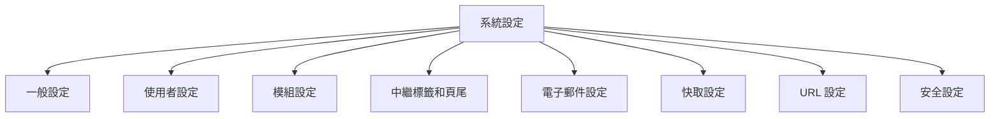

# XOOPS 系統設定

本指南涵蓋 XOOPS 管理面板中提供的完整系統設定，按類別組織。

## 系統設定架構



## 存取系統設定

### 位置

**管理面板 > System > Preferences**

或直接導覽：

```
http://your-domain.com/xoops/admin/index.php?fct=preferences
```

### 權限需求

- 僅管理員（網站管理員）可存取系統設定
- 變更會影響整個網站
- 大多數變更會立即生效

## 一般設定

XOOPS 安裝的基礎組態。

### 基本資訊

```
網站名稱：[您的網站名稱]
預設描述：[您的網站簡要描述]
網站標語：[朗朗上口的標語]
管理員電子郵件：admin@your-domain.com
網站管理員名稱：管理員名稱
網站管理員電子郵件：admin@your-domain.com
```

### 外觀設定

```
預設佈景主題：[選擇佈景主題]
預設語言：英文（或偏好的語言）
每頁項目：15（通常 10-25）
程式碼片段中的字詞：25（用於搜尋結果）
佈景主題上傳權限：停用（安全）
```

### 地區設定

```
預設時區：[您的時區]
日期格式：%Y-%m-%d (YYYY-MM-DD 格式)
時間格式：%H:%M:%S (HH:MM:SS 格式)
日光節約時間：[自動/手動/無]
```

## 使用者設定

控制使用者帳戶行為和註冊流程。

### 使用者註冊

```
允許使用者註冊：是/否
註冊類型：
  ☐ 自動啟用（即時存取）
  ☐ 管理員核准（管理員必須核准）
  ☐ 電子郵件驗證（使用者必須驗證電子郵件）

向使用者通知：是/否
使用者電子郵件驗證：必要/選用
```

### 新使用者組態

```
自動登入新使用者：是/否
指派預設使用者群組：是
預設使用者群組：[選擇群組]
建立使用者頭像：是/否
初始使用者頭像：[選擇預設值]
```

### 使用者個人檔案設定

```
允許使用者個人檔案：是
顯示成員清單：是
顯示使用者統計資訊：是
顯示上次線上時間：是
允許使用者頭像：是
頭像最大檔案大小：100KB
頭像尺寸：100x100 像素
```

### 使用者電子郵件設定

```
允許使用者隱藏電子郵件：是
在個人檔案上顯示電子郵件：是
通知電子郵件間隔：立即/每日/每週/永不
```

### 使用者活動追蹤

```
追蹤使用者活動：是
記錄使用者登入：是
記錄登入失敗：是
追蹤 IP 位址：是
清除舊於以下時間的活動日誌：90 天
```

### 帳戶限制

```
允許重複電子郵件：否
最小使用者名稱長度：3 個字元
最大使用者名稱長度：15 個字元
最小密碼長度：6 個字元
需要特殊字元：是
需要數字：是
密碼過期：90 天（或永不）
停用後要刪除的無效帳戶天數：365 天
```

## 模組設定

組態個別模組行為。

### 常見模組選項

對於每個已安裝的模組，您可以設定：

```
模組狀態：有效/無效
在功能表中顯示：是/否
模組權重：[1-999]（越高 = 越低的顯示）
首頁預設值：此模組在訪問 / 時顯示
管理員存取：[允許的使用者群組]
使用者存取：[允許的使用者群組]
```

### 系統模組設定

```
首頁顯示為：入口網站 / 模組 / 靜態頁面
預設首頁模組：[選擇模組]
顯示頁尾功能表：是
頁尾顏色：[顏色選擇器]
顯示系統統計資訊：是
顯示記憶體使用情況：是
```

## 中繼標籤和 SEO 設定

組態搜尋引擎最佳化的中繼標籤。

### 全域中繼標籤

```
中繼關鍵字：xoops、cms、內容管理系統
中繼描述：用於建立動態網站的功能強大的內容管理系統
中繼作者：您的名稱
中繼著作權：Copyright 2025，您的公司
中繼機器人：index、follow
中繼重新瀏覽：30 天
```

### 中繼標籤最佳做法

| 標籤 | 用途 | 建議 |
|---|---|---|
| 關鍵字 | 搜尋詞 | 5-10 個相關關鍵字，以逗號分隔 |
| 描述 | 搜尋清單 | 150-160 個字元 |
| 作者 | 頁面建立者 | 您的名稱或公司 |
| 著作權 | 法律 | 您的著作權聲明 |
| 機器人 | 爬蟲指令 | index、follow（允許索引） |

### 頁尾設定

```
顯示頁尾：是
頁尾顏色：深色/淺色
頁尾背景：[顏色代碼]
頁尾文字：[允許 HTML]
其他頁尾連結：[URL 和文字對]
```

## 電子郵件設定

組態電子郵件傳遞和通知系統。

### 電子郵件傳遞方法

```
使用 SMTP：是/否

如果 SMTP：
  SMTP 主機：smtp.gmail.com
  SMTP 連接埠：587 (TLS) 或 465 (SSL)
  SMTP 安全性：TLS / SSL / 無
  SMTP 使用者名稱：[email@example.com]
  SMTP 密碼：[密碼]
  SMTP 驗證：是/否
  SMTP 逾時：10 秒

如果 PHP mail()：
  Sendmail 路徑：/usr/sbin/sendmail -t -i
```

### 電子郵件組態

```
寄件人位址：noreply@your-domain.com
寄件人名稱：您的網站名稱
回覆地址：support@your-domain.com
密件副本管理員電子郵件：是/否
```

### 通知設定

```
傳送歡迎電子郵件：是/否
歡迎電子郵件主旨：歡迎使用 [網站名稱]
歡迎電子郵件正文：[自訂訊息]

傳送密碼重設電子郵件：是/否
包括隨機密碼：是/否
權杖過期：24 小時
```

### 管理員通知

```
在註冊時通知管理員：是
在評論時通知管理員：是
在提交時通知管理員：是
在錯誤時通知管理員：是
```

### 使用者通知

```
在註冊時通知使用者：是
在評論時通知使用者：是
在私人訊息時通知使用者：是
允許使用者停用通知：是
預設通知頻率：立即
```

## 快取設定

透過快取最佳化效能。

### 快取組態

```
啟用快取：是/否
快取類型：
  ☐ 檔案快取
  ☐ APCu（替代 PHP 快取）
  ☐ Memcache（分散式快取）
  ☐ Redis（進階快取）

快取壽命：3600 秒（1 小時）
```

### 快取選項（按類型）

**檔案快取：**
```
快取目錄：/var/www/html/xoops/cache/
清除間隔：每日
最大快取檔案：1000
```

**APCu 快取：**
```
記憶體配置：128MB
碎片化級別：低
```

**Memcache/Redis：**
```
伺服器主機：localhost
伺服器連接埠：11211 (Memcache) / 6379 (Redis)
持續連線：是
```

### 什麼會被快取

```
快取模組清單：是
快取組態資料：是
快取範本資料：是
快取使用者工作階段資料：是
快取搜尋結果：是
快取資料庫查詢：是
快取 RSS 摘要：是
快取影像：是
```

## URL 設定

組態 URL 重寫和格式設定。

### 友善 URL 設定

```
啟用友善 URL：是/否
友善 URL 類型：
  ☐ 路徑資訊：/page/about
  ☐ 查詢字串：/index.php?p=about

尾部斜線：包括 / 省略
URL 大小寫：小寫 / 區分大小寫
```

## 安全設定

控制與安全相關的組態。

### 密碼安全

```
密碼政策：
  ☐ 需要大寫字母
  ☐ 需要小寫字母
  ☐ 需要數字
  ☐ 需要特殊字元

最小密碼長度：8 個字元
密碼過期：90 天
密碼記錄：記住最後 5 個密碼
強制密碼變更：在下次登入時
```

### 登入安全

```
登入失敗後鎖定帳戶：5 次嘗試
鎖定持續時間：15 分鐘
記錄所有登入嘗試：是
記錄登入失敗：是
管理員登入警報：在管理員登入時傳送電子郵件
雙因素驗證：停用/啟用
```

### 檔案上傳安全

```
允許檔案上傳：是/否
最大檔案大小：128MB
允許的檔案類型：jpg、gif、png、pdf、zip、doc、docx
掃描上傳的惡意軟體：是（如果可用）
隔離可疑檔案：是
```

### 工作階段安全

```
工作階段管理：資料庫/檔案
工作階段逾時：1800 秒（30 分鐘）
工作階段 Cookie 壽命：0（直到瀏覽器關閉）
安全 Cookie：是（僅限 HTTPS）
HTTP Only Cookie：是（防止 JavaScript 存取）
```

## 進階設定

進階使用者的其他組態選項。

### 偵錯模式

```
偵錯模式：停用/啟用
日誌級別：錯誤 / 警告 / 資訊 / 偵錯
偵錯日誌檔案：/var/log/xoops_debug.log
顯示錯誤：停用（生產環境）
```

### 效能調整

```
最佳化資料庫查詢：是
使用查詢快取：是
壓縮輸出：是
縮小 CSS/JavaScript：是
延遲載入影像：是
```

### 內容設定

```
在貼文中允許 HTML：是/否
允許的 HTML 標籤：[組態]
剝離有害代碼：是
允許嵌入：是/否
內容審核：自動/手動
垃圾郵件偵測：是
```

## 設定匯出/匯入

### 備份設定

匯出目前設定：

**管理面板 > System > Tools > Export Settings**

```bash
# 設定已匯出為 JSON 檔案
# 下載並安全地儲存
```

### 還原設定

匯入先前匯出的設定：

**管理面板 > System > Tools > Import Settings**

```bash
# 上傳 JSON 檔案
# 在確認前驗證變更
```

## 組態階層

XOOPS 設定階層（由上至下 - 第一個相符者獲勝）：

```
1. mainfile.php（常數）
2. 模組特定組態
3. 管理系統設定
4. 佈景主題組態
5. 使用者偏好設定（用於使用者特定設定）
```

## 常見設定變更

### 變更網站名稱

1. Admin > System > Preferences > General Settings
2. 修改「網站名稱」
3. 按一下「儲存」

### 啟用/停用註冊

1. Admin > System > Preferences > User Settings
2. 切換「允許使用者註冊」
3. 選擇註冊類型
4. 按一下「儲存」

### 變更預設佈景主題

1. Admin > System > Preferences > General Settings
2. 選擇「預設佈景主題」
3. 按一下「儲存」
4. 清除快取以使變更生效

### 更新聯絡電子郵件

1. Admin > System > Preferences > General Settings
2. 修改「管理員電子郵件」
3. 修改「網站管理員電子郵件」
4. 按一下「儲存」

## 驗證檢查清單

在組態系統設定後，驗證：

- [ ] 網站名稱正確顯示
- [ ] 時區顯示正確時間
- [ ] 電子郵件通知正確傳送
- [ ] 使用者註冊按組態方式工作
- [ ] 首頁顯示所選預設
- [ ] 搜尋功能有效
- [ ] 快取改善頁面載入時間
- [ ] 友善 URL 有效（如果已啟用）
- [ ] 中繼標籤出現在頁面來源中
- [ ] 收到管理員通知
- [ ] 強制執行安全設定

## 後續步驟

設定系統設定後：

1. 組態安全設定
2. 最佳化效能
3. 探索管理面板功能
4. 設定使用者管理

---

**標籤：** #system-settings #configuration #preferences #admin-panel

**相關文章：**
- Security-Configuration
- Performance-Optimization
- ../First-Steps/Admin-Panel-Overview
