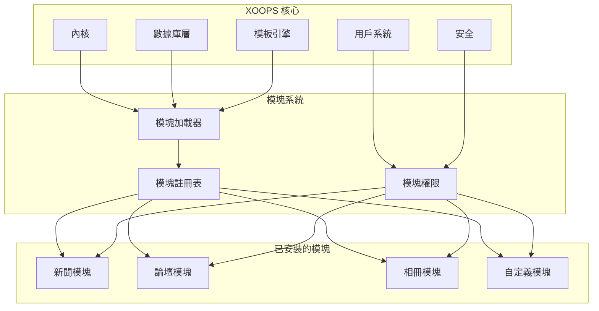
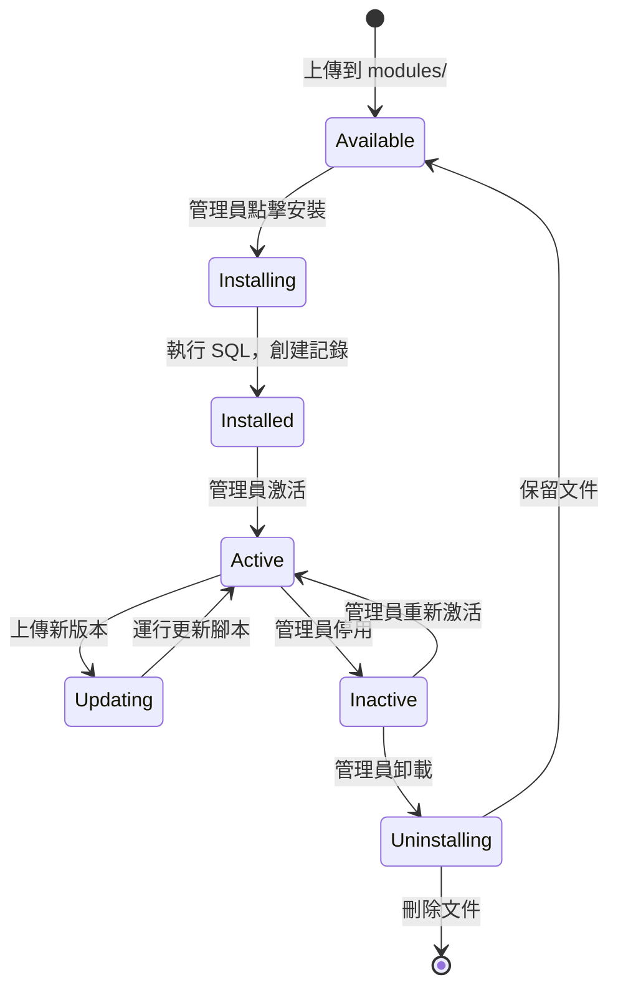

# ADR-001：模塊化架構

> XOOPS 核心模塊化設計哲學的架構決策記錄。

---

## 狀態

**已接受** - XOOPS 建立以來的基礎決策

---

## 背景

XOOPS（可擴展面向對象門戶系統）需要一個可以：

1. 允許第三方開發人員擴展功能
2. 使網站管理員無需編碼即可自定義
3. 支持獨立開發和更新
4. 在不同功能之間提供隔離
5. 從簡單博客擴展到複雜門戶

早期 2000 年代的 CMS 環境提供了難以自定義和擴展的單體系統。

---

## 決策圖



---

## 決策

我們將實現**模塊化架構**，其中：

### 1. 核心提供基礎設施
- 數據庫抽象
- 用戶身份驗證和權限
- 模板渲染 (Smarty)
- 安全工具
- 表單生成
- 常用工具

### 2. 模塊是自包含的
每個模塊：
- 有自己的目錄結構
- 包含自己的類、模板、SQL
- 定義自己的配置
- 可獨立安裝/卸載
- 有版本跟踪

### 3. 標準模塊結構
```
modules/modulename/
├── admin/                  # 管理界面
│   ├── index.php
│   └── menu.php
├── class/                  # PHP 類
├── include/                # 包含文件
├── language/               # 翻譯
├── sql/                    # 數據庫架構
├── templates/              # Smarty 模板
├── blocks/                 # 塊定義
├── xoops_version.php       # 模塊清單
├── index.php               # 入口點
└── header.php              # 模塊引導
```

### 4. 模塊清單 (xoops_version.php)
```php
<?php
$modversion['name']        = '模塊名稱';
$modversion['version']     = '1.0.0';
$modversion['description'] = '模塊說明';
$modversion['dirname']     = basename(__DIR__);
$modversion['hasMain']     = 1;
$modversion['hasAdmin']    = 1;
$modversion['sqlfile']['mysql'] = 'sql/mysql.sql';
$modversion['tables']      = ['modulename_table1'];
$modversion['templates']   = [...];
$modversion['config']      = [...];
$modversion['blocks']      = [...];
```

### 5. 模塊通信
- 通過核心 API（處理器、事件）
- 數據庫關係
- 預加載鉤子
- 共享服務

---

## 模塊生命週期



---

## 後果

### 積極的

1. **可擴展性**：社區創建了數千個模塊
2. **獨立性**：模塊可單獨開發
3. **靈活性**：網站可混合搭配功能
4. **可維護性**：更新不影響其他模塊
5. **市場**：出現了模塊生態系統
6. **學習曲線**：開發人員學習一種模式

### 消極的

1. **開銷**：每個模塊有引導成本
2. **重複**：常見代碼可能重複
3. **集成**：跨模塊功能需要仔細設計
4. **版本控制**：需要模塊兼容性管理
5. **質量差異**：第三方模塊質量不一

### 中立的

1. **數據庫**：每個模塊管理自己的表
2. **模板**：主題必須適應各種模塊
3. **更新**：核心和模塊獨立更新

---

## 考慮的替代方案

### 1. 單體架構
**已拒絕** - 過於僵化，難以自定義

### 2. 插件架構 (WordPress 風格)
**部分採用** - 塊和預加載在模塊內提供插件類的鉤子

### 3. 組件架構 (Joomla 風格)
**已拒絕** - 更複雜，開發人員不友好

### 4. 微服務
**不適用** - 對於共享主機時代過於複雜

---

## 相關決策

- ADR-002：面向對象數據庫訪問
- ADR-003：Smarty 模板引擎
- ADR-005：權限系統

---

## 參考

- XOOPS 項目歷史
- PHP 應用架構模式
- CMS 比較研究 (2001-2005)

---

#xoops #architecture #adr #modules #design-decision
