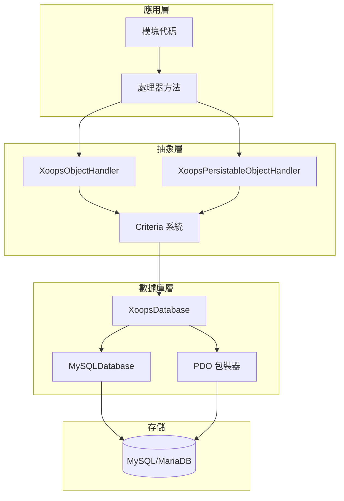
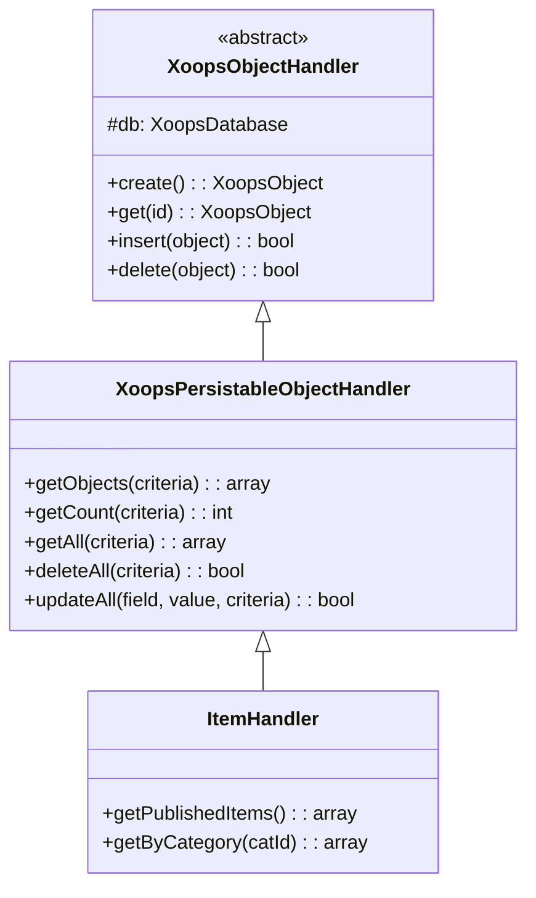
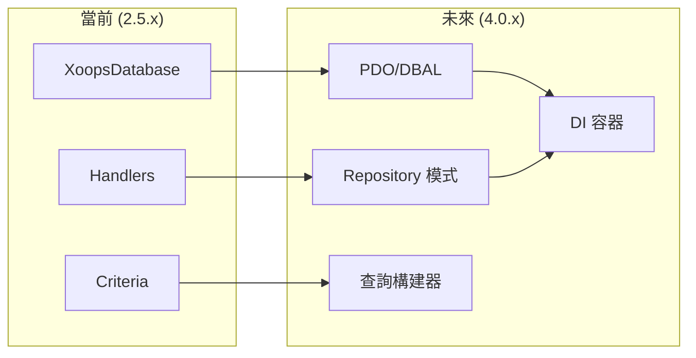

# ADR-002：數據庫抽象

> XOOPS 面向對象數據庫訪問模式的架構決策記錄。

---

## 狀態

**已接受** - XOOPS 2.0 以來的核心模式

---

## 背景

XOOPS 需要數據庫交互策略，該策略可以：

1. 抽象掉數據庫特定的 SQL 語法
2. 在所有模塊中提供一致的 CRUD 操作
3. 啟用自動數據清理和轉義
4. 支持未來數據庫引擎的更改
5. 為開發人員簡化常見操作

替代方案是：
- 整個代碼庫中的原始 SQL
- 完整的 ORM (Doctrine、Eloquent)
- 自定義輕量級抽象

---

## 決策圖



---

## 決策

我們將實現**處理器模式**，具有：

### 1. XoopsObject - 數據容器

每個數據實體擴展 XoopsObject：

```php
class Item extends XoopsObject
{
    public function __construct()
    {
        $this->initVar('id', XOBJ_DTYPE_INT, null, false);
        $this->initVar('title', XOBJ_DTYPE_TXTBOX, '', true, 255);
        $this->initVar('content', XOBJ_DTYPE_TXTAREA, '', false);
        $this->initVar('status', XOBJ_DTYPE_INT, 0, false);
    }
}
```

### 2. 處理器 - 操作管理器

每個對象都有相應的處理器：

```php
class ItemHandler extends XoopsPersistableObjectHandler
{
    public function __construct($db)
    {
        parent::__construct($db, 'mymodule_items', Item::class, 'id', 'title');
    }

    // 繼承的 CRUD 方法：
    // - create(), get(), insert(), delete()
    // - getObjects(), getCount(), getAll()
}
```

### 3. Criteria - 查詢構建器

面向對象的查詢條件：

```php
$criteria = new CriteriaCompo();
$criteria->add(new Criteria('status', 1));
$criteria->add(new Criteria('created', time() - 86400, '>='));
$criteria->setSort('created');
$criteria->setOrder('DESC');
$criteria->setLimit(10);

$items = $handler->getObjects($criteria);
```

---

## 數據類型常量

```php
// 具有自動清理的變量類型
XOBJ_DTYPE_INT       // 整數
XOBJ_DTYPE_TXTBOX    // 單行文本（轉義）
XOBJ_DTYPE_TXTAREA   // 多行文本（轉義）
XOBJ_DTYPE_EMAIL     // 電子郵件驗證
XOBJ_DTYPE_URL       // URL 驗證
XOBJ_DTYPE_ARRAY     // 序列化數組
XOBJ_DTYPE_OTHER     // 無處理
XOBJ_DTYPE_FLOAT     // 浮點
```

---

## 處理器繼承



---

## 後果

### 積極的

1. **一致性**：所有模塊使用相同模式
2. **安全性**：自動轉義可防止 SQL 注入
3. **簡單性**：常見操作需要最少代碼
4. **可維護性**：數據庫層變更不影響模塊
5. **可測試性**：處理器可以被模擬用於測試

### 消極的

1. **性能**：額外抽象開銷
2. **複雜性**：新開發人員的學習曲線
3. **限制**：複雜查詢可能需要原始 SQL
4. **N+1 問題**：沒有內置急加載

### 減輕方案

- **性能**：緩存頻繁訪問的對象
- **複雜查詢**：在需要時允許原始 SQL
- **N+1**：使用帶適當 Criteria 的 getAll()

---

## XOOPS 4.0 的演進



XOOPS 4.0 計劃：
- 用於數據庫抽象的 Doctrine DBAL
- 替換處理器的 Repository 模式
- 用於複雜查詢的查詢構建器
- 完整的 PSR-11 容器集成

---

## 代碼示例

### 基本 CRUD

```php
$helper = Helper::getInstance();
$handler = $helper->getHandler('Item');

// 創建
$item = $handler->create();
$item->setVar('title', 'New Item');
$handler->insert($item);

// 讀取
$item = $handler->get($id);
$title = $item->getVar('title');

// 更新
$item->setVar('title', 'Updated Title');
$handler->insert($item);

// 刪除
$handler->delete($item);
```

### 複雜查詢

```php
$criteria = new CriteriaCompo();
$criteria->add(new Criteria('status', 'published'));
$criteria->add(new Criteria('category_id', '(1,2,3)', 'IN'));
$criteria->add(new Criteria('created', strtotime('-30 days'), '>='));
$criteria->setSort('views');
$criteria->setOrder('DESC');
$criteria->setLimit(10);
$criteria->setStart(0);

$items = $handler->getObjects($criteria);
$total = $handler->getCount($criteria);
```

---

## 相關決策

- ADR-001：模塊化架構
- ADR-003：Smarty 模板引擎

---

## 參考

- Martin Fowler - 企業應用架構模式
- 域驅動設計概念
- Active Record vs Data Mapper 模式

---

#xoops #architecture #adr #database #handler #design-decision
