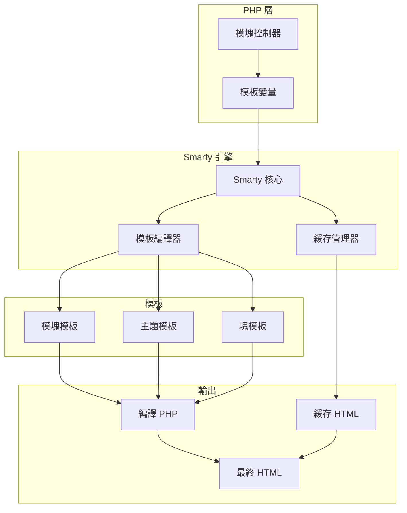
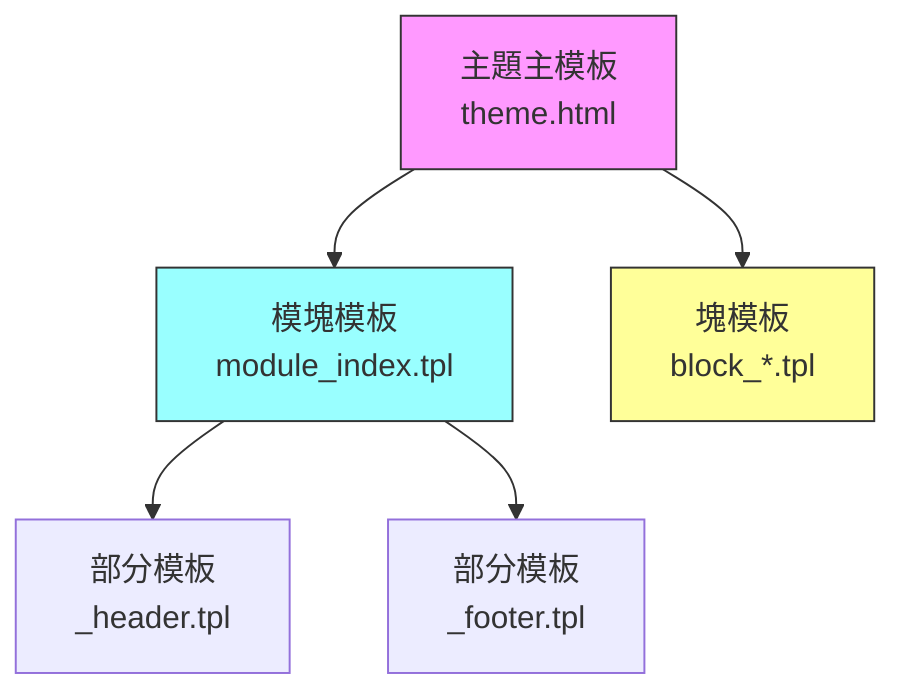
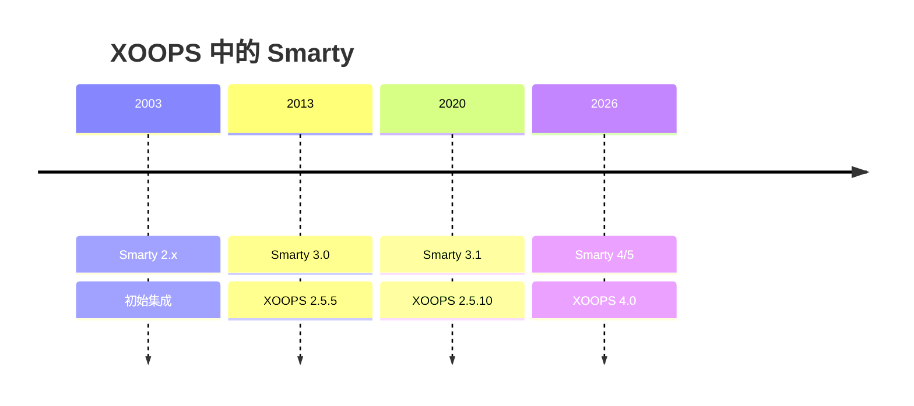

# ADR-003：模板引擎 (Smarty)

> XOOPS 採用 Smarty 模板引擎的架構決策記錄。

---

## 狀態

**已接受** - XOOPS 2.0 以來的核心決策

**演進中** - 計劃在 XOOPS 4.0 中遷移到 Smarty 4/5

---

## 背景

XOOPS 需要一個可以：

1. 將表現與業務邏輯分離
2. 允許主題設計師在不了解 PHP 的情況下工作
3. 支持模板繼承和包含
4. 為性能提供緩存
5. 啟用用戶可自定義的模板
6. 支持國際化

---

## 決策圖



---

## 決策

我們將使用 **Smarty** 作為模板引擎，因為：

### 1. 關注點分離

```php
// PHP (控制器) - 業務邏輯
$items = $itemHandler->getPublishedItems();
$xoopsTpl->assign('items', $items);

// Smarty (視圖) - 表現
// templates/items.tpl
```

```smarty
{* Smarty 模板 - 無 PHP 邏輯 *}
<{foreach item=item from=$items}>
    <article>
        <h2><{$item.title}></h2>
        <p><{$item.summary}></p>
    </article>
<{/foreach}>
```

### 2. XOOPS 分隔符

XOOPS 使用 `<{` 和 `}>` 代替標準 `{` `}`：

```smarty
{* 標準 Smarty *}
{$variable}

{* XOOPS Smarty - 避免 JavaScript 衝突 *}
<{$variable}>
```

### 3. 模板層次結構



### 4. 模板存儲

- **數據庫**：自定義模板存儲以便恢復
- **文件系統**：模塊目錄中的原始模板
- **緩存**：為性能編譯的模板

---

## Smarty 配置

```php
// XOOPS Smarty 初始化
$xoopsTpl = new XoopsTpl();

// 自定義分隔符
$xoopsTpl->left_delim = '<{';
$xoopsTpl->right_delim = '}>';

// 緩存
$xoopsTpl->caching = XOOPS_TEMPLATE_CACHE;
$xoopsTpl->cache_lifetime = 3600;

// 安全
$xoopsTpl->security_policy = new Smarty_Security($xoopsTpl);
$xoopsTpl->security_policy->php_functions = [];
$xoopsTpl->security_policy->php_modifiers = ['escape', 'count'];
```

---

## 使用的模板功能

### 變量

```smarty
{* 簡單變量 *}
<{$title}>

{* 對象屬性 *}
<{$item.title}>

{* 帶修飾符 *}
<{$content|truncate:200:'...'}>

{* 轉義輸出 *}
<{$userInput|escape:'html'}>
```

### 控制結構

```smarty
{* 條件 *}
<{if $isAdmin}>
    <a href="admin.php">管理員</a>
<{elseif $isUser}>
    <a href="profile.php">配置文件</a>
<{else}>
    <a href="login.php">登錄</a>
<{/if}>

{* 循環 *}
<{foreach item=item from=$items name=itemloop}>
    <{$smarty.foreach.itemloop.index}>: <{$item.title}>
<{/foreach}>
```

### 包含

```smarty
{* 包含另一個模板 *}
<{include file="db:mymodule_header.tpl"}>

{* 使用變量包含 *}
<{include file="db:mymodule_item.tpl" item=$currentItem}>

{* 從主題包含 *}
<{include file="file:$theme_path/partials/sidebar.tpl"}>
```

---

## 後果

### 積極的

1. **設計師友好**：HTML 類語法
2. **緩存**：內置模板緩存
3. **安全**：PHP 代碼隔離
4. **靈活性**：修飾符、函數、插件
5. **自定義**：用戶可以修改模板
6. **社區**：大型 Smarty 生態系統

### 消極的

1. **學習曲線**：Smarty 特定語法
2. **開銷**：需要編譯步驟
3. **調試**：模板錯誤可能不清楚
4. **版本問題**：版本之間的變更

### 減輕方案

- **學習**：全面文檔
- **性能**：積極緩存
- **調試**：調試控制台、清晰的錯誤信息
- **版本**：XOOPS 中的兼容層

---

## 版本歷史



---

## 遷移：Smarty 3 到 4/5

### 破壞性變更

```smarty
{* Smarty 3 - 已棄用 *}
<{php}>echo date('Y');<{/php}>

{* Smarty 4+ - 使用修飾符或從 PHP 分配 *}
<{$current_year}>

{* Smarty 3 - {section} 已棄用 *}
<{section name=i loop=$items}>
    <{$items[i].title}>
<{/section}>

{* Smarty 4+ - 使用 {foreach} *}
<{foreach $items as $item}>
    <{$item.title}>
<{/foreach}>
```

### 兼容層

XOOPS 提供了一個兼容層以順利過渡：

```php
// XoopsTpl 使用兼容性方法擴展 Smarty
class XoopsTpl extends Smarty
{
    public function assign($tpl_var, $value = null)
    {
        // 處理 Smarty 3 和 4 語法
        return parent::assign($tpl_var, $value);
    }
}
```

---

## 考慮的替代方案

### 1. Twig
**優點**：現代、Symfony 生態系統
**缺點**：不同語法、遷移工作
**決策**：XOOPS 3.x 的可能未來選項

### 2. Blade (Laravel)
**優點**：清潔語法、流行
**缺點**：Laravel 特定
**決策**：不適合獨立使用

### 3. 本地 PHP 模板
**優點**：無學習曲線、快速
**缺點**：安全風險、無分離
**決策**：因可維護性被拒絕

---

## 相關決策

- ADR-001：模塊化架構
- ADR-002：數據庫抽象

---

## 參考

- Smarty 文檔：https://www.smarty.net/docs/en/
- XOOPS 模板系統指南
- Web 應用中的 MVC 模式

---

#xoops #architecture #adr #smarty #templates #design-decision
