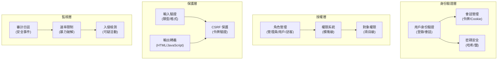

# ADR-004：安全系統架構

> 保護 XOOPS CMS 免受現代威脅的全面安全架構。

---

## 狀態

**已接受** - XOOPS 2.5 以來的核心安全層

---

## 背景

### 問題陳述

XOOPS 需要一個強大的安全系統，可以：

1. **防護常見 Web 漏洞** (OWASP Top 10)
2. **提供跨模塊的粒度權限控制**
3. **啟用現代標準的安全用戶認證**
4. **防止數據洩露和未授權訪問**
5. **支持多級訪問控制**（管理員、仲裁員、用戶、訪客）
6. **與所有模塊無縫集成**

### 當前威脅

現代 Web 攻擊包括：

- **SQL 注入** - 用戶輸入中的惡意 SQL
- **XSS (跨站腳本)** - 頁面中注入的 JavaScript
- **CSRF (跨站請求偽造)** - 未授權的表單提交
- **身份驗證繞過** - 弱會話/密碼處理
- **授權繞過** - 特權提升
- **數據洩露** - URL、日誌或緩存中的敏感數據

---

## 決策

### 核心安全架構



---

## 安全組件

### 1. 身份驗證系統

**用戶登錄過程：**

```php
<?php
// 1. 驗證憑據
$user = $userHandler->findByLogin($username);
if (!$user || !password_verify($password, $user->getVar('pass'))) {
    throw new AuthenticationException('無效憑據');
}

// 2. 檢查帳戶是否活躍
if (!$user->getVar('uactive')) {
    throw new AuthenticationException('帳戶不活躍');
}

// 3. 創建安全會話
session_regenerate_id(true);
$_SESSION['uid'] = $user->getVar('uid');
$_SESSION['token'] = bin2hex(random_bytes(32));
$_SESSION['created'] = time();

// 4. 記錄登錄
$this->auditLog('USER_LOGIN', $user->getVar('uid'));
```

**密碼安全：**

```php
<?php
// 使用 password_hash（不是 MD5 或 SHA1）
$hashed = password_hash($password, PASSWORD_BCRYPT, [
    'cost' => 12, // 高成本 = 慢暴力破解
]);

// 驗證密碼
if (!password_verify($inputPassword, $hashed)) {
    throw new Exception('無效密碼');
}

// 如果算法或成本改變，重新哈希
if (password_needs_rehash($hashed, PASSWORD_BCRYPT, ['cost' => 12])) {
    $newHash = password_hash($password, PASSWORD_BCRYPT, ['cost' => 12]);
    $user->setVar('pass', $newHash);
    $userHandler->insert($user);
}
```

---

## 後果

### 積極影響

1. **全面保護** - 涵蓋主要漏洞類別
2. **分層安全** - 多層防禦
3. **靈活的 RBAC** - 細粒度權限控制
4. **審計追踪** - 跟踪安全事件
5. **行業標準** - 符合 OWASP 建議
6. **模塊集成** - 模塊易於使用安全 API

### 消極影響

1. **複雜性** - 需要更多代碼和配置
2. **性能** - 哈希和驗證增加開銷
3. **用戶體驗** - 安全有時不便
4. **維護** - 需要持續安全更新
5. **培訓** - 開發人員必須遵循做法

---

## 相關決策

- ADR-001：模塊化架構
- ADR-006：兩因素認證（未來）

---

## 參考

### 安全標準

- [OWASP Top 10](https://owasp.org/www-project-top-ten/)
- [NIST 網絡安全框架](https://www.nist.gov/cyberframework)
- [CWE Top 25](https://cwe.mitre.org/top25/)

---

#xoops #adr #security #architecture #authentication #authorization #rbac
