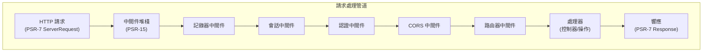

# ADR-005：XOOPS 4.0 的 PSR-15 中間件模式

> 採用 PSR-15 HTTP 服務器請求處理器（中間件）以改善請求處理管道。

:::caution[XOOPS 4.0 提案 — 在 2.5.x 中不可用]
此 ADR 描述 **XOOPS 4.0 的提議架構**。PSR-15 中間件 **在 XOOPS 2.5.x 中不可用**。當前 2.5.x 模塊使用具有 `mainfile.php` 引導的頁面控制器模式。查看 XOOPS 架構以了解當前請求生命週期。
:::

---

## 狀態

**提議** - 正在評估用於 XOOPS 4.0 發行版

---

## 背景

### 當前方法

XOOPS 2.5 使用單體請求處理方法：

```php
// 當前：順序處理
require_once 'mainfile.php';
// → 內核初始化
// → 用戶身份驗證
// → 模塊加載
// → 頁面呈現

// 全部在一個流程中，混合關注點
```

### 當前方法的問題

1. **混合關注點** - 身份驗證、日誌、路由相互交織
2. **難以測試** - 難以單元測試各個請求處理步驟
3. **難以擴展** - 模塊只能通過預加載/事件掛鉤
4. **分離不佳** - 請求處理邏輯散佈在代碼庫中
5. **不可組合** - 無法輕鬆鏈接或重新排序處理步驟

### 什麼是 PSR-15 中間件？

PSR-15 為 HTTP 中間件定義標準接口：

```php
<?php
interface RequestHandlerInterface {
    public function handle(ServerRequestInterface $request): ResponseInterface;
}

interface MiddlewareInterface {
    public function process(
        ServerRequestInterface $request,
        RequestHandlerInterface $handler
    ): ResponseInterface;
}
```

**中間件鏈：**

```
請求
  ↓
[記錄器] → 記錄請求
  ↓
[認證] → 驗證用戶會話
  ↓
[CORS] → 檢查跨域
  ↓
[路由器] → 分派到處理器
  ↓
[處理器] → 生成響應
  ↓
響應
```

---

## 決策

### 為 XOOPS 4.0 採用 PSR-15 中間件堆棧

實現遵循 PSR-15 標準的基於中間件的請求處理管道。

### 架構概述



---

## 後果

### 積極影響

1. **關注點分離** - 每個中間件處理一項責任
2. **可測試性** - 易於單元測試各個中間件組件
3. **可組合性** - 中間件可以混合和重新排序
4. **標準合規** - 使用 PSR-15 和 PSR-7 標準
5. **可擴展性** - 模塊可以輕鬆添加自定義中間件
6. **調試** - 清晰的通過管道的請求流
7. **性能** - 可以優化特定中間件層
8. **互操作性** - 可以使用第三方 PSR-15 中間件

### 消極影響

1. **學習曲線** - 開發人員必須理解 PSR-15
2. **性能開銷** - 管道中更多函數調用
3. **複雜性** - 比單體方法更多活動部件
4. **遷移工作** - 需要重構現有代碼
5. **依賴** - 需要 PSR-7 HTTP 庫

---

## 實施計劃

### 第 1 階段：基礎 (2026 年第 2 季度)

- [ ] 實施 PSR-7 HTTP 消息包裝器
- [ ] 創建 MiddlewareDispatcher
- [ ] 實施核心中間件（會話、認證）
- [ ] 更新內核使用中間件

### 第 2 階段：集成 (2026 年第 3 季度)

- [ ] 將現有功能遷移到中間件
- [ ] 添加模塊中間件支持
- [ ] 創建中間件測試工具
- [ ] 編寫全面文檔

### 第 3 階段：遷移 (2026 年第 4 季度)

- [ ] 為舊代碼提供兼容層
- [ ] 幫助模塊更新為新中間件
- [ ] 性能優化
- [ ] 安全審計

### 第 4 階段：發行 (2027 年第 1 季度)

- [ ] XOOPS 4.0 發行與中間件
- [ ] 棄用舊預加載/掛鉤系統
- [ ] 社區反饋和更新

---

## 相關決策

- ADR-001：模塊化架構 - 基礎
- ADR-004：安全系統 - 在認證中使用中間件
- ADR-006：兩因素認證 - 可作為中間件

---

## 參考

### PSR 標準

- [PSR-7：HTTP 消息接口](https://www.php-fig.org/psr/psr-7/)
- [PSR-15：HTTP 服務器請求處理器](https://www.php-fig.org/psr/psr-15/)

---

#xoops #adr #psr-15 #middleware #architecture #psr-7
