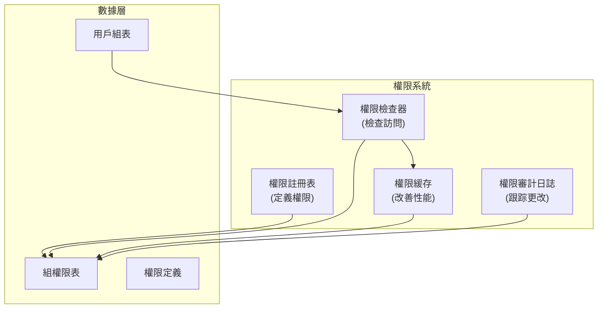

# ADR-006：模塊權限系統

> XOOPS 模塊啟用粒度訪問控制的細粒度分層權限系統。

---

## 狀態

**已接受** - 在 XOOPS 2.5.x 中實施並在 XOOPS 4.0 中擴展

---

## 背景

### 問題陳述

XOOPS 模塊需要靈活的權限控制，允許：

1. **模塊級權限** - 用戶能否訪問此模塊？
2. **對象級權限** - 用戶能否訪問此特定項？
3. **操作級權限** - 用戶能否執行此操作？
4. **自定義權限** - 模塊能否定義自己的權限？

### 當前狀態

XOOPS 2.5 使用 XoopsGroupPermission 系統：

```php
<?php
$perm_handler = xoops_getHandler('groupperm');
$isAllowed = $perm_handler->checkRight(
    'modulename',
    'action',
    $itemId,
    $groupId
);
```

---

## 決策

### 實施分層權限系統

創建支持以下功能的標準化、緩存的權限系統：

1. **分層權限** - 從父組繼承
2. **基於角色的訪問** - 將權限映射到角色（管理員、仲裁員、用戶、訪客）
3. **對象權限** - 細粒度項目控制
4. **緩存** - 緩存權限以減少查詢
5. **自定義權限** - 模塊定義自己的權限
6. **審計追踪** - 記錄權限更改

### 權限層次結構

```
用戶
  └── 組 1（管理員）
      └── 權限：admin_module
      └── 權限：edit_all_items
      └── 權限：delete_all_items
  └── 組 2（仲裁員）
      └── 權限：moderate_comments
      └── 權限：edit_own_items
  └── 組 3（用戶）
      └── 權限：view_published_items
      └── 權限：edit_own_items
  └── 組 4（訪客）
      └── 權限：view_published_items
```

### 架構



---

## 核心組件

### 1. 權限定義

```php
<?php
// 模塊在 xoops_version.php 中定義其權限

$modversion['permissions'] = [
    [
        'name' => 'module_view',
        'description' => '可以查看模塊',
        'level' => 'module',
    ],
    [
        'name' => 'item_view',
        'description' => '可以查看項目',
        'level' => 'item',
    ],
    [
        'name' => 'item_create',
        'description' => '可以創建項目',
        'level' => 'item',
    ],
    [
        'name' => 'item_edit',
        'description' => '可以編輯項目',
        'level' => 'item',
    ],
    [
        'name' => 'item_delete',
        'description' => '可以刪除項目',
        'level' => 'item',
    ],
    [
        'name' => 'admin_manage',
        'description' => '可以管理模塊',
        'level' => 'admin',
    ],
];
```

---

## 後果

### 積極影響

1. **細粒度控制** - 細化的權限管理
2. **標準化** - 跨模塊一致
3. **緩存** - 通過緩存改善性能
4. **可審計** - 跟踪誰更改了什麼
5. **靈活** - 支持自定義權限
6. **可擴展** - 處理複雜權限層次結構
7. **可測試** - 易於單元測試

### 消極影響

1. **複雜性** - 更多代碼要管理
2. **數據庫開銷** - 更多表和連接
3. **緩存失效** - 必須在更改時清除緩存
4. **學習曲線** - 開發人員必須理解系統
5. **性能** - 如果緩存配置不當

---

## 相關決策

- ADR-001：模塊化架構 - 模塊定義權限
- ADR-004：安全系統 - 安全的基礎
- ADR-005：中間件 - 可以強制執行權限

---

## 參考

### 權限模型

- [RBAC（基於角色的訪問控制）](https://en.wikipedia.org/wiki/Role-based_access_control)
- [ABAC（基於屬性的訪問控制）](https://en.wikipedia.org/wiki/Attribute-based_access_control)
- [ACL（訪問控制列表）](https://en.wikipedia.org/wiki/Access-control_list)

---

#xoops #adr #permissions #authorization #rbac #security
