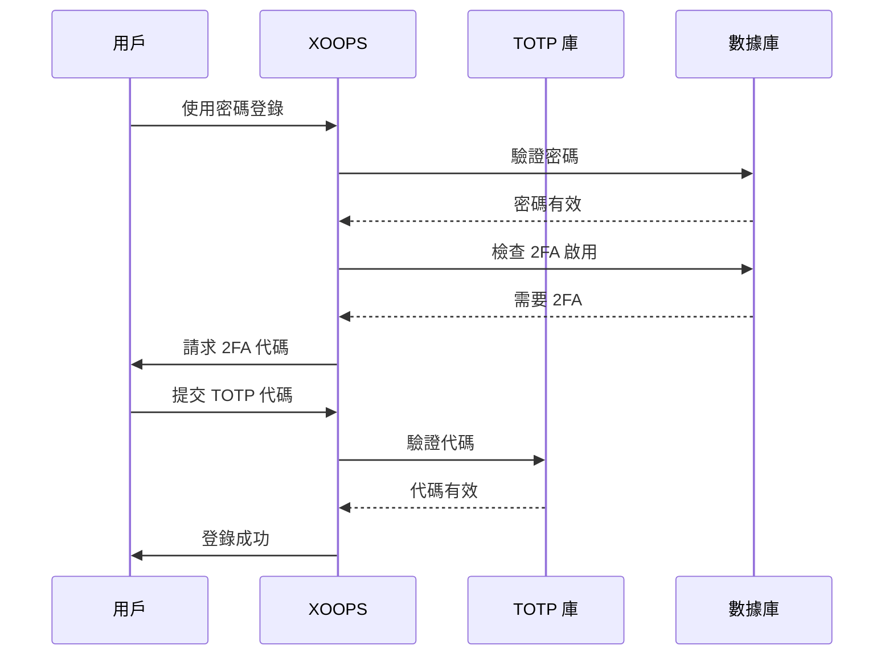

## 狀態

提議

## 背景

XOOPS 需要增強的用戶身份驗證安全性。雙因素認證 (2FA) 提供了超越密碼的額外安全層，即使密碼被洩露也能保護帳戶。

關鍵考慮：
- 與現有身份驗證的向後兼容性
- 支持多種 2FA 方法
- 設置和登錄期間的用戶體驗
- 丟失設備的恢復機制
- 與現有權限系統的集成

## 決策

我們將實施 TOTP（基於時間的一次性密碼）作為主要 2FA 方法，支持備用代碼。

### 實施方法



### 數據庫架構

```sql
CREATE TABLE `{PREFIX}_users_2fa` (
    `user_id` INT(11) NOT NULL,
    `secret` VARCHAR(32) NOT NULL,
    `enabled` TINYINT(1) DEFAULT 0,
    `backup_codes` TEXT,
    `last_used` INT(11),
    `created` INT(11) NOT NULL,
    PRIMARY KEY (`user_id`),
    FOREIGN KEY (`user_id`) REFERENCES `{PREFIX}_users`(`uid`)
);
```

---

## 後果

### 積極

- 顯著改善帳戶安全性
- 業界標準 TOTP 兼容性（Google Authenticator、Authy 等）
- 備用代碼防止帳戶鎖定
- 可選逐用戶 - 不強制採用
- PSR-15 中間件允許清潔集成

### 消極

- 額外登錄步驟影響用戶體驗
- 用戶必須管理身份驗證器應用
- 丟失的設備需要恢復過程
- 額外的數據庫存儲和查詢
- 需要加密庫依賴

### 遷移路徑

1. 為 2FA 數據添加數據庫表
2. 使用庫依賴實施 TOTP 服務
3. 將中間件添加到身份驗證鏈
4. 創建設置和驗證 UI
5. 管理員選項以要求特定組的 2FA

---

## 考慮的替代方案

### 基於 SMS 的 OTP

由於以下原因被拒絕：
- SIM 卡交換漏洞
- SMS 網關成本
- 電話號碼驗證複雜性
- 隱私問題

### 硬件安全密鑰 (WebAuthn)

推遲用於未來 ADR：
- 更複雜的實施
- 歷史上的有限瀏覽器支持
- 更高的用戶成本
- 稍後可能添加到 TOTP 中

### 基於電子郵件的 OTP

由於以下原因被拒絕：
- 電子郵件帳戶洩露會破壞目的
- 傳遞延遲影響 UX
- 垃圾郵件過濾器問題

---

## 參考

- [RFC 6238 - TOTP](https://tools.ietf.org/html/rfc6238)
- [Google Authenticator 密鑰格式](https://github.com/google/google-authenticator/wiki/Key-Uri-Format)
- ../../02-Core-Concepts/Security/Security-Best-Practices - 安全指南
- ../../02-Core-Concepts/Users-Permissions/Authentication - 認證系統文檔
