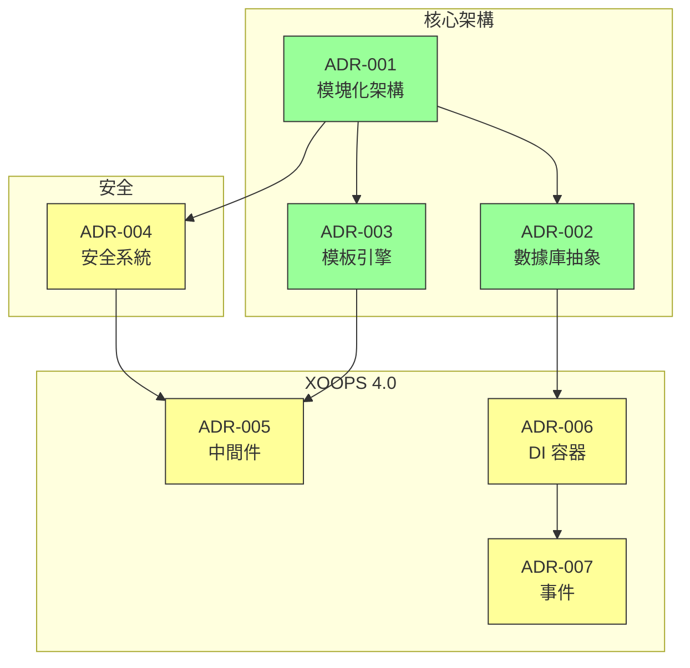
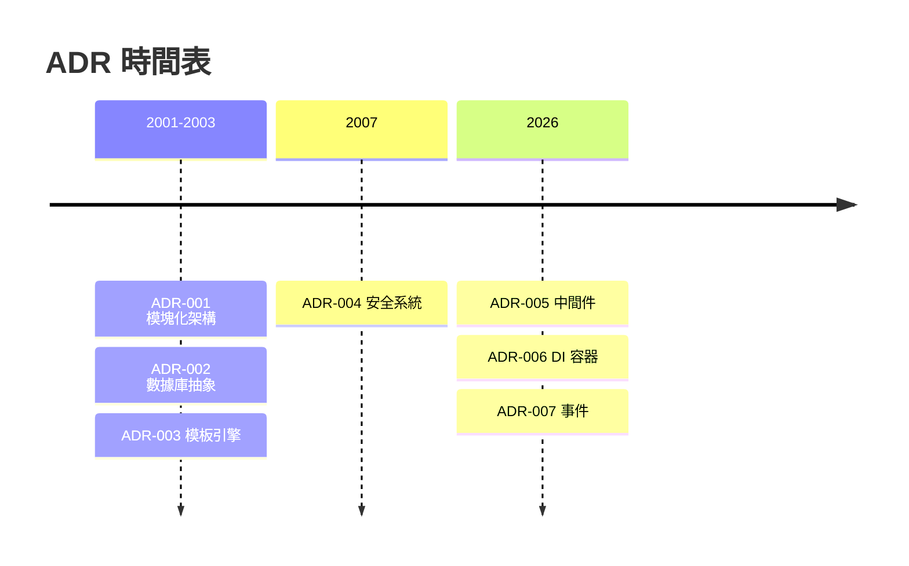

# 📋 架構決策記錄索引

> XOOPS CMS 架構決策的全面索引。

---

## 什麼是 ADR？

架構決策記錄 (ADR) 記錄 XOOPS 開發期間進行的重要架構決策。它們捕捉每個選擇的背景、決策和後果，為維護人員和貢獻者提供寶貴的歷史背景。

---

## ADR 狀態圖例

| 狀態 | 含義 |
|--------|---------|
| **提議** | 討論中，尚未接受 |
| **已接受** | 決策已採納 |
| **已棄用** | 不再推薦 |
| **已取代** | 由另一個 ADR 替換 |

---

## 當前 ADR

### 基礎決策

| ADR | 標題 | 狀態 | 影響 |
|-----|-------|--------|--------|
| ADR-001 | 模塊化架構 | 已接受 | 核心 |
| ADR-002 | 面向對象數據庫訪問 | 已接受 | 核心 |
| ADR-003 | Smarty 模板引擎 | 已接受 | 核心 |

### 計劃中的 ADR (XOOPS 4.0)

| ADR | 標題 | 狀態 | 影響 |
|-----|-------|--------|--------|
| ADR-004 | 安全系統設計 | 提議 | 安全 |
| ADR-005 | PSR-15 中間件 | 提議 | 架構 |
| ADR-006 | 依賴注入容器 | 提議 | 架構 |
| ADR-007 | 事件系統重新設計 | 提議 | 架構 |

---

## ADR 關係



---

## 時間表



---

## 創建新 ADR

當提議新的架構決策時：

1. 複製 ADR 模板
2. 填寫所有部分
3. 作為拉取請求提交
4. 在 GitHub 問題中討論
5. 決策後更新狀態

### ADR 模板結構

```markdown
# ADR-XXX：標題

## 狀態
提議 | 已接受 | 已棄用 | 已取代

## 背景
是什麼推動了這個決策？

## 決策
我們提議的變化是什麼？

## 後果
結果會發生什麼改變？

## 考慮的替代方案
評估了哪些其他選項？
```

---

## 🔗 相關文檔

- 核心概念
- 貢獻指南
- XOOPS 4.0 路線圖

---

#xoops #adr #architecture #index #decisions
