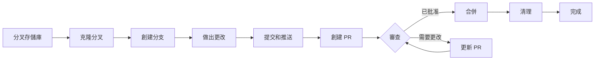

> 本指南將帶您完成為 XOOPS 貢獻的完整過程，從初始設置到合併拉取請求。

---

## 先決條件

在開始貢獻之前，請確保您有：

- **Git** 已安裝並配置
- **GitHub 帳戶**（免費）
- **PHP 7.4+** 用於 XOOPS 開發
- **Composer** 用於依賴管理
- 對 Git 工作流程的基本知識
- 熟悉行為準則

---

## 步驟 1：分叉存儲庫

### 在 GitHub Web 界面上

1. 導航到存儲庫（例如 `XOOPS/XoopsCore27`）
2. 單擊右上角的 **Fork** 按鈕
3. 選擇分叉位置（您的個人帳戶）
4. 等待分叉完成

### 為什麼分叉？

- 您得到自己的副本進行工作
- 維護者不需要管理許多分支
- 您對您的分叉有完全控制權
- 拉取請求參考您的分叉和上游存儲庫

---

## 步驟 2：在本地克隆您的分叉

```bash
# 克隆您的分叉（替換 YOUR_USERNAME）
git clone https://github.com/YOUR_USERNAME/XoopsCore27.git
cd XoopsCore27

# 添加上游遠程以跟蹤原始存儲庫
git remote add upstream https://github.com/XOOPS/XoopsCore27.git

# 驗證遠程是否設置正確
git remote -v
# origin    https://github.com/YOUR_USERNAME/XoopsCore27.git (fetch)
# origin    https://github.com/YOUR_USERNAME/XoopsCore27.git (push)
# upstream  https://github.com/XOOPS/XoopsCore27.git (fetch)
# upstream  https://github.com/XOOPS/XoopsCore27.git (nofetch)
```

---

## 步驟 3：設置開發環境

### 安裝依賴

```bash
# 安裝 Composer 依賴
composer install

# 安裝開發依賴
composer install --dev

# 對於模塊開發
cd modules/mymodule
composer install
```

### 配置 Git

```bash
# 設置您的 Git 身份
git config user.name "Your Name"
git config user.email "your.email@example.com"

# 可選：設置全局 Git 配置
git config --global user.name "Your Name"
git config --global user.email "your.email@example.com"
```

### 運行測試

```bash
# 確保測試在乾淨狀態下通過
./vendor/bin/phpunit

# 運行特定測試套件
./vendor/bin/phpunit --testsuite unit
```

---

## 步驟 4：創建功能分支

### 分支命名約定

遵循此模式：`<type>/<description>`

**類型：**
- `feature/` - 新功能
- `fix/` - 漏洞修復
- `docs/` - 僅文檔
- `refactor/` - 代碼重構
- `test/` - 測試添加
- `chore/` - 維護、工具

**示例：**
```bash
# 功能分支
git checkout -b feature/add-two-factor-auth

# 漏洞修復分支
git checkout -b fix/prevent-xss-in-forms

# 文檔分支
git checkout -b docs/update-api-guide

# 始終從 upstream/main 分支（或 develop）
git checkout -b feature/my-feature upstream/main
```

### 保持分支更新

```bash
# 在開始工作之前，與上游同步
git fetch upstream
git merge upstream/main

# 之後，如果上游已更改
git fetch upstream
git rebase upstream/main
```

---

## 步驟 5：做出您的更改

### 開發實踐

1. **編寫代碼** 遵循 PHP 標準
2. **編寫測試** 用於新功能
3. **更新文檔** 如果需要
4. **運行檢查工具** 和代碼格式化程序

### 代碼質量檢查

```bash
# 運行所有測試
./vendor/bin/phpunit

# 運行覆蓋率
./vendor/bin/phpunit --coverage-html coverage/

# 運行 PHP CS Fixer
./vendor/bin/php-cs-fixer fix --dry-run

# 運行 PHPStan 靜態分析
./vendor/bin/phpstan analyse class/ src/
```

### 提交好的更改

```bash
# 檢查您更改了什麼
git status
git diff

# 暫存特定文件
git add class/MyClass.php
git add tests/MyClassTest.php

# 或者暫存所有更改
git add .

# 使用描述性消息進行提交
git commit -m "feat(auth): add two-factor authentication support"
```

---

## 步驟 6：保持分支同步

在處理功能時，主分支可能會提前：

```bash
# 從上游獲取最新更改
git fetch upstream

# 選項 A：變基（更喜歡乾淨的歷史）
git rebase upstream/main

# 選項 B：合併（更簡單但添加合併提交）
git merge upstream/main

# 如果發生衝突，解決衝突然後：
git add .
git rebase --continue  # 或 git merge --continue
```

---

## 步驟 7：推送到您的分叉

```bash
# 將您的分支推送到您的分叉
git push origin feature/my-feature

# 在後續推送上
git push

# 如果您變基，您可能需要強制推送（謹慎使用！）
git push --force-with-lease origin feature/my-feature
```

---

## 步驟 8：創建拉取請求

### 在 GitHub Web 界面上

1. 在 GitHub 上轉到您的分叉
2. 您將看到從您的分支創建 PR 的通知
3. 單擊 **"Compare & pull request"**
4. 或者手動單擊 **"New pull request"** 並選擇您的分支

### PR 標題和描述

**標題格式：**
```
<type>(<scope>): <subject>
```

示例：
```
feat(auth): add two-factor authentication
fix(forms): prevent XSS in text input
docs: update installation guide
refactor(core): improve performance
```

**描述模板：**

```markdown
## 描述
此 PR 所做內容的簡要說明。

## 更改
- 將 X 從 A 更改為 B
- 添加功能 Y
- 修復漏洞 Z

## 更改類型
- [ ] 新功能（添加新功能）
- [ ] 漏洞修復（修復問題）
- [ ] 破壞性更改（API/行為更改）
- [ ] 文檔更新

## 測試
- [ ] 為新功能添加了測試
- [ ] 所有現有測試通過
- [ ] 執行了手動測試

## 屏幕截圖（如適用）
包括 UI 更改的之前/之後屏幕截圖。

## 相關問題
關閉 #123
相關 #456

## 檢查清單
- [ ] 代碼遵循樣式指南
- [ ] 已自審
- [ ] 為複雜代碼添加了註釋
- [ ] 更新了文檔
- [ ] 沒有生成新的警告
- [ ] 測試在本地通過
```

### PR 審查檢查清單

在提交之前，請確保：

- [ ] 代碼遵循 PHP 標準
- [ ] 包括測試並通過
- [ ] 文檔已更新（如果需要）
- [ ] 沒有合併衝突
- [ ] 提交消息清晰
- [ ] 參考相關問題
- [ ] PR 描述詳細
- [ ] 沒有調試代碼或控制台日誌

---

## 步驟 9：回應反饋

### 在代碼審查期間

1. **仔細閱讀評論** - 理解反饋
2. **提出問題** - 如果不清楚，請尋求澄清
3. **討論替代方案** - 尊重地辯論方法
4. **做出請求的更改** - 更新您的分支
5. **強制推送更新的提交** - 如果重寫歷史

```bash
# 做出更改
git add .
git commit --amend  # 修改最後一次提交
git push --force-with-lease origin feature/my-feature

# 或添加新提交
git commit -m "Address feedback on PR review"
git push origin feature/my-feature
```

### 預期迭代

- 大多數 PR 需要多個審查輪次
- 耐心和建設性
- 將反饋視為學習機會
- 維護者可能會建議重構

---

## 步驟 10：合併和清理

### 批准後

一旦維護者批准並合併：

1. **GitHub 自動合併** 或維護者單擊合併
2. **您的分支被刪除**（通常自動）
3. **更改在上游中**

### 本地清理

```bash
# 切換到主分支
git checkout main

# 用合併的更改更新主分支
git fetch upstream
git merge upstream/main

# 刪除本地功能分支
git branch -d feature/my-feature

# 從您的分叉中刪除（如果未自動刪除）
git push origin --delete feature/my-feature
```

---

## 工作流程圖



---

## 常見場景

### 開始前同步

```bash
# 始終開始新鮮
git fetch upstream
git checkout -b feature/new-thing upstream/main
```

### 添加更多提交

```bash
# 只需再推送一次
git add .
git commit -m "feat: additional changes"
git push origin feature/new-thing
```

### 修復錯誤

```bash
# 最後一次提交的消息錯誤
git commit --amend -m "Correct message"
git push --force-with-lease

# 還原到之前的狀態（小心！）
git reset --soft HEAD~1  # 保留更改
git reset --hard HEAD~1  # 放棄更改
```

### 處理合併衝突

```bash
# 變基並解決衝突
git fetch upstream
git rebase upstream/main

# 編輯衝突的文件以解決
# 然後繼續
git add .
git rebase --continue
git push --force-with-lease
```

---

## 最佳實踐

### 做

- 保持分支專注於單個問題
- 做小的、邏輯上的提交
- 編寫描述性提交消息
- 經常更新您的分支
- 推送前進行測試
- 記錄更改
- 及時回應反饋

### 不做

- 直接在主/母分支上工作
- 在一個 PR 中混合無關的更改
- 提交生成的文件或 node_modules
- 在 PR 公開後強制推送（使用 --force-with-lease）
- 忽略代碼審查反饋
- 創建巨大的 PR（分解為更小的）
- 提交敏感數據（API 密鑰、密碼）

---

## 成功提示

### 溝通

- 在開始工作前在問題中提出問題
- 向複雜更改尋求指導
- 在 PR 描述中討論方法
- 及時回應反饋

### 遵循標準

- 審查 PHP 標準
- 檢查問題報告指南
- 閱讀貢獻概述
- 遵循拉取請求指南

### 學習代碼庫

- 閱讀現有代碼模式
- 研究類似實現
- 理解架構
- 檢查核心概念

---

## 相關文檔

- 行為準則
- 拉取請求指南
- 問題報告
- PHP 編碼標準
- 貢獻概述

---

#xoops #git #github #contributing #workflow #pull-request
