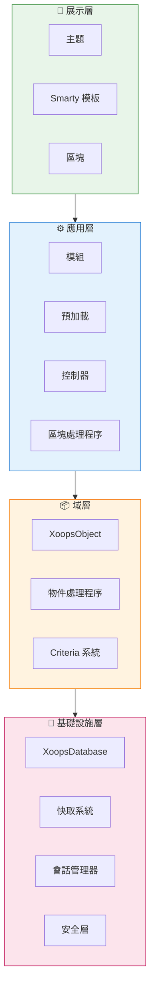
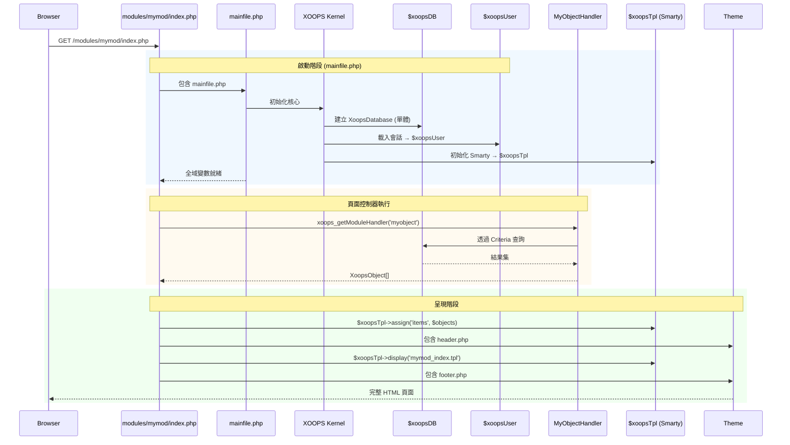

:::note[關於本文檔]
本頁面描述了適用於當前 (2.5.x) 和未來 (4.0.x) 版本的 **XOOPS 概念架構**。某些圖表顯示了分層設計願景。

**版本特定詳細資訊：**
- **XOOPS 2.5.x 當前：** 使用 `mainfile.php`、全域變數 (`$xoopsDB`、`$xoopsUser`)、預加載和處理程序模式
- **XOOPS 4.0 目標：** PSR-15 中間件、DI 容器、路由器 - 請查看 [路線圖](../../07-XOOPS-4.0/XOOPS-4.0-Roadmap.md)
:::

本文檔提供了 XOOPS 系統架構的綜合概述，說明各種元件如何協同工作以建立靈活且可擴展的內容管理系統。

## 概述

XOOPS 遵循模組化架構，將關注點分離成不同的層。該系統圍繞多個核心原則構建：

- **模組性**：功能被組織成獨立、可安裝的模組
- **可擴展性**：系統可以在不修改核心程式碼的情況下進行擴展
- **抽象化**：資料庫和展示層從業務邏輯中抽象出來
- **安全性**：內置的安全機制防止常見漏洞

## 系統層



### 1. 展示層

展示層使用 Smarty 模板引擎處理使用者介面呈現。

**關鍵元件：**
- **主題**：視覺樣式和佈局
- **Smarty 模板**：動態內容呈現
- **區塊**：可重複使用的內容小工具

### 2. 應用層

應用層包含業務邏輯、控制器和模組功能。

**關鍵元件：**
- **模組**：自包含的功能包
- **處理程序**：資料操作類別
- **預加載**：事件偵聽器和掛鉤

### 3. 域層

域層包含核心業務物件和規則。

**關鍵元件：**
- **XoopsObject**：所有域物件的基類
- **處理程序**：域物件的 CRUD 操作

### 4. 基礎設施層

基礎設施層提供核心服務，如資料庫存取和快取。

## 請求生命週期

理解請求生命週期對於有效的 XOOPS 開發至關重要。

### XOOPS 2.5.x 頁面控制器流

當前 XOOPS 2.5.x 使用**頁面控制器**模式，其中每個 PHP 檔案處理自己的請求。全域變數 (`$xoopsDB`、`$xoopsUser`、`$xoopsTpl` 等) 在啟動期間初始化，並在整個執行過程中可用。



### 2.5.x 中的關鍵全域變數

| 全域變數 | 類型 | 初始化 | 用途 |
|--------|------|--------|-----|
| `$xoopsDB` | `XoopsDatabase` | 啟動 | 資料庫連線 (單體) |
| `$xoopsUser` | `XoopsUser\|null` | 會話載入 | 當前登錄使用者 |
| `$xoopsTpl` | `XoopsTpl` | 模板初始化 | Smarty 模板引擎 |
| `$xoopsModule` | `XoopsModule` | 模組載入 | 當前模組上下文 |
| `$xoopsConfig` | `array` | 設定載入 | 系統設定 |

:::note[XOOPS 4.0 比較]
在 XOOPS 4.0 中，頁面控制器模式被替換為 **PSR-15 中間件管道**和基於路由器的分派。全域變數被替換為依賴注入。請查看 [混合模式契約](../../07-XOOPS-4.0/Specifications/Hybrid-Mode-Contract.md) 以了解遷移過程中的相容性保證。
:::

### 1. 啟動階段

```php
// mainfile.php 是入點
include_once XOOPS_ROOT_PATH . '/mainfile.php';

// 核心初始化
$xoops = Xoops::getInstance();
$xoops->boot();
```

**步驟：**
1. 載入設定 (`mainfile.php`)
2. 初始化自動載入器
3. 設定錯誤處理
4. 建立資料庫連線
5. 載入使用者會話
6. 初始化 Smarty 模板引擎

### 2. 路由階段

```php
// 將請求路由到適當的模組
$module = $GLOBALS['xoopsModule'];
$controller = $module->getController();
$controller->dispatch($request);
```

**步驟：**
1. 解析請求 URL
2. 識別目標模組
3. 載入模組設定
4. 檢查權限
5. 路由到適當的處理程序

### 3. 執行階段

```php
// 控制器執行
$data = $handler->getObjects($criteria);
$xoopsTpl->assign('items', $data);
```

**步驟：**
1. 執行控制器邏輯
2. 與資料層互動
3. 處理業務規則
4. 準備檢視資料

### 4. 呈現階段

```php
// 模板呈現
include XOOPS_ROOT_PATH . '/header.php';
$xoopsTpl->display('db:module_template.tpl');
include XOOPS_ROOT_PATH . '/footer.php';
```

**步驟：**
1. 應用主題佈局
2. 呈現模組模板
3. 處理區塊
4. 輸出回應

## 核心元件

### XoopsObject

所有 XOOPS 資料物件的基類。

```php
<?php
class MyModuleItem extends XoopsObject
{
    public function __construct()
    {
        $this->initVar('id', XOBJ_DTYPE_INT, null, false);
        $this->initVar('title', XOBJ_DTYPE_TXTBOX, '', true, 255);
        $this->initVar('content', XOBJ_DTYPE_TXTAREA, '', false);
        $this->initVar('created', XOBJ_DTYPE_INT, time(), false);
    }
}
```

**關鍵方法：**
- `initVar()` - 定義物件屬性
- `getVar()` - 檢索屬性值
- `setVar()` - 設定屬性值
- `assignVars()` - 從陣列批量分配

### XoopsPersistableObjectHandler

處理 XoopsObject 例項的 CRUD 操作。

```php
<?php
class MyModuleItemHandler extends XoopsPersistableObjectHandler
{
    public function __construct(\XoopsDatabase $db)
    {
        parent::__construct($db, 'mymodule_items', 'MyModuleItem', 'id', 'title');
    }

    public function getActiveItems($limit = 10)
    {
        $criteria = new CriteriaCompo();
        $criteria->add(new Criteria('status', 1));
        $criteria->setSort('created');
        $criteria->setOrder('DESC');
        $criteria->setLimit($limit);

        return $this->getObjects($criteria);
    }
}
```

**關鍵方法：**
- `create()` - 建立新物件例項
- `get()` - 按 ID 檢索物件
- `insert()` - 將物件儲存到資料庫
- `delete()` - 從資料庫移除物件
- `getObjects()` - 檢索多個物件
- `getCount()` - 計數匹配物件

### 模組結構

每個 XOOPS 模組都遵循標準目錄結構：

```
modules/mymodule/
├── class/                  # PHP 類別
│   ├── MyModuleItem.php
│   └── MyModuleItemHandler.php
├── include/                # 包含檔案
│   ├── common.php
│   └── functions.php
├── templates/              # Smarty 模板
│   ├── mymodule_index.tpl
│   └── mymodule_item.tpl
├── admin/                  # 管理區域
│   ├── index.php
│   └── menu.php
├── language/               # 翻譯
│   └── english/
│       ├── main.php
│       └── modinfo.php
├── sql/                    # 資料庫架構
│   └── mysql.sql
├── xoops_version.php       # 模組資訊
├── index.php               # 模組入點
└── header.php              # 模組頁首
```

## 依賴注入容器

現代 XOOPS 開發可以利用依賴注入來提高可測試性。

### 基本容器實現

```php
<?php
class XoopsDependencyContainer
{
    private array $services = [];

    public function register(string $name, callable $factory): void
    {
        $this->services[$name] = $factory;
    }

    public function resolve(string $name): mixed
    {
        if (!isset($this->services[$name])) {
            throw new \InvalidArgumentException("Service not found: $name");
        }

        $factory = $this->services[$name];

        if (is_callable($factory)) {
            return $factory($this);
        }

        return $factory;
    }

    public function has(string $name): bool
    {
        return isset($this->services[$name]);
    }
}
```

### PSR-11 相容容器

```php
<?php
namespace Xmf\Di;

use Psr\Container\ContainerInterface;

class BasicContainer implements ContainerInterface
{
    protected array $definitions = [];

    public function set(string $id, mixed $value): void
    {
        $this->definitions[$id] = $value;
    }

    public function get(string $id): mixed
    {
        if (!$this->has($id)) {
            throw new \InvalidArgumentException("Service not found: $id");
        }

        $entry = $this->definitions[$id];

        if (is_callable($entry)) {
            return $entry($this);
        }

        return $entry;
    }

    public function has(string $id): bool
    {
        return isset($this->definitions[$id]);
    }
}
```

### 使用示例

```php
<?php
// 服務登錄
$container = new XoopsDependencyContainer();

$container->register('database', function () {
    return XoopsDatabaseFactory::getDatabaseConnection();
});

$container->register('userHandler', function ($c) {
    return new XoopsUserHandler($c->resolve('database'));
});

// 服務解析
$userHandler = $container->resolve('userHandler');
$user = $userHandler->get($userId);
```

## 擴展點

XOOPS 提供了多種擴展機制：

### 1. 預加載

預加載允許模組掛接到核心事件。

```php
<?php
// modules/mymodule/preloads/core.php
class MymoduleCorePreload extends XoopsPreloadItem
{
    public static function eventCoreHeaderEnd($args)
    {
        // 在頁首處理結束時執行
    }

    public static function eventCoreFooterStart($args)
    {
        // 在頁尾處理開始時執行
    }
}
```

### 2. 外掛程式

外掛程式擴展模組內的特定功能。

```php
<?php
// modules/mymodule/plugins/notify.php
class MymoduleNotifyPlugin
{
    public function onItemCreate($item)
    {
        // 建立項目時傳送通知
    }
}
```

### 3. 篩選器

篩選器修改通過系統的資料。

```php
<?php
// 內容篩選器示例
$myts = MyTextSanitizer::getInstance();
$content = $myts->displayTarea($rawContent, 1, 1, 1);
```

## 最佳實踐

### 程式碼組織

1. **為新程式碼使用命名空間**：
   ```php
   namespace XoopsModules\MyModule;

   class Item extends \XoopsObject
   {
       // 實現
   }
   ```

2. **遵循 PSR-4 自動載入**：
   ```json
   {
       "autoload": {
           "psr-4": {
               "XoopsModules\\MyModule\\": "class/"
           }
       }
   }
   ```

3. **分離關注點**：
   - 業務邏輯在 `class/`
   - 展示在 `templates/`
   - 控制器在模組根目錄

### 效能

1. **對昂貴操作使用快取**
2. **盡可能延遲載入資源**
3. **使用 criteria 批處理最小化資料庫查詢**
4. **透過避免複雜邏輯最佳化模板**

### 安全性

1. **使用 `Xmf\Request` 驗證所有輸入**
2. **在模板中逸出輸出**
3. **對資料庫查詢使用準備好的語句**
4. **在敏感操作前檢查權限**

## 相關文檔

- [設計模式](Design-Patterns.md) - XOOPS 中使用的設計模式
- [資料庫層](../Database/Database-Layer.md) - 資料庫抽象詳細資訊
- [Smarty 基礎](../Templates/Smarty-Basics.md) - 模板系統文檔
- [安全最佳實踐](../Security/Security-Best-Practices.md) - 安全指南

---

#xoops #architecture #core #design #system-design
