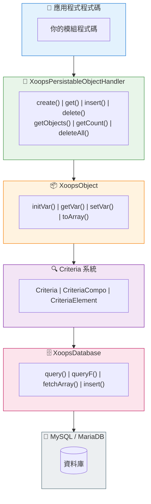

# 🗄️ 資料庫層

<span class="version-badge version-25x">2.5.x ✅</span> <span class="version-badge version-40x">4.0.x ✅</span>

> 理解 XOOPS 資料庫抽象、物件持久化和查詢建構。

:::tip[為未來做準備]
處理程序/Criteria 模式在兩個版本中都有效。要為 XOOPS 4.0 做準備，考慮在 [Repository 類別](../../03-Module-Development/Patterns/Repository-Pattern.md) 中包裝處理程序以獲得更好的可測試性。請參閱 [選擇資料存取模式](../../03-Module-Development/Choosing-Data-Access-Pattern.md)。
:::

---

## 概述

XOOPS 資料庫層在 MySQL/MariaDB 上提供強大的抽象，具有以下特性：

- **工廠模式** - 集中式資料庫連線管理
- **物件關係映射** - XoopsObject 和處理程序
- **查詢建構** - 複雜查詢的 Criteria 系統
- **連線重複使用** - 透過單體工廠的單一連線 (不是連線池)

---

## 🏗️ 架構



---

## 🔌 資料庫連線

### 取得連線

```php
// 推薦：使用全域資料庫例項
$db = \XoopsDatabaseFactory::getDatabaseConnection();

// 舊版：全域變數 (仍然有效)
global $xoopsDB;
```

### XoopsDatabaseFactory

工廠模式確保單一資料庫連線被重複使用：

```php
<?php

class XoopsDatabaseFactory
{
    private static ?XoopsDatabase $instance = null;

    public static function getDatabaseConnection(): XoopsDatabase
    {
        if (self::$instance === null) {
            self::$instance = new XoopsMySQLDatabase();
        }
        return self::$instance;
    }
}
```

---

## 📦 XoopsObject

所有 XOOPS 資料物件的基類。

### 定義物件

```php
<?php

namespace XoopsModules\MyModule;

class Article extends \XoopsObject
{
    public function __construct()
    {
        $this->initVar('article_id', \XOBJ_DTYPE_INT, null, false);
        $this->initVar('category_id', \XOBJ_DTYPE_INT, 0, true);
        $this->initVar('title', \XOBJ_DTYPE_TXTBOX, '', true, 255);
        $this->initVar('content', \XOBJ_DTYPE_TXTAREA, '', false);
        $this->initVar('author_id', \XOBJ_DTYPE_INT, 0, true);
        $this->initVar('status', \XOBJ_DTYPE_TXTBOX, 'draft', true, 20);
        $this->initVar('views', \XOBJ_DTYPE_INT, 0, false);
        $this->initVar('created', \XOBJ_DTYPE_INT, time(), false);
        $this->initVar('updated', \XOBJ_DTYPE_INT, 0, false);
    }
}
```

### 資料類型

| 常數 | 類型 | 描述 |
|------|------|------|
| `XOBJ_DTYPE_INT` | 整數 | 數值 |
| `XOBJ_DTYPE_TXTBOX` | 字串 | 短文字 (< 255 個字元) |
| `XOBJ_DTYPE_TXTAREA` | 文字 | 長文字內容 |
| `XOBJ_DTYPE_EMAIL` | 電子郵件 | 電子郵件地址 |
| `XOBJ_DTYPE_URL` | URL | 網址 |
| `XOBJ_DTYPE_FLOAT` | 浮點數 | 十進位數字 |
| `XOBJ_DTYPE_ARRAY` | 陣列 | 序列化陣列 |
| `XOBJ_DTYPE_OTHER` | 混合 | 原始資料 |

### 使用物件

```php
// 建立新物件
$article = new Article();

// 設定值
$article->setVar('title', 'My Article');
$article->setVar('content', 'Article content here...');
$article->setVar('category_id', 5);
$article->setVar('author_id', $xoopsUser->getVar('uid'));

// 取得值
$title = $article->getVar('title');           // 原始值
$titleDisplay = $article->getVar('title', 'e'); // 用於編輯 (HTML 實體)
$titleShow = $article->getVar('title', 's');    // 用於顯示 (已清理)

// 從陣列批量分配
$article->assignVars([
    'title' => 'New Title',
    'status' => 'published'
]);

// 轉換為陣列
$data = $article->toArray();
```

---

## 🔧 物件處理程序

### XoopsPersistableObjectHandler

處理程序類別管理 XoopsObject 例項的 CRUD 操作。

```php
<?php

namespace XoopsModules\MyModule;

class ArticleHandler extends \XoopsPersistableObjectHandler
{
    public function __construct(\XoopsDatabase $db = null)
    {
        parent::__construct(
            $db,
            'mymodule_articles',  // 表名稱
            Article::class,       // 物件類別
            'article_id',         // 主鍵
            'title'               // 識別字段
        );
    }
}
```

### 處理程序方法

```php
// 取得處理程序例項
$articleHandler = xoops_getModuleHandler('article', 'mymodule');

// 建立新物件
$article = $articleHandler->create();

// 按 ID 取得
$article = $articleHandler->get(123);

// 插入 (建立或更新)
$success = $articleHandler->insert($article);

// 刪除
$success = $articleHandler->delete($article);

// 取得多個物件
$articles = $articleHandler->getObjects($criteria);

// 取得計數
$count = $articleHandler->getCount($criteria);

// 取得為陣列 (鍵 => 值)
$list = $articleHandler->getList($criteria);

// 刪除多個
$deleted = $articleHandler->deleteAll($criteria);
```

### 自訂處理程序方法

```php
<?php

namespace XoopsModules\MyModule;

class ArticleHandler extends \XoopsPersistableObjectHandler
{
    // ... 構造函式

    /**
     * 取得已發佈的文章
     */
    public function getPublished(int $limit = 10, int $start = 0): array
    {
        $criteria = new \CriteriaCompo();
        $criteria->add(new \Criteria('status', 'published'));
        $criteria->setSort('created');
        $criteria->setOrder('DESC');
        $criteria->setLimit($limit);
        $criteria->setStart($start);

        return $this->getObjects($criteria);
    }

    /**
     * 按分類取得文章
     */
    public function getByCategory(int $categoryId, int $limit = 10): array
    {
        $criteria = new \CriteriaCompo();
        $criteria->add(new \Criteria('category_id', $categoryId));
        $criteria->add(new \Criteria('status', 'published'));
        $criteria->setSort('created');
        $criteria->setOrder('DESC');
        $criteria->setLimit($limit);

        return $this->getObjects($criteria);
    }

    /**
     * 按作者取得文章
     */
    public function getByAuthor(int $authorId): array
    {
        $criteria = new \Criteria('author_id', $authorId);
        return $this->getObjects($criteria);
    }

    /**
     * 增加檢視計數
     */
    public function incrementViews(int $articleId): bool
    {
        $sql = sprintf(
            'UPDATE %s SET views = views + 1 WHERE article_id = %d',
            $this->table,
            $articleId
        );
        return $this->db->queryF($sql) !== false;
    }

    /**
     * 取得熱門文章
     */
    public function getPopular(int $limit = 5): array
    {
        $criteria = new \CriteriaCompo();
        $criteria->add(new \Criteria('status', 'published'));
        $criteria->setSort('views');
        $criteria->setOrder('DESC');
        $criteria->setLimit($limit);

        return $this->getObjects($criteria);
    }
}
```

---

## 🔍 Criteria 系統

Criteria 系統提供了一種強大的、物件導向的方式來建構 SQL WHERE 子句。

### 基本 Criteria

```php
// 簡單相等
$criteria = new \Criteria('status', 'published');

// 使用運算子
$criteria = new \Criteria('views', 100, '>=');

// 欄位比較
$criteria = new \Criteria('updated', 'created', '>');
```

### CriteriaCompo (結合 Criteria)

```php
$criteria = new \CriteriaCompo();

// AND 條件 (預設)
$criteria->add(new \Criteria('status', 'published'));
$criteria->add(new \Criteria('category_id', 5));

// OR 條件
$criteria->add(new \Criteria('featured', 1), 'OR');

// 巢狀條件
$subCriteria = new \CriteriaCompo();
$subCriteria->add(new \Criteria('author_id', 1));
$subCriteria->add(new \Criteria('author_id', 2), 'OR');
$criteria->add($subCriteria);
```

### 排序和分頁

```php
$criteria = new \CriteriaCompo();
$criteria->add(new \Criteria('status', 'published'));

// 排序
$criteria->setSort('created');
$criteria->setOrder('DESC');

// 多個排序欄位
$criteria->setSort('category_id, created');
$criteria->setOrder('ASC, DESC');

// 分頁
$criteria->setLimit(10);    // 每頁項目
$criteria->setStart(20);    // 偏移量

// 分組
$criteria->setGroupby('category_id');
```

### 運算子

| 運算子 | 示例 | SQL 輸出 |
|--------|------|---------|
| `=` | `new Criteria('status', 'published')` | `status = 'published'` |
| `!=` | `new Criteria('status', 'draft', '!=')` | `status != 'draft'` |
| `>` | `new Criteria('views', 100, '>')` | `views > 100` |
| `>=` | `new Criteria('views', 100, '>=')` | `views >= 100` |
| `<` | `new Criteria('views', 100, '<')` | `views < 100` |
| `<=` | `new Criteria('views', 100, '<=')` | `views <= 100` |
| `LIKE` | `new Criteria('title', '%php%', 'LIKE')` | `title LIKE '%php%'` |
| `NOT LIKE` | `new Criteria('title', '%test%', 'NOT LIKE')` | `title NOT LIKE '%test%'` |
| `IN` | `new Criteria('id', '(1,2,3)', 'IN')` | `id IN (1,2,3)` |
| `NOT IN` | `new Criteria('id', '(1,2,3)', 'NOT IN')` | `id NOT IN (1,2,3)` |

### 複雜示例

```php
// 在特定分類中尋找已發佈的文章，
// 標題中包含搜尋詞，按檢視排序
$criteria = new \CriteriaCompo();

// 狀態必須是已發佈
$criteria->add(new \Criteria('status', 'published'));

// 在分類 1、2 或 3 中
$criteria->add(new \Criteria('category_id', '(1, 2, 3)', 'IN'));

// 標題包含搜尋詞
$searchTerm = '%' . $db->escape($searchQuery) . '%';
$criteria->add(new \Criteria('title', $searchTerm, 'LIKE'));

// 在過去 30 天內建立
$thirtyDaysAgo = time() - (30 * 24 * 60 * 60);
$criteria->add(new \Criteria('created', $thirtyDaysAgo, '>='));

// 按檢視遞減排序
$criteria->setSort('views');
$criteria->setOrder('DESC');

// 分頁
$criteria->setLimit(10);
$criteria->setStart($page * 10);

$articles = $articleHandler->getObjects($criteria);
$totalCount = $articleHandler->getCount($criteria);
```

---

## 📝 直接查詢

對於使用 Criteria 無法進行的複雜查詢，請使用直接 SQL。

### 安全查詢 (讀取)

```php
$db = \XoopsDatabaseFactory::getDatabaseConnection();

$sql = sprintf(
    'SELECT a.*, c.category_name
     FROM %s a
     LEFT JOIN %s c ON a.category_id = c.category_id
     WHERE a.status = %s
     ORDER BY a.created DESC
     LIMIT %d',
    $db->prefix('mymodule_articles'),
    $db->prefix('mymodule_categories'),
    $db->quoteString('published'),
    10
);

$result = $db->query($sql);

while ($row = $db->fetchArray($result)) {
    // 處理列
    echo $row['title'];
}
```

### 寫入查詢

```php
// 插入
$sql = sprintf(
    "INSERT INTO %s (title, content, created) VALUES (%s, %s, %d)",
    $db->prefix('mymodule_articles'),
    $db->quoteString($title),
    $db->quoteString($content),
    time()
);
$db->queryF($sql);
$newId = $db->getInsertId();

// 更新
$sql = sprintf(
    "UPDATE %s SET views = views + 1 WHERE article_id = %d",
    $db->prefix('mymodule_articles'),
    $articleId
);
$db->queryF($sql);
$affectedRows = $db->getAffectedRows();

// 刪除
$sql = sprintf(
    "DELETE FROM %s WHERE article_id = %d",
    $db->prefix('mymodule_articles'),
    $articleId
);
$db->queryF($sql);
```

### 逸出值

```php
// 字串逸出
$safeString = $db->quoteString($userInput);
// 或
$safeString = $db->escape($userInput);

// 整數 (無需逸出，只需轉型)
$safeInt = (int) $userInput;
```

---

## ⚠️ 安全最佳實踐

### 始終逸出使用者輸入

```php
// 永遠不要這樣做
$sql = "SELECT * FROM articles WHERE title = '$_GET[title]'"; // SQL 注入!

// 這樣做
$title = $db->escape($_GET['title']);
$sql = "SELECT * FROM articles WHERE title = '$title'";

// 或更好，使用 Criteria
$criteria = new \Criteria('title', $db->escape($_GET['title']));
```

### 使用參數化查詢 (XMF)

```php
use Xmf\Database\TableLoad;

// 安全批量插入
$tableLoad = new TableLoad('mymodule_articles');
$tableLoad->insert([
    ['title' => 'Article 1', 'content' => 'Content 1'],
    ['title' => 'Article 2', 'content' => 'Content 2'],
]);
```

### 驗證輸入類型

```php
use Xmf\Request;

$id = Request::getInt('id', 0, 'GET');
$title = Request::getString('title', '', 'POST');
```

---

## 📊 資料庫架構示例

```sql
-- sql/mysql.sql

CREATE TABLE `{PREFIX}_mymodule_articles` (
    `article_id` INT(11) UNSIGNED NOT NULL AUTO_INCREMENT,
    `category_id` INT(11) UNSIGNED NOT NULL DEFAULT 0,
    `title` VARCHAR(255) NOT NULL DEFAULT '',
    `content` TEXT,
    `author_id` INT(11) UNSIGNED NOT NULL DEFAULT 0,
    `status` VARCHAR(20) NOT NULL DEFAULT 'draft',
    `views` INT(11) UNSIGNED NOT NULL DEFAULT 0,
    `created` INT(11) UNSIGNED NOT NULL DEFAULT 0,
    `updated` INT(11) UNSIGNED NOT NULL DEFAULT 0,
    PRIMARY KEY (`article_id`),
    KEY `category_id` (`category_id`),
    KEY `author_id` (`author_id`),
    KEY `status` (`status`),
    KEY `created` (`created`)
) ENGINE=InnoDB DEFAULT CHARSET=utf8mb4;
```

---

## 🔗 相關文檔

- [Criteria 系統深度探討](../../04-API-Reference/Kernel/Criteria.md)
- [設計模式 - 工廠](../Architecture/Design-Patterns.md)
- [SQL 注入預防](../Security/SQL-Injection-Prevention.md)
- [XoopsDatabase API 參考](../../04-API-Reference/Database/XoopsDatabase.md)

---

#xoops #database #orm #criteria #handlers #mysql
