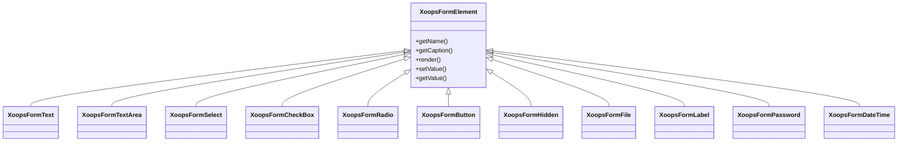

## 概述

XOOPS 透過其 `XoopsFormElement` 類別階層提供了一套完整的表單元素。這些元素處理呈現、驗證和 Web 表單的資料處理。

## 表單元素階層



## 文字輸入元素

### XoopsFormText

單行文字輸入：

```php
use XoopsFormText;

$element = new XoopsFormText(
    caption: 'Username',
    name: 'username',
    size: 30,
    maxlength: 50,
    value: $currentValue
);
```

### XoopsFormPassword

密碼輸入，帶遮罩：

```php
use XoopsFormPassword;

$element = new XoopsFormPassword(
    caption: 'Password',
    name: 'password',
    size: 30,
    maxlength: 100
);
```

### XoopsFormTextArea

多行文字輸入：

```php
use XoopsFormTextArea;

$element = new XoopsFormTextArea(
    caption: 'Description',
    name: 'description',
    value: $currentValue,
    rows: 5,
    cols: 50
);
```

## 選擇元素

### XoopsFormSelect

下拉式清單選擇：

```php
use XoopsFormSelect;

$element = new XoopsFormSelect(
    caption: 'Category',
    name: 'category_id',
    value: $selected,
    size: 1,
    multiple: false
);

$element->addOption(1, 'Category 1');
$element->addOption(2, 'Category 2');
$element->addOptionArray([
    3 => 'Category 3',
    4 => 'Category 4'
]);
```

### XoopsFormCheckBox

核取方塊輸入：

```php
use XoopsFormCheckBox;

$element = new XoopsFormCheckBox(
    caption: 'Features',
    name: 'features',
    value: $selected
);

$element->addOption('comments', 'Enable Comments');
$element->addOption('ratings', 'Enable Ratings');
```

### XoopsFormRadio

選項按鈕組：

```php
use XoopsFormRadio;

$element = new XoopsFormRadio(
    caption: 'Status',
    name: 'status',
    value: $currentValue
);

$element->addOption('draft', 'Draft');
$element->addOption('published', 'Published');
$element->addOption('archived', 'Archived');
```

## 檔案上傳

### XoopsFormFile

檔案上傳輸入：

```php
use XoopsFormFile;

$element = new XoopsFormFile(
    caption: 'Upload Image',
    name: 'image'
);

$element->setMaxFileSize(2 * 1024 * 1024); // 2MB
```

## 日期和時間

### XoopsFormDateTime

日期/時間選擇器：

```php
use XoopsFormDateTime;

$element = new XoopsFormDateTime(
    caption: 'Publish Date',
    name: 'publish_date',
    size: 15,
    value: time()
);
```

## 特殊元素

### XoopsFormHidden

隱藏欄位：

```php
use XoopsFormHidden;

$element = new XoopsFormHidden('article_id', $articleId);
```

### XoopsFormLabel

僅顯示標籤：

```php
use XoopsFormLabel;

$element = new XoopsFormLabel(
    caption: 'Created By',
    value: $authorName
);
```

### XoopsFormButton

表單按鈕：

```php
use XoopsFormButton;

// 提交按鈕
$submit = new XoopsFormButton('', 'submit', 'Save', 'submit');

// 重設按鈕
$reset = new XoopsFormButton('', 'reset', 'Reset', 'reset');
```

## 元素自訂

### 新增 CSS 類別

```php
$element->setExtra('class="form-control custom-class"');
```

### 新增自訂屬性

```php
$element->setExtra('data-validate="required" placeholder="Enter text..."');
```

### 設定描述

```php
$element->setDescription('Enter a unique username (3-20 characters)');
```

## 相關文檔

- 表單概述
- 表單驗證
- 自訂呈現器
