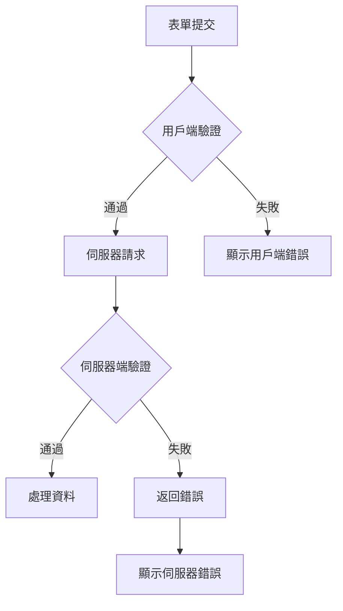

## 概述

XOOPS 為表單輸入提供用戶端和伺服器端驗證。本指南涵蓋驗證技術、內置驗證器和自訂驗證實現。

## 驗證架構



## 伺服器端驗證

### 使用 XoopsFormValidator

```php
use Xoops\Core\Form\Validator;

$validator = new Validator();

$validator->addRule('username', 'required', 'Username is required');
$validator->addRule('username', 'minLength:3', 'Username must be at least 3 characters');
$validator->addRule('username', 'maxLength:50', 'Username cannot exceed 50 characters');
$validator->addRule('email', 'email', 'Please enter a valid email address');
$validator->addRule('password', 'minLength:8', 'Password must be at least 8 characters');

if (!$validator->validate($_POST)) {
    $errors = $validator->getErrors();
    // 處理錯誤
}
```

### 內置驗證規則

| 規則 | 描述 | 示例 |
|------|------|------|
| `required` | 欄位不能為空 | `required` |
| `email` | 有效的電子郵件格式 | `email` |
| `url` | 有效的 URL 格式 | `url` |
| `numeric` | 僅數值 | `numeric` |
| `integer` | 整數值 | `integer` |
| `minLength` | 最小字串長度 | `minLength:3` |
| `maxLength` | 最大字串長度 | `maxLength:100` |
| `min` | 最小數值 | `min:1` |
| `max` | 最大數值 | `max:100` |
| `regex` | 自訂正規表示式模式 | `regex:/^[a-z]+$/` |
| `in` | 值在列表中 | `in:draft,published,archived` |
| `date` | 有效日期格式 | `date` |
| `alpha` | 僅字母 | `alpha` |
| `alphanumeric` | 字母和數字 | `alphanumeric` |

### 自訂驗證規則

```php
$validator->addCustomRule('unique_username', function($value) {
    $memberHandler = xoops_getHandler('member');
    $criteria = new \CriteriaCompo();
    $criteria->add(new \Criteria('uname', $value));
    return $memberHandler->getUserCount($criteria) === 0;
}, 'Username already exists');

$validator->addRule('username', 'unique_username');
```

## 請求驗證

### 清理輸入

```php
use Xoops\Core\Request;

// 取得已清理的值
$username = Request::getString('username', '', 'POST');
$email = Request::getEmail('email', '', 'POST');
$age = Request::getInt('age', 0, 'POST');
$price = Request::getFloat('price', 0.0, 'POST');
$tags = Request::getArray('tags', [], 'POST');

// 使用驗證
$username = Request::getString('username', '', 'POST', [
    'minLength' => 3,
    'maxLength' => 50
]);
```

### XSS 預防

```php
use Xoops\Core\Text\Sanitizer;

$sanitizer = Sanitizer::getInstance();

// 清理 HTML 內容
$cleanContent = $sanitizer->sanitizeForDisplay($userContent);

// 移除所有 HTML
$plainText = $sanitizer->stripHtml($userContent);

// 允許特定標籤
$content = $sanitizer->sanitizeForDisplay($userContent, [
    'allowedTags' => '<p><br><strong><em><a>'
]);
```

## 用戶端驗證

### HTML5 驗證屬性

```php
// 必需欄位
$element->setExtra('required');

// 模式驗證
$element->setExtra('pattern="[a-zA-Z0-9]+" title="Alphanumeric only"');

// 長度限制
$element->setExtra('minlength="3" maxlength="50"');

// 數值限制
$element->setExtra('min="1" max="100"');
```

### JavaScript 驗證

```javascript
document.getElementById('myForm').addEventListener('submit', function(e) {
    const username = document.getElementById('username').value;
    const errors = [];

    if (username.length < 3) {
        errors.push('Username must be at least 3 characters');
    }

    if (!/^[a-zA-Z0-9_]+$/.test(username)) {
        errors.push('Username can only contain letters, numbers, and underscores');
    }

    if (errors.length > 0) {
        e.preventDefault();
        displayErrors(errors);
    }
});
```

## CSRF 保護

### 令牌產生

```php
// 在表單中產生令牌
$form->addElement(new \XoopsFormHiddenToken());

// 這新增了一個帶有安全令牌的隱藏欄位
```

### 令牌驗證

```php
use Xoops\Core\Security;

if (!Security::checkReferer()) {
    die('Invalid request origin');
}

if (!Security::checkToken()) {
    die('Invalid security token');
}
```

## 檔案上傳驗證

```php
use Xoops\Core\Uploader;

$uploader = new Uploader(
    uploadDir: XOOPS_UPLOAD_PATH . '/images/',
    allowedMimeTypes: ['image/jpeg', 'image/png', 'image/gif'],
    maxFileSize: 2 * 1024 * 1024, // 2MB
    maxWidth: 1920,
    maxHeight: 1080
);

if ($uploader->fetchMedia('image_upload')) {
    if ($uploader->upload()) {
        $savedFile = $uploader->getSavedFileName();
    } else {
        $errors[] = $uploader->getErrors();
    }
}
```

## 錯誤顯示

### 收集錯誤

```php
$errors = [];

if (empty($username)) {
    $errors['username'] = 'Username is required';
}

if (!filter_var($email, FILTER_VALIDATE_EMAIL)) {
    $errors['email'] = 'Invalid email format';
}

if (!empty($errors)) {
    // 在重新導向後顯示，將其儲存在會話中
    $_SESSION['form_errors'] = $errors;
    $_SESSION['form_data'] = $_POST;
    header('Location: ' . $_SERVER['HTTP_REFERER']);
    exit;
}
```

### 顯示錯誤

```smarty
{if $errors}
<div class="alert alert-danger">
    <ul>
        {foreach $errors as $field => $message}
        <li>{$message}</li>
        {/foreach}
    </ul>
</div>
{/if}
```

## 最佳實踐

1. **始終進行伺服器端驗證** - 用戶端驗證可以被繞過
2. **使用參數化查詢** - 防止 SQL 注入
3. **清理輸出** - 防止 XSS 攻擊
4. **驗證檔案上傳** - 檢查 MIME 類型和大小
5. **使用 CSRF 令牌** - 防止跨網站請求偽造
6. **速率限制提交** - 防止濫用

## 相關文檔

- 表單元素參考
- 表單概述
- 安全最佳實踐
