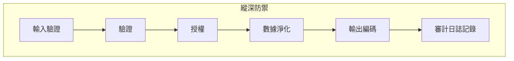

## 概覽

本文檔概述了XOOPS開發的安全最佳實踐，涵蓋輸入驗證、輸出編碼、驗證、授權和防護常見Web漏洞。

## 安全原則



## 輸入驗證

### 請求淨化

```php
use Xoops\Core\Request;

// 始終使用類型化的取得器
$id = Request::getInt('id', 0, 'GET');
$name = Request::getString('name', '', 'POST');
$email = Request::getEmail('email', '', 'POST');
$url = Request::getUrl('website', '', 'POST');

// 永遠不要使用原始的$_GET/$_POST/$_REQUEST
// 不好：$id = $_GET['id'];
// 好：$id = Request::getInt('id', 0, 'GET');
```

### 驗證規則

```php
// 使用前驗證
if ($id <= 0) {
    throw new InvalidArgumentException('Invalid ID');
}

if (!preg_match('/^[a-zA-Z0-9_]{3,50}$/', $username)) {
    throw new InvalidArgumentException('Invalid username format');
}

// 為列舉使用白名單驗證
$allowedStatuses = ['draft', 'published', 'archived'];
if (!in_array($status, $allowedStatuses, true)) {
    throw new InvalidArgumentException('Invalid status');
}
```

## SQL注入預防

### 使用參數化查詢

```php
// 好：參數化查詢
$sql = "SELECT * FROM {$xoopsDB->prefix('users')} WHERE uid = ?";
$result = $xoopsDB->query($sql, [$userId]);

// 不好：字符串連接(易受攻擊！)
// $sql = "SELECT * FROM users WHERE uid = " . $userId;
```

### 使用Criteria對象

```php
use Criteria;
use CriteriaCompo;

$criteria = new CriteriaCompo();
$criteria->add(new Criteria('status', 'published'));
$criteria->add(new Criteria('uid', $userId, '='));
$criteria->add(new Criteria('created', time() - 86400, '>'));

$articles = $articleHandler->getObjects($criteria);
```

## XSS預防

### 輸出編碼

```php
use Xoops\Core\Text\Sanitizer;

// HTML上下文
$safeName = htmlspecialchars($userName, ENT_QUOTES, 'UTF-8');

// 在範本中(自動轉義)
{$userName|escape}

// 對於豐富內容
$sanitizer = Sanitizer::getInstance();
$safeContent = $sanitizer->sanitizeForDisplay($content);
```

### 內容安全政策

```php
// 設定CSP標題
header("Content-Security-Policy: default-src 'self'; script-src 'self'; style-src 'self' 'unsafe-inline'");
```

## CSRF保護

### 標記實施

```php
// 產生標記
use Xoops\Core\Security;

$token = Security::createToken();

// 在表單中
echo '<input type="hidden" name="XOOPS_TOKEN_REQUEST" value="' . $token . '">';

// 驗證提交
if (!Security::checkToken()) {
    die('Security token mismatch');
}
```

### 使用XoopsForm

```php
// 自動新增CSRF標記
$form = new XoopsThemeForm('Edit Article', 'articleform', 'save.php');
$form->addElement(new XoopsFormHiddenToken());
```

## 驗證

### 密碼處理

```php
// 雜湊密碼(PHP 5.5+)
$hashedPassword = password_hash($plainPassword, PASSWORD_ARGON2ID);

// 驗證密碼
if (password_verify($plainPassword, $storedHash)) {
    // 密碼正確
}

// 檢查是否需要重新雜湊
if (password_needs_rehash($storedHash, PASSWORD_ARGON2ID)) {
    $newHash = password_hash($plainPassword, PASSWORD_ARGON2ID);
    // 更新存儲的雜湊
}
```

### 會話安全

```php
// 登錄後重新產生會話ID
session_regenerate_id(true);

// 設定安全會話Cookie選項
ini_set('session.cookie_httponly', 1);
ini_set('session.cookie_secure', 1);
ini_set('session.cookie_samesite', 'Lax');
```

## 授權

### 權限檢查

```php
// 檢查模組管理員
if (!$xoopsUser || !$xoopsUser->isAdmin($xoopsModule->mid())) {
    redirect_header('index.php', 3, 'Access denied');
}

// 檢查群組權限
$grouppermHandler = xoops_getHandler('groupperm');
$groups = $xoopsUser ? $xoopsUser->getGroups() : [XOOPS_GROUP_ANONYMOUS];

if (!$grouppermHandler->checkRight('view_item', $itemId, $groups, $moduleId)) {
    throw new AccessDeniedException('Permission denied');
}
```

### 角色型訪問

```php
class PermissionChecker
{
    public function canEdit(Article $article, ?XoopsUser $user): bool
    {
        if (!$user) {
            return false;
        }

        // 管理員可以編輯任何內容
        if ($user->isAdmin()) {
            return true;
        }

        // 作者可以編輯自己的內容
        if ($article->getAuthorId() === $user->uid()) {
            return true;
        }

        // 檢查編輯器權限
        return $this->hasPermission($user, 'article_edit');
    }
}
```

## 檔案上傳安全

```php
class SecureUploader
{
    private array $allowedMimeTypes = [
        'image/jpeg',
        'image/png',
        'image/gif'
    ];

    private array $allowedExtensions = ['jpg', 'jpeg', 'png', 'gif'];

    public function validate(array $file): bool
    {
        // 檢查檔案大小
        if ($file['size'] > 2 * 1024 * 1024) {
            throw new FileTooLargeException();
        }

        // 驗證MIME類型
        $finfo = new finfo(FILEINFO_MIME_TYPE);
        $mimeType = $finfo->file($file['tmp_name']);

        if (!in_array($mimeType, $this->allowedMimeTypes, true)) {
            throw new InvalidFileTypeException();
        }

        // 檢查副檔名
        $extension = strtolower(pathinfo($file['name'], PATHINFO_EXTENSION));
        if (!in_array($extension, $this->allowedExtensions, true)) {
            throw new InvalidFileTypeException();
        }

        // 產生安全檔案名稱
        return true;
    }

    public function generateSafeFilename(string $original): string
    {
        $extension = strtolower(pathinfo($original, PATHINFO_EXTENSION));
        return bin2hex(random_bytes(16)) . '.' . $extension;
    }
}
```

## 審計日誌記錄

```php
class SecurityLogger
{
    public function logAuthAttempt(string $username, bool $success, string $ip): void
    {
        $data = [
            'username' => $username,
            'success' => $success,
            'ip' => $ip,
            'user_agent' => $_SERVER['HTTP_USER_AGENT'] ?? '',
            'timestamp' => time()
        ];

        // 記錄到資料庫或檔案
        $this->log('auth', $data);
    }

    public function logSensitiveAction(int $userId, string $action, array $context): void
    {
        $data = [
            'user_id' => $userId,
            'action' => $action,
            'context' => json_encode($context),
            'ip' => $_SERVER['REMOTE_ADDR'],
            'timestamp' => time()
        ];

        $this->log('audit', $data);
    }
}
```

## 安全標題

```php
// 建議的安全標題
header('X-Content-Type-Options: nosniff');
header('X-Frame-Options: SAMEORIGIN');
header('X-XSS-Protection: 1; mode=block');
header('Referrer-Policy: strict-origin-when-cross-origin');
header('Permissions-Policy: geolocation=(), microphone=(), camera=()');

// HSTS(僅用於HTTPS網站)
if (isset($_SERVER['HTTPS']) && $_SERVER['HTTPS'] === 'on') {
    header('Strict-Transport-Security: max-age=31536000; includeSubDomains');
}
```

## 速率限制

```php
class RateLimiter
{
    public function check(string $key, int $maxAttempts, int $windowSeconds): bool
    {
        $cacheKey = 'rate_limit:' . $key;
        $attempts = (int) $this->cache->get($cacheKey, 0);

        if ($attempts >= $maxAttempts) {
            return false; // 速率已限制
        }

        $this->cache->increment($cacheKey, 1, $windowSeconds);
        return true;
    }
}

// 用法
$limiter = new RateLimiter();
if (!$limiter->check('login:' . $ip, 5, 300)) {
    throw new TooManyRequestsException('Too many login attempts');
}
```

## 安全檢查清單

- [ ] 所有用戶輸入已驗證和淨化
- [ ] 所有資料庫操作的參數化查詢
- [ ] 所有用戶產生內容的輸出編碼
- [ ] 所有狀態改變表單上的CSRF標記
- [ ] 安全密碼雜湊(Argon2id)
- [ ] 會話安全已配置
- [ ] 檔案上傳驗證
- [ ] 安全標題已設定
- [ ] 實施的速率限制
- [ ] 啟用審計日誌記錄
- [ ] 錯誤訊息不洩露敏感訊息

## 相關文檔

- 驗證系統
- 權限系統
- 輸入驗證
