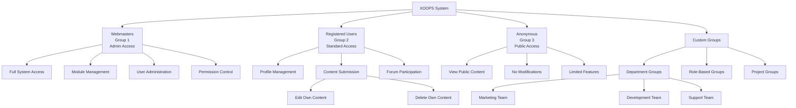
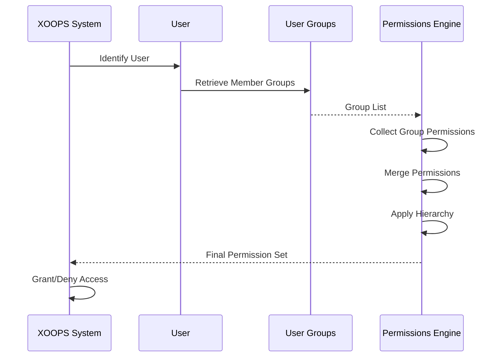

# XOOPS中的群組系統

XOOPS群組系統為組織用戶和管理集體權限提供了分層框架。本文件涵蓋預設群組、自訂群組建立、層級和實際實施。

## 預設群組

XOOPS包括系統安裝期間建立的三個基本群組:

### Webmasters群組(ID: 1)

Webmasters群組代表具有完整系統存取權限的網站管理員。

**特徵:**
- 群組ID: 1
- 最高權限等級
- 無法刪除
- 完整存取所有模組和功能
- 存取管理面板

```php
<?php
/**
 * 檢查用戶是否為網站管理員
 */
$groupHandler = xoops_getHandler('group');
$group = $groupHandler->getGroup(1);
$webmasterUsers = $groupHandler->getUsersByGroup(1);

if ($xoopsUser instanceof XoopsUser) {
    $groups = $xoopsUser->getGroups();
    if (in_array(1, $groups)) {
        // 用戶是網站管理員
        echo "歡迎，網站管理員！";
    }
}
```

### 已註冊用戶群組(ID: 2)

已註冊用戶群組包括所有不是匿名的已驗證用戶。

**特徵:**
- 群組ID: 2
- 新註冊的預設群組
- 可以存取用戶特定功能
- 受群組權限限制
- 可針對標準用戶功能自訂

```php
<?php
/**
 * 檢查用戶是否已註冊(非匿名)
 */
if ($xoopsUser instanceof XoopsUser) {
    // 用戶已登入
    $groups = $xoopsUser->getGroups();
    if (in_array(2, $groups)) {
        // 用戶在已註冊群組中
        echo "歡迎，已註冊用戶！";
    }
}
```

### 匿名群組(ID: 3)

匿名群組代表網站的未驗證訪客。

**特徵:**
- 群組ID: 3
- 未登入用戶的預設群組
- 通常有限的唯讀存取
- 無法修改內容
- 公開檢視權限

```php
<?php
/**
 * 檢查用戶是否為匿名
 */
if (!$xoopsUser instanceof XoopsUser) {
    // 用戶未登入
    echo "僅公開內容";
}

// 使用群組檢查的替代方案
$anonymousUsers = xoops_getHandler('group')->getUsersByGroup(3);
```

## 群組結構

### 資料庫模式

```sql
CREATE TABLE xoops_groups (
  group_id INT(11) NOT NULL AUTO_INCREMENT PRIMARY KEY,
  group_name VARCHAR(255) NOT NULL UNIQUE,
  group_description TEXT,
  group_type TINYINT(1) NOT NULL DEFAULT 0,
  group_active TINYINT(1) NOT NULL DEFAULT 1,
  created_at TIMESTAMP DEFAULT CURRENT_TIMESTAMP,
  updated_at TIMESTAMP DEFAULT CURRENT_TIMESTAMP ON UPDATE CURRENT_TIMESTAMP
);

CREATE TABLE xoops_group_users (
  group_id INT(11) NOT NULL,
  uid INT(11) NOT NULL,
  PRIMARY KEY (group_id, uid),
  FOREIGN KEY (group_id) REFERENCES xoops_groups(group_id) ON DELETE CASCADE,
  FOREIGN KEY (uid) REFERENCES xoops_users(uid) ON DELETE CASCADE
);
```

### XoopsGroup類別屬性

```php
class XoopsGroup
{
    protected $group_id;
    protected $group_name;
    protected $group_description;
    protected $group_type;
    protected $group_active;
    protected $created_at;
    protected $updated_at;
}
```

## 群組層級

### 層級圖



### 權限繼承



## 建立自訂群組

### 群組建立處理器

```php
<?php
/**
 * 自訂群組管理
 */
class GroupManager
{
    private $groupHandler;
    private $permissionHandler;

    public function __construct()
    {
        $this->groupHandler = xoops_getHandler('group');
        $this->permissionHandler = xoops_getHandler('permission');
    }

    /**
     * 建立新群組
     *
     * @param array $data 群組資料
     * @return XoopsGroup|false 新群組或false
     */
    public function createGroup(array $data)
    {
        // 驗證輸入
        if (empty($data['group_name'])) {
            throw new Exception('群組名稱為必需');
        }

        if (strlen($data['group_name']) < 3 || strlen($data['group_name']) > 255) {
            throw new Exception('群組名稱必須介於3到255個字符之間');
        }

        // 檢查群組是否已存在
        $existing = $this->groupHandler->getByName($data['group_name']);
        if ($existing) {
            throw new Exception('群組已存在');
        }

        // 建立群組物件
        $group = $this->groupHandler->create();
        $group->setVar('group_name', $data['group_name']);
        $group->setVar('group_description', $data['group_description'] ?? '');
        $group->setVar('group_type', $data['group_type'] ?? 0);
        $group->setVar('group_active', $data['group_active'] ?? 1);

        // 儲存群組
        if ($this->groupHandler->insert($group)) {
            return $group;
        }

        return false;
    }

    /**
     * 更新群組
     *
     * @param int $groupId 群組ID
     * @param array $data 更新資料
     * @return bool 成功狀態
     */
    public function updateGroup(int $groupId, array $data): bool
    {
        $group = $this->groupHandler->get($groupId);
        if (!$group) {
            return false;
        }

        // 防止修改預設群組
        if (in_array($groupId, [1, 2, 3])) {
            if (isset($data['group_name']) && $data['group_name'] !== $group->getVar('group_name')) {
                throw new Exception('無法重新命名預設群組');
            }
        }

        if (isset($data['group_name'])) {
            $group->setVar('group_name', $data['group_name']);
        }

        if (isset($data['group_description'])) {
            $group->setVar('group_description', $data['group_description']);
        }

        if (isset($data['group_active']) && !in_array($groupId, [1, 2, 3])) {
            $group->setVar('group_active', (int)$data['group_active']);
        }

        if (isset($data['group_type'])) {
            $group->setVar('group_type', (int)$data['group_type']);
        }

        return $this->groupHandler->insert($group);
    }

    /**
     * 將用戶新增到群組
     *
     * @param int $uid 用戶ID
     * @param int $groupId 群組ID
     * @return bool 成功狀態
     */
    public function addUserToGroup(int $uid, int $groupId): bool
    {
        return $this->groupHandler->addUser($uid, $groupId);
    }

    /**
     * 從群組中移除用戶
     *
     * @param int $uid 用戶ID
     * @param int $groupId 群組ID
     * @return bool 成功狀態
     */
    public function removeUserFromGroup(int $uid, int $groupId): bool
    {
        return $this->groupHandler->removeUser($uid, $groupId);
    }

    /**
     * 取得群組成員
     *
     * @param int $groupId 群組ID
     * @return array 用戶物件陣列
     */
    public function getGroupMembers(int $groupId): array
    {
        return $this->groupHandler->getUsersByGroup($groupId);
    }

    /**
     * 取得用戶群組
     *
     * @param int $uid 用戶ID
     * @return array 群組物件陣列
     */
    public function getUserGroups(int $uid): array
    {
        return $this->groupHandler->getGroupsByUser($uid);
    }

    /**
     * 刪除群組
     *
     * @param int $groupId 群組ID
     * @return bool 成功狀態
     */
    public function deleteGroup(int $groupId): bool
    {
        // 防止刪除預設群組
        if (in_array($groupId, [1, 2, 3])) {
            throw new Exception('無法刪除預設群組');
        }

        // 先移除所有群組用戶
        $db = XoopsDatabaseFactory::getDatabaseConnection();
        $db->query("DELETE FROM xoops_group_users WHERE group_id = ?", array($groupId));

        // 刪除群組權限
        $db->query("DELETE FROM xoops_group_permission WHERE group_id = ?", array($groupId));

        // 刪除群組
        return $this->groupHandler->delete($groupId);
    }
}
```

## 群組權限指派

### 為群組指派權限

```php
<?php
/**
 * 群組權限指派
 */
class GroupPermissionAssignment
{
    private $permissionHandler;
    private $groupHandler;
    private $moduleHandler;

    public function __construct()
    {
        $this->permissionHandler = xoops_getHandler('groupperm');
        $this->groupHandler = xoops_getHandler('group');
        $this->moduleHandler = xoops_getHandler('module');
    }

    /**
     * 授予群組模組權限
     *
     * @param int $groupId 群組ID
     * @param string $permission 權限名稱
     * @param int $moduleId 模組ID
     * @param array $itemIds 項目ID(可選)
     * @return bool 成功狀態
     */
    public function grantModulePermission(
        int $groupId,
        string $permission,
        int $moduleId,
        array $itemIds = []
    ): bool
    {
        if (empty($itemIds)) {
            // 授予模組級權限
            return $this->permissionHandler->addRight(
                $permission,
                $groupId,
                $moduleId
            );
        } else {
            // 授予項目級權限
            foreach ($itemIds as $itemId) {
                $this->permissionHandler->addRight(
                    $permission,
                    $groupId,
                    $moduleId,
                    $itemId
                );
            }
            return true;
        }
    }

    /**
     * 撤銷群組的模組權限
     *
     * @param int $groupId 群組ID
     * @param string $permission 權限名稱
     * @param int $moduleId 模組ID
     * @param array $itemIds 項目ID(可選)
     * @return bool 成功狀態
     */
    public function revokeModulePermission(
        int $groupId,
        string $permission,
        int $moduleId,
        array $itemIds = []
    ): bool
    {
        if (empty($itemIds)) {
            return $this->permissionHandler->deleteRight(
                $permission,
                $groupId,
                $moduleId
            );
        } else {
            foreach ($itemIds as $itemId) {
                $this->permissionHandler->deleteRight(
                    $permission,
                    $groupId,
                    $moduleId,
                    $itemId
                );
            }
            return true;
        }
    }

    /**
     * 檢查群組是否具有權限
     *
     * @param int $groupId 群組ID
     * @param string $permission 權限名稱
     * @param int $moduleId 模組ID
     * @param int $itemId 項目ID(可選)
     * @return bool 權限狀態
     */
    public function hasPermission(
        int $groupId,
        string $permission,
        int $moduleId,
        int $itemId = 0
    ): bool
    {
        return $this->permissionHandler->checkRight(
            $permission,
            $groupId,
            $moduleId,
            $itemId
        );
    }

    /**
     * 取得群組在模組中的所有權限
     *
     * @param int $groupId 群組ID
     * @param int $moduleId 模組ID
     * @return array 權限清單
     */
    public function getGroupModulePermissions(
        int $groupId,
        int $moduleId
    ): array
    {
        return $this->permissionHandler->getGroupPermissions(
            $groupId,
            $moduleId
        );
    }

    /**
     * 一次指派多個權限
     *
     * @param int $groupId 群組ID
     * @param array $permissions 權限資料
     * @return bool 成功狀態
     */
    public function assignBulkPermissions(int $groupId, array $permissions): bool
    {
        try {
            foreach ($permissions as $perm) {
                $this->grantModulePermission(
                    $groupId,
                    $perm['permission'],
                    $perm['module_id'],
                    $perm['item_ids'] ?? []
                );
            }
            return true;
        } catch (Exception $e) {
            return false;
        }
    }
}
```

## 實際範例

### 部門群組設定

```php
<?php
/**
 * 範例:設定部門群組
 */

$groupManager = new GroupManager();
$permissionAssigner = new GroupPermissionAssignment();

// 建立行銷部門群組
$marketingGroup = $groupManager->createGroup([
    'group_name' => '行銷部門',
    'group_description' => '行銷團隊成員',
    'group_type' => 1,
    'group_active' => 1
]);

$marketingId = $marketingGroup->getVar('group_id');

// 建立開發部門群組
$devGroup = $groupManager->createGroup([
    'group_name' => '開發部門',
    'group_description' => '開發團隊成員',
    'group_type' => 1,
    'group_active' => 1
]);

$devId = $devGroup->getVar('group_id');

// 將用戶新增到群組
$groupManager->addUserToGroup(5, $marketingId);
$groupManager->addUserToGroup(6, $marketingId);
$groupManager->addUserToGroup(7, $devId);
$groupManager->addUserToGroup(8, $devId);

// 指派權限
// 行銷可以檢視和提交文章
$permissionAssigner->grantModulePermission(
    $marketingId,
    'module_view',
    2  // 文章模組
);

$permissionAssigner->grantModulePermission(
    $marketingId,
    'module_submit',
    2
);

// 開發可以存取所有開發工具
$permissionAssigner->grantModulePermission(
    $devId,
    'module_view',
    4  // 開發者模組
);

$permissionAssigner->grantModulePermission(
    $devId,
    'module_admin',
    4
);
```

### 檢查用戶群組

```php
<?php
/**
 * 範例:檢查用戶群組成員資格
 */

$groupManager = new GroupManager();
$xoopsUser = $GLOBALS['xoopsUser'];

if ($xoopsUser instanceof XoopsUser) {
    $userGroups = $groupManager->getUserGroups($xoopsUser->getVar('uid'));

    // 檢查特定群組成員資格
    $isInMarketing = false;
    foreach ($userGroups as $group) {
        if ($group->getVar('group_name') === '行銷部門') {
            $isInMarketing = true;
            break;
        }
    }

    if ($isInMarketing) {
        echo "歡迎來到行銷部門！";
    }

    // 取得群組名稱
    $groupNames = array_map(function($g) {
        return $g->getVar('group_name');
    }, $userGroups);

    echo "您是以下群組的成員: " . implode(", ", $groupNames);
}
```

### 多個群組指派

```php
<?php
/**
 * 範例:將用戶指派給多個群組
 */

$groupManager = new GroupManager();

// 取得群組ID
$groupHandler = xoops_getHandler('group');
$marketingGroup = $groupHandler->getByName('行銷部門');
$writerGroup = $groupHandler->getByName('寫手');

// 將用戶新增到多個群組
$userId = 12;
$groupManager->addUserToGroup($userId, $marketingGroup->getVar('group_id'));
$groupManager->addUserToGroup($userId, $writerGroup->getVar('group_id'));

// 用戶現在擁有來自兩個群組的組合權限
```

## 最佳實踐

### 群組組織

1. **明確命名**: 使用描述性的清晰群組名稱
2. **文件說明**: 記錄群組目的和權限
3. **最小權限原則**: 授予所需的最小權限
4. **定期審計**: 定期檢查群組成員資格和權限
5. **預設群組**: 保留預設群組(網站管理員、已註冊、匿名)

### 權限管理

```php
<?php
/**
 * 最佳實踐:權限審計功能
 */
class GroupAudit
{
    /**
     * 審計群組權限
     *
     * @param int $groupId 群組ID
     * @return array 審計報告
     */
    public function auditGroupPermissions(int $groupId): array
    {
        $permissionHandler = xoops_getHandler('groupperm');
        $groupHandler = xoops_getHandler('group');
        $moduleHandler = xoops_getHandler('module');

        $group = $groupHandler->get($groupId);
        if (!$group) {
            return ['error' => '找不到群組'];
        }

        $modules = $moduleHandler->getList();
        $report = [
            'group_name' => $group->getVar('group_name'),
            'members_count' => count($groupHandler->getUsersByGroup($groupId)),
            'permissions_by_module' => []
        ];

        foreach ($modules as $moduleId => $moduleName) {
            $perms = $permissionHandler->getGroupPermissions($groupId, $moduleId);
            if (!empty($perms)) {
                $report['permissions_by_module'][$moduleName] = $perms;
            }
        }

        return $report;
    }
}
```

## 相關連結

- User Management.md
- Permission System.md
- Authentication.md
- ../../Security/Security-Guidelines.md

## 標籤

#groups #group-management #permissions #access-control #user-organization #hierarchy
