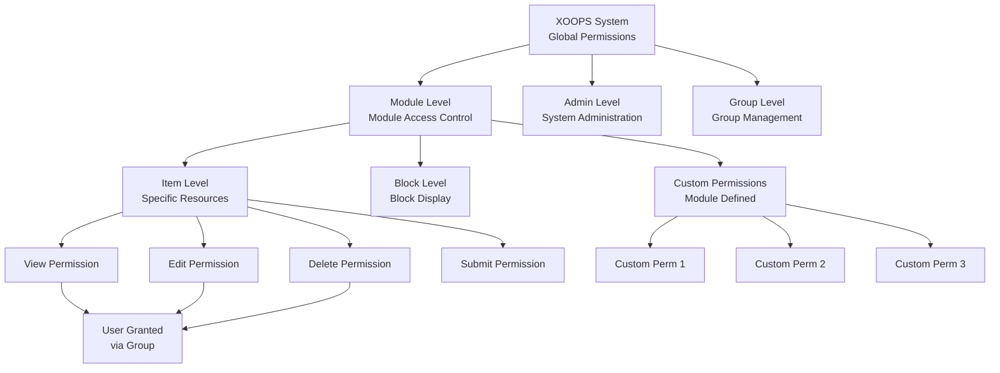
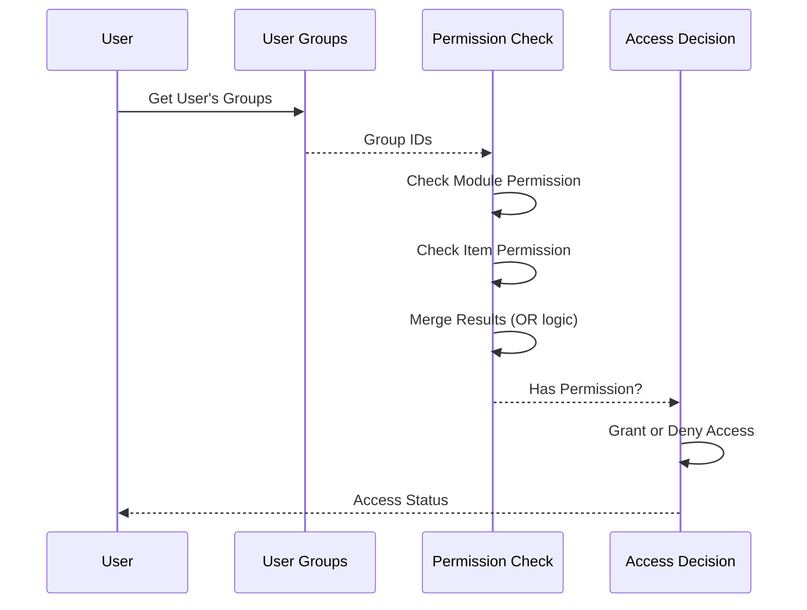

# XOOPS中的權限系統

XOOPS權限系統是一個細粒度的存取控制框架，管理誰可以對哪些資源執行什麼操作。本文件涵蓋權限類型、檢查機制、層級和實施範例。

## 權限類型

### 模組級權限

模組級權限控制對整個模組或模組功能的存取。

**常見權限名稱:**
- `module_view` - 檢視模組內容
- `module_read` - 讀取模組資源
- `module_submit` - 提交內容到模組
- `module_edit` - 編輯模組內容
- `module_admin` - 管理模組

```php
<?php
/**
 * Module permission example
 */

$permissionHandler = xoops_getHandler('groupperm');
$userGroups = $xoopsUser->getGroups();
$moduleId = 2; // Article module

// Check if user can view module
$canView = false;
foreach ($userGroups as $groupId) {
    if ($permissionHandler->checkRight('module_view', $groupId, $moduleId)) {
        $canView = true;
        break;
    }
}

if (!$canView) {
    redirect('index.php?error=no_access');
}
```

### 項目級權限

項目級權限控制對模組中特定資源的存取。

**範例:**
- 文章ID: 群組可以檢視/編輯特定文章嗎?
- 分類ID: 群組可以存取分類嗎?
- 頁面ID: 群組可以檢視/修改特定頁面嗎?

```php
<?php
/**
 * Item permission example
 */

$permissionHandler = xoops_getHandler('groupperm');
$userGroups = $xoopsUser->getGroups();
$moduleId = 2;      // Article module
$articleId = 42;    // Specific article

// Check if user can edit specific article
$canEdit = false;
foreach ($userGroups as $groupId) {
    if ($permissionHandler->checkRight(
        'item_edit',
        $groupId,
        $moduleId,
        $articleId
    )) {
        $canEdit = true;
        break;
    }
}
```

### 區塊權限

區塊權限控制頁面上顯示的區塊的可見性和互動。

```php
<?php
/**
 * 區塊權限範例
 */

$permissionHandler = xoops_getHandler('groupperm');
$userGroups = $xoopsUser->getGroups();

// 檢查用戶是否可以檢視區塊
$blockId = 5;
$canViewBlock = false;

foreach ($userGroups as $groupId) {
    if ($permissionHandler->checkRight('block_view', $groupId, 1, $blockId)) {
        $canViewBlock = true;
        break;
    }
}
```

### 群組權限

控制群組管理和管理的權限。

```php
<?php
/**
 * 群組管理權限範例
 */

$permissionHandler = xoops_getHandler('groupperm');
$userGroups = $xoopsUser->getGroups();

// 檢查用戶是否可以管理群組
$canManageGroups = false;
foreach ($userGroups as $groupId) {
    if ($permissionHandler->checkRight('group_admin', $groupId, 1)) {
        $canManageGroups = true;
        break;
    }
}
```

## 權限層級

### 權限結構圖



### 權限繼承鏈



## 權限檢查

### XoopsGroupPermHandler

`XoopsGroupPermHandler`類別提供了檢查和管理權限的方法。

```php
<?php
/**
 * XoopsGroupPermHandler方法
 */

class XoopsGroupPermHandler
{
    /**
     * 檢查群組是否具有權限
     *
     * @param string $gperm_name 權限名稱
     * @param int $gperm_group_id 群組ID
     * @param int $gperm_modid 模組ID
     * @param int $gperm_itemid 項目ID(可選)
     * @return bool 權限狀態
     */
    public function checkRight(
        $gperm_name,
        $gperm_group_id,
        $gperm_modid,
        $gperm_itemid = 0
    ) { }

    /**
     * 為群組新增權限
     *
     * @param string $gperm_name 權限名稱
     * @param int $gperm_group_id 群組ID
     * @param int $gperm_modid 模組ID
     * @param int $gperm_itemid 項目ID(可選)
     * @return bool 成功狀態
     */
    public function addRight(
        $gperm_name,
        $gperm_group_id,
        $gperm_modid,
        $gperm_itemid = 0
    ) { }

    /**
     * 從群組移除權限
     *
     * @param string $gperm_name 權限名稱
     * @param int $gperm_group_id 群組ID
     * @param int $gperm_modid 模組ID
     * @param int $gperm_itemid 項目ID(可選)
     * @return bool 成功狀態
     */
    public function deleteRight(
        $gperm_name,
        $gperm_group_id,
        $gperm_modid,
        $gperm_itemid = 0
    ) { }

    /**
     * 取得群組在模組中的所有權限
     *
     * @param int $groupId 群組ID
     * @param int $modId 模組ID
     * @return array 權限清單
     */
    public function getGroupPermissions($groupId, $modId) { }

    /**
     * 取得群組的允許項目ID
     *
     * @param string $permName 權限名稱
     * @param int $groupId 群組ID
     * @param int $modId 模組ID
     * @return array 項目ID
     */
    public function getPermittedItemIds(
        $permName,
        $groupId,
        $modId
    ) { }
}
```

## 權限檢查實施

### 單一用戶權限檢查

```php
<?php
/**
 * 權限檢查工具
 */
class PermissionChecker
{
    private $permissionHandler;
    private $user;

    public function __construct(XoopsUser $user = null)
    {
        $this->permissionHandler = xoops_getHandler('groupperm');
        $this->user = $user ?? $GLOBALS['xoopsUser'] ?? null;
    }

    /**
     * Check if user has permission
     *
     * @param string $permissionName Permission name
     * @param int $moduleId Module ID
     * @param int $itemId Item ID (optional)
     * @return bool Permission status
     */
    public function hasPermission(
        string $permissionName,
        int $moduleId,
        int $itemId = 0
    ): bool
    {
        if (!$this->user instanceof XoopsUser) {
            return false;
        }

        $userGroups = $this->user->getGroups();

        foreach ($userGroups as $groupId) {
            if ($this->permissionHandler->checkRight(
                $permissionName,
                $groupId,
                $moduleId,
                $itemId
            )) {
                return true;
            }
        }

        return false;
    }

    /**
     * Require permission or deny access
     *
     * @param string $permissionName Permission name
     * @param int $moduleId Module ID
     * @param int $itemId Item ID (optional)
     * @throws Exception If permission denied
     */
    public function requirePermission(
        string $permissionName,
        int $moduleId,
        int $itemId = 0
    ): void
    {
        if (!$this->hasPermission($permissionName, $moduleId, $itemId)) {
            throw new Exception('Permission denied');
        }
    }

    /**
     * Get permitted item IDs
     *
     * @param string $permissionName Permission name
     * @param int $moduleId Module ID
     * @return array Item IDs user can access
     */
    public function getPermittedItems(
        string $permissionName,
        int $moduleId
    ): array
    {
        if (!$this->user instanceof XoopsUser) {
            return [];
        }

        $permitted = [];
        $userGroups = $this->user->getGroups();

        foreach ($userGroups as $groupId) {
            $items = $this->permissionHandler->getPermittedItemIds(
                $permissionName,
                $groupId,
                $moduleId
            );
            $permitted = array_merge($permitted, $items);
        }

        return array_unique($permitted);
    }

    /**
     * Check multiple permissions (AND logic)
     *
     * @param array $permissions Permission names
     * @param int $moduleId Module ID
     * @param int $itemId Item ID (optional)
     * @return bool All permissions granted
     */
    public function hasAllPermissions(
        array $permissions,
        int $moduleId,
        int $itemId = 0
    ): bool
    {
        foreach ($permissions as $perm) {
            if (!$this->hasPermission($perm, $moduleId, $itemId)) {
                return false;
            }
        }
        return true;
    }

    /**
     * Check multiple permissions (OR logic)
     *
     * @param array $permissions Permission names
     * @param int $moduleId Module ID
     * @param int $itemId Item ID (optional)
     * @return bool Any permission granted
     */
    public function hasAnyPermission(
        array $permissions,
        int $moduleId,
        int $itemId = 0
    ): bool
    {
        foreach ($permissions as $perm) {
            if ($this->hasPermission($perm, $moduleId, $itemId)) {
                return true;
            }
        }
        return false;
    }
}
```

### Permission Middleware

```php
<?php
/**
 * Permission middleware for request filtering
 */
class PermissionMiddleware
{
    private $permissionChecker;

    public function __construct(PermissionChecker $checker)
    {
        $this->permissionChecker = $checker;
    }

    /**
     * Enforce permission on request
     *
     * @param string $permissionName Permission to check
     * @param int $moduleId Module ID
     * @param int $itemId Item ID (optional)
     * @return void Halts execution on permission denied
     */
    public function enforce(
        string $permissionName,
        int $moduleId,
        int $itemId = 0
    ): void
    {
        try {
            $this->permissionChecker->requirePermission(
                $permissionName,
                $moduleId,
                $itemId
            );
        } catch (Exception $e) {
            // Log permission denial
            error_log(sprintf(
                'Permission denied: %s (User: %s, Module: %d, Item: %d)',
                $permissionName,
                $GLOBALS['xoopsUser']?->getVar('uname') ?? 'anonymous',
                $moduleId,
                $itemId
            ));

            // Send error response
            header('HTTP/1.1 403 Forbidden');
            die('Access denied');
        }
    }

    /**
     * Filter array of items by permission
     *
     * @param array $items Items to filter
     * @param string $permissionName Permission name
     * @param int $moduleId Module ID
     * @param callable $idExtractor Callback to extract ID from item
     * @return array Filtered items
     */
    public function filterByPermission(
        array $items,
        string $permissionName,
        int $moduleId,
        callable $idExtractor
    ): array
    {
        return array_filter($items, function($item) use (
            $permissionName,
            $moduleId,
            $idExtractor
        ) {
            $itemId = $idExtractor($item);
            return $this->permissionChecker->hasPermission(
                $permissionName,
                $moduleId,
                $itemId
            );
        });
    }
}
```

## Practical Implementation Examples

### Module Access Control

```php
<?php
/**
 * Module access control example
 */

// Get current module
$moduleId = $GLOBALS['xoopsModule']->getVar('mid');
$moduleDir = $GLOBALS['xoopsModule']->getVar('dirname');

// Create permission checker
$checker = new PermissionChecker();

// Check module view permission
if (!$checker->hasPermission('module_view', $moduleId)) {
    redirect('index.php?error=access_denied');
}

// Get items user can access
$permittedItems = $checker->getPermittedItems('item_view', $moduleId);

// Build query to only show permitted items
$sql = 'SELECT * FROM articles WHERE id IN (' . implode(',', $permittedItems) . ')';
```

### Content Management Example

```php
<?php
/**
 * Article management with permissions
 */

class ArticleManager
{
    private $permissionChecker;
    private $moduleId = 2;

    public function __construct(PermissionChecker $checker)
    {
        $this->permissionChecker = $checker;
    }

    /**
     * Get articles user can view
     *
     * @return array Article list
     */
    public function getViewableArticles(): array
    {
        $this->permissionChecker->requirePermission(
            'module_view',
            $this->moduleId
        );

        $permittedIds = $this->permissionChecker->getPermittedItems(
            'article_view',
            $this->moduleId
        );

        if (empty($permittedIds)) {
            return [];
        }

        $db = XoopsDatabaseFactory::getDatabaseConnection();
        $result = $db->query(
            'SELECT * FROM articles WHERE id IN (' .
            implode(',', $permittedIds) .
            ') AND published = 1'
        );

        $articles = [];
        while ($row = $db->fetchArray($result)) {
            $articles[] = $row;
        }

        return $articles;
    }

    /**
     * Create article with permission check
     *
     * @param array $data Article data
     * @return int Article ID
     */
    public function createArticle(array $data): int
    {
        $this->permissionChecker->requirePermission(
            'article_create',
            $this->moduleId
        );

        $db = XoopsDatabaseFactory::getDatabaseConnection();
        $db->query(
            'INSERT INTO articles (title, content, author_id, created) VALUES (?, ?, ?, ?)',
            array($data['title'], $data['content'], $_SESSION['xoopsUserId'], time())
        );

        return $db->getInsertId();
    }

    /**
     * Update article with permission check
     *
     * @param int $articleId Article ID
     * @param array $data Update data
     * @return bool Success
     */
    public function updateArticle(int $articleId, array $data): bool
    {
        $this->permissionChecker->requirePermission(
            'article_edit',
            $this->moduleId,
            $articleId
        );

        $db = XoopsDatabaseFactory::getDatabaseConnection();
        return (bool)$db->query(
            'UPDATE articles SET title = ?, content = ? WHERE id = ?',
            array($data['title'], $data['content'], $articleId)
        );
    }

    /**
     * Delete article with permission check
     *
     * @param int $articleId Article ID
     * @return bool Success
     */
    public function deleteArticle(int $articleId): bool
    {
        $this->permissionChecker->requirePermission(
            'article_delete',
            $this->moduleId,
            $articleId
        );

        $db = XoopsDatabaseFactory::getDatabaseConnection();
        return (bool)$db->query(
            'DELETE FROM articles WHERE id = ?',
            array($articleId)
        );
    }
}
```

### Admin Panel Permission Check

```php
<?php
/**
 * Admin panel access control
 */

// Verify user is webmaster
if (!in_array(1, $xoopsUser->getGroups())) {
    redirect('index.php');
    exit;
}

$checker = new PermissionChecker();
$moduleId = $GLOBALS['xoopsModule']->getVar('mid');

// Check admin permission
$checker->requirePermission('module_admin', $moduleId);

// Load admin content
?>
<h1>Admin Panel</h1>
<p>Welcome, Administrator</p>
```

## Permission Caching

### Optimized Permission Checking

```php
<?php
/**
 * Cached permission checker for performance
 */
class CachedPermissionChecker extends PermissionChecker
{
    private $cache = [];
    private $cachePrefix = 'xoops_perm_';

    /**
     * Check permission with caching
     *
     * @param string $permissionName Permission name
     * @param int $moduleId Module ID
     * @param int $itemId Item ID (optional)
     * @return bool Permission status
     */
    public function hasPermission(
        string $permissionName,
        int $moduleId,
        int $itemId = 0
    ): bool
    {
        $cacheKey = $this->getCacheKey(
            $permissionName,
            $moduleId,
            $itemId
        );

        // Check memory cache
        if (isset($this->cache[$cacheKey])) {
            return $this->cache[$cacheKey];
        }

        // Check APCu cache
        $cacheKeyFull = $this->cachePrefix . $cacheKey;
        $cached = apcu_fetch($cacheKeyFull);
        if ($cached !== false) {
            $this->cache[$cacheKey] = $cached;
            return $cached;
        }

        // Check actual permission
        $result = parent::hasPermission($permissionName, $moduleId, $itemId);

        // Cache result (1 hour TTL)
        $this->cache[$cacheKey] = $result;
        apcu_store($cacheKeyFull, $result, 3600);

        return $result;
    }

    /**
     * Generate cache key
     *
     * @param string $permissionName Permission name
     * @param int $moduleId Module ID
     * @param int $itemId Item ID
     * @return string Cache key
     */
    private function getCacheKey(
        string $permissionName,
        int $moduleId,
        int $itemId
    ): string
    {
        $uid = $this->user?->getVar('uid') ?? 0;
        return md5("{$uid}_{$permissionName}_{$moduleId}_{$itemId}");
    }

    /**
     * Clear permission cache for user
     *
     * @param int $uid User ID
     */
    public static function clearUserCache(int $uid): void
    {
        // This would need to be more sophisticated in production
        apcu_clear_cache();
    }
}
```

## Security Best Practices

### Permission Assignment Rules

1. **Principle of Least Privilege**: Assign only necessary permissions
2. **Role-Based Access**: Use groups for role-based permissions
3. **Regular Audits**: Periodically review permissions
4. **Separation of Duties**: Separate admin from user permissions
5. **Explicit Deny**: Default deny, explicit allow approach

### Permission Validation

```php
<?php
/**
 * Permission validation best practices
 */

// Always check permission before action
$moduleId = 2;
$articleId = 42;

try {
    $checker = new PermissionChecker();

    // Explicit permission check
    if (!$checker->hasPermission('article_edit', $moduleId, $articleId)) {
        throw new Exception('Insufficient permissions');
    }

    // Perform action only after permission verified
    updateArticle($articleId);

} catch (Exception $e) {
    // Log security event
    error_log('Permission denied: ' . $e->getMessage());
    // Show user-friendly error
    die('You do not have permission to perform this action');
}
```

## Related Links

- User Management.md
- Group System.md
- Authentication.md
- ../../Security/Security-Guidelines.md

## Tags

#permissions #access-control #security #authorization #acl #permission-checking
