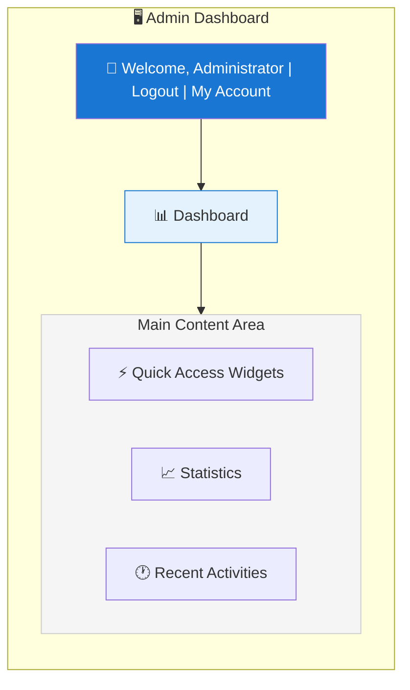
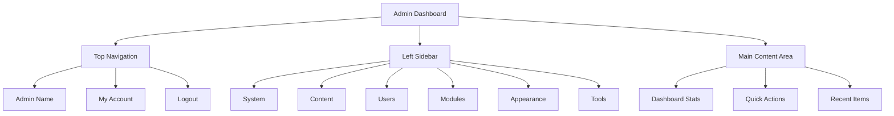

# XOOPS 管理面板概述

導覽和使用 XOOPS 管理員儀表板的完整指南。

## 存取管理面板

### 管理員登入

在瀏覽器中開啟並導覽到：

```
http://your-domain.com/xoops/admin/
```

或如果 XOOPS 在根目錄：

```
http://your-domain.com/admin/
```

輸入您的管理員認證：

```
Username: [Your admin username]
Password: [Your admin password]
```

### 登入後

您會看到主要管理儀表板：



## 管理面板佈局



## 儀表板元件

### 頂部列

頂部列包含基本控制項：

| 元素 | 用途 |
|---|---|
| **Admin Logo** | 點擊返回儀表板 |
| **歡迎訊息** | 顯示已登入的管理員名稱 |
| **我的帳戶** | 編輯管理員個人檔案和密碼 |
| **說明** | 存取文件 |
| **登出** | 登出管理面板 |

### 左側導覽側邊欄

按功能組織的主功能表：

```
├── System
│   ├── Dashboard
│   ├── Preferences
│   ├── Admin Users
│   ├── Groups
│   ├── Permissions
│   ├── Modules
│   └── Tools
├── Content
│   ├── Pages
│   ├── Categories
│   ├── Comments
│   └── Media Manager
├── Users
│   ├── Users
│   ├── User Requests
│   ├── Online Users
│   └── User Groups
├── Modules
│   ├── Modules
│   ├── Module Settings
│   └── Module Updates
├── Appearance
│   ├── Themes
│   ├── Templates
│   ├── Blocks
│   └── Images
└── Tools
    ├── Maintenance
    ├── Email
    ├── Statistics
    ├── Logs
    └── Backups
```

### 主要內容區域

顯示所選部分的資訊和控制項：

- 組態的表單
- 包含列表的資料表格
- 圖表和統計資訊
- 快速動作按鈕
- 說明文本和提示

### 儀表板小工具

快速存取關鍵資訊：

- **系統資訊：** PHP 版本、MySQL 版本、XOOPS 版本
- **快速統計：** 使用者數、總貼文數、已安裝的模組數
- **最近活動：** 最新登入、內容變更、錯誤
- **伺服器狀態：** CPU、記憶體、磁碟使用情況
- **通知：** 系統警報、待處理更新

## 核心管理功能

### 系統管理

**位置：** System > [Various Options]

#### Preferences

組態基本系統設定：

```
System > Preferences > [Settings Category]
```

類別：
- 一般設定（網站名稱、時區）
- 使用者設定（註冊、個人檔案）
- 電子郵件設定（SMTP 組態）
- 快取設定（快取選項）
- URL 設定（友善 URL）
- 中繼標籤（SEO 設定）

參見基本組態和系統設定。

#### 管理使用者

管理管理員帳戶：

```
System > Admin Users
```

功能：
- 新增管理員
- 編輯管理員個人檔案
- 變更管理員密碼
- 刪除管理員帳戶
- 設定管理員權限

### 內容管理

**位置：** Content > [Various Options]

#### 頁面/文章

管理網站內容：

```
Content > Pages (or your module)
```

功能：
- 建立新頁面
- 編輯現有內容
- 刪除頁面
- 發佈/取消發佈
- 設定類別
- 管理修訂

#### 類別

組織內容：

```
Content > Categories
```

功能：
- 建立類別階層
- 編輯類別
- 刪除類別
- 指派給頁面

#### 註解

審核使用者評論：

```
Content > Comments
```

功能：
- 檢視所有評論
- 核准評論
- 編輯評論
- 刪除垃圾郵件
- 封鎖評論者

### 使用者管理

**位置：** Users > [Various Options]

#### 使用者

管理使用者帳戶：

```
Users > Users
```

功能：
- 檢視所有使用者
- 建立新使用者
- 編輯使用者個人檔案
- 刪除帳戶
- 重設密碼
- 變更使用者狀態
- 指派給群組

#### 線上使用者

監視活躍使用者：

```
Users > Online Users
```

顯示：
- 目前線上的使用者
- 上次活動時間
- IP 位址
- 使用者位置（如果已組態）

#### 使用者群組

管理使用者角色和權限：

```
Users > Groups
```

功能：
- 建立自訂群組
- 設定群組權限
- 將使用者指派到群組
- 刪除群組

### 模組管理

**位置：** Modules > [Various Options]

#### 模組

安裝和組態模組：

```
Modules > Modules
```

功能：
- 檢視已安裝的模組
- 啟用/停用模組
- 更新模組
- 組態模組設定
- 安裝新模組
- 檢視模組詳細資訊

#### 檢查更新

```
Modules > Modules > Check for Updates
```

顯示：
- 可用的模組更新
- 變更記錄
- 下載和安裝選項

### 外觀管理

**位置：** Appearance > [Various Options]

#### 佈景主題

管理網站佈景主題：

```
Appearance > Themes
```

功能：
- 檢視已安裝的佈景主題
- 設定預設佈景主題
- 上傳新佈景主題
- 刪除佈景主題
- 佈景主題預覽
- 佈景主題組態

#### 區塊

管理內容區塊：

```
Appearance > Blocks
```

功能：
- 建立自訂區塊
- 編輯區塊內容
- 排列頁面上的區塊
- 設定區塊可見性
- 刪除區塊
- 組態區塊快取

#### 範本

管理範本（進階）：

```
Appearance > Templates
```

適用於進階使用者和開發人員。

### 系統工具

**位置：** System > Tools

#### 維護模式

在維護期間防止使用者存取：

```
System > Maintenance Mode
```

組態：
- 啟用/停用維護
- 自訂維護訊息
- 允許的 IP 位址（用於測試）

#### 資料庫管理

```
System > Database
```

功能：
- 檢查資料庫一致性
- 執行資料庫更新
- 修復表格
- 最佳化資料庫
- 匯出資料庫結構

#### 活動日誌

```
System > Logs
```

監視：
- 使用者活動
- 管理動作
- 系統事件
- 錯誤日誌

## 快速動作

從儀表板存取的常見任務：

```
快速連結：
├── 建立新頁面
├── 新增使用者
├── 建立內容區塊
├── 上傳影像
├── 傳送大量電子郵件
├── 更新所有模組
└── 清除快取
```

## 管理面板鍵盤快速鍵

快速導覽：

| 快速鍵 | 動作 |
|---|---|
| `Ctrl+H` | 移至說明 |
| `Ctrl+D` | 移至儀表板 |
| `Ctrl+Q` | 快速搜尋 |
| `Ctrl+L` | 登出 |

## 使用者帳戶管理

### 我的帳戶

存取您的管理員個人檔案：

1. 在右上方點擊「我的帳戶」
2. 編輯個人檔案資訊：
   - 電子郵件位址
   - 真名
   - 使用者資訊
   - 大頭貼

### 變更密碼

變更您的管理員密碼：

1. 移至**我的帳戶**
2. 按一下「變更密碼」
3. 輸入目前密碼
4. 輸入新密碼（兩次）
5. 按一下「儲存」

**安全提示：**
- 使用強密碼（16 個以上字元）
- 包含大寫、小寫、數字、符號
- 每 90 天變更一次密碼
- 永遠不要分享管理員認證

### 登出

登出管理面板：

1. 在右上方點擊「登出」
2. 您會被重新導向至登入頁面

## 管理面板統計

### 儀表板統計

網站指標的快速概覽：

| 指標 | 值 |
|--------|-------|
| 線上使用者 | 12 |
| 總使用者 | 256 |
| 總貼文 | 1,234 |
| 總評論 | 5,678 |
| 總模組 | 8 |

### 系統狀態

伺服器和效能資訊：

| 元件 | 版本/值 |
|-----------|---------------|
| XOOPS 版本 | 2.5.11 |
| PHP 版本 | 8.2.x |
| MySQL 版本 | 8.0.x |
| 伺服器負載 | 0.45, 0.42 |
| 正常運行時間 | 45 天 |

### 最近活動

最近事件的時間表：

```
12:45 - 管理員登入
12:30 - 新使用者註冊
12:15 - 頁面發佈
12:00 - 評論已發佈
11:45 - 模組已更新
```

## 通知系統

### 管理警報

接收以下項目的通知：

- 新使用者註冊
- 等待審核的評論
- 登入失敗嘗試
- 系統錯誤
- 可用的模組更新
- 資料庫問題
- 磁碟空間警告

組態警報：

**System > Preferences > Email Settings**

```
在註冊時通知管理員：是
在評論時通知管理員：是
在錯誤時通知管理員：是
警報電子郵件：admin@your-domain.com
```

## 常見管理工作

### 建立新頁面

1. 移至**Content > Pages**（或相關模組）
2. 按一下「新增頁面」
3. 填入：
   - 標題
   - 內容
   - 描述
   - 類別
   - 中繼資料
4. 按一下「發佈」

### 管理使用者

1. 移至**Users > Users**
2. 檢視使用者清單，包含：
   - 使用者名稱
   - 電子郵件
   - 註冊日期
   - 上次登入
   - 狀態

3. 點擊使用者名稱以：
   - 編輯個人檔案
   - 變更密碼
   - 編輯群組
   - 封鎖/解除封鎖使用者

### 組態模組

1. 移至**Modules > Modules**
2. 在清單中尋找模組
3. 按一下模組名稱
4. 按一下「Preferences」或「Settings」
5. 組態模組選項
6. 儲存變更

### 建立新區塊

1. 移至**Appearance > Blocks**
2. 按一下「新增區塊」
3. 輸入：
   - 區塊標題
   - 區塊內容（允許 HTML）
   - 頁面上的位置
   - 可見性（所有頁面或特定頁面）
   - 模組（如果適用）
4. 按一下「提交」

## 管理面板說明

### 內建文件

從管理面板存取說明：

1. 在頂部列中按一下「說明」按鈕
2. 目前頁面的內容相關說明
3. 文件連結
4. 常見問題

### 外部資源

- XOOPS 官方網站：https://xoops.org/
- 社群論壇：https://xoops.org/modules/newbb/
- 模組存放庫：https://xoops.org/modules/repository/
- 錯誤/問題：https://github.com/XOOPS/XoopsCore/issues

## 自訂管理面板

### 管理佈景主題

選擇管理介面佈景主題：

**System > Preferences > General Settings**

```
管理佈景主題：[選擇佈景主題]
```

可用佈景主題：
- 預設（淺色）
- 深色模式
- 自訂佈景主題

### 儀表板自訂

選擇顯示哪些小工具：

**Dashboard > Customize**

選擇：
- 系統資訊
- 統計資訊
- 最近活動
- 快速連結
- 自訂小工具

## 管理面板權限

不同的管理員級別有不同的權限：

| 角色 | 功能 |
|---|---|
| **網站管理員** | 完全存取所有管理功能 |
| **管理員** | 有限的管理功能 |
| **版主** | 僅內容審核 |
| **編輯者** | 內容建立和編輯 |

管理權限：

**System > Permissions**

## 管理面板安全最佳做法

1. **強密碼：** 使用 16 個以上字元的密碼
2. **定期變更：** 每 90 天變更一次密碼
3. **監視存取：** 定期檢查「管理使用者」日誌
4. **限制存取：** 重新命名管理資料夾以增加安全性
5. **使用 HTTPS：** 始終透過 HTTPS 存取管理員
6. **IP 白名單：** 將管理員存取限制在特定 IP
7. **定期登出：** 完成時登出
8. **瀏覽器安全：** 定期清除瀏覽器快取

參見安全組態。

## 管理面板疑難排解

### 無法存取管理面板

**解決方案：**
1. 驗證登入認證
2. 清除瀏覽器快取和 Cookie
3. 嘗試不同的瀏覽器
4. 檢查管理資料夾路徑是否正確
5. 驗證管理資料夾的檔案權限
6. 檢查 mainfile.php 中的資料庫連線

### 管理面板為空白

**解決方案：**
```bash
# 檢查 PHP 錯誤
tail -f /var/log/apache2/error.log

# 暫時啟用偵錯模式
sed -i "s/define('XOOPS_DEBUG', 0)/define('XOOPS_DEBUG', 1)/" /var/www/html/xoops/mainfile.php

# 檢查檔案權限
ls -la /var/www/html/xoops/admin/
```

### 管理面板緩慢

**解決方案：**
1. 清除快取：**System > Tools > Clear Cache**
2. 最佳化資料庫：**System > Database > Optimize**
3. 檢查伺服器資源：`htop`
4. 在 MySQL 中檢查慢查詢

### 模組未出現

**解決方案：**
1. 驗證模組已安裝：**Modules > Modules**
2. 檢查模組是否已啟用
3. 驗證已指派的權限
4. 檢查模組檔案是否存在
5. 檢查錯誤日誌

## 後續步驟

在熟悉管理面板後：

1. 建立您的第一個頁面
2. 設定使用者群組
3. 安裝其他模組
4. 組態基本設定
5. 實施安全性

---

**標籤：** #admin-panel #dashboard #navigation #getting-started

**相關文章：**
- ../Configuration/Basic-Configuration
- ../Configuration/System-Settings
- Creating-Your-First-Page
- Managing-Users
- Installing-Modules
