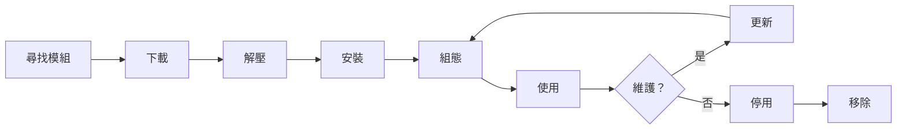

# 安裝和管理 XOOPS 模組

了解如何透過安裝和組態模組來擴充 XOOPS 功能。

## 了解 XOOPS 模組

### 什麼是模組？

模組是擴充 XOOPS 功能的擴充功能：

| 類型 | 用途 | 範例 |
|---|---|---|
| **內容** | 管理特定內容類型 | 新聞、部落格、工單 |
| **社群** | 使用者互動 | 論壇、評論、評論 |
| **電子商務** | 銷售產品 | 商店、購物車、付款 |
| **媒體** | 處理檔案/影像 | 圖庫、下載、影片 |
| **公用程式** | 工具和幫助程式 | 電子郵件、備份、分析 |

### 核心模組與選用模組

| 模組 | 類型 | 已包含 | 可移除 |
|---|---|---|---|
| **System** | 核心 | 是 | 否 |
| **User** | 核心 | 是 | 否 |
| **Profile** | 建議 | 是 | 是 |
| **PM (私人訊息)** | 建議 | 是 | 是 |
| **WF-Channel** | 選用 | 通常 | 是 |
| **新聞** | 選用 | 否 | 是 |
| **論壇** | 選用 | 否 | 是 |

## 模組生命週期



## 尋找模組

### XOOPS 模組存放庫

官方 XOOPS 模組存放庫：

**瀏覽：** https://xoops.org/modules/repository/

```
Directory > Modules > [瀏覽類別]
```

按類別瀏覽：
- 內容管理
- 社群
- 電子商務
- 多媒體
- 開發
- 網站管理

### 評估模組

安裝前，請檢查：

| 條件 | 尋找的內容 |
|---|---|
| **相容性** | 適用於您的 XOOPS 版本 |
| **評分** | 良好的使用者評論和評分 |
| **更新** | 最近維護 |
| **下載** | 受歡迎且廣泛使用 |
| **需求** | 與您的伺服器相容 |
| **授權** | GPL 或類似的開源 |
| **支援** | 有效的開發人員和社群 |

### 閱讀模組資訊

每個模組清單顯示：

```
模組名稱：[名稱]
版本：[X.X.X]
需要：XOOPS [版本]
作者：[名稱]
上次更新：[日期]
下載：[數字]
評分：[星數]
描述：[簡要描述]
相容性：PHP [版本]、MySQL [版本]
```

## 安裝模組

### 方法 1：管理面板安裝

**步驟 1：存取模組部分**

1. 登入管理面板
2. 導覽至 **Modules > Modules**
3. 按一下 **「安裝新模組」** 或 **「瀏覽模組」**

**步驟 2：上傳模組**

選項 A - 直接上傳：
1. 按一下 **「選擇檔案」**
2. 從電腦選擇模組 .zip 檔案
3. 按一下 **「上傳」**

選項 B - URL 上傳：
1. 貼上模組 URL
2. 按一下 **「下載並安裝」**

**步驟 3：檢視模組資訊**

```
模組名稱：[顯示的名稱]
版本：[版本]
作者：[作者資訊]
描述：[完整描述]
需求：[PHP/MySQL 版本]
```

審查並按一下 **「繼續安裝」**

**步驟 4：選擇安裝類型**

```
☐ 全新安裝（新安裝）
☐ 更新（升級現有）
☐ 刪除然後安裝（替換現有）
```

選擇適當的選項。

**步驟 5：確認安裝**

檢視最終確認：
```
模組將被安裝到：/modules/modulename/
資料庫：xoops_db
繼續？[是] [否]
```

按一下 **「是」** 確認。

**步驟 6：安裝完成**

```
安裝成功！

模組：[模組名稱]
版本：[版本]
建立的表格：[數字]
安裝的檔案：[數字]

[移至模組設定]  [返回模組]
```

### 方法 2：手動安裝（進階）

用於手動安裝或疑難排解：

**步驟 1：下載模組**

1. 從存放庫下載模組 .zip
2. 解壓至 `/var/www/html/xoops/modules/modulename/`

```bash
# 解壓模組
unzip module_name.zip
cp -r module_name /var/www/html/xoops/modules/

# 設定權限
chmod -R 755 /var/www/html/xoops/modules/module_name
```

**步驟 2：執行安裝指令碼**

```
瀏覽：http://your-domain.com/xoops/modules/module_name/admin/index.php?op=install
```

或透過管理面板（System > Modules > Update DB）。

**步驟 3：驗證安裝**

1. 在管理中移至 **Modules > Modules**
2. 在清單中尋找您的模組
3. 驗證其顯示為「有效」

## 模組組態

### 存取模組設定

1. 移至 **Modules > Modules**
2. 尋找您的模組
3. 按一下模組名稱
4. 按一下 **「Preferences」** 或 **「設定」**

### 常見模組設定

大多數模組提供：

```
模組狀態：[啟用/停用]
在功能表中顯示：[是/否]
模組權重：[1-999]（顯示順序）
對群組可見：[使用者群組的複選框]
```

### 模組特定選項

每個模組都有獨特的設定。範例：

**新聞模組：**
```
每頁項目：10
顯示作者：是
允許評論：是
需要審核：是
```

**論壇模組：**
```
每頁主題：20
每頁貼文：15
最大附件大小：5MB
啟用簽名：是
```

**圖庫模組：**
```
每頁影像：12
縮圖大小：150x150
最大上傳：10MB
浮水印：是/否
```

檢視您的模組文件以了解特定選項。

### 儲存組態

調整設定後：

1. 按一下 **「提交」** 或 **「儲存」**
2. 您會看到確認：
   ```
   設定儲存成功！
   ```

## 管理模組區塊

許多模組建立「區塊」 - 類似小工具的內容區域。

### 檢視模組區塊

1. 移至 **Appearance > Blocks**
2. 尋找來自您的模組的區塊
3. 大多數模組顯示「[模組名稱] - [區塊描述]」

### 組態區塊

1. 按一下區塊名稱
2. 調整：
   - 區塊標題
   - 可見性（所有頁面或特定）
   - 頁面上的位置（左、中、右）
   - 可以看到的使用者群組
3. 按一下 **「提交」**

### 在首頁上顯示區塊

1. 移至 **Appearance > Blocks**
2. 尋找您想要的區塊
3. 按一下 **「編輯」**
4. 設定：
   - **對以下項目可見：** 選擇群組
   - **位置：** 選擇欄位（左/中/右）
   - **頁面：** 首頁或所有頁面
5. 按一下 **「提交」**

## 安裝特定模組範例

### 安裝新聞模組

**完美用於：** 部落格文章、公告

1. 從存放庫下載新聞模組
2. 透過 **Modules > Modules > Install** 上傳
3. 在 **Modules > News > Preferences** 中組態：
   - 每頁故事：10
   - 允許評論：是
   - 發佈前核准：是
4. 為最新新聞建立區塊
5. 開始發佈故事！

### 安裝論壇模組

**完美用於：** 社群討論

1. 下載論壇模組
2. 透過管理面板安裝
3. 在模組中建立論壇類別
4. 組態設定：
   - 主題/頁面：20
   - 貼文/頁面：15
   - 啟用審核：是
5. 指派使用者群組權限
6. 為最新主題建立區塊

### 安裝圖庫模組

**完美用於：** 影像展示

1. 下載圖庫模組
2. 安裝並組態
3. 建立相簿
4. 上傳影像
5. 設定檢視/上傳權限
6. 在網站上顯示圖庫

## 更新模組

### 檢查更新

```
管理面板 > Modules > Modules > Check for Updates
```

顯示：
- 可用的模組更新
- 目前版本與新版本
- 變更記錄/發行說明

### 更新模組

1. 移至 **Modules > Modules**
2. 按一下有可用更新的模組
3. 按一下 **「更新」** 按鈕
4. 從安裝類型選擇 **「更新」**
5. 遵循安裝精靈
6. 模組已更新！

### 重要更新注意事項

更新前：

- [ ] 備份資料庫
- [ ] 備份模組檔案
- [ ] 檢視變更記錄
- [ ] 先在預備伺服器上測試
- [ ] 注意任何自訂修改

更新後
- [ ] 驗證功能
- [ ] 檢查模組設定
- [ ] 檢查警告/錯誤
- [ ] 清除快取

## 模組權限

### 指派使用者群組存取

控制哪些使用者群組可以存取模組：

**位置：** System > Permissions

對於每個模組，組態：

```
模組：[模組名稱]

管理員存取：[選擇群組]
使用者存取：[選擇群組]
讀取權限：[允許檢視的群組]
寫入權限：[允許發佈的群組]
刪除權限：[僅限管理員]
```

### 常見權限等級

```
公開內容（新聞、頁面）：
├── 管理員存取：網站管理員
├── 使用者存取：所有已登入的使用者
└── 讀取權限：每個人

社群功能（論壇、評論）：
├── 管理員存取：網站管理員、版主
├── 使用者存取：所有已登入的使用者
└── 寫入權限：所有已登入的使用者

管理工具：
├── 管理員存取：僅網站管理員
└── 使用者存取：停用
```

## 停用和移除模組

### 停用模組（保留檔案）

隱藏模組但保留網站：

1. 移至 **Modules > Modules**
2. 尋找模組
3. 按一下模組名稱
4. 按一下 **「停用」** 或將狀態設為非使用中
5. 模組已隱藏但資料已保留

隨時重新啟用：
1. 按一下模組
2. 按一下 **「啟用」**

### 完全移除模組

刪除模組及其資料：

1. 移至 **Modules > Modules**
2. 尋找模組
3. 按一下 **「解除安裝」** 或 **「刪除」**
4. 確認：「刪除模組和所有資料？」
5. 按一下 **「是」** 確認

**警告：** 解除安裝會刪除所有模組資料！

### 解除安裝後重新安裝

如果您解除安裝模組：
- 模組檔案已刪除
- 資料庫表格已刪除
- 所有資料都會遺失
- 必須重新安裝才能使用
- 可以從備份還原

## 模組安裝疑難排解

### 安裝後模組未出現

**症狀：** 模組已列出但在網站上不可見

**解決方案：**
```
1. 檢查模組為「有效」（Modules > Modules）
2. 啟用模組區塊（Appearance > Blocks）
3. 驗證使用者權限（System > Permissions）
4. 清除快取（System > Tools > Clear Cache）
5. 檢查 .htaccess 是否不會封鎖模組
```

### 安裝錯誤：「表格已存在」

**症狀：** 模組安裝期間出錯

**解決方案：**
```
1. 模組之前已部分安裝
2. 嘗試「刪除然後安裝」選項
3. 或先解除安裝，然後全新安裝
4. 檢查資料庫是否有現有表格：
   mysql> SHOW TABLES LIKE 'xoops_module%';
```

### 模組遺失依賴項

**症狀：** 模組不會安裝 - 需要其他模組

**解決方案：**
```
1. 從錯誤訊息記下必要的模組
2. 先安裝必要的模組
3. 然後安裝模組
4. 按正確順序安裝
```

### 存取模組時頁面為空白

**症狀：** 模組載入但不顯示任何內容

**解決方案：**
```
1. 在 mainfile.php 中啟用偵錯模式：
   define('XOOPS_DEBUG', 1);

2. 檢查 PHP 錯誤日誌：
   tail -f /var/log/php_errors.log

3. 驗證檔案權限：
   chmod -R 755 /var/www/html/xoops/modules/modulename

4. 檢查模組組態中的資料庫連線

5. 停用模組並重新安裝
```

### 模組破壞網站

**症狀：** 安裝模組會破壞網站

**解決方案：**
```
1. 立即停用有問題的模組：
   Admin > Modules > [Module] > Disable

2. 清除快取：
   rm -rf /var/www/html/xoops/cache/*
   rm -rf /var/www/html/xoops/templates_c/*

3. 如果需要從備份還原

4. 檢查錯誤日誌以找出根本原因

5. 聯絡模組開發人員
```

## 模組安全考量

### 僅從受信任的來源安裝

```
✓ 官方 XOOPS 存放庫
✓ GitHub 官方 XOOPS 模組
✓ 受信任的模組開發人員
✗ 未知網站
✗ 未驗證的來源
```

### 檢查模組權限

安裝後：

1. 檢視模組代碼以尋找可疑活動
2. 檢查資料庫表格是否有異常
3. 監視檔案變更
4. 保持模組更新
5. 移除未使用的模組

### 權限最佳做法

```
模組目錄：755（可讀，網路伺服器不可寫）
模組檔案：644（僅可讀）
模組資料：由資料庫保護
```

## 模組開發資源

### 學習模組開發

- 官方文件：https://xoops.org/
- GitHub 存放庫：https://github.com/XOOPS/
- 社群論壇：https://xoops.org/modules/newbb/
- 開發人員指南：docs 資料夾中提供

## 模組最佳做法

1. **一次安裝一個：** 監視衝突
2. **安裝後測試：** 驗證功能
3. **記錄自訂組態：** 記下您的設定
4. **保持更新：** 及時安裝模組更新
5. **移除未使用的模組：** 刪除不需要的模組
6. **安裝前備份：** 在安裝前始終備份
7. **閱讀文件：** 檢查模組說明
8. **加入社群：** 如需幫助，請提問

## 模組安裝檢查清單

對於每個模組安裝：

- [ ] 研究和閱讀評論
- [ ] 驗證 XOOPS 版本相容性
- [ ] 備份資料庫和檔案
- [ ] 下載最新版本
- [ ] 透過管理面板安裝
- [ ] 組態設定
- [ ] 建立/定位區塊
- [ ] 設定使用者權限
- [ ] 測試功能
- [ ] 記錄組態
- [ ] 排程更新

## 後續步驟

安裝模組後：

1. 為模組建立內容
2. 設定使用者群組
3. 探索管理功能
4. 最佳化效能
5. 根據需要安裝其他模組

---

**標籤：** #modules #installation #extension #management

**相關文章：**
- Admin-Panel-Overview
- Managing-Users
- Creating-Your-First-Page
- ../Configuration/System-Settings
