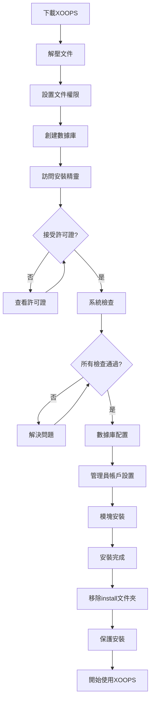

# 完整的XOOPS安裝指南

本指南使用安裝精靈從頭開始安裝XOOPS的全面逐步說明。

## 先決條件

開始安裝前，請確保您有：

- 通過FTP或SSH訪問您的網絡伺服器的權限
- 您的數據庫伺服器的管理員訪問權限
- 已註冊的域名
- 已驗證的伺服器要求
- 可用的備份工具

## 安裝流程



## 逐步安裝

### 步驟1：下載XOOPS

從[https://xoops.org/](https://xoops.org/)下載最新版本：

```bash
# 使用wget
wget https://xoops.org/download/xoops-2.5.8.zip

# 使用curl
curl -O https://xoops.org/download/xoops-2.5.8.zip
```

### 步驟2：解壓文件

將XOOPS存檔解壓到您的網絡根目錄：

```bash
# 導航到網絡根目錄
cd /var/www/html

# 解壓XOOPS
unzip xoops-2.5.8.zip

# 重命名文件夾（可選，但推薦）
mv xoops-2.5.8 xoops
cd xoops
```

### 步驟3：設置文件權限

為XOOPS目錄設置適當的權限：

```bash
# 使目錄可寫（目錄755，文件644）
find . -type d -exec chmod 755 {} \;
find . -type f -exec chmod 644 {} \;

# 使特定目錄對網絡伺服器可寫
chmod 777 uploads/
chmod 777 templates_c/
chmod 777 var/
chmod 777 cache/

# 安裝後保護mainfile.php
chmod 644 mainfile.php
```

### 步驟4：創建數據庫

使用MySQL為XOOPS創建新數據庫：

```sql
-- 創建數據庫
CREATE DATABASE xoops_db CHARACTER SET utf8mb4 COLLATE utf8mb4_unicode_ci;

-- 創建用戶
CREATE USER 'xoops_user'@'localhost' IDENTIFIED BY 'secure_password_here';

-- 授予權限
GRANT ALL PRIVILEGES ON xoops_db.* TO 'xoops_user'@'localhost';
FLUSH PRIVILEGES;
```

或使用phpMyAdmin：

1. 登錄phpMyAdmin
2. 單擊"數據庫"選項卡
3. 輸入數據庫名稱：`xoops_db`
4. 選擇"utf8mb4_unicode_ci"整理
5. 單擊"創建"
6. 創建與數據庫同名的用戶
7. 授予所有權限

### 步驟5：運行安裝精靈

打開您的瀏覽器並導航到：

```
http://your-domain.com/xoops/install/
```

#### 系統檢查階段

精靈檢查您的伺服器配置：

- PHP版本 >= 5.6.0
- MySQL/MariaDB可用
- 必需的PHP擴展（GD、PDO等）
- 目錄權限
- 數據庫連接

**如果檢查失敗：**

請參閱#常見安裝問題部分尋求解決方案。

#### 數據庫配置

輸入您的數據庫憑據：

```
數據庫主機：localhost
數據庫名稱：xoops_db
數據庫用戶：xoops_user
數據庫密碼：[your_secure_password]
表前綴：xoops_
```

**重要提示：**
- 如果您的數據庫主機與localhost不同（例如遠程伺服器），請輸入正確的主機名
- 表前綴有助於在一個數據庫中運行多個XOOPS實例
- 使用包含大小寫、數字和符號的強密碼

#### 管理員帳戶設置

創建您的管理員帳戶：

```
管理員用戶名：admin（或選擇自定義）
管理員電子郵件：admin@your-domain.com
管理員密碼：[strong_unique_password]
確認密碼：[repeat_password]
```

**最佳實踐：**
- 使用唯一的用戶名，不要使用"admin"
- 使用16個以上字符的密碼
- 將憑據存儲在安全密碼管理器中
- 切勿分享管理員憑據

#### 模塊安裝

選擇要安裝的默認模塊：

- **系統模塊**（必需）- XOOPS核心功能
- **用戶模塊**（必需）- 用戶管理
- **個人資料模塊**（推薦）- 用戶個人資料
- **PM（私有消息）模塊**（推薦）- 內部消息傳遞
- **WF-Channel模塊**（可選）- 內容管理

選擇所有推薦的模塊以進行完整安裝。

### 步驟6：完成安裝

完成所有步驟後，您將看到確認屏幕：

```
安裝完成！

您的XOOPS安裝已準備好使用。
管理面板：http://your-domain.com/xoops/admin/
用戶面板：http://your-domain.com/xoops/
```

### 步驟7：保護您的安裝

#### 移除安裝文件夾

```bash
# 移除install目錄（安全性至關重要）
rm -rf /var/www/html/xoops/install/

# 或重命名它
mv /var/www/html/xoops/install/ /var/www/html/xoops/install.bak
```

**警告：** 絕不要在生產環境中讓install文件夾可訪問！

#### 保護mainfile.php

```bash
# 使mainfile.php只讀
chmod 644 /var/www/html/xoops/mainfile.php

# 設置所有權
chown www-data:www-data /var/www/html/xoops/mainfile.php
```

#### 設置適當的文件權限

```bash
# 推薦的生產權限
find . -type f -name "*.php" -exec chmod 644 {} \;
find . -type d -exec chmod 755 {} \;

# 網絡伺服器可寫的目錄
chmod 777 uploads/ var/ cache/ templates_c/
```

#### 啟用HTTPS/SSL

在您的網絡伺服器（nginx或Apache）中配置SSL。

**對於Apache：**
```apache
<VirtualHost *:443>
    ServerName your-domain.com
    DocumentRoot /var/www/html/xoops

    SSLEngine on
    SSLCertificateFile /etc/ssl/certs/your-cert.crt
    SSLCertificateKeyFile /etc/ssl/private/your-key.key

    # 強制HTTPS重定向
    <IfModule mod_rewrite.c>
        RewriteEngine On
        RewriteCond %{HTTPS} off
        RewriteRule ^(.*)$ https://%{HTTP_HOST}%{REQUEST_URI} [L,R=301]
    </IfModule>
</VirtualHost>
```

## 安裝後配置

### 1. 訪問管理面板

導航到：
```
http://your-domain.com/xoops/admin/
```

使用您的管理員憑據登錄。

### 2. 配置基本設置

配置以下內容：

- 網站名稱和描述
- 管理員電子郵件地址
- 時區和日期格式
- 搜索引擎優化

### 3. 測試安裝

- [ ] 訪問主頁
- [ ] 檢查模塊加載
- [ ] 驗證用戶註冊有效
- [ ] 測試管理面板功能
- [ ] 確認SSL/HTTPS有效

### 4. 安排備份

設置自動備份：

```bash
# 創建備份腳本（backup.sh）
#!/bin/bash
DATE=$(date +%Y%m%d_%H%M%S)
BACKUP_DIR="/backups/xoops"
XOOPS_DIR="/var/www/html/xoops"

# 備份數據庫
mysqldump -u xoops_user -p[password] xoops_db > $BACKUP_DIR/db_$DATE.sql

# 備份文件
tar -czf $BACKUP_DIR/files_$DATE.tar.gz $XOOPS_DIR

echo "備份完成：$DATE"
```

使用cron安排：
```bash
# 每天凌晨2點備份
0 2 * * * /usr/local/bin/backup.sh
```

## 常見安裝問題

### 問題：權限被拒絕錯誤

**症狀：** 上傳或創建文件時出現"權限被拒絕"

**解決方案：**
```bash
# 檢查網絡伺服器用戶
ps aux | grep apache  # Apache用
ps aux | grep nginx   # Nginx用

# 修復權限（將www-data替換為您的網絡伺服器用戶）
chown -R www-data:www-data /var/www/html/xoops
chmod -R 755 /var/www/html/xoops
chmod 777 uploads/ var/ cache/ templates_c/
```

### 問題：數據庫連接失敗

**症狀：** "無法連接到數據庫伺服器"

**解決方案：**
1. 驗證安裝精靈中的數據庫憑據
2. 檢查MySQL/MariaDB是否運行：
   ```bash
   service mysql status  # 或mariadb
   ```
3. 驗證數據庫是否存在：
   ```sql
   SHOW DATABASES;
   ```
4. 測試命令行連接：
   ```bash
   mysql -h localhost -u xoops_user -p xoops_db
   ```

### 問題：空白白屏

**症狀：** 訪問XOOPS顯示空白頁面

**解決方案：**
1. 檢查PHP錯誤日誌：
   ```bash
   tail -f /var/log/apache2/error.log
   ```
2. 在mainfile.php中啟用調試模式：
   ```php
   define('XOOPS_DEBUG', 1);
   ```
3. 檢查mainfile.php和配置文件的文件權限
4. 驗證已安裝PHP-MySQL擴展

### 問題：無法寫入上傳目錄

**症狀：** 上傳功能失敗，"無法寫入uploads/"

**解決方案：**
```bash
# 檢查當前權限
ls -la uploads/

# 修復權限
chmod 777 uploads/
chown www-data:www-data uploads/

# 對於特定文件
chmod 644 uploads/*
```

### 問題：缺少PHP擴展

**症狀：** 系統檢查失敗，缺少擴展（GD、MySQL等）

**解決方案（Ubuntu/Debian）：**
```bash
# 安裝PHP GD庫
apt-get install php-gd

# 安裝PHP MySQL支持
apt-get install php-mysql

# 重新啟動網絡伺服器
systemctl restart apache2  # 或nginx
```

**解決方案（CentOS/RHEL）：**
```bash
# 安裝PHP GD庫
yum install php-gd

# 安裝PHP MySQL支持
yum install php-mysql

# 重新啟動網絡伺服器
systemctl restart httpd
```

### 問題：安裝過程緩慢

**症狀：** 安裝精靈超時或運行非常緩慢

**解決方案：**
1. 在php.ini中增加PHP超時：
   ```ini
   max_execution_time = 300  # 5分鐘
   ```
2. 增加MySQL max_allowed_packet：
   ```sql
   SET GLOBAL max_allowed_packet = 256M;
   ```
3. 檢查伺服器資源：
   ```bash
   free -h  # 檢查RAM
   df -h    # 檢查磁盤空間
   ```

### 問題：無法訪問管理面板

**症狀：** 安裝後無法訪問管理面板

**解決方案：**
1. 驗證數據庫中管理員用戶是否存在：
   ```sql
   SELECT * FROM xoops_users WHERE uid = 1;
   ```
2. 清除瀏覽器緩存和cookie
3. 檢查sessions文件夾是否可寫：
   ```bash
   chmod 777 var/
   ```
4. 驗證htaccess規則不阻止管理員訪問

## 驗證檢查清單

安裝後，驗證：

- [x] XOOPS主頁正確加載
- [x] 管理面板可在/xoops/admin/訪問
- [x] SSL/HTTPS正常工作
- [x] Install文件夾已移除或無法訪問
- [x] 文件權限安全（文件644，目錄755）
- [x] 數據庫備份已安排
- [x] 模塊加載沒有錯誤
- [x] 用戶註冊系統有效
- [x] 文件上傳功能有效
- [x] 電子郵件通知正確發送

## 後續步驟

安裝完成後：

1. 閱讀基本配置指南
2. 保護您的安裝
3. 探索管理面板
4. 安裝其他模塊
5. 設置用戶組和權限

---

**標籤：** #installation #setup #getting-started #troubleshooting

**相關文章：**
- Server-Requirements
- Upgrading-XOOPS
- ../Configuration/Security-Configuration
