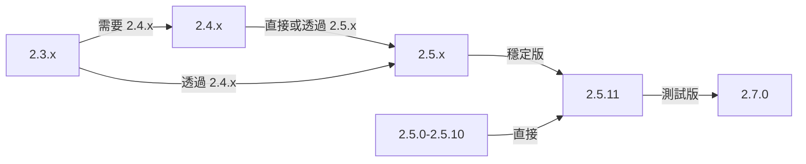

本指南涵蓋從舊版本升級 XOOPS 到最新發行版本，同時保留您的資料和自訂。

> **版本信息**
> - **穩定版：** XOOPS 2.5.11
> - **測試版：** XOOPS 2.7.0（測試中）
> - **未來版本：** XOOPS 4.0（開發中 - 請參閱路線圖）

## 升級前檢查清單

開始升級前，請驗證：

- [ ] 當前 XOOPS 版本已記錄
- [ ] 已識別目標 XOOPS 版本
- [ ] 已完成完整系統備份
- [ ] 資料庫備份已驗證
- [ ] 已記錄已安裝模組清單
- [ ] 已記錄自訂修改
- [ ] 可用測試環境
- [ ] 已檢查升級路徑（某些版本跳過中間發行版本）
- [ ] 已驗證伺服器資源（磁碟空間、記憶體足夠）
- [ ] 已啟用維護模式

## 升級路徑指南

根據目前版本的不同升級路徑：



**重要：** 永遠不要跳過主要版本。如果從 2.3.x 升級，請先升級到 2.4.x，然後升級到 2.5.x。

## 步驟 1：完成系統備份

### 資料庫備份

使用 mysqldump 備份資料庫：

```bash
# 完整資料庫備份
mysqldump -u xoops_user -p xoops_db > /backups/xoops_db_backup_$(date +%Y%m%d_%H%M%S).sql

# 壓縮備份
mysqldump -u xoops_user -p xoops_db | gzip > /backups/xoops_db_backup_$(date +%Y%m%d_%H%M%S).sql.gz
```

或使用 phpMyAdmin：

1. 選擇您的 XOOPS 資料庫
2. 按一下 "Export" 選項卡
3. 選擇 "SQL" 格式
4. 選擇 "Save as file"
5. 按一下 "Go"

驗證備份文件：

```bash
# 檢查備份大小
ls -lh /backups/xoops_db_backup*.sql

# 驗證備份完整性（未壓縮）
head -20 /backups/xoops_db_backup_*.sql

# 驗證壓縮備份
zcat /backups/xoops_db_backup_*.sql.gz | head -20
```

### 文件系統備份

備份所有 XOOPS 文件：

```bash
# 壓縮文件備份
tar -czf /backups/xoops_files_$(date +%Y%m%d_%H%M%S).tar.gz /var/www/html/xoops

# 未壓縮（更快，需要更多磁碟空間）
tar -cf /backups/xoops_files_$(date +%Y%m%d_%H%M%S).tar /var/www/html/xoops

# 顯示備份進度
tar -czf /backups/xoops_files_$(date +%Y%m%d_%H%M%S).tar.gz --verbose /var/www/html/xoops | tail
```

安全地儲存備份：

```bash
# 安全備份儲存
chmod 600 /backups/xoops_*
ls -lah /backups/

# 可選：複製到遠端儲存
scp /backups/xoops_* user@backup-server:/secure/backups/
```

### 測試備份還原

**關鍵：** 始終測試您的備份有效：

```bash
# 驗證 tar 存檔內容
tar -tzf /backups/xoops_files_*.tar.gz | head -20

# 提取至測試位置
mkdir /tmp/restore_test
cd /tmp/restore_test
tar -xzf /backups/xoops_files_*.tar.gz

# 驗證關鍵文件存在
ls -la xoops/mainfile.php
ls -la xoops/install/
```

## 步驟 2：啟用維護模式

防止用戶在升級期間訪問網站：

### 選項 1：XOOPS 管理面板

1. 登錄到管理面板
2. 前往 System > Maintenance
3. 啟用 "Site Maintenance Mode"
4. 設定維護訊息
5. 儲存

### 選項 2：手動維護模式

在網頁根目錄建立維護文件：

```html
<!-- /var/www/html/maintenance.html -->
<!DOCTYPE html>
<html>
<head>
    <title>Under Maintenance</title>
    <style>
        body { font-family: Arial; text-align: center; padding: 50px; }
        h1 { color: #333; }
        p { color: #666; margin: 20px 0; }
    </style>
</head>
<body>
    <h1>Site Under Maintenance</h1>
    <p>We're currently upgrading our site.</p>
    <p>Expected time: approximately 30 minutes.</p>
    <p>Thank you for your patience!</p>
</body>
</html>
```

配置 Apache 以顯示維護頁面：

```apache
# 在 .htaccess 或 vhost 配置中
ErrorDocument 503 /maintenance.html

# 將所有流量重定向到維護頁面
<IfModule mod_rewrite.c>
    RewriteEngine On
    RewriteCond %{REMOTE_ADDR} !^192\.168\.1\.100$  # 您的 IP
    RewriteRule ^(.*)$ - [R=503,L]
</IfModule>
```

## 步驟 3：下載新版本

從官方網站下載 XOOPS：

```bash
# 下載最新版本
cd /tmp
wget https://xoops.org/download/xoops-2.5.8.zip

# 驗證校驗和（如果提供）
sha256sum xoops-2.5.8.zip
# 與官方 SHA256 雜湊值進行比較

# 提取至暫時位置
unzip xoops-2.5.8.zip
cd xoops-2.5.8
```

## 步驟 4：升級前文件準備

### 識別自訂修改

檢查自訂核心文件：

```bash
# 查找修改的文件（mtime 較新的文件）
find /var/www/html/xoops -type f -newer /var/www/html/xoops/install.php

# 檢查自訂主題
ls /var/www/html/xoops/themes/
# 記下任何自訂主題

# 檢查自訂模組
ls /var/www/html/xoops/modules/
# 記下任何您建立的自訂模組
```

### 記錄當前狀態

建立升級報告：

```bash
cat > /tmp/upgrade_report.txt << EOF
=== XOOPS Upgrade Report ===
Date: $(date)
Current Version: 2.5.6
Target Version: 2.5.8

=== Installed Modules ===
$(ls /var/www/html/xoops/modules/)

=== Custom Modifications ===
[記錄任何自訂主題或模組修改]

=== Themes ===
$(ls /var/www/html/xoops/themes/)

=== Plugin Status ===
[列出任何自訂程式碼修改]

EOF
```

## 步驟 5：將新文件與當前安裝合併

### 策略：保留自訂文件

替換 XOOPS 核心文件但保留：
- `mainfile.php`（您的資料庫配置）
- `themes/` 中的自訂主題
- `modules/` 中的自訂模組
- `uploads/` 中的用戶上傳
- `var/` 中的網站資料

### 手動合併過程

```bash
# 設定變數
XOOPS_OLD="/var/www/html/xoops"
XOOPS_NEW="/tmp/xoops-2.5.8"
BACKUP="/backups/pre-upgrade"

# 在原位建立升級前備份
mkdir -p $BACKUP
cp -r $XOOPS_OLD/* $BACKUP/

# 複製新文件（但保留敏感文件）
# 複製除受保護目錄外的所有內容
rsync -av --exclude='mainfile.php' \
    --exclude='modules/custom*' \
    --exclude='themes/custom*' \
    --exclude='uploads' \
    --exclude='var' \
    --exclude='cache' \
    --exclude='templates_c' \
    $XOOPS_NEW/ $XOOPS_OLD/

# 驗證關鍵文件已保留
ls -la $XOOPS_OLD/mainfile.php
```

### 使用 upgrade.php（如果可用）

某些 XOOPS 版本包括自動升級腳本：

```bash
# 使用安裝程序複製新文件
cp -r /tmp/xoops-2.5.8/* /var/www/html/xoops/

# 執行升級精靈
# 訪問：http://your-domain.com/xoops/upgrade/
```

### 合併後的文件權限

還原適當的權限：

```bash
# 設定所有權
chown -R www-data:www-data /var/www/html/xoops

# 設定目錄權限
find /var/www/html/xoops -type d -exec chmod 755 {} \;

# 設定文件權限
find /var/www/html/xoops -type f -exec chmod 644 {} \;

# 使可寫入目錄
chmod 777 /var/www/html/xoops/cache
chmod 777 /var/www/html/xoops/templates_c
chmod 777 /var/www/html/xoops/uploads
chmod 777 /var/www/html/xoops/var

# 保護 mainfile.php
chmod 644 /var/www/html/xoops/mainfile.php
```

## 步驟 6：資料庫遷移

### 檢查資料庫更改

查閱 XOOPS 發行版本附註以了解資料庫結構更改：

```bash
# 提取並檢查 SQL 遷移文件
find /tmp/xoops-2.5.8 -name "*.sql" -type f
# 記錄找到的所有 .sql 文件
```

### 執行資料庫更新

### 選項 1：自動更新（如果可用）

使用管理面板：

1. 登錄到管理員
2. 前往 **System > Database**
3. 按一下 "Check Updates"
4. 檢查待決變更
5. 按一下 "Apply Updates"

### 選項 2：手動資料庫更新

執行遷移 SQL 文件：

```bash
# 連接到資料庫
mysql -u xoops_user -p xoops_db

# 檢查待決變更（因版本而異）
SELECT * FROM xoops_config WHERE conf_name LIKE '%version%';

# 如果需要，手動執行遷移腳本
SOURCE /tmp/xoops-2.5.8/migrate_2.5.6_to_2.5.8.sql;
```

### 資料庫驗證

更新後驗證資料庫完整性：

```sql
-- 檢查資料庫一致性
REPAIR TABLE xoops_users;
OPTIMIZE TABLE xoops_users;

-- 驗證關鍵表格存在
SHOW TABLES LIKE 'xoops_%';

-- 檢查行計數（應增加或保持相同）
SELECT COUNT(*) FROM xoops_users;
SELECT COUNT(*) FROM xoops_posts;
```

## 步驟 7：驗證升級

### 首頁檢查

訪問您的 XOOPS 首頁：

```
http://your-domain.com/xoops/
```

預期：頁面加載無錯誤，顯示正確

### 管理面板檢查

訪問管理員：

```
http://your-domain.com/xoops/admin/
```

驗證：
- [ ] 管理面板加載
- [ ] 導航有效
- [ ] 儀表板正確顯示
- [ ] 日誌中沒有資料庫錯誤

### 模組驗證

檢查已安裝的模組：

1. 在管理員中前往 **Modules > Modules**
2. 驗證所有模組仍已安裝
3. 檢查任何錯誤訊息
4. 啟用任何被禁用的模組

### 日誌文件檢查

檢查系統日誌中的錯誤：

```bash
# 檢查網頁伺服器錯誤日誌
tail -50 /var/log/apache2/error.log

# 檢查 PHP 錯誤日誌
tail -50 /var/log/php_errors.log

# 檢查 XOOPS 系統日誌（如果可用）
# 在管理面板中：System > Logs
```

### 測試核心功能

- [ ] 用戶登入/登出有效
- [ ] 用戶註冊有效
- [ ] 文件上傳功能
- [ ] 電郵通知發送
- [ ] 搜尋功能有效
- [ ] 管理員功能正常運作
- [ ] 模組功能完整

## 步驟 8：升級後清理

### 移除臨時文件

```bash
# 移除提取目錄
rm -rf /tmp/xoops-2.5.8

# 清除範本快取（安全刪除）
rm -rf /var/www/html/xoops/templates_c/*

# 清除網站快取
rm -rf /var/www/html/xoops/cache/*
```

### 移除維護模式

重新啟用正常網站訪問：

```apache
# 從 .htaccess 移除維護模式重定向
# 或刪除 maintenance.html 文件
rm /var/www/html/maintenance.html
```

### 更新文件

更新您的升級筆記：

```bash
# 記錄成功升級
cat >> /tmp/upgrade_report.txt << EOF

=== Upgrade Results ===
Status: SUCCESS
Upgrade Date: $(date)
New Version: 2.5.8
Duration: [以分鐘為單位的時間]

Post-Upgrade Tests:
- [x] Homepage loads
- [x] Admin panel accessible
- [x] Modules functional
- [x] User registration works
- [x] Database optimized

EOF
```

## 升級故障排除

### 問題：升級後出現空白白色畫面

**症狀：** 首頁無顯示

**解決方案：**
```bash
# 檢查 PHP 錯誤
tail -f /var/log/apache2/error.log

# 暫時啟用偵錯模式
echo "define('XOOPS_DEBUG', 1);" >> /var/www/html/xoops/mainfile.php

# 檢查文件權限
ls -la /var/www/html/xoops/mainfile.php

# 需要時從備份還原
cp /backups/xoops_files_*.tar.gz /tmp/
cd /tmp && tar -xzf xoops_files_*.tar.gz
```

### 問題：資料庫連接錯誤

**症狀：** "Cannot connect to database"訊息

**解決方案：**
```bash
# 驗證 mainfile.php 中的資料庫認證
grep -i "database\|host\|user" /var/www/html/xoops/mainfile.php

# 測試連接
mysql -h localhost -u xoops_user -p xoops_db -e "SELECT 1"

# 檢查 MySQL 狀態
systemctl status mysql

# 驗證資料庫仍存在
mysql -u xoops_user -p -e "SHOW DATABASES" | grep xoops
```

### 問題：管理面板無法訪問

**症狀：** 無法訪問 /xoops/admin/

**解決方案：**
```bash
# 檢查 .htaccess 規則
cat /var/www/html/xoops/.htaccess

# 驗證管理員文件存在
ls -la /var/www/html/xoops/admin/

# 檢查 mod_rewrite 已啟用
apache2ctl -M | grep rewrite

# 重啟網頁伺服器
systemctl restart apache2
```

### 問題：模組無法載入

**症狀：** 模組顯示錯誤或已停用

**解決方案：**
```bash
# 驗證模組文件存在
ls /var/www/html/xoops/modules/

# 檢查模組權限
ls -la /var/www/html/xoops/modules/*/

# 檢查資料庫中的模組配置
mysql -u xoops_user -p xoops_db -e "SELECT * FROM xoops_modules WHERE module_status = 0"

# 在管理面板中重新啟動模組
# System > Modules > 按一下模組 > Update Status
```

### 問題：拒絕權限錯誤

**症狀：** 上傳或儲存時出現 "Permission denied"

**解決方案：**
```bash
# 檢查文件所有權
ls -la /var/www/html/xoops/ | head -20

# 修復所有權
chown -R www-data:www-data /var/www/html/xoops

# 修復目錄權限
find /var/www/html/xoops -type d -exec chmod 755 {} \;

# 使快取/上傳可寫入
chmod 777 /var/www/html/xoops/cache
chmod 777 /var/www/html/xoops/templates_c
chmod 777 /var/www/html/xoops/uploads
chmod 777 /var/www/html/xoops/var
```

### 問題：頁面加載速度緩慢

**症狀：** 升級後頁面加載非常緩慢

**解決方案：**
```bash
# 清除所有快取
rm -rf /var/www/html/xoops/cache/*
rm -rf /var/www/html/xoops/templates_c/*

# 優化資料庫
mysql -u xoops_user -p xoops_db << EOF
OPTIMIZE TABLE xoops_users;
OPTIMIZE TABLE xoops_posts;
OPTIMIZE TABLE xoops_config;
ANALYZE TABLE xoops_users;
EOF

# 檢查 PHP 錯誤日誌中的警告
grep -i "deprecated\|warning" /var/log/php_errors.log | tail -20

# 暫時增加 PHP 記憶體/執行時間
# 編輯 php.ini：
memory_limit = 256M
max_execution_time = 300
```

## 回復過程

如果升級失敗嚴重，請從備份還原：

### 還原資料庫

```bash
# 從備份還原
mysql -u xoops_user -p xoops_db < /backups/xoops_db_backup_YYYYMMDD_HHMMSS.sql

# 或從壓縮備份還原
gunzip < /backups/xoops_db_backup_YYYYMMDD_HHMMSS.sql.gz | mysql -u xoops_user -p xoops_db

# 驗證還原
mysql -u xoops_user -p xoops_db -e "SELECT COUNT(*) FROM xoops_users"
```

### 還原文件系統

```bash
# 停止網頁伺服器
systemctl stop apache2

# 移除當前安裝
rm -rf /var/www/html/xoops/*

# 提取備份
cd /var/www/html
tar -xzf /backups/xoops_files_YYYYMMDD_HHMMSS.tar.gz

# 修復權限
chown -R www-data:www-data xoops/
find xoops -type d -exec chmod 755 {} \;
find xoops -type f -exec chmod 644 {} \;
chmod 777 xoops/cache xoops/templates_c xoops/uploads xoops/var

# 啟動網頁伺服器
systemctl start apache2

# 驗證還原
# 訪問 http://your-domain.com/xoops/
```

## 升級驗證檢查清單

升級完成後，驗證：

- [ ] XOOPS 版本已更新（檢查管理員 > System info）
- [ ] 首頁無錯誤加載
- [ ] 所有模組有效
- [ ] 用戶登入有效
- [ ] 管理面板可訪問
- [ ] 文件上傳有效
- [ ] 電郵通知有效
- [ ] 資料庫完整性已驗證
- [ ] 文件權限正確
- [ ] 維護模式已移除
- [ ] 備份已保護和測試
- [ ] 性能可接受
- [ ] SSL/HTTPS 有效
- [ ] 日誌中沒有錯誤訊息

## 後續步驟

成功升級後：

1. 將任何自訂模組更新到最新版本
2. 檢查發行版本附註中的不推薦功能
3. 考慮優化性能
4. 更新安全設定
5. 徹底測試所有功能
6. 保護備份文件安全

---

**標籤：** #upgrade #maintenance #backup #database-migration

**相關文章：**
- ../../06-Publisher-Module/User-Guide/Installation
- Server-Requirements
- ../Configuration/Basic-Configuration
- ../Configuration/Security-Configuration
