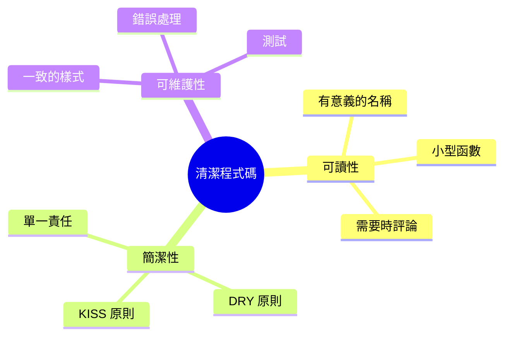

## 概述

清潔程式碼是易於閱讀、理解和維護的程式碼。本指南涵蓋特別應用於 XOOPS 模組開發的清潔程式碼原則。

## 核心原則



## 有意義的名稱

### 變數

```php
// 差
$d = new DateTime();
$u = $memberHandler->getUser($id);
$arr = [];

// 好
$createdDate = new DateTime();
$currentUser = $memberHandler->getUser($userId);
$publishedArticles = [];
```

### 函數

```php
// 差
function process($data) { ... }
function handle($item) { ... }
function doStuff($x, $y) { ... }

// 好
function publishArticle(Article $article): void { ... }
function calculateTotalPrice(array $items): float { ... }
function sendNotificationEmail(User $user, string $subject): bool { ... }
```

### 類別

```php
// 差
class Manager { ... }
class Helper { ... }
class Utils { ... }

// 好
class ArticleRepository { ... }
class NotificationService { ... }
class PermissionChecker { ... }
```

## 小型函數

### 單一責任

```php
// 差 - 做太多事情
function processArticle($data) {
    // 驗證
    if (empty($data['title'])) {
        throw new Exception('Title required');
    }
    // 儲存
    $article = new Article();
    $article->setTitle($data['title']);
    $this->repository->save($article);
    // 通知
    $this->mailer->send($article->getAuthor(), 'Article published');
    // 記錄
    $this->logger->info('Article created');
    return $article;
}

// 好 - 每個函數只做一件事
function validateArticleData(array $data): void
{
    if (empty($data['title'])) {
        throw new ValidationException('Title required');
    }
}

function createArticle(array $data): Article
{
    $this->validateArticleData($data);
    return Article::create($data['title'], $data['content']);
}

function publishArticle(Article $article): void
{
    $this->repository->save($article);
    $this->notifyAuthor($article);
    $this->logArticleCreation($article);
}
```

### 函數長度

保持函數簡短 - 理想情況下在 20 行以下：

```php
// 好 - 集中的函數
public function getPublishedArticles(int $limit = 10): array
{
    $criteria = new CriteriaCompo();
    $criteria->add(new Criteria('status', 'published'));
    $criteria->setSort('published_at');
    $criteria->setOrder('DESC');
    $criteria->setLimit($limit);

    return $this->repository->getObjects($criteria);
}
```

## DRY 原則 (不要重複自己)

### 提取通用代碼

```php
// 差 - 重複的程式碼
function getActiveUsers() {
    $criteria = new CriteriaCompo();
    $criteria->add(new Criteria('level', 0, '>'));
    $criteria->setSort('uname');
    return $this->userHandler->getObjects($criteria);
}

function getActiveAdmins() {
    $criteria = new CriteriaCompo();
    $criteria->add(new Criteria('level', 0, '>'));
    $criteria->add(new Criteria('is_admin', 1));
    $criteria->setSort('uname');
    return $this->userHandler->getObjects($criteria);
}

// 好 - 共用邏輯已提取
function getUsers(CriteriaCompo $criteria): array
{
    $criteria->add(new Criteria('level', 0, '>'));
    $criteria->setSort('uname');
    return $this->userHandler->getObjects($criteria);
}

function getActiveUsers(): array
{
    return $this->getUsers(new CriteriaCompo());
}

function getActiveAdmins(): array
{
    $criteria = new CriteriaCompo();
    $criteria->add(new Criteria('is_admin', 1));
    return $this->getUsers($criteria);
}
```

## 錯誤處理

### 正確使用例外狀況

```php
// 差 - 通用例外狀況
throw new Exception('Error');

// 好 - 特定例外狀況
throw new ArticleNotFoundException($articleId);
throw new PermissionDeniedException('Cannot edit article');
throw new ValidationException(['title' => 'Title is required']);
```

### 妥善處理錯誤

```php
public function findArticle(string $id): ?Article
{
    try {
        return $this->repository->findById($id);
    } catch (DatabaseException $e) {
        $this->logger->error('Database error finding article', [
            'id' => $id,
            'error' => $e->getMessage()
        ]);
        throw new ServiceException('Unable to retrieve article', 0, $e);
    }
}
```

## 評論

### 何時評論

```php
// 差 - 明顯的評論
// 遞增計數器
$counter++;

// 好 - 說明原因，而非內容
// 快取 1 小時以減少尖峰流量期間的資料庫負載
$cache->set($key, $data, 3600);

// 好 - 記錄複雜演算法
/**
 * 使用 TF-IDF 演算法計算文章相關性分數。
 * 更高的分數表示與搜尋詞的更好匹配。
 */
function calculateRelevanceScore(Article $article, array $terms): float
{
    // ...
}
```

## 程式碼組織

### 類別結構

```php
class ArticleService
{
    // 1. 常數
    private const MAX_TITLE_LENGTH = 255;

    // 2. 屬性
    private ArticleRepository $repository;
    private EventDispatcher $events;

    // 3. 建構子
    public function __construct(
        ArticleRepository $repository,
        EventDispatcher $events
    ) {
        $this->repository = $repository;
        $this->events = $events;
    }

    // 4. 公用方法
    public function publish(Article $article): void { ... }
    public function archive(Article $article): void { ... }

    // 5. 私有方法
    private function validateForPublication(Article $article): void { ... }
}
```

## 清潔程式碼檢查清單

- [ ] 名稱有意義且易於發音
- [ ] 函數只做一件事
- [ ] 函數簡短 (< 20 行)
- [ ] 沒有重複的程式碼
- [ ] 正確的錯誤處理與特定例外狀況
- [ ] 評論說明「為什麼」，而非「內容」
- [ ] 一致的格式和樣式
- [ ] 沒有魔術數字或字串
- [ ] 注入依賴，而不是建立依賴

## 相關文件

- Code Organization
- Error Handling
- Testing Best Practices
- PHP Standards
