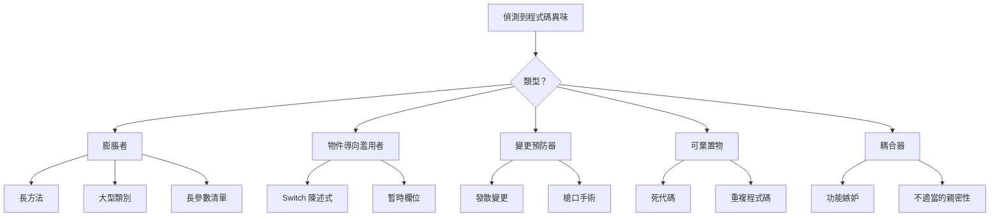

## 概述

程式碼異味是程式碼中潛在問題的指標。它們不一定意味著程式碼已損壞，但它們表明可能受益於重構的區域。

## 常見程式碼異味



## 膨脹者

### 長方法

```php
// 異味: 方法做太多事情
function processArticleSubmission($data) {
    // 100+ 行驗證、儲存、通知等
}

// 解決方案: 提取到集中方法
function processArticleSubmission(array $data): Article
{
    $this->validateInput($data);
    $article = $this->createArticle($data);
    $this->saveArticle($article);
    $this->notifySubscribers($article);
    return $article;
}
```

### 大型類別 (神祇物件)

```php
// 異味: 類別做所有事情
class ArticleManager {
    public function create() { ... }
    public function delete() { ... }
    public function sendEmail() { ... }
    public function generatePDF() { ... }
    public function exportToExcel() { ... }
    public function validateUser() { ... }
    public function checkPermissions() { ... }
    // ... 50 個更多的方法
}

// 解決方案: 分割成集中的類別
class ArticleService { ... }
class ArticleExporter { ... }
class ArticleNotifier { ... }
class PermissionChecker { ... }
```

### 長參數清單

```php
// 異味: 過多參數
function createArticle($title, $content, $author, $category, $tags, $status, $publishDate, $featured, $image) { ... }

// 解決方案: 使用參數物件
class CreateArticleCommand {
    public string $title;
    public string $content;
    public int $authorId;
    public int $categoryId;
    public array $tags;
    public string $status;
    public ?DateTime $publishDate;
    public bool $featured;
    public ?string $image;
}

function createArticle(CreateArticleCommand $command): Article { ... }
```

## 物件導向濫用者

### Switch 陳述式

```php
// 異味: 使用 switch 進行型別檢查
function getDiscount($userType) {
    switch ($userType) {
        case 'regular':
            return 0;
        case 'premium':
            return 10;
        case 'vip':
            return 20;
        default:
            return 0;
    }
}

// 解決方案: 使用多型性
interface UserType {
    public function getDiscount(): int;
}

class RegularUser implements UserType {
    public function getDiscount(): int { return 0; }
}

class PremiumUser implements UserType {
    public function getDiscount(): int { return 10; }
}

class VipUser implements UserType {
    public function getDiscount(): int { return 20; }
}
```

### 暫時欄位

```php
// 異味: 欄位只在某些情況下使用
class Article {
    private $tempCalculatedScore;

    public function search($terms) {
        $this->tempCalculatedScore = $this->calculateScore($terms);
        // ... 使用分數
    }
}

// 解決方案: 作為參數或傳回值傳遞
class Article {
    public function getSearchScore(array $terms): float {
        return $this->calculateScore($terms);
    }
}
```

## 變更預防器

### 發散變更

```php
// 異味: 一個類別因許多不同原因而改變
class Article {
    public function save() { ... } // 資料庫變更
    public function toJson() { ... } // API 格式變更
    public function validate() { ... } // 業務規則變更
    public function render() { ... } // UI 變更
}

// 解決方案: 分離責任
class Article { ... } // 領域物件僅
class ArticleRepository { public function save() { ... } }
class ArticleSerializer { public function toJson() { ... } }
class ArticleValidator { public function validate() { ... } }
```

### 槍口手術

```php
// 異味: 一個變更需要許多檔案編輯
// 變更日期格式需要編輯:
// - ArticleController.php
// - ArticleView.php
// - ArticleAPI.php
// - ArticleExport.php

// 解決方案: 集中化
class DateFormatter {
    public function format(DateTime $date): string {
        return $date->format($this->config->get('date_format'));
    }
}
```

## 可棄置物

### 死代碼

```php
// 異味: 無法存取或未使用的程式碼
function processData($data) {
    if (true) {
        return $this->handleData($data);
    }
    // 這永遠不會執行
    return $this->legacyHandler($data);
}

// 舊的未呼叫方法仍在程式碼庫中
function oldMethod() {
    // 任何地方都未呼叫
}

// 解決方案: 移除死代碼
function processData($data) {
    return $this->handleData($data);
}
```

### 重複程式碼

```php
// 異味: 相同邏輯在多個地方
class ArticleHandler {
    public function getActive() {
        $criteria = new CriteriaCompo();
        $criteria->add(new Criteria('status', 'active'));
        return $this->getObjects($criteria);
    }
}

class NewsHandler {
    public function getActive() {
        $criteria = new CriteriaCompo();
        $criteria->add(new Criteria('status', 'active'));
        return $this->getObjects($criteria);
    }
}

// 解決方案: 提取通用行為
trait ActiveRecordsTrait {
    public function getActive(): array {
        $criteria = new CriteriaCompo();
        $criteria->add(new Criteria('status', 'active'));
        return $this->getObjects($criteria);
    }
}
```

## 耦合器

### 功能嫉妒

```php
// 異味: 方法使用另一個物件的資料多於其本身
class Invoice {
    public function calculateTotal(Customer $customer) {
        $total = 0;
        foreach ($this->items as $item) {
            $total += $item->price;
        }
        // 廣泛使用客戶資料
        if ($customer->isPremium()) {
            $total *= (1 - $customer->getDiscountRate());
        }
        if ($customer->getCountry() === 'US') {
            $total *= 1.08; // 稅
        }
        return $total;
    }
}

// 解決方案: 將行為移至具有資料的物件
class Customer {
    public function applyDiscount(float $amount): float {
        return $this->isPremium()
            ? $amount * (1 - $this->discountRate)
            : $amount;
    }

    public function applyTax(float $amount): float {
        return $this->country === 'US'
            ? $amount * 1.08
            : $amount;
    }
}
```

## 重構檢查清單

當你發現程式碼異味時：

1. **識別** - 它是什麼異味？
2. **評估** - 影響的嚴重程度是多少？
3. **計畫** - 哪種重構技術適用？
4. **測試** - 在重構前確保測試存在
5. **重構** - 進行小的、增量的變更
6. **驗證** - 每次變更後執行測試

## 相關文件

- Clean Code Principles
- Code Organization
- Testing Best Practices
