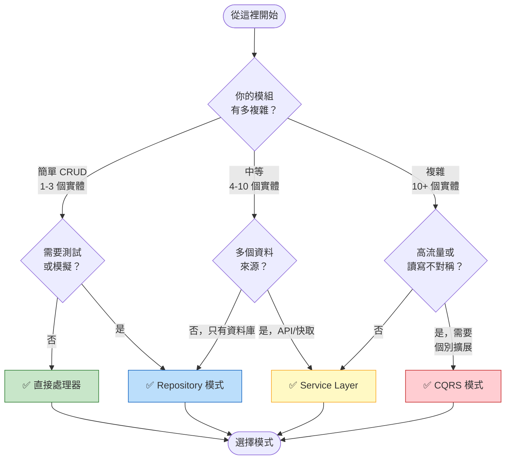
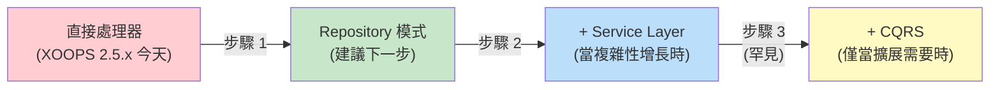

<span class="version-badge version-25x">2.5.x ✅</span> <span class="version-badge version-40x">4.0.x ✅</span>

> **我應該使用哪種模式？** 此決策樹可幫助你在直接處理器、Repository 模式、Service Layer 和 CQRS 之間選擇。

---

## 快速決策樹



---

## 模式比較

| 條件 | 直接處理器 | Repository | Service Layer | CQRS |
|----------|---------------|------------|---------------|------|
| **複雜度** | ⭐ | ⭐⭐ | ⭐⭐⭐ | ⭐⭐⭐⭐⭐ |
| **可測試性** | ❌ 困難 | ✅ 好 | ✅ 極佳 | ✅ 極佳 |
| **靈活性** | ❌ 低 | ✅ 中等 | ✅ 高 | ✅ 非常高 |
| **XOOPS 2.5.x** | ✅ 原生 | ✅ 有效 | ✅ 有效 | ⚠️ 複雜 |
| **XOOPS 4.0** | ⚠️ 已棄用 | ✅ 建議 | ✅ 建議 | ✅ 用於擴展 |
| **團隊大小** | 1 個開發人員 | 1-3 個開發人員 | 2-5 個開發人員 | 5+ 個開發人員 |
| **維護** | ❌ 更高 | ✅ 適中 | ✅ 更低 | ⚠️ 需要專業知識 |

---

## 何時使用各種模式

### ✅ 直接處理器 (`XoopsPersistableObjectHandler`)

**最適合：** 簡單模組、快速原型、學習 XOOPS

```php
// 簡單且直接 - 適合小型模組
$handler = xoops_getModuleHandler('article', 'news');
$articles = $handler->getObjects(new Criteria('status', 1));
```

**選擇此項當：**
- 建立具有 1-3 個資料庫表的簡單模組
- 建立快速原型
- 你是唯一的開發人員且不需要測試
- 模組不會有明顯增長

**限制：**
- 難以進行單元測試 (全域依賴)
- 與 XOOPS 資料庫層的緊密耦合
- 業務邏輯傾向於洩露到控制器中

---

### ✅ Repository 模式

**最適合：** 大多數模組、想要可測試性的團隊

```php
// 抽象允許模擬以進行測試
interface ArticleRepositoryInterface {
    public function findPublished(): array;
    public function save(Article $article): void;
}

class XoopsArticleRepository implements ArticleRepositoryInterface {
    private $handler;

    public function __construct() {
        $this->handler = xoops_getModuleHandler('article', 'news');
    }

    public function findPublished(): array {
        return $this->handler->getObjects(new Criteria('status', 1));
    }
}
```

**選擇此項當：**
- 你想編寫單元測試
- 你稍後可能會變更資料來源 (資料庫 → API)
- 與 2+ 個開發人員合作
- 建立用於發佈的模組

**升級路徑：** 這是 XOOPS 4.0 準備的建議模式。

---

### ✅ Service Layer

**最適合：** 具有複雜業務邏輯的模組

```php
// Service 協調多個 repository 並包含業務規則
class ArticlePublicationService {
    public function __construct(
        private ArticleRepositoryInterface $articles,
        private NotificationServiceInterface $notifications,
        private CacheInterface $cache
    ) {}

    public function publish(int $articleId): void {
        $article = $this->articles->find($articleId);
        $article->setStatus('published');
        $article->setPublishedAt(new DateTime());

        $this->articles->save($article);
        $this->notifications->notifySubscribers($article);
        $this->cache->invalidate("article:{$articleId}");
    }
}
```

**選擇此項當：**
- 操作跨越多個資料來源
- 業務規則複雜
- 你需要交易管理
- 應用程式的多個部分進行相同的操作

**升級路徑：** 與 Repository 組合以獲得強大的架構。

---

### ⚠️ CQRS (命令查詢責任分離)

**最適合：** 具有讀寫不對稱的高規模模組

```php
// 命令修改狀態
class PublishArticleCommand {
    public function __construct(
        public readonly int $articleId,
        public readonly int $publisherId
    ) {}
}

// 查詢讀取狀態 (可以使用反正規化讀取模型)
class GetPublishedArticlesQuery {
    public function __construct(
        public readonly int $limit = 10
    ) {}
}
```

**選擇此項當：**
- 讀取遠遠超過寫入 (100:1 或更多)
- 你需要為讀取和寫入提供不同的擴展
- 複雜的報告/分析要求
- 事件溯源會使你的領域受益

**警告：** CQRS 增加了顯著的複雜性。大多數 XOOPS 模組不需要它。

---

## 建議的升級路徑



### 步驟 1: 在 Repository 中包裝處理器 (2-4 小時)

1. 為你的資料存取需求建立介面
2. 使用現有的處理器實施它
3. 注入 repository 而不是直接呼叫 `xoops_getModuleHandler()`

### 步驟 2: 需要時新增 Service Layer (1-2 天)

1. 當業務邏輯出現在控制器中時，提取到 Service
2. Service 使用 repository，而非直接處理器
3. 控制器變細 (路由 → service → 回應)

### 步驟 3: 僅在以下情況下考慮 CQRS (罕見)

1. 你每天有數百萬次讀取
2. 讀取和寫入模型明顯不同
3. 你需要事件溯源以進行稽核追蹤
4. 你有具有 CQRS 經驗的團隊

---

## 快速參考卡

| 問題 | 答案 |
|----------|--------|
| **「我只需要保存/載入資料」** | 直接處理器 |
| **「我想編寫測試」** | Repository 模式 |
| **「我有複雜的業務規則」** | Service Layer |
| **「我需要個別擴展讀取」** | CQRS |
| **「我正在準備 XOOPS 4.0」** | Repository + Service Layer |

---

## 相關文件

- [Repository 模式指南](Patterns/Repository-Pattern.md)
- [Service Layer 模式指南](Patterns/Service-Layer-Pattern.md)
- [CQRS 模式指南](../07-XOOPS-4.0/Implementation-Guides/CQRS-Pattern-Guide.md) *(進階)*
- [混合模式合約](../07-XOOPS-4.0/Specifications/Hybrid-Mode-Contract.md)

---

#patterns #data-access #decision-tree #best-practices #xoops
