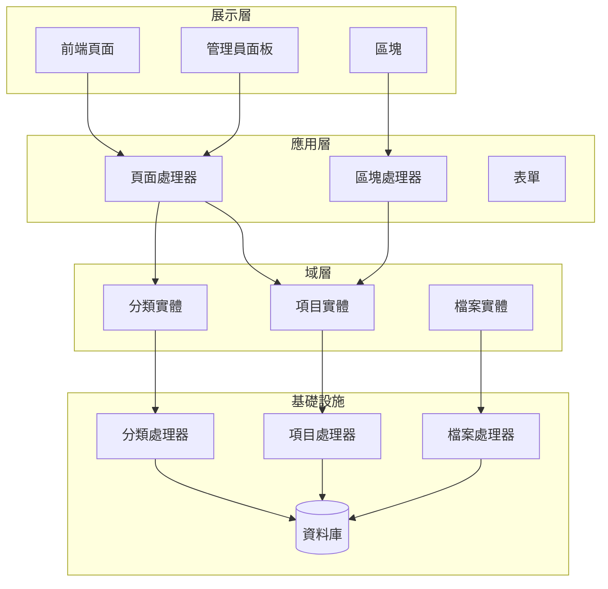
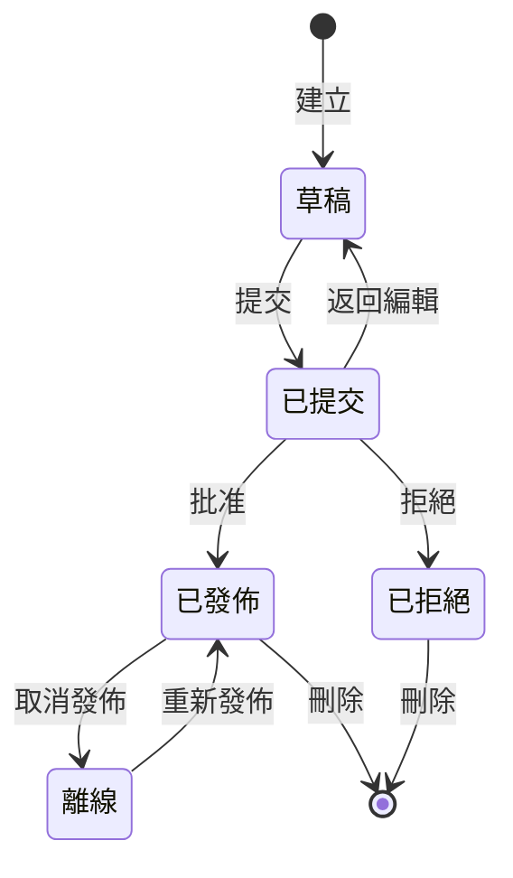

## 概述

本文件提供Publisher模組架構、模式和實現詳細資訊的技術分析。將其用作參考，了解生產品質XOOPS模組的結構方式。

## 架構概述



## 目錄結構

```
publisher/
├── admin/
│   ├── index.php           # 管理員儀表板
│   ├── item.php            # 文章管理
│   ├── category.php        # 分類管理
│   ├── permission.php      # 權限
│   ├── file.php            # 檔案管理器
│   └── menu.php            # 管理員選單
├── assets/
│   ├── css/
│   ├── js/
│   └── images/
├── class/
│   ├── Category.php        # 分類實體
│   ├── CategoryHandler.php # 分類資料存取
│   ├── Item.php            # 文章實體
│   ├── ItemHandler.php     # 文章資料存取
│   ├── File.php            # 檔案附件
│   ├── FileHandler.php     # 檔案資料存取
│   ├── Form/               # 表單類別
│   ├── Common/             # 公用程式
│   └── Helper.php          # 模組幫手
├── include/
│   ├── common.php          # 初始化
│   ├── functions.php       # 公用程式函式
│   ├── oninstall.php       # 安裝鉤子
│   ├── onupdate.php        # 更新鉤子
│   └── search.php          # 搜尋整合
├── language/
├── templates/
├── sql/
└── xoops_version.php
```

## 實體分析

### Item (文章) 實體

```php
class Item extends \XoopsObject
{
    // 欄位
    public function initVar(): void
    {
        $this->initVar('itemid', XOBJ_DTYPE_INT, null, false);
        $this->initVar('categoryid', XOBJ_DTYPE_INT, 0, false);
        $this->initVar('title', XOBJ_DTYPE_TXTBOX, '', true);
        $this->initVar('subtitle', XOBJ_DTYPE_TXTBOX, '');
        $this->initVar('summary', XOBJ_DTYPE_TXTAREA, '');
        $this->initVar('body', XOBJ_DTYPE_TXTAREA, '', true);
        $this->initVar('uid', XOBJ_DTYPE_INT, 0);
        $this->initVar('status', XOBJ_DTYPE_INT, 0);
        $this->initVar('datesub', XOBJ_DTYPE_INT, time());
        // ... 更多欄位
    }

    // 業務方法
    public function isPublished(): bool
    {
        return $this->getVar('status') == _PUBLISHER_STATUS_PUBLISHED;
    }

    public function canEdit(int $userId): bool
    {
        return $this->getVar('uid') == $userId
            || $this->isAdmin($userId);
    }
}
```

### 處理器模式

```php
class ItemHandler extends \XoopsPersistableObjectHandler
{
    public function __construct(\XoopsDatabase $db)
    {
        parent::__construct(
            $db,
            'publisher_items',
            Item::class,
            'itemid',
            'title'
        );
    }

    public function getPublishedItems(int $limit = 10): array
    {
        $criteria = new \CriteriaCompo();
        $criteria->add(new \Criteria('status', _PUBLISHER_STATUS_PUBLISHED));
        $criteria->setSort('datesub');
        $criteria->setOrder('DESC');
        $criteria->setLimit($limit);

        return $this->getObjects($criteria);
    }
}
```

## 權限系統

### 權限類型

| 權限 | 說明 |
|------|------|
| `publisher_view` | 檢視分類/文章 |
| `publisher_submit` | 提交新文章 |
| `publisher_approve` | 自動批准提交 |
| `publisher_moderate` | 檢查待批准文章 |
| `publisher_global` | 全域模組權限 |

### 權限檢查

```php
class PermissionHandler
{
    public function isGranted(string $permission, int $categoryId): bool
    {
        $userId = $GLOBALS['xoopsUser']?->uid() ?? 0;
        $groups = $this->getUserGroups($userId);

        return $this->grouppermHandler->checkRight(
            $permission,
            $categoryId,
            $groups,
            $this->helper->getModule()->mid()
        );
    }
}
```

## 工作流程狀態



## 範本結構

### 前端範本

| 範本 | 目的 |
|------|------|
| `publisher_index.tpl` | 模組首頁 |
| `publisher_item.tpl` | 單篇文章 |
| `publisher_category.tpl` | 分類列表 |
| `publisher_submit.tpl` | 提交表單 |
| `publisher_search.tpl` | 搜尋結果 |

### 區塊範本

| 範本 | 目的 |
|------|------|
| `publisher_block_latest.tpl` | 最近文章 |
| `publisher_block_spotlight.tpl` | 精選文章 |
| `publisher_block_category.tpl` | 分類選單 |

## 使用的關鍵模式

1. **處理器模式** - 資料存取封裝
2. **值物件** - 狀態常數
3. **範本方法** - 表單產生
4. **策略** - 不同顯示模式
5. **觀察者** - 事件上的通知

## 模組開發課程

1. 對CRUD使用XoopsPersistableObjectHandler
2. 實現細粒度權限
3. 將展示與邏輯分開
4. 對查詢使用Criteria
5. 支援多個內容狀態
6. 與XOOPS通知系統整合

## 相關文件

- 建立文章 - 文章管理
- 管理分類 - 分類系統
- 權限設定 - 權限設定
- 開發人員指南/鉤子和事件 - 擴展點
