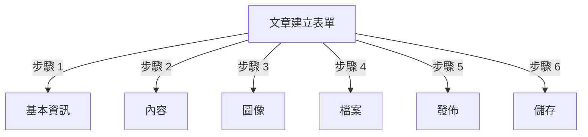
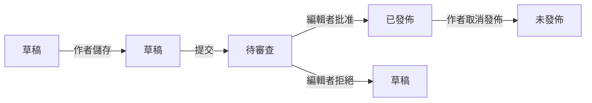
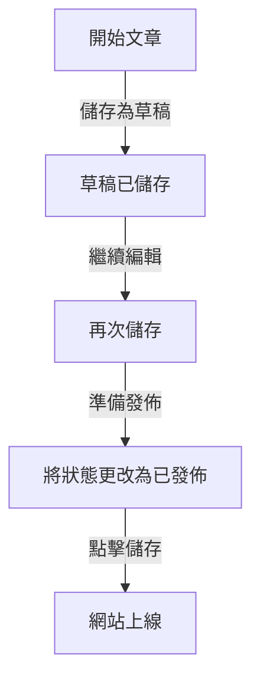

# 在 Publisher 中建立文章

> 在 Publisher 模組中建立、編輯、格式化和發佈文章的逐步指南。

---

## 存取文章管理

### 管理員面板導覽

```
管理員面板
└── 模組
    └── Publisher
        └── 文章
            ├── 建立新文章
            ├── 編輯
            ├── 刪除
            └── 發佈
```

### 最快路徑

1. 以**管理員**身份登入
2. 點擊管理員列中的**模組**
3. 找到 **Publisher**
4. 點擊**管理員**連結
5. 點擊左側選單中的**文章**
6. 點擊**新增文章**按鈕

---

## 文章建立表單

### 基本資訊

建立新文章時，填入以下部分：



---

## 步驟 1：基本資訊

### 必填欄位

#### 文章標題

```
欄位：標題
類型：文字輸入（必填）
最大長度：255 字元
範例："攝影更好的五大技巧"
```

**指導方針：**
- 描述性和具體性
- 包含SEO關鍵字
- 避免全大寫
- 最佳顯示應保持在60字元以下

#### 選擇分類

```
欄位：分類
類型：下拉選單（必填）
選項：已建立分類的清單
範例：攝影 > 教程
```

**提示：**
- 父分類和子分類均可用
- 選擇最相關的分類
- 每篇文章僅一個分類
- 稍後可變更

#### 文章副標題（選填）

```
欄位：副標題
類型：文字輸入（選填）
最大長度：255 字元
範例："透過5個簡單步驟學習攝影基礎"
```

**用途：**
- 摘要標題
- 吸引文本
- 擴展標題

### 文章說明

#### 簡短說明

```
欄位：簡短說明
類型：文字區域（選填）
最大長度：500 字元
```

**目的：**
- 文章預覽文本
- 在分類清單中顯示
- 在搜尋結果中使用
- 用於SEO的中繼說明

**範例：**
```
"發現能改變您照片的基本攝影技巧，
從普通到非凡。本綜合指南涵蓋構圖、
光線和曝光設定。"
```

#### 完整內容

```
欄位：文章本文
類型：WYSIWYG編輯器（必填）
最大長度：無限制
格式：HTML
```

含有豐富文本編輯功能的主要文章內容區域。

---

## 步驟 2：格式化內容

### 使用WYSIWYG編輯器

#### 文本格式化

```
粗體：           Ctrl+B 或點擊 [B] 按鈕
斜體：           Ctrl+I 或點擊 [I] 按鈕
下劃線：         Ctrl+U 或點擊 [U] 按鈕
刪除線：         Alt+Shift+D 或點擊 [S] 按鈕
下標：           Ctrl+, (逗號)
上標：           Ctrl+. (句號)
```

#### 標題結構

建立適當的文檔層次結構：

```html
<h1>文章標題</h1>      <!-- 在頂部使用一次 -->
<h2>主要章節</h2>      <!-- 用於主要章節 -->
<h3>小節</h3>          <!-- 用於子主題 -->
<h4>小小節</h4>        <!-- 用於詳細資訊 -->
```

**在編輯器中：**
- 點擊**格式**下拉選單
- 選擇標題級別 (H1-H6)
- 輸入您的標題

#### 清單

**無序清單（項目符號）：**

```markdown
• 第一點
• 第二點
• 第三點
```

編輯器中的步驟：
1. 點擊 [≡] 項目符號清單按鈕
2. 輸入每個要點
3. 按Enter鍵以轉至下一個項目
4. 按Backspace兩次以結束清單

**有序清單（編號）：**

```markdown
1. 第一步
2. 第二步
3. 第三步
```

編輯器中的步驟：
1. 點擊 [1.] 編號清單按鈕
2. 輸入每個項目
3. 按Enter鍵轉至下一項
4. 按Backspace兩次以結束

**巢狀清單：**

```markdown
1. 主要要點
   a. 子要點
   b. 子要點
2. 下一個要點
```

步驟：
1. 建立第一個清單
2. 按Tab鍵進行縮進
3. 建立巢狀項目
4. 按Shift+Tab取消縮進

#### 連結

**新增超連結：**

1. 選擇要連結的文本
2. 點擊 **[🔗] 連結**按鈕
3. 輸入URL：`https://example.com`
4. 選填：新增標題/目標
5. 點擊**插入連結**

**移除連結：**

1. 點擊連結文本內
2. 點擊 **[🔗] 移除連結**按鈕

#### 程式碼和引言

**區塊引言：**

```
"這是專家的重要引言"
- 屬性
```

步驟：
1. 輸入引言文本
2. 點擊 **[❝] 區塊引言**按鈕
3. 文本縮進並被設計風格

**程式碼區塊：**

```python
def hello_world():
    print("Hello, World!")
```

步驟：
1. 點擊**格式 → 程式碼**
2. 粘貼程式碼
3. 選擇語言（選填）
4. 程式碼顯示並帶有語法高亮

---

## 步驟 3：新增圖像

### 特色圖像（主圖）

```
欄位：特色圖像 / 主圖
類型：圖像上傳
格式：JPG、PNG、GIF、WebP
最大尺寸：5 MB
建議：600x400 px
```

**上傳方法：**

1. 點擊**上傳圖像**按鈕
2. 從電腦選擇圖像
3. 如需要，進行裁剪/調整大小
4. 點擊**使用此圖像**

**圖像位置：**
- 顯示在文章頂部
- 用於分類清單
- 在存檔中顯示
- 用於社交分享

### 內嵌圖像

在文章文本中插入圖像：

1. 將遊標位於編輯器中應放置圖像的位置
2. 點擊工具列中的 **[🖼️] 圖像**按鈕
3. 選擇上傳選項：
   - 上傳新圖像
   - 從圖庫選擇
   - 輸入圖像URL
4. 設定：
   ```
   圖像尺寸：
   - 寬度：300-600 px
   - 高度：自動（保持比例）
   - 對齊：左/中/右
   ```
5. 點擊**插入圖像**

**將文本環繞圖像：**

在編輯器中插入後：

```html
<!-- 圖像向左浮動，文本環繞 -->

```

### 圖像圖庫

建立多圖像圖庫：

1. 點擊**圖庫**按鈕（如果可用）
2. 上傳多個圖像：
   - 單擊：新增一個
   - 拖放：新增多個
3. 通過拖動排列順序
4. 為每個圖像設定標題
5. 點擊**建立圖庫**

---

## 步驟 4：附加檔案

### 新增檔案附件

```
欄位：檔案附件
類型：檔案上傳（允許多個）
支援：PDF、DOC、XLS、ZIP等
每個檔案最大值：10 MB
每篇文章最多：5個檔案
```

**附加方法：**

1. 點擊**新增檔案**按鈕
2. 從電腦選擇檔案
3. 選填：新增檔案說明
4. 點擊**附加檔案**
5. 對多個檔案重複

**檔案範例：**
- PDF指南
- Excel電子表格
- Word文檔
- ZIP存檔
- 原始程式碼

### 管理附加檔案

**編輯檔案：**

1. 點擊檔案名稱
2. 編輯說明
3. 點擊**儲存**

**刪除檔案：**

1. 在清單中找到檔案
2. 點擊 **[×] 刪除**圖示
3. 確認刪除

---

## 步驟 5：發佈和狀態

### 文章狀態

```
欄位：狀態
類型：下拉選單
選項：
  - 草稿：未發佈，僅作者可見
  - 待審：等待批准
  - 已發佈：網站上線
  - 已歸檔：舊內容
  - 未發佈：曾發佈，現已隱藏
```

**狀態工作流程：**



### 發佈選項

#### 立即發佈

```
狀態：已發佈
開始日期：今天（自動填入）
結束日期：（留空表示無過期）
```

#### 排程稍後發佈

```
狀態：已排程
開始日期：未來日期/時間
範例：2024年2月15日上午9:00
```

文章將在指定時間自動發佈。

#### 設定過期

```
啟用過期：是
過期日期：未來日期
操作：存檔/隱藏/刪除
範例：2024年4月1日（文章自動存檔）
```

### 可見性選項

```yaml
顯示文章：
  - 顯示在首頁：是/否
  - 在分類中顯示：是/否
  - 包含在搜尋：是/否
  - 包含在最新文章：是/否

特色文章：
  - 標記為特色：是/否
  - 特色章節位置：（編號）
```

---

## 步驟 6：SEO和中繼資料

### SEO設定

```
欄位：SEO設定（展開章節）
```

#### 中繼說明

```
欄位：中繼說明
類型：文本（建議160個字元）
搜尋引擎和社交媒體使用

範例：
"透過5個簡單步驟學習攝影基礎。
發現構圖、光線和曝光技巧。"
```

#### 中繼關鍵字

```
欄位：中繼關鍵字
類型：逗號分隔清單
最多：5-10個關鍵字

範例：攝影、教程、構圖、光線、曝光
```

#### URL縮略名

```
欄位：URL縮略名（從標題自動生成）
類型：文本
格式：小寫、連字符、無空格

自動："top-5-tips-for-better-photography"
編輯：在發佈前更改
```

#### Open Graph標籤

自動從文章資訊生成：
- 標題
- 說明
- 特色圖像
- 文章URL
- 發佈日期

由Facebook、LinkedIn、WhatsApp等使用

---

## 步驟 7：留言和互動

### 留言設定

```yaml
允許留言：
  - 啟用：是/否
  - 預設：繼承自偏好設定
  - 覆蓋：特定於此文章

審核留言：
  - 需要批准：是/否
  - 預設：繼承自偏好設定
```

### 評分設定

```yaml
允許評分：
  - 啟用：是/否
  - 比例：5顆星（預設）
  - 顯示平均值：是/否
  - 顯示計數：是/否
```

---

## 步驟 8：進階選項

### 作者和署名

```
欄位：作者
類型：下拉選單
預設：當前使用者
選項：所有具有作者權限的使用者

顯示：
  - 顯示作者名稱：是/否
  - 顯示作者簡介：是/否
  - 顯示作者頭像：是/否
```

### 編輯鎖

```
欄位：編輯鎖
目的：防止意外更改

鎖定文章：
  - 已鎖定：是/否
  - 鎖定原因："最終版本"
  - 解鎖日期：（選填）
```

### 修訂歷史

文章的自動保存版本：

```
檢視修訂：
  - 點擊"修訂歷史"
  - 顯示所有保存的版本
  - 比較版本
  - 還原先前版本
```

---

## 儲存和發佈

### 儲存工作流程



### 儲存文章

**自動儲存：**
- 每60秒觸發
- 自動儲存為草稿
- 顯示"最後儲存：2分鐘前"

**手動儲存：**
- 點擊**儲存並繼續**以保持編輯
- 點擊**儲存並檢視**以查看已發佈版本
- 點擊**儲存**以儲存並關閉

### 發佈文章

1. 設定**狀態**：已發佈
2. 設定**開始日期**：現在（或未來日期）
3. 點擊**儲存**或**發佈**
4. 確認訊息出現
5. 文章上線（或已排程）

---

## 編輯現有文章

### 存取文章編輯器

1. 轉至**管理員 → Publisher → 文章**
2. 在清單中找到文章
3. 點擊**編輯**圖示/按鈕
4. 進行更改
5. 點擊**儲存**

### 批量編輯

一次編輯多篇文章：

```
1. 轉至文章清單
2. 選擇文章（核取方塊）
3. 從下拉選單選擇"批量編輯"
4. 更改選定的欄位
5. 點擊"全部更新"

可用於：
  - 狀態
  - 分類
  - 特色（是/否）
  - 作者
```

### 預覽文章

發佈前：

1. 點擊**預覽**按鈕
2. 檢視讀者將看到的內容
3. 檢查格式
4. 測試連結
5. 返回編輯器進行調整

---

## 文章管理

### 檢視所有文章

**文章清單檢視：**

```
管理員 → Publisher → 文章

欄位：
  - 標題
  - 分類
  - 作者
  - 狀態
  - 建立日期
  - 修改日期
  - 操作（編輯、刪除、預覽）

排序：
  - 按標題 (A-Z)
  - 按日期（最新/最舊）
  - 按狀態（已發佈/草稿）
  - 按分類
```

### 篩選文章

```
篩選選項：
  - 按分類
  - 按狀態
  - 按作者
  - 按日期範圍
  - 按標題搜尋

範例：顯示"新聞"分類中"John"撰寫的所有"草稿"文章
```

### 刪除文章

**軟刪除（建議）：**

1. 更改**狀態**：未發佈
2. 點擊**儲存**
3. 文章隱藏但未刪除
4. 稍後可以還原

**硬刪除：**

1. 在清單中選擇文章
2. 點擊**刪除**按鈕
3. 確認刪除
4. 文章永久移除

---

## 內容最佳做法

### 撰寫優質文章

```
結構：
  ✓ 引人入勝的標題
  ✓ 清晰的副標題/說明
  ✓ 吸引人的開場段落
  ✓ 具有標題的邏輯章節
  ✓ 支援視覺效果
  ✓ 結論/摘要
  ✓ 行動呼籲

長度：
  - 部落格文章：500-2000字
  - 新聞：300-800字
  - 指南：2000-5000字
  - 最小值：300字
```

### SEO最佳化

```
標題最佳化：
  ✓ 包含主要關鍵字
  ✓ 保持在60個字元以下
  ✓ 將關鍵字放在開頭附近
  ✓ 具體且具描述性

內容最佳化：
  ✓ 使用標題 (H1, H2, H3)
  ✓ 在標題中包含關鍵字
  ✓ 對重要術語使用粗體
  ✓ 新增描述性連結
  ✓ 包含帶有alt文本的圖像

中繼說明：
  ✓ 包含主要關鍵字
  ✓ 155-160個字元
  ✓ 以行動為導向
  ✓ 每篇文章獨特
```

### 格式化提示

```
可讀性：
  ✓ 短段落（2-4句）
  ✓ 清單的項目符號
  ✓ 每300字一個小標題
  ✓ 慷慨的空白
  ✓ 章節之間的換行符

視覺吸引力：
  ✓ 頂部的特色圖像
  ✓ 內容中的內嵌圖像
  ✓ 所有圖像上的alt文本
  ✓ 技術內容的程式碼區塊
  ✓ 強調的區塊引言
```

---

## 鍵盤快捷鍵

### 編輯器快捷鍵

```
粗體：               Ctrl+B
斜體：               Ctrl+I
下劃線：             Ctrl+U
連結：               Ctrl+K
儲存草稿：          Ctrl+S
```

### 文本快捷鍵

```
-- →  （連字符到en-dash）
... → … （三個點到省略號）
(c) → © （版權）
(r) → ® （已註冊）
(tm) → ™ （商標）
```

---

## 常見任務

### 複製文章

1. 開啟文章
2. 點擊**複製**或**複製**按鈕
3. 文章複製為草稿
4. 編輯標題和內容
5. 發佈

### 排程文章

1. 建立文章
2. 設定**開始日期**：未來日期/時間
3. 設定**狀態**：已發佈
4. 點擊**儲存**
5. 文章自動發佈

### 批量發佈

1. 建立文章作為草稿
2. 設定發佈日期
3. 文章在排程時間自動發佈
4. 從"已排程"檢視監視

### 在分類之間移動

1. 編輯文章
2. 更改**分類**下拉選單
3. 點擊**儲存**
4. 文章出現在新分類中

---

## 疑難排解

### 問題：無法儲存文章

**解決方案：**
```
1. 檢查表單是否有必填欄位
2. 驗證已選擇分類
3. 檢查PHP記憶體限制
4. 先嘗試儲存為草稿
5. 清除瀏覽器快取
```

### 問題：圖像未顯示

**解決方案：**
```
1. 驗證圖像上傳成功
2. 檢查圖像檔案格式 (JPG, PNG)
3. 驗證資料庫中的圖像路徑
4. 檢查上傳目錄權限
5. 嘗試重新上傳圖像
```

### 問題：編輯器工具列不顯示

**解決方案：**
```
1. 清除瀏覽器快取
2. 嘗試不同的瀏覽器
3. 停用瀏覽器擴充功能
4. 檢查JavaScript控制台中的錯誤
5. 驗證編輯器外掛已安裝
```

### 問題：文章未發佈

**解決方案：**
```
1. 驗證狀態 = "已發佈"
2. 檢查開始日期是今天或更早
3. 驗證權限允許發佈
4. 檢查分類是否已發佈
5. 清除模組快取
```

---

## 相關指南

- 設定指南
- 分類管理
- 權限設定
- 自訂範本

---

## 後續步驟

- 建立您的第一篇文章
- 設定分類
- 設定權限
- 查看範本自訂

---

#publisher #articles #content #creation #formatting #editing #xoops
