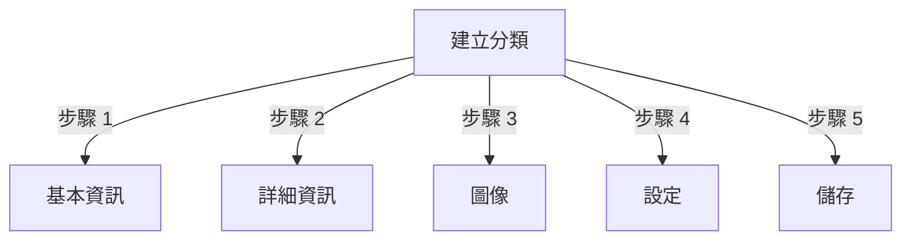

# 在Publisher中管理分類

> 在Publisher模組中建立、組織階層和管理分類的完整指南。

---

## 分類基礎

### 什麼是分類?

分類將文章組織成邏輯組:

```
範例結構:

  新聞 (主分類)
    ├── 科技
    ├── 運動
    └── 娛樂

  教學 (主分類)
    ├── 攝影
    │   ├── 基礎
    │   └── 進階
    └── 寫作
        └── 部落格
```

### 良好分類結構的好處

```
✓ 更好的使用者導航
✓ 組織內容
✓ 改善SEO
✓ 更簡單的內容管理
✓ 更好的編輯工作流程
```

---

## 存取分類管理

### 管理員面板導航

```
管理員面板
└── 模組
    └── Publisher
        └── 分類
            ├── 建立新分類
            ├── 編輯
            ├── 刪除
            ├── 權限
            └── 組織
```

### 快速存取

1. 以**管理員**身份登入
2. 前往**管理員 → 模組**
3. 按一下**Publisher → 管理員**
4. 按一下左選單中的**分類**

---

## 建立分類

### 分類建立表單



### 步驟 1: 基本資訊

#### 分類名稱

```
欄位: 分類名稱
類型: 文字輸入 (必需)
最大長度: 100 個字元
唯一性: 應該唯一
範例: "攝影"
```

**準則:**
- 描述性且單數或複數一致
- 適當大寫
- 避免特殊字符
- 保持合理的簡短

#### 分類說明

```
欄位: 說明
類型: 文字區域 (選用)
最大長度: 500 個字元
用於: 分類列表頁面、分類區塊
```

**目的:**
- 解釋分類內容
- 出現在分類文章上方
- 幫助使用者了解範圍
- 用於SEO中繼描述

**範例:**
```
"攝影提示、教學和靈感,適合所有技能水準。
從構圖基礎到進階打光技巧,精通你的工藝。"
```

### 步驟 2: 父分類

#### 建立階層

```
欄位: 父分類
類型: 下拉清單
選項: 無 (根目錄), 或現有分類
```

**階層範例:**

```
扁平結構:
  新聞
  教學
  評論

巢狀結構:
  新聞
    科技
    商業
    運動
  教學
    攝影
      基礎
      進階
    寫作
```

**建立子分類:**

1. 按一下**父分類**下拉清單
2. 選擇父分類 (例如: "新聞")
3. 填入分類名稱
4. 儲存
5. 新分類顯示為子項

### 步驟 3: 分類圖像

#### 上傳分類圖像

```
欄位: 分類圖像
類型: 圖像上傳 (選用)
格式: JPG, PNG, GIF, WebP
最大大小: 5 MB
建議: 300x200 像素 (或你的主題大小)
```

**上傳方式:**

1. 按一下**上傳圖像**按鈕
2. 從電腦選擇圖像
3. 裁剪/調整大小 (如果需要)
4. 按一下**使用此圖像**

**使用位置:**
- 分類列表頁面
- 分類區塊標題
- 麵包屑 (某些主題)
- 社交媒體分享

### 步驟 4: 分類設定

#### 顯示設定

```yaml
狀態:
  - 已啟用: 是/否
  - 隱藏: 是/否 (隱藏在選單中, 仍可通過URL存取)

顯示選項:
  - 顯示說明: 是/否
  - 顯示圖像: 是/否
  - 顯示文章計數: 是/否
  - 顯示子分類: 是/否

佈局:
  - 每頁項目: 10-50
  - 顯示順序: 日期/標題/作者
  - 顯示方向: 升序/降序
```

#### 分類權限

```yaml
誰可以檢視:
  - 匿名: 是/否
  - 已註冊: 是/否
  - 特定群組: 按群組設定

誰可以提交:
  - 已註冊: 是/否
  - 特定群組: 按群組設定
  - 作者必須擁有: "提交文章"權限
```

### 步驟 5: SEO設定

#### 中繼標籤

```
欄位: 中繼描述
類型: 文字 (160 個字元)
目的: 搜尋引擎描述

欄位: 中繼關鍵字
類型: 逗號分隔清單
範例: 攝影, 教學, 提示, 技巧
```

#### URL設定

```
欄位: URL Slug
類型: 文字
自動生成自分類名稱
範例: 從 "攝影" 產生 "photography"
可在儲存前自訂
```

### 儲存分類

1. 填入所有必需欄位:
   - 分類名稱 ✓
   - 說明 (建議)
2. 選用: 上傳圖像、設定SEO
3. 按一下**儲存分類**
4. 出現確認訊息
5. 分類現已可用

---

## 分類階層

### 建立巢狀結構

```
逐步範例: 建立新聞 → 科技子分類

1. 前往分類管理員
2. 按一下 "新增分類"
3. 名稱: "新聞"
4. 父分類: (留白 - 這是根目錄)
5. 儲存
6. 再次按一下 "新增分類"
7. 名稱: "科技"
8. 父分類: "新聞" (從下拉清單選擇)
9. 儲存
```

### 檢視階層樹

```
分類檢視顯示樹狀結構:

📁 新聞
  📄 科技
  📄 運動
  📄 娛樂
📁 教學
  📄 攝影
    📄 基礎
    📄 進階
  📄 寫作
```

按一下展開箭頭以顯示/隱藏子分類。

### 重新組織分類

#### 移動分類

1. 前往分類清單
2. 按一下分類上的**編輯**
3. 變更**父分類**
4. 按一下**儲存**
5. 分類移至新位置

#### 重新排序分類

如果可用，使用拖放:

1. 前往分類清單
2. 按一下並拖曳分類
3. 放在新位置
4. 順序自動儲存

#### 刪除分類

**選項 1: 軟刪除 (隱藏)**

1. 編輯分類
2. 設定**狀態**: 已停用
3. 按一下**儲存**
4. 分類隱藏但未刪除

**選項 2: 硬刪除**

1. 前往分類清單
2. 按一下分類上的**刪除**
3. 為文章選擇操作:
   ```
   ☐ 將文章移至父分類
   ☐ 將文章移至根目錄 (新聞)
   ☐ 刪除分類中的所有文章
   ```
4. 確認刪除

---

## 分類操作

### 編輯分類

1. 前往**管理員 → Publisher → 分類**
2. 按一下分類上的**編輯**
3. 修改欄位:
   - 名稱
   - 說明
   - 父分類
   - 圖像
   - 設定
4. 按一下**儲存**

### 編輯分類權限

1. 前往分類
2. 按一下分類上的**權限** (或按一下分類然後按一下 [權限])
3. 設定群組:

```
對於每個群組:
  ☐ 檢視此分類中的文章
  ☐ 向此分類提交文章
  ☐ 編輯自己的文章
  ☐ 編輯所有文章
  ☐ 批准/管制文章
  ☐ 管理分類
```

4. 按一下**儲存權限**

### 設定分類圖像

**上傳新圖像:**

1. 編輯分類
2. 按一下**變更圖像**
3. 上傳或選擇圖像
4. 裁剪/調整大小
5. 按一下**使用圖像**
6. 按一下**儲存分類**

**移除圖像:**

1. 編輯分類
2. 按一下**移除圖像** (如果可用)
3. 按一下**儲存分類**

---

## 分類權限

### 權限矩陣

```
                 匿名  已註冊  編輯者  管理員
檢視分類          ✓     ✓      ✓      ✓
提交文章          ✗     ✓      ✓      ✓
編輯自己的文章    ✗     ✓      ✓      ✓
編輯所有文章      ✗     ✗      ✓      ✓
管制文章          ✗     ✗      ✓      ✓
管理分類          ✗     ✗      ✗      ✓
```

### 設定分類級權限

#### 按分類存取控制

1. 前往**分類**清單
2. 選擇分類
3. 按一下**權限**
4. 對於每個群組，選擇權限:

```
範例: 新聞分類
  匿名: 僅檢視
  已註冊: 提交文章
  編輯者: 批准文章
  管理員: 完全控制
```

5. 按一下**儲存**

#### 欄位級權限

控制使用者可以看到/編輯哪些表單欄位:

```
範例: 限制已註冊使用者的欄位可見性

已註冊使用者可以看到/編輯:
  ✓ 標題
  ✓ 說明
  ✓ 內容
  ✗ 作者 (自動設定為目前使用者)
  ✗ 排程日期 (僅編輯者)
  ✗ 精選 (僅管理員)
```

**設定於:**
- 分類權限
- 尋找 "欄位可見性" 部分

---

## 分類最佳實踐

### 分類結構

```
✓ 保持階層 2-3 層深度
✗ 不要建立過多頂級分類
✗ 不要建立只有一篇文章的分類

✓ 使用一致的命名 (複數或單數)
✗ 不要使用模糊的名稱 ("東西", "其他")

✓ 為存在的文章建立分類
✗ 不要提前建立空分類
```

### 命名指南

```
好的名稱:
  "攝影"
  "網路開發"
  "旅遊提示"
  "商業新聞"

避免:
  "文章" (太模糊)
  "內容" (冗長)
  "新聞&更新" (不一致)
  "攝影相關" (格式)
```

### 組織提示

```
按主題:
  新聞
    科技
    運動
    娛樂

按類型:
  教學
    視頻
    文字
    互動

按受眾:
  初學者
  專家
  案例研究

地理:
  北美洲
    美國
    加拿大
  歐洲
```

---

## 分類區塊

### Publisher分類區塊

在你的網站上顯示分類列表:

1. 前往**管理員 → 區塊**
2. 尋找**Publisher - 分類**
3. 按一下**編輯**
4. 設定:

```
區塊標題: "新聞分類"
顯示子分類: 是/否
顯示文章計數: 是/否
高度: (像素或自動)
```

5. 按一下**儲存**

### 分類文章區塊

顯示特定分類的最新文章:

1. 前往**管理員 → 區塊**
2. 尋找**Publisher - 分類文章**
3. 按一下**編輯**
4. 選擇:

```
分類: 新聞 (或特定分類)
文章數: 5
顯示圖像: 是/否
顯示說明: 是/否
```

5. 按一下**儲存**

---

## 分類分析

### 檢視分類統計

從分類管理員:

```
每個分類顯示:
  - 總文章: 45
  - 已發佈: 42
  - 草稿: 2
  - 待批准: 1
  - 總檢視次數: 5,234
  - 最新文章: 2 小時前
```

### 檢視分類流量

如果啟用分析:

1. 按一下分類名稱
2. 按一下**統計**標籤
3. 檢視:
   - 頁面檢視
   - 熱門文章
   - 流量趨勢
   - 使用的搜尋詞

---

## 分類範本

### 自訂分類顯示

如果使用自訂範本，每個分類可以覆蓋:

```
publisher_category.tpl
  ├── 分類標題
  ├── 分類說明
  ├── 分類圖像
  ├── 文章列表
  └── 分頁
```

**自訂方式:**

1. 複製範本檔案
2. 修改HTML/CSS
3. 指派給管理員中的分類
4. 分類使用自訂範本

---

## 常見工作

### 建立新聞階層

```
管理員 → Publisher → 分類
1. 建立 "新聞" (父分類)
2. 建立 "科技" (父分類: 新聞)
3. 建立 "運動" (父分類: 新聞)
4. 建立 "娛樂" (父分類: 新聞)
```

### 在分類之間移動文章

1. 前往**文章**管理員
2. 選擇文章 (勾選框)
3. 從批量操作下拉清單選擇**"變更分類"**
4. 選擇新分類
5. 按一下**全部更新**

### 隱藏分類而不刪除

1. 編輯分類
2. 設定**狀態**: 已停用/隱藏
3. 儲存
4. 分類不顯示在選單中 (仍可通過URL存取)

### 為草稿建立分類

```
最佳實踐:

建立 "待審查" 分類
  ├── 目的: 等待批准的文章
  ├── 權限: 對公眾隱藏
  ├── 僅管理員/編輯者可以看到
  ├── 在批准前將文章移到此處
  └── 發佈時移至 "新聞"
```

---

## 匯入/匯出分類

### 匯出分類

如果可用:

1. 前往**分類**管理員
2. 按一下**匯出**
3. 選擇格式: CSV/JSON/XML
4. 下載檔案
5. 備份已儲存

### 匯入分類

如果可用:

1. 準備包含分類的檔案
2. 前往**分類**管理員
3. 按一下**匯入**
4. 上傳檔案
5. 選擇更新策略:
   - 僅建立新項
   - 更新現有項
   - 全部取代
6. 按一下**匯入**

---

## 分類故障排除

### 問題: 子分類不顯示

**解決方案:**
```
1. 驗證父分類狀態為 "已啟用"
2. 檢查權限允許檢視
3. 驗證子分類狀態為 "已啟用"
4. 清除快取: 管理員 → 工具 → 清除快取
5. 檢查主題是否顯示子分類
```

### 問題: 無法刪除分類

**解決方案:**
```
1. 分類必須沒有文章
2. 先移動或刪除文章:
   管理員 → 文章
   選擇分類中的文章
   將分類變更為另一個
3. 然後刪除空分類
4. 或在刪除時選擇 "移動文章" 選項
```

### 問題: 分類圖像不顯示

**解決方案:**
```
1. 驗證圖像上傳成功
2. 檢查圖像檔案格式 (JPG, PNG)
3. 驗證上傳目錄權限
4. 檢查主題是否顯示分類圖像
5. 嘗試重新上傳圖像
6. 清除瀏覽器快取
```

### 問題: 權限不生效

**解決方案:**
```
1. 檢查分類中的群組權限
2. 檢查全域Publisher權限
3. 檢查使用者屬於設定的群組
4. 清除工作階段快取
5. 登出後再登入
6. 檢查權限模組是否已安裝
```

---

## 分類最佳實踐檢查清單

在部署分類前:

- [ ] 階層深度 2-3 層
- [ ] 每個分類有 5+ 篇文章
- [ ] 分類名稱一致
- [ ] 權限合適
- [ ] 分類圖像已最佳化
- [ ] 說明完整
- [ ] SEO中繼資料已填入
- [ ] URL 友善
- [ ] 前端分類已測試
- [ ] 說明文件已更新

---

## 相關指南

- 文章建立
- 權限管理
- 模組設定
- 安裝指南

---

## 後續步驟

- 在分類中建立文章
- 設定權限
- 使用自訂範本自訂

---

#publisher #categories #organization #hierarchy #management #xoops
