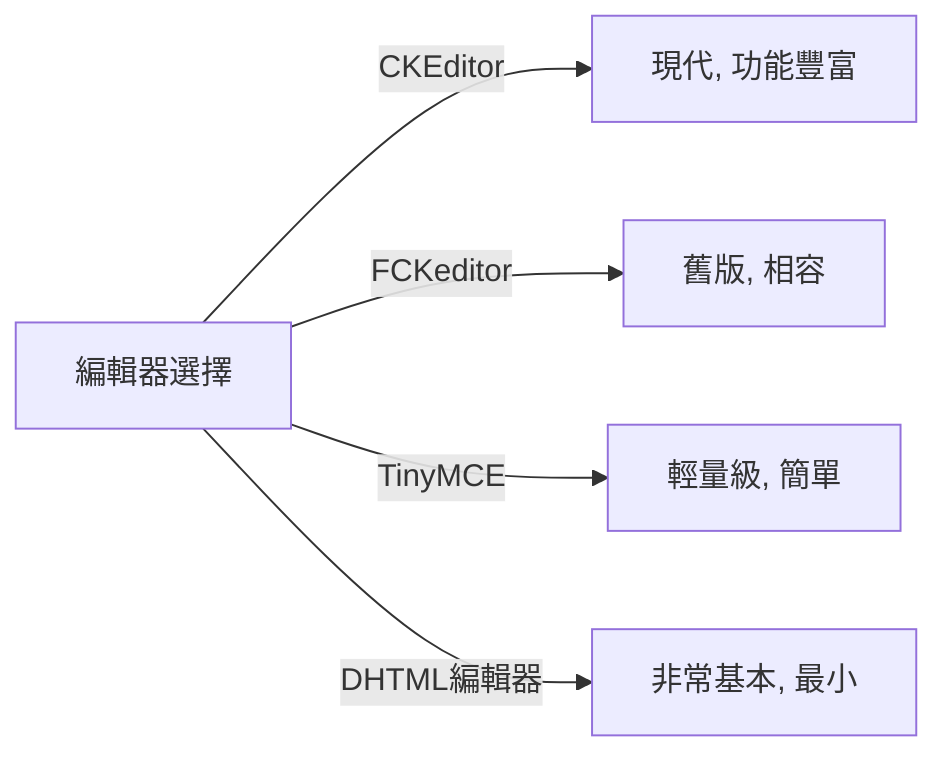
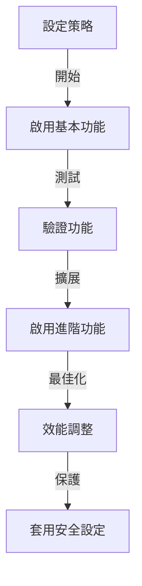

# Publisher基本設定

> 為您的XOOPS安裝設定Publisher模組設定、偏好設定和一般選項。

---

## 存取設定

### 管理員面板導航

```
XOOPS管理員面板
└── 模組
    └── Publisher
        ├── 偏好設定
        ├── 設定
        └── 設定
```

1. 以**管理員**身份登入
2. 前往**管理員面板 → 模組**
3. 尋找**Publisher**模組
4. 按一下**偏好設定**或**管理員**連結

---

## 一般設定

### 存取設定

```
管理員面板 → 模組 → Publisher
```

按一下**齒輪圖標**或**設定**以獲取這些選項:

#### 顯示選項

| 設定 | 選項 | 預設值 | 說明 |
|------|------|--------|------|
| **每頁項目** | 5-50 | 10 | 列表中顯示的文章 |
| **顯示麵包屑** | 是/否 | 是 | 導航軌跡顯示 |
| **使用分頁** | 是/否 | 是 | 分頁長清單 |
| **顯示日期** | 是/否 | 是 | 顯示文章日期 |
| **顯示分類** | 是/否 | 是 | 顯示文章分類 |
| **顯示作者** | 是/否 | 是 | 顯示文章作者 |
| **顯示檢視次數** | 是/否 | 是 | 顯示文章檢視計數 |

**範例設定:**

```yaml
每頁項目: 15
顯示麵包屑: 是
使用分頁: 是
顯示日期: 是
顯示分類: 是
顯示作者: 是
顯示檢視次數: 是
```

#### 作者選項

| 設定 | 預設值 | 說明 |
|------|--------|------|
| **顯示作者名稱** | 是 | 顯示真實名稱或使用者名稱 |
| **使用使用者名稱** | 否 | 顯示使用者名稱而不是名稱 |
| **顯示作者電子郵件** | 否 | 顯示作者聯絡電子郵件 |
| **顯示作者大頭貼** | 是 | 顯示使用者大頭貼 |

---

## 編輯器設定

### 選擇WYSIWYG編輯器

Publisher支援多個編輯器:

#### 可用編輯器



### CKEditor (推薦)

**最佳用途:** 大多數使用者, 現代瀏覽器, 完整功能

1. 前往**偏好設定**
2. 設定**編輯器**: CKEditor
3. 設定選項:

```
編輯器: CKEditor 4.x
工具欄: 完整
高度: 400px
寬度: 100%
移除外掛程式: []
新增外掛程式: [mathjax, codesnippet]
```

### FCKeditor

**最佳用途:** 相容性, 舊版系統

```
編輯器: FCKeditor
工具欄: 預設
自訂設定: (選用)
```

### TinyMCE

**最佳用途:** 最小佔用空間, 基本編輯

```
編輯器: TinyMCE
外掛程式: [paste, table, link, image]
工具欄: 最小
```

---

## 檔案與上傳設定

### 設定上傳目錄

```
管理員 → Publisher → 偏好設定 → 上傳設定
```

#### 檔案類型設定

```yaml
允許的檔案類型:
  圖像:
    - jpg
    - jpeg
    - gif
    - png
    - webp
  文件:
    - pdf
    - doc
    - docx
    - xls
    - xlsx
    - ppt
    - pptx
  存檔:
    - zip
    - rar
    - 7z
  媒體:
    - mp3
    - mp4
    - webm
    - mov
```

#### 檔案大小限制

| 檔案類型 | 最大大小 | 備註 |
|---------|---------|------|
| **圖像** | 5 MB | 每個圖像檔案 |
| **文件** | 10 MB | PDF, Office檔案 |
| **媒體** | 50 MB | 視頻/音訊檔案 |
| **所有檔案** | 100 MB | 每次上傳總計 |

**設定:**

```
最大圖像上傳大小: 5 MB
最大文件上傳大小: 10 MB
最大媒體上傳大小: 50 MB
總上傳大小: 100 MB
每篇文章最多檔案: 5
```

### 圖像調整大小

Publisher自動調整圖像以保持一致性:

```yaml
縮圖大小:
  寬度: 150
  高度: 150
  模式: 裁剪/調整

分類圖像大小:
  寬度: 300
  高度: 200
  模式: 調整

文章精選圖像:
  寬度: 600
  高度: 400
  模式: 調整
```

---

## 留言和互動設定

### 留言設定

```
偏好設定 → 留言部分
```

#### 留言選項

```yaml
允許留言:
  - 已啟用: 是/否
  - 預設: 是
  - 按文章覆蓋: 是

留言管制:
  - 管制留言: 是/否
  - 僅管制客訪留言: 是/否
  - 垃圾郵件過濾器: 已啟用
  - 每天最多留言: (無限)

留言顯示:
  - 顯示格式: 已序列/平面
  - 每頁留言: 10
  - 日期格式: 完整日期/時間前
  - 顯示留言計數: 是/否
```

### 評分設定

```yaml
允許評分:
  - 已啟用: 是/否
  - 預設: 是
  - 按文章覆蓋: 是

評分選項:
  - 評分等級: 5 星 (預設)
  - 允許使用者評分自己的: 否
  - 顯示平均評分: 是
  - 顯示評分計數: 是
```

---

## SEO和URL設定

### 搜尋引擎最佳化

```
偏好設定 → SEO設定
```

#### URL設定

```yaml
SEO URL:
  - 已啟用: 否 (設定為 "是" 以使用SEO URL)
  - URL重寫: 無/Apache mod_rewrite/IIS重寫

URL格式:
  - 分類: /category/news
  - 文章: /article/welcome-to-site
  - 存檔: /archive/2024/01

中繼描述:
  - 自動產生: 是
  - 最大長度: 160 個字元

中繼關鍵字:
  - 自動產生: 是
  - 來自: 文章標籤, 標題
```

### 啟用SEO URL (進階)

**前提條件:**
- Apache with `mod_rewrite` 已啟用
- `.htaccess` 支援已啟用

**設定步驟:**

1. 前往**偏好設定 → SEO設定**
2. 設定**SEO URL**: 是
3. 設定**URL重寫**: Apache mod_rewrite
4. 驗證 `.htaccess` 檔案存在於Publisher資料夾中

**.htaccess設定:**

```apache
<IfModule mod_rewrite.c>
    RewriteEngine On
    RewriteBase /modules/publisher/

    # Category rewrites
    RewriteRule ^category/([0-9]+)-(.*)\.html$ index.php?op=showcategory&categoryid=$1 [L,QSA]

    # Article rewrites
    RewriteRule ^article/([0-9]+)-(.*)\.html$ index.php?op=showitem&itemid=$1 [L,QSA]

    # Archive rewrites
    RewriteRule ^archive/([0-9]+)/([0-9]+)/$ index.php?op=archive&year=$1&month=$2 [L,QSA]
</IfModule>
```

---

## 快取和效能

### 快取設定

```
偏好設定 → 快取設定
```

```yaml
啟用快取:
  - 已啟用: 是
  - 快取類型: 檔案 (或 Memcache)

快取壽命:
  - 分類列表: 3600 秒 (1 小時)
  - 文章列表: 1800 秒 (30 分鐘)
  - 單篇文章: 7200 秒 (2 小時)
  - 最近文章區塊: 900 秒 (15 分鐘)

清除快取:
  - 手動清除: 在管理員中可用
  - 儲存文章時自動清除: 是
  - 分類變更時清除: 是
```

### 清除快取

**手動清除快取:**

1. 前往**管理員 → Publisher → 工具**
2. 按一下**清除快取**
3. 選擇要清除的快取類型:
   - [ ] 分類快取
   - [ ] 文章快取
   - [ ] 區塊快取
   - [ ] 全部快取
4. 按一下**清除已選擇**

**命令行:**

```bash
# Clear all Publisher cache
php /path/to/xoops/admin/cache_manage.php publisher

# Or directly delete cache files
rm -rf /path/to/xoops/var/cache/publisher/*
```

---

## 通知和工作流程

### 電子郵件通知

```
偏好設定 → 通知
```

```yaml
新文章時通知管理員:
  - 已啟用: 是
  - 收件者: 管理員電子郵件
  - 包括摘要: 是

通知版主:
  - 已啟用: 是
  - 新提交時: 是
  - 待批准文章時: 是

通知作者:
  - 批准時: 是
  - 拒絕時: 是
  - 留言時: 否 (選用)
```

### 提交工作流程

```yaml
需要批准:
  - 已啟用: 是
  - 編輯器批准: 是
  - 管理員批准: 否

草稿儲存:
  - 自動儲存間隔: 60 秒
  - 儲存本機版本: 是
  - 版本歷紀: 最後 5 版本
```

---

## 內容設定

### 發佈預設值

```
偏好設定 → 內容設定
```

```yaml
預設文章狀態:
  - 草稿/已發佈: 草稿
  - 預設精選: 否
  - 自動發佈時間: 無

預設可見性:
  - 公開/私人: 公開
  - 首頁顯示: 是
  - 分類中顯示: 是

排程發佈:
  - 已啟用: 是
  - 按文章允許: 是

內容過期:
  - 已啟用: 否
  - 自動存檔舊文章: 否
  - 存檔後天數: (無限)
```

### WYSIWYG內容選項

```yaml
允許HTML:
  - 在文章中: 是
  - 在留言中: 否

允許嵌入媒體:
  - 視頻 (iframe): 是
  - 圖像: 是
  - 外掛程式: 否

內容過濾:
  - 去除標籤: 否
  - XSS過濾器: 是 (建議)
```

---

## 搜尋引擎設定

### 設定搜尋整合

```
偏好設定 → 搜尋設定
```

```yaml
啟用文章索引:
  - 包括在網站搜尋中: 是
  - 索引類型: 全文/僅標題

搜尋選項:
  - 搜尋標題中: 是
  - 搜尋內容中: 是
  - 搜尋留言中: 是

中繼標籤:
  - 自動產生: 是
  - OG標籤 (社交): 是
  - Twitter卡片: 是
```

---

## 進階設定

### 偵錯模式 (僅開發)

```
偏好設定 → 進階
```

```yaml
偵錯模式:
  - 已啟用: 否 (僅用於開發!)

開發功能:
  - 顯示SQL查詢: 否
  - 記錄錯誤: 是
  - 錯誤電子郵件: admin@example.com
```

### 資料庫最佳化

```
管理員 → 工具 → 最佳化資料庫
```

```bash
# Manual optimization
mysql> OPTIMIZE TABLE publisher_items;
mysql> OPTIMIZE TABLE publisher_categories;
mysql> OPTIMIZE TABLE publisher_comments;
```

---

## 模組自訂

### 主題範本

```
偏好設定 → 顯示 → 範本
```

選擇範本集:
- 預設
- 經典
- 現代
- 深色
- 自訂

每個範本控制:
- 文章佈局
- 分類列表
- 存檔顯示
- 留言顯示

---

## 設定提示

### 最佳實踐



1. **從簡單開始** - 先啟用核心功能
2. **測試每項變更** - 繼續前驗證
3. **啟用快取** - 改善效能
4. **先備份** - 主要變更前匯出設定
5. **監視日誌** - 定期檢查錯誤日誌

### 效能最佳化

```yaml
為更好的效能:
  - 啟用快取: 是
  - 快取壽命: 3600 秒
  - 限制每頁項目: 10-15
  - 壓縮圖像: 是
  - 縮小CSS/JS: 是 (如果可用)
```

### 安全強化

```yaml
為更好的安全性:
  - 管制留言: 是
  - 在留言中停用HTML: 是
  - XSS過濾: 是
  - 檔案類型白名單: 嚴格
  - 最大上傳大小: 合理限制
```

---

## 匯出/匯入設定

### 備份設定

```
管理員 → 工具 → 匯出設定
```

**備份目前設定:**

1. 按一下**匯出設定**
2. 儲存下載的 `.cfg` 檔案
3. 儲存在安全位置

**復原:**

1. 按一下**匯入設定**
2. 選擇 `.cfg` 檔案
3. 按一下**復原**

---

## 相關設定指南

- 分類管理
- 文章建立
- 權限設定
- 安裝指南

---

## 設定故障排除

### 設定無法儲存

**解決方案:**
1. 檢查 `/var/config/` 上的目錄權限
2. 驗證PHP寫入存取
3. 檢查PHP錯誤日誌尋找問題
4. 清除瀏覽器快取並再試

### 編輯器不出現

**解決方案:**
1. 驗證編輯器外掛程式已安裝
2. 檢查XOOPS編輯器設定
3. 嘗試不同的編輯器選項
4. 檢查瀏覽器主控台尋找JavaScript錯誤

### 效能問題

**解決方案:**
1. 啟用快取
2. 減少每頁項目
3. 壓縮圖像
4. 檢查資料庫最佳化
5. 檢視緩慢查詢日誌

---

## 後續步驟

- 設定群組權限
- 建立你的第一篇文章
- 設定分類
- 檢視自訂範本

---

#publisher #configuration #preferences #settings #xoops
