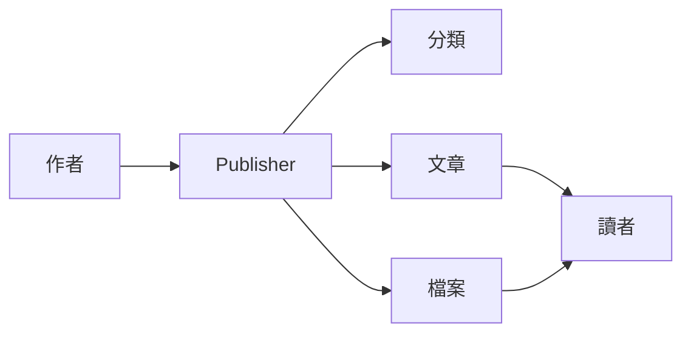
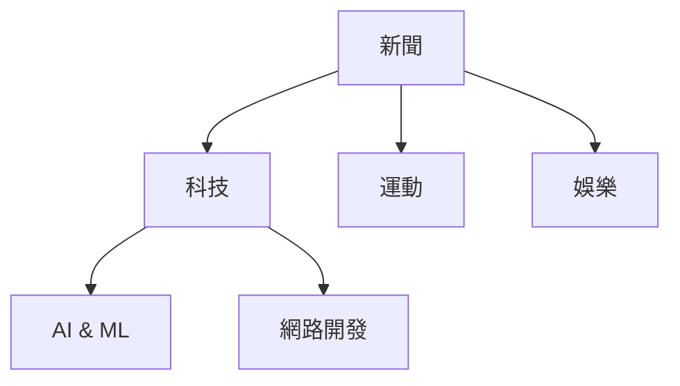
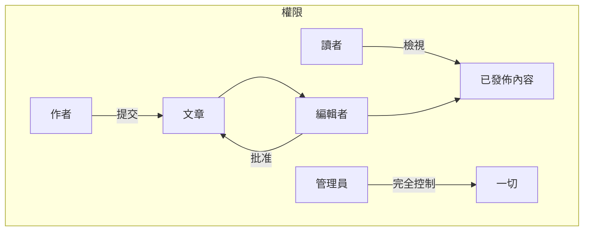
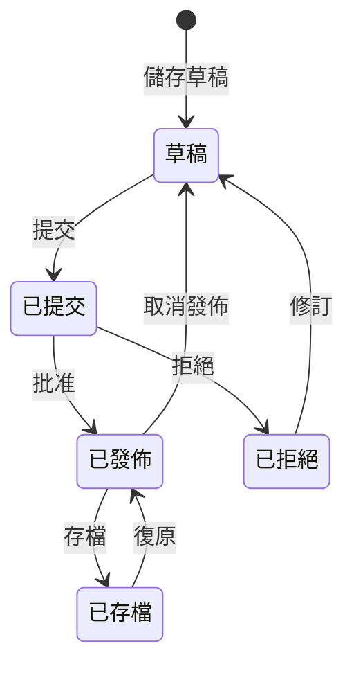

# Publisher快速開始

> 設定和使用Publisher新聞/部落格模組的逐步指南。

---

## 什麼是Publisher?

Publisher是XOOPS的首選內容管理模組，設計用於:

- **新聞網站** - 發佈帶有分類的文章
- **部落格** - 個人或多作者部落格
- **文件** - 組織化的知識庫
- **內容入口** - 混合媒體內容



---

## 快速設定

### 步驟 1: 安裝Publisher

1. 從 [GitHub](https://github.com/XoopsModules25x/publisher) 下載
2. 上傳至 `modules/publisher/`
3. 前往管理員 → 模組 → 安裝

### 步驟 2: 建立分類



1. 管理員 → Publisher → 分類
2. 按一下 "新增分類"
3. 填入:
   - **名稱**: 分類名稱
   - **說明**: 此分類包含的內容
   - **圖像**: 選用分類圖像
4. 設定權限 (誰可以提交/檢視)
5. 儲存

### 步驟 3: 設定設定

1. 管理員 → Publisher → 偏好設定
2. 要設定的關鍵設定:

| 設定 | 建議 | 說明 |
|------|------|------|
| 每頁項目 | 10-20 | 索引上的文章 |
| 編輯器 | TinyMCE/CKEditor | 富文字編輯器 |
| 允許評分 | 是 | 讀者反饋 |
| 允許留言 | 是 | 討論 |
| 自動批准 | 否 | 編輯控制 |

### 步驟 4: 建立你的第一篇文章

1. 主選單 → Publisher → 提交文章
2. 填入表單:
   - **標題**: 文章標題
   - **分類**: 所屬位置
   - **摘要**: 簡短說明
   - **內容**: 完整文章內容
3. 新增選用元素:
   - 精選圖像
   - 檔案附件
   - SEO設定
4. 提交審查或發佈

---

## 使用者角色



### 讀者
- 檢視已發佈的文章
- 評分和留言
- 搜尋內容

### 作者
- 提交新文章
- 編輯自己的文章
- 附加檔案

### 編輯者
- 批准/拒絕提交
- 編輯任何文章
- 管理分類

### 管理員
- 完整模組控制
- 設定設定
- 管理權限

---

## 撰寫文章

### 文章編輯器

```
┌─────────────────────────────────────────────────────┐
│ 標題: [你的文章標題                                  │
├─────────────────────────────────────────────────────┤
│ 分類: [選擇分類                    ▼]              │
├─────────────────────────────────────────────────────┤
│ 摘要:                                              │
│ ┌─────────────────────────────────────────────────┐ │
│ │ 列表中顯示的簡短說明...                          │ │
│ └─────────────────────────────────────────────────┘ │
├─────────────────────────────────────────────────────┤
│ 內容:                                              │
│ ┌─────────────────────────────────────────────────┐ │
│ │ [B] [I] [U] [連結] [圖像] [程式碼]                │ │
│ ├─────────────────────────────────────────────────┤ │
│ │                                                  │ │
│ │ 完整文章內容放在這裡...                           │ │
│ │                                                  │ │
│ └─────────────────────────────────────────────────┘ │
├─────────────────────────────────────────────────────┤
│ [提交] [預覽] [儲存草稿]                           │
└─────────────────────────────────────────────────────┘
```

### 最佳實踐

1. **引人入勝的標題** - 清楚, 吸引人的標題
2. **好的摘要** - 吸引讀者點擊
3. **結構化內容** - 使用標題、列表、圖像
4. **適當分類** - 幫助讀者找到內容
5. **SEO最佳化** - 標題和內容中的關鍵字

---

## 管理內容

### 文章狀態流



### 狀態說明

| 狀態 | 說明 |
|------|------|
| 草稿 | 進行中的工作 |
| 已提交 | 等待審查 |
| 已發佈 | 在網站上線 |
| 已過期 | 超過過期日期 |
| 已拒絕 | 需要修訂 |
| 已存檔 | 從列表中移除 |

---

## 導航

### 存取Publisher

- **主選單** → Publisher
- **直接URL**: `yoursite.com/modules/publisher/`

### 關鍵頁面

| 頁面 | URL | 目的 |
|------|-----|------|
| 索引 | `/modules/publisher/` | 文章列表 |
| 分類 | `/modules/publisher/category.php?id=X` | 分類文章 |
| 文章 | `/modules/publisher/item.php?itemid=X` | 單篇文章 |
| 提交 | `/modules/publisher/submit.php` | 新文章 |
| 搜尋 | `/modules/publisher/search.php` | 尋找文章 |

---

## 區塊

Publisher為你的網站提供多個區塊:

### 最近文章
顯示最新發佈的文章

### 分類選單
按分類導航

### 熱門文章
最多瀏覽的內容

### 隨機文章
展示隨機內容

### 焦點
精選文章

---

## 相關文件

- 建立和編輯文章
- 管理分類
- 擴展Publisher

---

#xoops #publisher #user-guide #getting-started #cms
