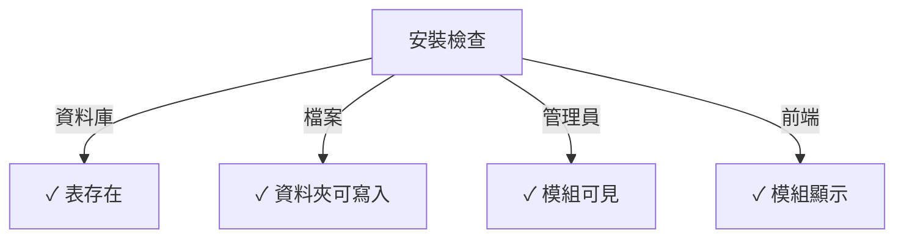

# Publisher安裝指南

> 為XOOPS CMS安裝和設定Publisher模組的完整說明。

---

## 系統要求

### 最低要求

| 要求 | 版本 | 備註 |
|------|------|------|
| XOOPS | 2.5.10+ | 核心CMS平臺 |
| PHP | 7.1+ | 建議PHP 8.x |
| MySQL | 5.7+ | 資料庫伺服器 |
| 網路伺服器 | Apache/Nginx | 具有重寫支援 |

### PHP擴充

```
- PDO (PHP Data Objects)
- pdo_mysql or mysqli
- mb_string (多位元組字串)
- curl (外部內容)
- json
- gd (圖像處理)
```

### 磁碟空間

- **模組檔案**: ~5 MB
- **快取目錄**: 建議50+ MB
- **上傳目錄**: 根據內容需要

---

## 安裝前檢查清單

在安裝Publisher之前，驗證:

- [ ] XOOPS核心已安裝並執行
- [ ] 管理員帳戶具有模組管理權限
- [ ] 資料庫備份已建立
- [ ] 檔案權限允許寫入 `/modules/` 目錄
- [ ] PHP記憶體限制至少128 MB
- [ ] 檔案上傳大小限制適當 (最少10 MB)

---

## 安裝步驟

### 步驟 1: 下載Publisher

#### 選項 A: 從GitHub (推薦)

```bash
# Navigate to modules directory
cd /path/to/xoops/htdocs/modules/

# Clone the repository
git clone https://github.com/XoopsModules25x/publisher.git

# Verify download
ls -la publisher/
```

#### 選項 B: 手動下載

1. 訪問 [GitHub Publisher版本](https://github.com/XoopsModules25x/publisher/releases)
2. 下載最新的 `.zip` 檔案
3. 解壓至 `modules/publisher/`

### 步驟 2: 設定檔案權限

```bash
# Set proper ownership
chown -R www-data:www-data /path/to/xoops/htdocs/modules/publisher

# Set directory permissions (755)
find publisher -type d -exec chmod 755 {} \;

# Set file permissions (644)
find publisher -type f -exec chmod 644 {} \;

# Make scripts executable
chmod 755 publisher/admin/index.php
chmod 755 publisher/index.php
```

### 步驟 3: 通過XOOPS管理員安裝

1. 以管理員身份登入 **XOOPS管理員面板**
2. 導航至 **系統 → 模組**
3. 按一下**安裝模組**
4. 在清單中尋找**Publisher**
5. 按一下**安裝**按鈕
6. 等待安裝完成 (顯示已建立資料庫表)

```
安裝進度:
✓ 表已建立
✓ 設定已初始化
✓ 權限已設定
✓ 快取已清除
安裝完成!
```

---

## 初始設定

### 步驟 1: 存取Publisher管理員

1. 前往 **管理員面板 → 模組**
2. 尋找 **Publisher** 模組
3. 按一下 **管理員** 連結
4. 你現在進入Publisher管理

### 步驟 2: 設定模組偏好設定

1. 按一下左選單中的 **偏好設定**
2. 設定基本設定:

```
一般設定:
- 編輯器: 選擇你的WYSIWYG編輯器
- 每頁項目: 10
- 顯示麵包屑: 是
- 允許留言: 是
- 允許評分: 是

SEO設定:
- SEO URL: 否 (稍後需要時啟用)
- URL重寫: 無

上傳設定:
- 最大上傳大小: 5 MB
- 允許的檔案類型: jpg, png, gif, pdf, doc, docx
```

3. 按一下**儲存設定**

### 步驟 3: 建立第一個分類

1. 按一下左選單中的 **分類**
2. 按一下**新增分類**
3. 填入表單:

```
分類名稱: 新聞
說明: 最新新聞和更新
圖像: (選用) 上傳分類圖像
父分類: (留白為頂級)
狀態: 已啟用
```

4. 按一下**儲存分類**

### 步驟 4: 驗證安裝

檢查這些指示:



#### 資料庫檢查

```bash
mysql -u xoops_user -p xoops_database
mysql> SHOW TABLES LIKE 'publisher%';

# Should show tables:
# - publisher_categories
# - publisher_items
# - publisher_comments
# - publisher_files
```

#### 前端檢查

1. 訪問你的XOOPS首頁
2. 尋找**Publisher**或**新聞**區塊
3. 應該顯示最近的文章

---

## 安裝後設定

### 編輯器選擇

Publisher支援多個WYSIWYG編輯器:

| 編輯器 | 優點 | 缺點 |
|--------|------|------|
| FCKeditor | 功能豐富 | 舊版, 較大 |
| CKEditor | 現代標準 | 設定複雜 |
| TinyMCE | 輕量級 | 功能有限 |
| DHTML編輯器 | 基本 | 非常基本 |

**更改編輯器:**

1. 前往**偏好設定**
2. 滾動到**編輯器**設定
3. 從下拉清單選擇
4. 儲存並測試

### 上傳目錄設定

```bash
# Create upload directories
mkdir -p /path/to/xoops/uploads/publisher/
mkdir -p /path/to/xoops/uploads/publisher/categories/
mkdir -p /path/to/xoops/uploads/publisher/images/
mkdir -p /path/to/xoops/uploads/publisher/files/

# Set permissions
chmod 755 /path/to/xoops/uploads/publisher/
chmod 755 /path/to/xoops/uploads/publisher/*
```

### 設定圖像大小

在偏好設定中，設定縮圖大小:

```
分類圖像大小: 300 x 200 像素
文章圖像大小: 600 x 400 像素
縮圖大小: 150 x 100 像素
```

---

## 安裝後步驟

### 1. 設定群組權限

1. 前往管理選單中的 **權限**
2. 為群組設定存取:
   - 匿名: 僅檢視
   - 已註冊使用者: 提交文章
   - 編輯者: 批准/編輯文章
   - 管理員: 完全存取

### 2. 設定模組可見性

1. 前往XOOPS管理員中的 **區塊**
2. 尋找Publisher區塊:
   - Publisher - 最新文章
   - Publisher - 分類
   - Publisher - 存檔
3. 按頁面設定區塊可見性

### 3. 匯入測試內容 (選用)

為了測試，匯入範例文章:

1. 前往 **Publisher管理員 → 匯入**
2. 選擇 **範例內容**
3. 按一下 **匯入**

### 4. 啟用SEO URL (選用)

針對搜尋友善的URL:

1. 前往**偏好設定**
2. 設定**SEO URL**: 是
3. 啟用 **.htaccess** 重寫
4. 驗證 `.htaccess` 檔案存在於Publisher資料夾中

```apache
# .htaccess example
<IfModule mod_rewrite.c>
    RewriteEngine On
    RewriteBase /modules/publisher/
    RewriteRule ^category/([0-9]+)-(.*)\.html$ index.php?op=showcategory&categoryid=$1 [L]
    RewriteRule ^article/([0-9]+)-(.*)\.html$ index.php?op=showitem&itemid=$1 [L]
</IfModule>
```

---

## 安裝故障排除

### 問題: 模組不出現在管理員中

**解決方案:**
```bash
# Check file permissions
ls -la /path/to/xoops/modules/publisher/

# Check xoops_version.php exists
ls /path/to/xoops/modules/publisher/xoops_version.php

# Verify PHP syntax
php -l /path/to/xoops/modules/publisher/xoops_version.php
```

### 問題: 資料庫表未建立

**解決方案:**
1. 檢查MySQL使用者是否有CREATE TABLE特權
2. 檢查資料庫錯誤日誌:
   ```bash
   mysql> SHOW WARNINGS;
   ```
3. 手動匯入SQL:
   ```bash
   mysql -u user -p database < modules/publisher/sql/mysql.sql
   ```

### 問題: 檔案上傳失敗

**解決方案:**
```bash
# Check directory exists and is writable
stat /path/to/xoops/uploads/publisher/

# Fix permissions
chmod 777 /path/to/xoops/uploads/publisher/

# Verify PHP settings
php -i | grep upload_max_filesize
```

### 問題: "找不到頁面" 錯誤

**解決方案:**
1. 檢查 `.htaccess` 檔案是否存在
2. 驗證Apache `mod_rewrite` 已啟用:
   ```bash
   a2enmod rewrite
   systemctl restart apache2
   ```
3. 檢查Apache設定中的 `AllowOverride All`

---

## 從舊版本升級

### 從Publisher 1.x至2.x

1. **備份目前安裝:**
   ```bash
   cp -r modules/publisher/ modules/publisher-backup/
   mysqldump -u user -p database > publisher-backup.sql
   ```

2. **下載Publisher 2.x**

3. **覆蓋檔案:**
   ```bash
   rm -rf modules/publisher/
   unzip publisher-2.0.zip -d modules/
   ```

4. **執行更新:**
   - 前往 **管理員 → Publisher → 更新**
   - 按一下 **更新資料庫**
   - 等待完成

5. **驗證:**
   - 檢查所有文章正確顯示
   - 驗證權限完整
   - 測試檔案上傳

---

## 安全考慮事項

### 檔案權限

```
- 核心檔案: 644 (網路伺服器可讀)
- 目錄: 755 (網路伺服器可瀏覽)
- 上傳目錄: 755 或 777
- 設定檔: 600 (網路無法讀取)
```

### 停用對敏感檔案的直接存取

在上傳目錄中建立 `.htaccess`:

```apache
<FilesMatch "\.(php|phtml|php3|php4|php5|phtml)$">
    Deny from all
</FilesMatch>
```

### 資料庫安全

```bash
# Use strong password
ALTER USER 'publisher_user'@'localhost' IDENTIFIED BY 'strong_password_here';

# Grant minimal permissions
GRANT SELECT, INSERT, UPDATE, DELETE ON publisher_db.* TO 'publisher_user'@'localhost';
FLUSH PRIVILEGES;
```

---

## 驗證檢查清單

安裝後，驗證:

- [ ] 模組出現在管理員模組清單中
- [ ] 可以存取Publisher管理部分
- [ ] 可以建立分類
- [ ] 可以建立文章
- [ ] 文章在前端顯示
- [ ] 檔案上傳有效
- [ ] 圖像正確顯示
- [ ] 權限正確套用
- [ ] 資料庫表已建立
- [ ] 快取目錄可寫入

---

## 後續步驟

成功安裝後:

1. 讀取基本設定指南
2. 建立你的第一篇文章
3. 設定群組權限
4. 檢視分類管理

---

## 支援和資源

- **GitHub問題**: [Publisher問題](https://github.com/XoopsModules25x/publisher/issues)
- **XOOPS論壇**: [社群支援](https://www.xoops.org/modules/newbb/)
- **GitHub Wiki**: [安裝幫助](https://github.com/XoopsModules25x/publisher/wiki)

---

#publisher #installation #setup #xoops #module #configuration
