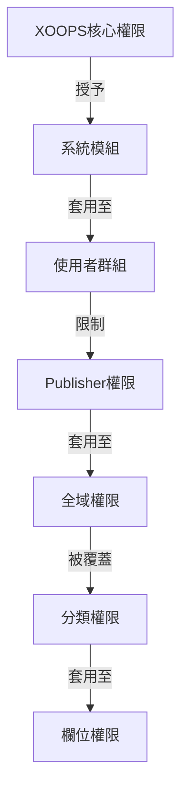

# Publisher權限設定

> 在Publisher中設定群組權限、存取控制和管理使用者存取的完整指南。

---

## 權限基礎

### 什麼是權限?

權限控制不同使用者群組在Publisher中可以做什麼:

```
誰可以:
  - 檢視文章
  - 提交文章
  - 編輯文章
  - 批准文章
  - 管理分類
  - 設定設定
```

### 權限級別

```
匿名
  └── 僅檢視已發佈的文章

已註冊使用者
  ├── 檢視文章
  ├── 提交文章 (待批准)
  └── 編輯自己的文章

編輯者/版主
  ├── 所有已註冊權限
  ├── 批准文章
  ├── 編輯所有文章
  └── 管理某些分類

管理員
  └── 完全存取一切
```

---

## 存取權限管理

### 導航至權限

```
管理員面板
└── 模組
    └── Publisher
        ├── 權限
        ├── 分類權限
        └── 群組管理
```

### 快速存取

1. 以**管理員**身份登入
2. 前往 **管理員 → 模組**
3. 按一下 **Publisher → 管理員**
4. 按一下左選單中的 **權限**

---

## 全域權限

### 模組級權限

控制對Publisher模組和功能的存取:

```
權限設定檢視:
┌─────────────────────────────────────┐
│ 權限             │ 匿名 │ 已註冊 │ 編輯者 │ 管理員 │
├────────────────────────┼──────┼─────┼────────┼───────┤
│ 檢視文章          │  ✓   │  ✓  │   ✓    │  ✓   │
│ 提交文章        │  ✗   │  ✓  │   ✓    │  ✓   │
│ 編輯自己的文章      │  ✗   │  ✓  │   ✓    │  ✓   │
│ 編輯所有文章      │  ✗   │  ✗  │   ✓    │  ✓   │
│ 批准文章       │  ✗   │  ✗  │   ✓    │  ✓   │
│ 管理分類      │  ✗   │  ✗  │   ✗    │  ✓   │
│ 存取管理員面板     │  ✗   │  ✗  │   ✓    │  ✓   │
└─────────────────────────────────────┘
```

### 權限說明

| 權限 | 使用者 | 效果 |
|------|--------|------|
| **檢視文章** | 所有群組 | 可以在前端看到已發佈的文章 |
| **提交文章** | 已註冊+ | 可以建立新文章 (待批准) |
| **編輯自己的文章** | 已註冊+ | 可以編輯/刪除自己的文章 |
| **編輯所有文章** | 編輯者+ | 可以編輯任何使用者的文章 |
| **刪除自己的文章** | 已註冊+ | 可以刪除自己的未發佈文章 |
| **刪除所有文章** | 編輯者+ | 可以刪除任何文章 |
| **批准文章** | 編輯者+ | 可以發佈待批准的文章 |
| **管理分類** | 管理員 | 建立、編輯、刪除分類 |
| **管理員存取** | 編輯者+ | 存取管理員介面 |

---

## 設定全域權限

### 步驟 1: 存取權限設定

1. 前往 **管理員 → 模組**
2. 尋找 **Publisher**
3. 按一下 **權限** (或管理員連結然後權限)
4. 你看到權限矩陣

### 步驟 2: 設定群組權限

對於每個群組，設定他們可以做什麼:

#### 匿名使用者

```yaml
匿名群組權限:
  檢視文章: ✓ 是
  提交文章: ✗ 否
  編輯文章: ✗ 否
  刪除文章: ✗ 否
  批准文章: ✗ 否
  管理分類: ✗ 否
  管理員存取: ✗ 否

結果: 匿名使用者只能檢視已發佈內容
```

#### 已註冊使用者

```yaml
已註冊群組權限:
  檢視文章: ✓ 是
  提交文章: ✓ 是 (需要批准)
  編輯自己的文章: ✓ 是
  編輯所有文章: ✗ 否
  刪除自己的文章: ✓ 是 (僅草稿)
  刪除所有文章: ✗ 否
  批准文章: ✗ 否
  管理分類: ✗ 否
  管理員存取: ✗ 否

結果: 已註冊使用者可以在批准後貢獻內容
```

#### 編輯者群組

```yaml
編輯者群組權限:
  檢視文章: ✓ 是
  提交文章: ✓ 是
  編輯自己的文章: ✓ 是
  編輯所有文章: ✓ 是
  刪除自己的文章: ✓ 是
  刪除所有文章: ✓ 是
  批准文章: ✓ 是
  管理分類: ✓ 有限
  管理員存取: ✓ 是
  設定設定: ✗ 否

結果: 編輯者管理內容但不設定設定
```

#### 管理員

```yaml
管理員群組權限:
  ✓ 完全存取所有功能

  - 所有編輯者權限
  - 管理所有分類
  - 設定所有設定
  - 管理權限
  - 安裝/卸載
```

### 步驟 3: 儲存權限

1. 設定每個群組的權限
2. 對於允許的操作勾選方塊
3. 對於拒絕的操作取消勾選
4. 按一下 **儲存權限**
5. 出現確認訊息

---

## 分類級權限

### 設定分類存取

控制誰可以檢視/提交到特定分類:

```
管理員 → Publisher → 分類
→ 選擇分類 → 權限
```

### 分類權限矩陣

```
                 匿名  已註冊  編輯者  管理員
檢視分類          ✓     ✓      ✓      ✓
提交到分類        ✗     ✓      ✓      ✓
編輯自己的        ✗     ✓      ✓      ✓
編輯全部的        ✗     ✗      ✓      ✓
批准在分類中      ✗     ✗      ✓      ✓
管理分類          ✗     ✗      ✗      ✓
```

### 設定分類權限

1. 前往 **分類** 管理員
2. 尋找分類
3. 按一下 **權限** 按鈕
4. 對於每個群組，選擇:
   - [ ] 檢視此分類
   - [ ] 提交文章
   - [ ] 編輯自己的文章
   - [ ] 編輯所有文章
   - [ ] 批准文章
   - [ ] 管理分類
5. 按一下 **儲存**

### 分類權限範例

#### 公開新聞分類

```
匿名: 僅檢視
已註冊: 檢視 + 提交 (待批准)
編輯者: 批准 + 編輯
管理員: 完全控制
```

#### 內部更新分類

```
匿名: 無存取
已註冊: 僅檢視
編輯者: 提交 + 批准
管理員: 完全控制
```

#### 客訪部落格分類

```
匿名: 僅檢視
已註冊: 提交 (待批准)
編輯者: 批准
管理員: 完全控制
```

---

## 欄位級權限

### 控制表單欄位可見性

限制使用者可以看到/編輯哪些表單欄位:

```
管理員 → Publisher → 權限 → 欄位
```

### 欄位選項

```yaml
已註冊使用者的可見欄位:
  ✓ 標題
  ✓ 說明
  ✓ 內容 (主體)
  ✓ 精選圖像
  ✓ 分類
  ✓ 標籤
  ✗ 作者 (自動設定)
  ✗ 發佈日期 (僅編輯者)
  ✗ 排程日期 (僅編輯者)
  ✗ 精選旗標 (僅編輯者)
  ✗ 權限 (僅管理員)
```

### 範例

#### 已註冊的有限提交

已註冊使用者看到較少的選項:

```
可用欄位:
  - 標題 ✓
  - 說明 ✓
  - 內容 ✓
  - 精選圖像 ✓
  - 分類 ✓

隱藏欄位:
  - 作者 (自動目前使用者)
  - 發佈日期 (編輯者決定)
  - 排程日期 (僅管理員)
  - 精選狀態 (編輯者選擇)
```

#### 編輯者的完整表單

編輯者看到所有選項:

```
可用欄位:
  - 所有基本欄位
  - 所有中繼資料
  - 作者選擇 ✓
  - 發佈日期/時間 ✓
  - 排程日期 ✓
  - 精選狀態 ✓
  - 過期日期 ✓
  - 權限 ✓
```

---

## 使用者群組設定

### 建立自訂群組

1. 前往 **管理員 → 使用者 → 群組**
2. 按一下 **建立群組**
3. 輸入群組詳細資訊:

```
群組名稱: "社群部落客"
群組說明: "貢獻部落格內容的使用者"
類型: 常規群組
```

4. 按一下 **儲存群組**
5. 返回Publisher權限
6. 為新群組設定權限

### 群組範例

```
建議Publisher群組:

群組: 貢獻者
  - 提交文章的普通成員
  - 可以編輯自己的文章
  - 無法批准文章

群組: 審查者
  - 可以看到已提交的文章
  - 可以批准/拒絕文章
  - 無法刪除他人的文章

群組: 編輯者
  - 可以編輯任何文章
  - 可以批准文章
  - 可以管制留言
  - 可以管理某些分類

群組: 發行者
  - 可以編輯任何文章
  - 可以直接發佈 (無批准)
  - 可以管理所有分類
  - 可以設定設定
```

---

## 權限階層

### 權限流



### 權限繼承

```
基礎: 全域模組權限
  ↓
分類: 特定分類的覆蓋
  ↓
欄位: 進一步限制可用欄位
  ↓
使用者: 如果所有級別允許則有權限
```

**範例:**

```
使用者想要編輯文章:
1. 使用者群組必須有 "編輯文章" 權限 (全域)
2. 分類必須允許編輯 (分類級)
3. 欄位限制必須允許 (如果適用)
4. 使用者必須是作者或編輯者 (自己的 vs 全部)

如果任何級別拒絕 → 權限被拒絕
```

---

## 批准工作流程權限

### 設定提交批准

控制文章是否需要批准:

```
管理員 → Publisher → 偏好設定 → 工作流程
```

#### 批准選項

```yaml
提交工作流程:
  需要批准: 是

  對已註冊使用者:
    - 新文章: 草稿 (待批准)
    - 編輯者必須批准
    - 使用者可以在待批准時編輯
    - 批准後: 使用者仍可編輯

  對編輯者:
    - 新文章: 直接發佈 (選用)
    - 跳過批准佇列
    - 或始終需要批准
```

#### 按群組設定

1. 前往偏好設定
2. 尋找 "提交工作流程"
3. 對於每個群組，設定:

```
群組: 已註冊使用者
  需要批准: ✓ 是
  預設狀態: 草稿
  可以在待批准時修改: ✓ 是

群組: 編輯者
  需要批准: ✗ 否
  預設狀態: 已發佈
  可以修改已發佈: ✓ 是
```

4. 按一下 **儲存**

---

## 管制文章

### 批准待批准的文章

對於有 "批准文章" 權限的使用者:

1. 前往 **管理員 → Publisher → 文章**
2. 按 **狀態** 篩選: 待批准
3. 按一下文章進行審查
4. 檢查內容品質
5. 設定 **狀態**: 已發佈
6. 選用: 新增編輯註解
7. 按一下 **儲存**

### 拒絕文章

如果文章不符合標準:

1. 開啟文章
2. 設定 **狀態**: 草稿
3. 新增拒絕理由 (在留言或電子郵件中)
4. 按一下 **儲存**
5. 向作者傳送訊息解釋拒絕

### 管制留言

如果管制留言:

1. 前往 **管理員 → Publisher → 留言**
2. 按 **狀態** 篩選: 待批准
3. 檢查留言
4. 選項:
   - 批准: 按一下 **批准**
   - 拒絕: 按一下 **刪除**
   - 編輯: 按一下 **編輯**, 修正, 儲存
5. 按一下 **儲存**

---

## 管理使用者存取

### 檢視使用者群組

看到哪些使用者屬於群組:

```
管理員 → 使用者 → 使用者群組

對於每個使用者:
  - 主群組 (一個)
  - 次要群組 (多個)

權限來自所有群組 (聯集)
```

### 將使用者新增至群組

1. 前往 **管理員 → 使用者**
2. 尋找使用者
3. 按一下 **編輯**
4. 在 **群組** 下，勾選要新增的群組
5. 按一下 **儲存**

### 變更使用者權限

對於個別使用者 (如果支援):

1. 前往使用者管理員
2. 尋找使用者
3. 按一下 **編輯**
4. 尋找個別權限覆蓋
5. 根據需要設定
6. 按一下 **儲存**

---

## 常見權限場景

### 場景 1: 開放部落格

允許任何人提交:

```
匿名: 檢視
已註冊: 提交, 編輯自己的, 刪除自己的
編輯者: 批准, 編輯全部, 刪除全部
管理員: 完全控制

結果: 開放社群部落格
```

### 場景 2: 受管制的新聞網站

嚴格的批准流程:

```
匿名: 僅檢視
已註冊: 無法提交
編輯者: 提交, 批准他人的
管理員: 完全控制

結果: 僅批准的專業人員發佈
```

### 場景 3: 員工部落格

員工可以貢獻:

```
建立群組: "員工"
匿名: 檢視
已註冊: 僅檢視 (非員工)
員工: 提交, 編輯自己的, 直接發佈
管理員: 完全控制

結果: 員工編寫的部落格
```

### 場景 4: 具有不同編輯者的多分類

不同編輯者針對不同分類:

```
新聞分類:
  編輯者群組 A: 完全控制

評論分類:
  編輯者群組 B: 完全控制

教學分類:
  編輯者群組 C: 完全控制

結果: 去中心化編輯控制
```

---

## 權限測試

### 驗證權限有效

1. 在每個群組中建立測試使用者
2. 以每個測試使用者身份登入
3. 嘗試:
   - 檢視文章
   - 提交文章 (應該建立草稿 (如果允許)
   - 編輯文章 (自己的和他人的)
   - 刪除文章
   - 存取管理員面板
   - 存取分類

4. 驗證結果符合預期權限

### 常見測試案例

```
測試案例 1: 匿名使用者
  [ ] 可以檢視已發佈文章: ✓
  [ ] 無法提交文章: ✓
  [ ] 無法存取管理員: ✓

測試案例 2: 已註冊使用者
  [ ] 可以提交文章: ✓
  [ ] 文章進入草稿: ✓
  [ ] 可以編輯自己的文章: ✓
  [ ] 無法編輯他人的: ✓
  [ ] 無法存取管理員: ✓

測試案例 3: 編輯者
  [ ] 可以批准文章: ✓
  [ ] 可以編輯任何文章: ✓
  [ ] 可以存取管理員: ✓
  [ ] 無法刪除全部: ✓ (或 ✓ 如果允許)

測試案例 4: 管理員
  [ ] 可以做任何事: ✓
```

---

## 權限故障排除

### 問題: 使用者無法提交文章

**檢查:**
```
1. 使用者群組有 "提交文章" 權限
   管理員 → Publisher → 權限

2. 使用者屬於允許的群組
   管理員 → 使用者 → 編輯使用者 → 群組

3. 分類允許使用者群組的提交
   管理員 → Publisher → 分類 → 權限

4. 使用者已註冊 (非匿名)
```

**解決方案:**
```bash
1. 驗證已註冊使用者群組有提交權限
2. 將使用者新增至適當的群組
3. 檢查分類權限
4. 清除使用者工作階段快取
```

### 問題: 編輯者無法批准文章

**檢查:**
```
1. 編輯者群組有 "批准文章" 權限
2. 存在 "待批准" 狀態的文章
3. 編輯者在正確的群組中
4. 分類允許編輯者群組進行批准
```

**解決方案:**
```bash
1. 前往權限，檢查編輯者群組已勾選 "批准文章"
2. 建立測試文章，設定為草稿
3. 嘗試以編輯者身份批准
4. 檢查系統日誌中的錯誤訊息
```

### 問題: 可以看到文章但無法存取分類

**檢查:**
```
1. 分類未禁用/隱藏
2. 分類權限允許檢視
3. 使用者群組允許檢視分類
4. 分類已發佈
```

**解決方案:**
```bash
1. 前往分類，檢查分類狀態為 "已啟用"
2. 檢查分類權限已設定
3. 將使用者群組新增至分類檢視權限
```

### 問題: 權限已變更但未生效

**解決方案:**
```bash
1. 清除快取: 管理員 → 工具 → 清除快取
2. 清除工作階段: 登出後再登入
3. 檢查系統日誌尋找錯誤
4. 驗證權限實際已儲存
5. 嘗試不同的瀏覽器/無痕視窗
```

---

## 權限備份和匯出

### 匯出權限

某些系統允許匯出:

1. 前往 **管理員 → Publisher → 工具**
2. 按一下 **匯出權限**
3. 儲存 `.xml` 或 `.json` 檔案
4. 保留為備份

### 匯入權限

從備份復原:

1. 前往 **管理員 → Publisher → 工具**
2. 按一下 **匯入權限**
3. 選擇備份檔案
4. 審查變更
5. 按一下 **匯入**

---

## 最佳實踐

### 權限設定檢查清單

- [ ] 決定使用者群組
- [ ] 為群組指定清楚的名稱
- [ ] 為每個群組設定基本權限
- [ ] 測試每個權限級別
- [ ] 記錄權限結構
- [ ] 建立批准工作流程
- [ ] 訓練編輯者進行管制
- [ ] 監視權限使用
- [ ] 每季審查一次權限
- [ ] 備份權限設定

### 安全最佳實踐

```
✓ 最低特權原則
  - 授予最少必要的權限

✓ 基於角色的存取
  - 對角色 (編輯者、版主等) 使用群組

✓ 稽核權限
  - 檢查誰有什麼存取

✓ 分離職責
  - 提交者、批准者、發行者不同

✓ 定期審查
  - 每季檢查一次權限
  - 使用者離開時移除存取
  - 為新需求更新
```

---

## 相關指南

- 建立文章
- 管理分類
- 基本設定
- 安裝

---

## 後續步驟

- 為工作流程設定權限
- 以適當的權限建立文章
- 使用權限設定分類
- 訓練使用者進行文章建立

---

#publisher #permissions #groups #access-control #security #moderation #xoops
