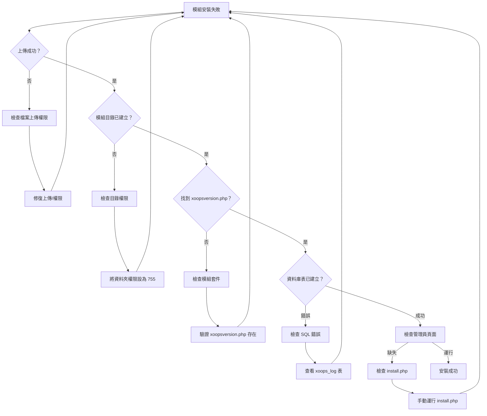
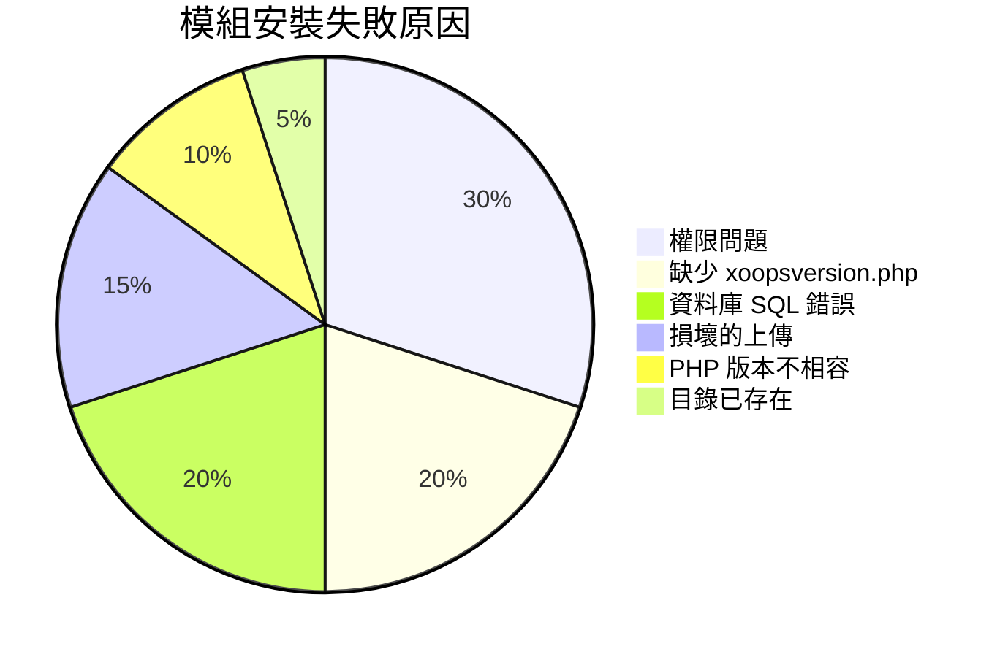
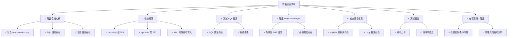

> XOOPS 中解決模組安裝問題的常見問題和解決方案。

---

## 診斷流程圖



---

## 常見原因與解決方案



---

## 1. 檔案上傳權限被拒

**症狀：**
- 上傳失敗，出現「權限被拒」
- 模組資料夾未建立
- 無法寫入模組目錄

**錯誤訊息：**
```
Warning: move_uploaded_file(): Unable to move file
Permission denied (13)
```

**解決方案：**

```bash
# 檢查目前權限
ls -ld /path/to/xoops/modules
ls -ld /path/to/xoops/uploads

# 修復模組目錄權限
chmod 755 /path/to/xoops/modules

# 修復臨時上傳目錄
chmod 777 /path/to/xoops/uploads
chmod 777 /tmp  # 如果需要

# 修復擁有權（如果以不同使用者運行）
chown -R www-data:www-data /path/to/xoops/modules
chown -R www-data:www-data /path/to/xoops/uploads
```

---

## 2. 缺少 xoopsversion.php

**症狀：**
- 模組出現在列表中但無法啟用
- 安裝開始後停止
- 未建立管理員頁面

**xoops_log 中的錯誤：**
```
Module xoopsversion.php not found
```

**解決方案：**

驗證模組套件結構：

```bash
# 提取並檢查模組內容
unzip module.zip
ls -la mymodule/

# 必須包含：
# - xoopsversion.php
# - language/
# - sql/
# - admin/ (可選但推薦)
```

**有效的 xoopsversion.php 結構：**

```php
<?php
$modversion['name'] = 'My Module';
$modversion['version'] = '1.0.0';
$modversion['description'] = 'Module description';
$modversion['author'] = 'Author Name';
$modversion['author_mail'] = 'author@example.com';
$modversion['author_website_url'] = 'https://example.com';
$modversion['credits'] = 'Credits';
$modversion['license'] = 'GPL 2.0 or later';
$modversion['official'] = 0;
$modversion['image'] = 'images/icon.png';
$modversion['dirname'] = basename(__DIR__);
$modversion['modpath'] = __DIR__;

// 核心模組資訊
$modversion['hasMain'] = 1;
$modversion['hasAdmin'] = 1;
$modversion['hasSearch'] = 0;
$modversion['hasNotification'] = 0;

// 資料庫表
$modversion['sqlfile']['mysql'] = 'sql/mysql.sql';
$modversion['tables'] = ['table_name'];
```

---

## 3. 資料庫 SQL 執行錯誤

**症狀：**
- 上傳成功但資料庫表未建立
- 管理員頁面無法加載
- 「表不存在」錯誤

**錯誤訊息：**
```
SQL Error: Table 'xoops_module_table' already exists
Syntax error in SQL statement
```

**解決方案：**

### 檢查 SQL 檔案語法

```bash
# 檢視 SQL 檔案
cat modules/mymodule/sql/mysql.sql

# 檢查語法問題
# 驗證：
# - 所有 CREATE TABLE 陳述式都以 ; 結尾
# - 正確的識別符號反引號
# - 有效的欄位類型 (INT, VARCHAR, TEXT, 等)
```

**正確的 SQL 格式：**

```sql
CREATE TABLE `xoops_module_table` (
  `id` INT(11) NOT NULL AUTO_INCREMENT,
  `name` VARCHAR(255) NOT NULL,
  `description` TEXT,
  `created` INT(11) NOT NULL,
  `updated` INT(11) NOT NULL,
  PRIMARY KEY (`id`)
) ENGINE=InnoDB DEFAULT CHARSET=utf8mb4;
```

### 手動執行 SQL

```php
<?php
// 建立檔案：modules/mymodule/test_sql.php
require_once '../../mainfile.php';

$sql_file = __DIR__ . '/sql/mysql.sql';
$sql_content = file_get_contents($sql_file);

// 分割陳述式
$statements = array_filter(array_map('trim', explode(';', $sql_content)));

foreach ($statements as $statement) {
    if (empty($statement)) continue;

    try {
        $GLOBALS['xoopsDB']->query($statement);
        echo "✓ Executed: " . substr($statement, 0, 50) . "...<br>";
    } catch (Exception $e) {
        echo "✗ Error: " . $e->getMessage() . "<br>";
        echo "Statement: " . substr($statement, 0, 100) . "...<br>";
    }
}
?>
```

---

## 4. 損壞的模組上傳

**症狀：**
- 檔案部分上傳
- 隨機 .php 檔案缺失
- 安裝後模組變得不穩定

**解決方案：**

```bash
# 重新上傳全新副本
rm -rf /path/to/xoops/modules/mymodule

# 驗證校驗和（如果提供）
md5sum -c mymodule.md5

# 提取前驗證存檔完整性
unzip -t mymodule.zip

# 提取到臨時目錄，驗證，然後移動
unzip -d /tmp mymodule.zip
find /tmp/mymodule -name "*.php" | wc -l
# 應該顯示預期的檔案數量
```

---

## 5. PHP 版本不相容

**症狀：**
- 安裝立即失敗
- xoopsversion.php 中的分析錯誤
- 「意外的 token」錯誤

**錯誤訊息：**
```
Parse error: syntax error, unexpected 'fn' (T_FN)
```

**解決方案：**

```bash
# 檢查 XOOPS 支援的 PHP 版本
grep -r "php_require" /path/to/xoops/

# 檢查模組要求
grep -i "php\|version" modules/mymodule/xoopsversion.php

# 檢查伺服器上的 PHP 版本
php --version
```

**測試模組相容性：**

```php
<?php
// 建立 modules/mymodule/check_compat.php
$required_php = '7.4.0';
$current_php = PHP_VERSION;

echo "Required PHP: $required_php<br>";
echo "Current PHP: $current_php<br>";

if (version_compare(PHP_VERSION, $required_php, '<')) {
    echo "✗ PHP version too old<br>";
} else {
    echo "✓ PHP version compatible<br>";
}

// 檢查必需的擴充套件
$required_ext = ['mysqli', 'json', 'mb_string'];
foreach ($required_ext as $ext) {
    echo extension_loaded($ext) ? "✓" : "✗";
    echo " $ext<br>";
}
?>
```

---

## 6. 模組目錄已存在

**症狀：**
- 當模組目錄存在時安裝失敗
- 無法重新安裝或更新模組
- 「目錄存在」錯誤

**錯誤訊息：**
```
The specified directory already exists
```

**解決方案：**

```bash
# 備份現有模組
cp -r modules/mymodule modules/mymodule.backup

# 完全移除舊安裝
rm -rf modules/mymodule

# 清除任何與模組相關的快取
rm -rf xoops_data/caches/*

# 現在透過管理員面板重試安裝
```

---

## 7. 管理員頁面產生失敗

**症狀：**
- 模組安裝但管理員頁面缺失
- 管理員面板不顯示模組
- 無法訪問模組設置

**解決方案：**

```php
<?php
// 建立 modules/mymodule/admin/index.php
<?php
/**
 * 模組管理索引
 */

include_once XOOPS_ROOT_PATH . '/kernel/module.php';

if (!is_object($xoopsModule) || !is_object($xoopsUser) || !$xoopsUser->isAdmin($xoopsModule->mid())) {
    exit("Access Denied");
}

// 包含管理員標題
xoops_cp_header();

// 新增管理員內容
echo "<h1>Module Administration</h1>";
echo "<p>Welcome to module administration</p>";

// 包含管理員頁尾
xoops_cp_footer();
?>
```

---

## 8. 語言檔案缺失

**症狀：**
- 模組顯示變數名稱而不是文字
- 管理員頁面顯示 「[LANG_CONSTANT]」 樣式文字
- 安裝完成但介面損壞

**解決方案：**

```bash
# 驗證語言檔案結構
ls -la modules/mymodule/language/

# 應該包含：
# english/ (至少)
#   admin.php
#   index.php
#   modinfo.php
```

**建立語言檔案：**

```php
<?php
// modules/mymodule/language/english/index.php
<?php
define('_AM_MYMODULE_INSTALLED', 'Module installed successfully');
define('_AM_MYMODULE_UPDATED', 'Module updated successfully');
define('_AM_MYMODULE_ERROR', 'An error occurred');
?>
```

---

## 安裝檢查清單



---

## 防止和最佳實踐

1. **始終備份**安裝新模組前
2. **本地測試**後才部署到生產環境
3. **驗證模組結構**上傳前
4. **上傳後立即檢查權限**
5. **查看 xoops_log 表**尋找安裝錯誤
6. **保留工作模組版本的備份**

---

## 相關文件

- 啟用除錯模式
- 模組常見問題解答
- 模組結構
- 資料庫連接錯誤

---

#xoops #troubleshooting #modules #installation #debugging
