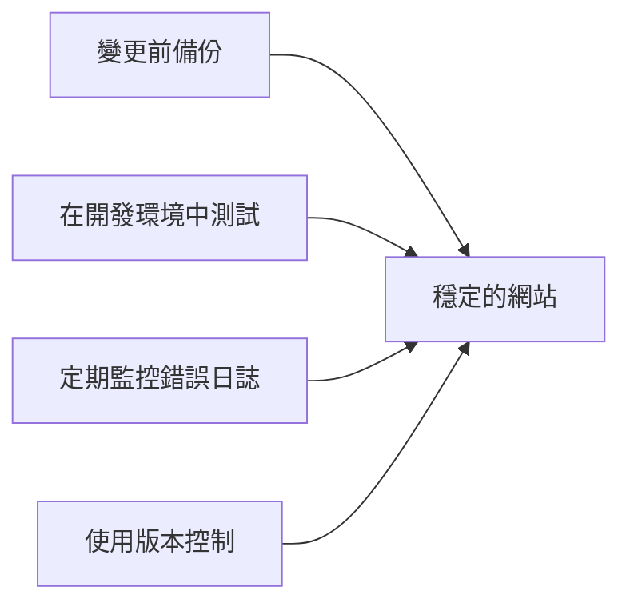

> 如何診斷和修復 XOOPS 中的空白白色頁面。

---

## 快速診斷

### 步驟 1：啟用 PHP 錯誤顯示

臨時添加到 `mainfile.php`：

```php
<?php
// 新增在 <?php 之後，很開始
error_reporting(E_ALL);
ini_set('display_errors', '1');
ini_set('display_startup_errors', '1');
```

### 步驟 2：檢查 PHP 錯誤日誌

```bash
# 常見日誌位置
tail -100 /var/log/php/error.log
tail -100 /var/log/apache2/error.log
tail -100 /var/log/nginx/error.log

# 或檢查 PHP 資訊以取得日誌位置
php -i | grep error_log
```

### 步驟 3：啟用 XOOPS 除錯

```php
// 在 mainfile.php 中
define('XOOPS_DEBUG_LEVEL', 2);
```

---

## 常見原因與解決方案

### 1. 超出記憶體限制

**症狀：**
- 大型操作時出現空白頁面
- 適用於小資料，大資料失敗

**錯誤：**
```
Fatal error: Allowed memory size of 134217728 bytes exhausted
```

**解決方案：**

```php
// 在 mainfile.php 中
ini_set('memory_limit', '256M');

// 或在 .htaccess 中
php_value memory_limit 256M

// 或在 php.ini 中
memory_limit = 256M
```

### 2. PHP 語法錯誤

**症狀：**
- 編輯 PHP 檔案後 WSOD
- 特定頁面失敗，其他運作

**錯誤：**
```
Parse error: syntax error, unexpected '}' in /path/file.php on line 123
```

**解決方案：**

```bash
# 檢查檔案語法錯誤
php -l /path/to/file.php

# 檢查模組中的所有 PHP 檔案
find modules/mymodule -name "*.php" -exec php -l {} \;
```

### 3. 缺少所需檔案

**症狀：**
- 上傳/遷移後 WSOD
- 隨機頁面失敗

**錯誤：**
```
Fatal error: require_once(): Failed opening required 'class/Helper.php'
```

**解決方案：**

```bash
# 重新上傳缺失的檔案
# 與全新安裝進行比較
diff -r /path/to/xoops /path/to/fresh-xoops

# 檢查檔案權限
ls -la class/
```

### 4. 資料庫連接失敗

**症狀：**
- 所有頁面顯示 WSOD
- 靜態檔案 (影像、CSS) 運作

**錯誤：**
```
Warning: mysqli_connect(): Access denied for user
```

**解決方案：**

```php
// 驗證 mainfile.php 中的認證資訊
define('XOOPS_DB_HOST', 'localhost');
define('XOOPS_DB_USER', 'your_user');
define('XOOPS_DB_PASS', 'your_password');
define('XOOPS_DB_NAME', 'your_database');

// 手動測試連接
<?php
$conn = new mysqli('localhost', 'user', 'pass', 'database');
if ($conn->connect_error) {
    die("Connection failed: " . $conn->connect_error);
}
echo "Connected successfully";
```

### 5. 權限問題

**症狀：**
- 寫入檔案時 WSOD
- 快取/編譯錯誤

**解決方案：**

```bash
# 修復目錄權限
chmod -R 755 htdocs/
chmod -R 777 xoops_data/
chmod -R 777 uploads/

# 修復擁有權
chown -R www-data:www-data /path/to/xoops
```

### 6. Smarty 樣板錯誤

**症狀：**
- 特定頁面上的 WSOD
- 清除快取後運作

**解決方案：**

```bash
# 清除 Smarty 快取
rm -rf xoops_data/caches/smarty_cache/*
rm -rf xoops_data/caches/smarty_compile/*

# 檢查樣板語法
```

### 7. 最大執行時間

**症狀：**
- ~30 秒後 WSOD
- 長操作失敗

**錯誤：**
```
Fatal error: Maximum execution time of 30 seconds exceeded
```

**解決方案：**

```php
// 在 mainfile.php 中
set_time_limit(300);

// 或在 .htaccess 中
php_value max_execution_time 300
```

---

## 除錯指令碼

在 XOOPS 根目錄建立 `debug.php`：

```php
<?php
/**
 * XOOPS Debug Script
 * Delete after troubleshooting!
 */

error_reporting(E_ALL);
ini_set('display_errors', '1');

echo "<h1>XOOPS Debug</h1>";

// 檢查 PHP 版本
echo "<h2>PHP Version</h2>";
echo "PHP " . PHP_VERSION . "<br>";

// 檢查必需的擴充套件
echo "<h2>Required Extensions</h2>";
$required = ['mysqli', 'gd', 'curl', 'json', 'mbstring'];
foreach ($required as $ext) {
    $status = extension_loaded($ext) ? '✓' : '✗';
    echo "$status $ext<br>";
}

// 檢查檔案權限
echo "<h2>Directory Permissions</h2>";
$dirs = [
    'xoops_data' => 'xoops_data',
    'uploads' => 'uploads',
    'cache' => 'xoops_data/caches'
];
foreach ($dirs as $name => $path) {
    $writable = is_writable($path) ? '✓ Writable' : '✗ Not writable';
    echo "$name: $writable<br>";
}

// 測試資料庫連接
echo "<h2>Database Connection</h2>";
if (file_exists('mainfile.php')) {
    // Extract credentials (simple regex, not production safe)
    $mainfile = file_get_contents('mainfile.php');
    preg_match("/XOOPS_DB_HOST.*'(.+?)'/", $mainfile, $host);
    preg_match("/XOOPS_DB_USER.*'(.+?)'/", $mainfile, $user);
    preg_match("/XOOPS_DB_PASS.*'(.+?)'/", $mainfile, $pass);
    preg_match("/XOOPS_DB_NAME.*'(.+?)'/", $mainfile, $name);

    if (!empty($host[1])) {
        $conn = @new mysqli($host[1], $user[1], $pass[1], $name[1]);
        if ($conn->connect_error) {
            echo "✗ Connection failed: " . $conn->connect_error;
        } else {
            echo "✓ Connected to database";
            $conn->close();
        }
    }
} else {
    echo "mainfile.php not found";
}

// 記憶體資訊
echo "<h2>Memory</h2>";
echo "Memory Limit: " . ini_get('memory_limit') . "<br>";
echo "Current Usage: " . round(memory_get_usage() / 1024 / 1024, 2) . " MB<br>";

// 檢查錯誤日誌位置
echo "<h2>Error Log</h2>";
echo "Location: " . ini_get('error_log');
```

---

## 預防



1. **始終備份**變更前
2. **本地測試**部署前
3. **定期監控**錯誤日誌
4. **使用 git** 追蹤變更
5. **保持 PHP 更新**在支援的版本內

---

## 相關文件

- 資料庫連接錯誤
- 權限被拒錯誤
- 啟用除錯模式

---

#xoops #troubleshooting #wsod #debugging #errors
