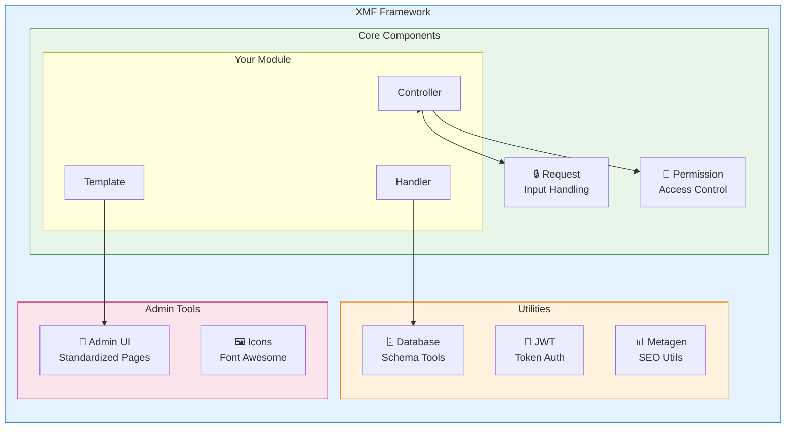
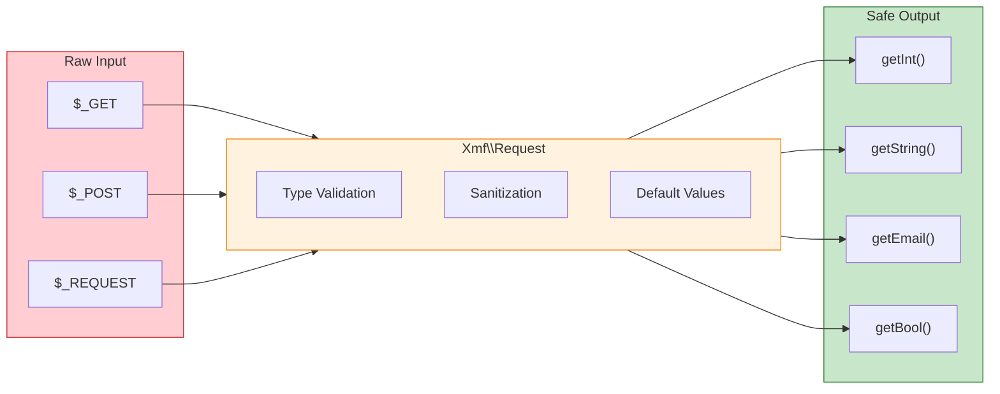

<span class="version-badge version-25x">2.5.x ✅</span> <span class="version-badge version-40x">4.0.x ✅</span>

:::tip[通往現代 XOOPS 的橋樑]
XMF 在 **XOOPS 2.5.x 和 XOOPS 4.0.x** 中都有效。它是現在現代化您的模組同時為 XOOPS 4.0 做準備的推薦方式。XMF 提供 PSR-4 自動載入、命名空間和協助者，可平順轉換。
:::

**XOOPS 模組框架 (XMF)** 是一個強大的程式庫，旨在簡化和標準化 XOOPS 模組開發。XMF 提供現代 PHP 實踐，包括命名空間、自動載入以及一組全面的協助者類別，可減少重複程式碼並提高可維護性。

## 什麼是 XMF？

XMF 是類別和公用程式的集合，提供：

- **現代 PHP 支援** - 具有 PSR-4 自動載入的完整命名空間支援
- **請求處理** - 安全的輸入驗證和清理
- **模組協助者** - 簡化對模組配置和物件的存取
- **權限系統** - 易於使用的權限管理
- **資料庫公用程式** - 綱要遷移和表格管理工具
- **JWT 支援** - 用於安全認證的 JSON Web Token 實作
- **中繼資料產生** - SEO 和內容擷取公用程式
- **管理介面** - 標準化的模組管理頁面

### XMF 元件概述



## 主要功能

### 命名空間和自動載入

所有 XMF 類別都位於 `Xmf` 命名空間中。當被引用時，類別會自動載入 - 不需要手動包含。

```php
use Xmf\Request;
use Xmf\Module\Helper;

// Classes load automatically when used
$input = Request::getString('input', '');
$helper = Helper::getHelper('mymodule');
```

### 安全請求處理

[Request 類別](../05-XMF-Framework/Basics/XMF-Request.md)提供對 HTTP 請求資料的型別安全存取，具有內建清理功能：



```php
use Xmf\Request;

$id = Request::getInt('id', 0);
$name = Request::getString('name', '');
$email = Request::getEmail('email', '');
```

### 模組協助者系統

[模組協助者](../05-XMF-Framework/Basics/XMF-Module-Helper.md)提供對模組相關功能的便利存取：

```php
$helper = \Xmf\Module\Helper::getHelper('mymodule');

// Access module configuration
$configValue = $helper->getConfig('setting_name', 'default');

// Get module object
$module = $helper->getModule();

// Access handlers
$handler = $helper->getHandler('items');
```

### 權限管理

[Permission-Helper](../05-XMF-Framework/Recipes/Permission-Helper.md)簡化了 XOOPS 權限處理：

```php
$permHelper = new \Xmf\Module\Helper\Permission();

// Check user permission
if ($permHelper->checkPermission('view', $itemId)) {
    // User has permission
}
```

## 文件結構

### 基礎

- [Getting-Started-with-XMF](../05-XMF-Framework/Basics/Getting-Started-with-XMF.md) - 安裝和基本用法
- [XMF-Request](../05-XMF-Framework/Basics/XMF-Request.md) - 請求處理和輸入驗證
- [XMF-Module-Helper](../05-XMF-Framework/Basics/XMF-Module-Helper.md) - 模組協助者類別用法

### 食譜

- [Permission-Helper](../05-XMF-Framework/Recipes/Permission-Helper.md) - 使用權限
- [Module-Admin-Pages](../05-XMF-Framework/Recipes/Module-Admin-Pages.md) - 建立標準化管理介面

### 參考資料

- [JWT](../05-XMF-Framework/Reference/JWT.md) - JSON Web Token 實作
- [Database](../05-XMF-Framework/Reference/Database.md) - 資料庫公用程式和綱要管理
- [Metagen](Reference/Metagen.md) - 中繼資料和 SEO 公用程式

## 要求

- XOOPS 2.5.8 或更新版本
- PHP 7.2 或更新版本（建議使用 PHP 8.x）

## 安裝

XMF 隨 XOOPS 2.5.8 及更新版本一併提供。對於較早的版本或手動安裝：

1. 從 XOOPS 儲存庫下載 XMF 套件
2. 解壓縮到您的 XOOPS `/class/xmf/` 目錄
3. 自動載入器將自動處理類別載入

## 快速開始範例

以下是顯示常見 XMF 用法模式的完整範例：

```php
<?php
use Xmf\Request;
use Xmf\Module\Helper;
use Xmf\Module\Helper\Permission;

// Get module helper
$helper = Helper::getHelper('mymodule');

// Get configuration values
$itemsPerPage = $helper->getConfig('items_per_page', 10);

// Handle request input
$op = Request::getCmd('op', 'list');
$id = Request::getInt('id', 0);

// Check permissions
$permHelper = new Permission();
if (!$permHelper->checkPermission('view', $id)) {
    redirect_header('index.php', 3, 'Access denied');
}

// Process based on operation
switch ($op) {
    case 'view':
        $handler = $helper->getHandler('items');
        $item = $handler->get($id);
        // ... display item
        break;
    case 'list':
    default:
        // ... list items
        break;
}
```

## 資源

- [XMF GitHub 儲存庫](https://github.com/XOOPS/XMF)
- [XOOPS 專案網站](https://xoops.org)

---

#xmf #xoops #framework #php #module-development
