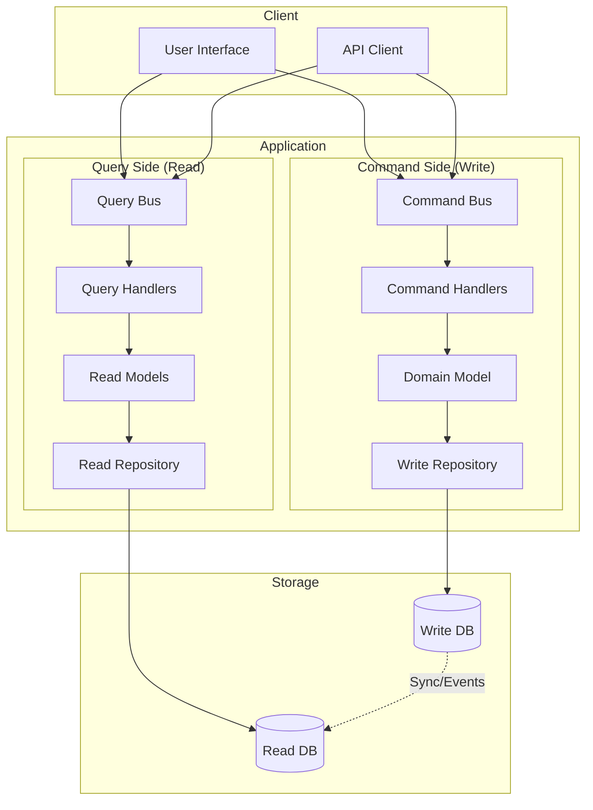
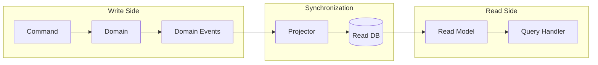

> **Implementing Command Query Responsibility Segregation for scalable XOOPS 4.0 modules.**

:::caution[Advanced Pattern — Not Required for Most Modules]
CQRS is an **advanced architectural pattern** intended for complex, high-scale applications with distinct read/write performance requirements. **Most XOOPS modules do not need CQRS.** Start with the simpler [Repository Pattern](../../03-Module-Development/Patterns/Repository-Pattern.md) or [Service Layer Pattern](../../03-Module-Development/Patterns/Service-Layer-Pattern.md) first. Only consider CQRS if you have specific scalability requirements or complex domain logic that justifies the additional architectural complexity.
:::

CQRS separates read and write operations into distinct models, enabling independent optimization, scaling, and evolution of each side.

---

## Overview



---

## When to Use CQRS

### Good Candidates

| Scenario | Reason |
|----------|--------|
| Complex domain logic | Separate read optimization from business rules |
| Different read/write patterns | Reads vastly outnumber writes |
| Multiple read representations | Dashboard, API, reports need different views |
| Team separation | Different teams for reads vs writes |
| Scalability requirements | Scale reads independently |

### Poor Candidates

| Scenario | Reason |
|----------|--------|
| Simple CRUD | Overhead not justified |
| Always-consistent reads | Eventual consistency problematic |
| Small team/project | Complexity not worth it |

---

## Core Components

### Commands

Commands represent intentions to change state. They are:
- **Imperative**: Named as actions (CreateArticle, PublishArticle)
- **Immutable**: Cannot be modified after creation
- **Validated**: Contain only valid data

```php
<?php

declare(strict_types=1);

namespace Xoops\Vision2026\Application\Command;

/**
 * Base interface for all commands
 */
interface Command
{
    /**
     * Get unique command ID for tracking/idempotency
     */
    public function getCommandId(): string;
}
```

#### CreateArticle Command

```php
<?php

declare(strict_types=1);

namespace Xoops\Vision2026\Application\Command;

use Xmf\Ulid;

final readonly class CreateArticle implements Command
{
    private string $commandId;

    public function __construct(
        public string $title,
        public string $content,
        public string $authorId,
        public string $categoryId,
        public array $tags = [],
        ?string $commandId = null,
    ) {
        $this->commandId = $commandId ?? Ulid::generate()->toString();
    }

    public function getCommandId(): string
    {
        return $this->commandId;
    }
}
```

#### PublishArticle Command

```php
<?php

declare(strict_types=1);

namespace Xoops\Vision2026\Application\Command;

use Xmf\Ulid;

final readonly class PublishArticle implements Command
{
    private string $commandId;

    public function __construct(
        public string $articleId,
        public ?\DateTimeImmutable $publishAt = null,
        ?string $commandId = null,
    ) {
        $this->commandId = $commandId ?? Ulid::generate()->toString();
    }

    public function getCommandId(): string
    {
        return $this->commandId;
    }
}
```

#### UpdateArticle Command

```php
<?php

declare(strict_types=1);

namespace Xoops\Vision2026\Application\Command;

use Xmf\Ulid;

final readonly class UpdateArticle implements Command
{
    private string $commandId;

    public function __construct(
        public string $articleId,
        public ?string $title = null,
        public ?string $content = null,
        public ?string $categoryId = null,
        public ?array $tags = null,
        ?string $commandId = null,
    ) {
        $this->commandId = $commandId ?? Ulid::generate()->toString();
    }

    public function getCommandId(): string
    {
        return $this->commandId;
    }
}
```

---

### Command Handlers

Handlers execute commands and coordinate domain operations:

```php
<?php

declare(strict_types=1);

namespace Xoops\Vision2026\Application\Command;

/**
 * Base interface for command handlers
 *
 * @template T of Command
 */
interface CommandHandler
{
    /**
     * Handle the command
     *
     * @param T $command
     * @return mixed Result (often the entity ID or void)
     */
    public function handle(Command $command): mixed;
}
```

#### CreateArticleHandler

```php
<?php

declare(strict_types=1);

namespace Xoops\Vision2026\Application\Command;

use Xoops\Vision2026\Domain\Entity\Article;
use Xoops\Vision2026\Domain\Repository\ArticleRepository;
use Xoops\Vision2026\Domain\ValueObject\{
    ArticleId,
    ArticleTitle,
    ArticleContent,
    AuthorId,
    CategoryId
};
use Psr\EventDispatcher\EventDispatcherInterface;

final class CreateArticleHandler implements CommandHandler
{
    public function __construct(
        private readonly ArticleRepository $articleRepository,
        private readonly EventDispatcherInterface $eventDispatcher,
    ) {}

    public function handle(Command $command): string
    {
        assert($command instanceof CreateArticle);

        // Create domain objects
        $articleId = ArticleId::generate();
        $title = ArticleTitle::fromString($command->title);
        $content = ArticleContent::fromString($command->content);
        $authorId = AuthorId::fromString($command->authorId);
        $categoryId = CategoryId::fromString($command->categoryId);

        // Create article through domain model
        $article = Article::create(
            id: $articleId,
            title: $title,
            content: $content,
            authorId: $authorId,
            categoryId: $categoryId,
        );

        // Add tags
        foreach ($command->tags as $tagName) {
            // Tag handling logic...
        }

        // Persist
        $this->articleRepository->save($article);

        // Dispatch domain events
        foreach ($article->pullDomainEvents() as $event) {
            $this->eventDispatcher->dispatch($event);
        }

        return $articleId->toString();
    }
}
```

#### PublishArticleHandler

```php
<?php

declare(strict_types=1);

namespace Xoops\Vision2026\Application\Command;

use Xoops\Vision2026\Domain\Repository\ArticleRepository;
use Xoops\Vision2026\Domain\ValueObject\ArticleId;
use Xoops\Vision2026\Domain\Service\ArticlePublishingPolicy;
use Psr\EventDispatcher\EventDispatcherInterface;

final class PublishArticleHandler implements CommandHandler
{
    public function __construct(
        private readonly ArticleRepository $articleRepository,
        private readonly ArticlePublishingPolicy $publishingPolicy,
        private readonly EventDispatcherInterface $eventDispatcher,
    ) {}

    public function handle(Command $command): void
    {
        assert($command instanceof PublishArticle);

        $articleId = ArticleId::fromString($command->articleId);
        $article = $this->articleRepository->findOrFail($articleId);

        // Check publishing policy
        $result = $this->publishingPolicy->canPublish($article);
        if (!$result->canPublish) {
            throw new CannotPublishArticle($result->violations);
        }

        // Publish through domain model
        $article->publish();

        // Persist
        $this->articleRepository->save($article);

        // Dispatch events
        foreach ($article->pullDomainEvents() as $event) {
            $this->eventDispatcher->dispatch($event);
        }
    }
}
```

---

### Command Bus

The command bus routes commands to their handlers:

```php
<?php

declare(strict_types=1);

namespace Xoops\Vision2026\Application\Command;

interface CommandBus
{
    /**
     * Dispatch a command to its handler
     *
     * @template T
     * @param Command $command
     * @return T Result from handler
     */
    public function dispatch(Command $command): mixed;
}
```

#### Simple Command Bus Implementation

```php
<?php

declare(strict_types=1);

namespace Xoops\Vision2026\Infrastructure\Bus;

use Xoops\Vision2026\Application\Command\{Command, CommandBus, CommandHandler};
use Psr\Container\ContainerInterface;

final class SimpleCommandBus implements CommandBus
{
    /** @var array<class-string<Command>, class-string<CommandHandler>> */
    private array $handlers = [];

    public function __construct(
        private readonly ContainerInterface $container,
    ) {}

    /**
     * Register a handler for a command type
     */
    public function register(string $commandClass, string $handlerClass): void
    {
        $this->handlers[$commandClass] = $handlerClass;
    }

    public function dispatch(Command $command): mixed
    {
        $commandClass = get_class($command);

        if (!isset($this->handlers[$commandClass])) {
            throw new NoHandlerForCommand($commandClass);
        }

        $handler = $this->container->get($this->handlers[$commandClass]);

        return $handler->handle($command);
    }
}
```

#### Middleware-Aware Command Bus

```php
<?php

declare(strict_types=1);

namespace Xoops\Vision2026\Infrastructure\Bus;

use Xoops\Vision2026\Application\Command\{Command, CommandBus};

final class MiddlewareCommandBus implements CommandBus
{
    /** @var callable[] */
    private array $middlewares = [];

    public function __construct(
        private readonly CommandBus $innerBus,
    ) {}

    public function addMiddleware(callable $middleware): void
    {
        $this->middlewares[] = $middleware;
    }

    public function dispatch(Command $command): mixed
    {
        $chain = array_reduce(
            array_reverse($this->middlewares),
            fn($next, $middleware) => fn($cmd) => $middleware($cmd, $next),
            fn($cmd) => $this->innerBus->dispatch($cmd)
        );

        return $chain($command);
    }
}
```

#### Common Middlewares

```php
<?php

// Logging Middleware
final class LoggingMiddleware
{
    public function __construct(
        private readonly LoggerInterface $logger,
    ) {}

    public function __invoke(Command $command, callable $next): mixed
    {
        $this->logger->info('Handling command', [
            'command' => get_class($command),
            'command_id' => $command->getCommandId(),
        ]);

        $start = microtime(true);

        try {
            $result = $next($command);

            $this->logger->info('Command handled', [
                'command' => get_class($command),
                'duration_ms' => (microtime(true) - $start) * 1000,
            ]);

            return $result;
        } catch (\Throwable $e) {
            $this->logger->error('Command failed', [
                'command' => get_class($command),
                'error' => $e->getMessage(),
            ]);
            throw $e;
        }
    }
}

// Transaction Middleware
final class TransactionMiddleware
{
    public function __construct(
        private readonly Connection $connection,
    ) {}

    public function __invoke(Command $command, callable $next): mixed
    {
        $this->connection->beginTransaction();

        try {
            $result = $next($command);
            $this->connection->commit();
            return $result;
        } catch (\Throwable $e) {
            $this->connection->rollBack();
            throw $e;
        }
    }
}

// Validation Middleware
final class ValidationMiddleware
{
    public function __construct(
        private readonly ValidatorInterface $validator,
    ) {}

    public function __invoke(Command $command, callable $next): mixed
    {
        $violations = $this->validator->validate($command);

        if (count($violations) > 0) {
            throw new CommandValidationFailed($violations);
        }

        return $next($command);
    }
}
```

---

### Queries

Queries represent requests for data. They are:
- **Interrogative**: Named as questions (GetArticle, ListArticles)
- **Side-effect free**: Do not modify state
- **Optimized for reading**: Can use denormalized data

```php
<?php

declare(strict_types=1);

namespace Xoops\Vision2026\Application\Query;

/**
 * Base interface for all queries
 */
interface Query
{
}
```

#### GetArticle Query

```php
<?php

declare(strict_types=1);

namespace Xoops\Vision2026\Application\Query;

final readonly class GetArticle implements Query
{
    public function __construct(
        public string $articleId,
        public bool $includeAuthor = false,
        public bool $includeCategory = false,
        public bool $includeTags = false,
    ) {}
}
```

#### ListArticles Query

```php
<?php

declare(strict_types=1);

namespace Xoops\Vision2026\Application\Query;

final readonly class ListArticles implements Query
{
    public function __construct(
        public int $page = 1,
        public int $perPage = 15,
        public ?string $status = null,
        public ?string $categoryId = null,
        public ?string $authorId = null,
        public ?string $search = null,
        public string $sortBy = 'published_at',
        public string $sortOrder = 'desc',
    ) {}
}
```

#### SearchArticles Query

```php
<?php

declare(strict_types=1);

namespace Xoops\Vision2026\Application\Query;

final readonly class SearchArticles implements Query
{
    public function __construct(
        public string $query,
        public int $limit = 20,
        public array $filters = [],
    ) {}
}
```

---

### Query Handlers

Query handlers fetch and transform data:

```php
<?php

declare(strict_types=1);

namespace Xoops\Vision2026\Application\Query;

/**
 * @template TQuery of Query
 * @template TResult
 */
interface QueryHandler
{
    /**
     * @param TQuery $query
     * @return TResult
     */
    public function handle(Query $query): mixed;
}
```

#### GetArticleHandler

```php
<?php

declare(strict_types=1);

namespace Xoops\Vision2026\Application\Query;

use Xoops\Vision2026\Application\ReadModel\ArticleReadModel;
use Xoops\Vision2026\Infrastructure\ReadModel\ArticleReadRepository;

final class GetArticleHandler implements QueryHandler
{
    public function __construct(
        private readonly ArticleReadRepository $readRepository,
    ) {}

    public function handle(Query $query): ?ArticleReadModel
    {
        assert($query instanceof GetArticle);

        return $this->readRepository->findById(
            $query->articleId,
            [
                'include_author' => $query->includeAuthor,
                'include_category' => $query->includeCategory,
                'include_tags' => $query->includeTags,
            ]
        );
    }
}
```

#### ListArticlesHandler

```php
<?php

declare(strict_types=1);

namespace Xoops\Vision2026\Application\Query;

use Xoops\Vision2026\Application\ReadModel\ArticleListResult;
use Xoops\Vision2026\Infrastructure\ReadModel\ArticleReadRepository;

final class ListArticlesHandler implements QueryHandler
{
    public function __construct(
        private readonly ArticleReadRepository $readRepository,
    ) {}

    public function handle(Query $query): ArticleListResult
    {
        assert($query instanceof ListArticles);

        return $this->readRepository->findAll(
            page: $query->page,
            perPage: $query->perPage,
            filters: [
                'status' => $query->status,
                'category_id' => $query->categoryId,
                'author_id' => $query->authorId,
                'search' => $query->search,
            ],
            sort: [$query->sortBy => $query->sortOrder],
        );
    }
}
```

---

### Read Models

Read models are optimized for display:

```php
<?php

declare(strict_types=1);

namespace Xoops\Vision2026\Application\ReadModel;

/**
 * Read model for article display
 *
 * This is a flat, denormalized structure optimized for reading.
 * It may include pre-computed fields like reading_time.
 */
final readonly class ArticleReadModel
{
    public function __construct(
        public string $id,
        public string $title,
        public string $slug,
        public string $excerpt,
        public string $content,
        public string $status,
        public int $views,
        public int $wordCount,
        public int $readingTime,
        public string $createdAt,
        public ?string $publishedAt,
        public ?AuthorReadModel $author,
        public ?CategoryReadModel $category,
        /** @var TagReadModel[] */
        public array $tags,
    ) {}

    public static function fromArray(array $data): self
    {
        return new self(
            id: $data['id'],
            title: $data['title'],
            slug: $data['slug'],
            excerpt: $data['excerpt'] ?? '',
            content: $data['content'],
            status: $data['status'],
            views: (int) $data['views'],
            wordCount: (int) $data['word_count'],
            readingTime: (int) $data['reading_time'],
            createdAt: $data['created_at'],
            publishedAt: $data['published_at'] ?? null,
            author: isset($data['author'])
                ? AuthorReadModel::fromArray($data['author'])
                : null,
            category: isset($data['category'])
                ? CategoryReadModel::fromArray($data['category'])
                : null,
            tags: array_map(
                TagReadModel::fromArray(...),
                $data['tags'] ?? []
            ),
        );
    }

    public function toArray(): array
    {
        return [
            'id' => $this->id,
            'title' => $this->title,
            'slug' => $this->slug,
            'excerpt' => $this->excerpt,
            'content' => $this->content,
            'status' => $this->status,
            'views' => $this->views,
            'word_count' => $this->wordCount,
            'reading_time' => $this->readingTime,
            'created_at' => $this->createdAt,
            'published_at' => $this->publishedAt,
            'author' => $this->author?->toArray(),
            'category' => $this->category?->toArray(),
            'tags' => array_map(fn($t) => $t->toArray(), $this->tags),
        ];
    }
}
```

#### ArticleListResult

```php
<?php

declare(strict_types=1);

namespace Xoops\Vision2026\Application\ReadModel;

final readonly class ArticleListResult
{
    public function __construct(
        /** @var ArticleReadModel[] */
        public array $items,
        public int $total,
        public int $page,
        public int $perPage,
        public int $lastPage,
    ) {}

    public function toArray(): array
    {
        return [
            'data' => array_map(fn($a) => $a->toArray(), $this->items),
            'meta' => [
                'total' => $this->total,
                'page' => $this->page,
                'per_page' => $this->perPage,
                'last_page' => $this->lastPage,
            ],
        ];
    }
}
```

---

### Query Bus

```php
<?php

declare(strict_types=1);

namespace Xoops\Vision2026\Application\Query;

interface QueryBus
{
    /**
     * @template T
     * @param Query $query
     * @return T
     */
    public function ask(Query $query): mixed;
}
```

---

## Read Model Synchronization



### Event-Based Projection

```php
<?php

declare(strict_types=1);

namespace Xoops\Vision2026\Infrastructure\Projection;

use Xoops\Vision2026\Domain\Event\ArticleCreated;
use Xoops\Vision2026\Domain\Event\ArticlePublished;
use Xoops\Vision2026\Domain\Event\ArticleUpdated;

final class ArticleProjector
{
    public function __construct(
        private readonly \PDO $readDb,
    ) {}

    public function onArticleCreated(ArticleCreated $event): void
    {
        $stmt = $this->readDb->prepare('
            INSERT INTO article_read_models
                (id, title, slug, status, author_id, created_at)
            VALUES
                (:id, :title, :slug, :status, :author_id, :created_at)
        ');

        $stmt->execute([
            'id' => $event->articleId->toString(),
            'title' => $event->title->value,
            'slug' => '', // Will be updated
            'status' => 'draft',
            'author_id' => $event->authorId->toString(),
            'created_at' => $event->occurredAt->format('Y-m-d H:i:s'),
        ]);
    }

    public function onArticlePublished(ArticlePublished $event): void
    {
        $stmt = $this->readDb->prepare('
            UPDATE article_read_models
            SET status = :status, published_at = :published_at
            WHERE id = :id
        ');

        $stmt->execute([
            'id' => $event->articleId->toString(),
            'status' => 'published',
            'published_at' => $event->publishedAt->format('Y-m-d H:i:s'),
        ]);
    }
}
```

---

## Controller Integration

```php
<?php

declare(strict_types=1);

namespace Xoops\Vision2026\Infrastructure\Http;

use Xoops\Vision2026\Application\Command\{CommandBus, CreateArticle, PublishArticle};
use Xoops\Vision2026\Application\Query\{QueryBus, GetArticle, ListArticles};
use Psr\Http\Message\{ResponseInterface, ServerRequestInterface};

final class ArticleController
{
    public function __construct(
        private readonly CommandBus $commandBus,
        private readonly QueryBus $queryBus,
    ) {}

    /**
     * GET /articles
     */
    public function index(ServerRequestInterface $request): ResponseInterface
    {
        $params = $request->getQueryParams();

        $result = $this->queryBus->ask(new ListArticles(
            page: (int) ($params['page'] ?? 1),
            perPage: (int) ($params['per_page'] ?? 15),
            status: $params['status'] ?? null,
            categoryId: $params['category'] ?? null,
        ));

        return $this->json($result->toArray());
    }

    /**
     * GET /articles/{id}
     */
    public function show(string $id): ResponseInterface
    {
        $article = $this->queryBus->ask(new GetArticle(
            articleId: $id,
            includeAuthor: true,
            includeCategory: true,
            includeTags: true,
        ));

        if ($article === null) {
            return $this->notFound('Article not found');
        }

        return $this->json($article->toArray());
    }

    /**
     * POST /articles
     */
    public function store(ServerRequestInterface $request): ResponseInterface
    {
        $data = $request->getParsedBody();

        $articleId = $this->commandBus->dispatch(new CreateArticle(
            title: $data['title'],
            content: $data['content'],
            authorId: $data['author_id'],
            categoryId: $data['category_id'],
            tags: $data['tags'] ?? [],
        ));

        return $this->json(['id' => $articleId], 201);
    }

    /**
     * POST /articles/{id}/publish
     */
    public function publish(string $id): ResponseInterface
    {
        $this->commandBus->dispatch(new PublishArticle(
            articleId: $id,
        ));

        return $this->json(['message' => 'Article published']);
    }
}
```

---

## Best Practices

### 1. Keep Commands Small and Focused

```php
// Good: One command, one action
CreateArticle, UpdateArticle, PublishArticle, ArchiveArticle

// Avoid: Multi-purpose commands
SaveArticle // Creates or updates?
```

### 2. Use DTOs for Query Results

```php
// Good: Dedicated read models
final readonly class ArticleReadModel { ... }

// Avoid: Returning domain entities from queries
public function handle(Query $query): Article
```

### 3. Validate Commands Early

```php
// Good: Validate in middleware/handler
final class CreateArticleHandler
{
    public function handle(CreateArticle $cmd): string
    {
        $title = ArticleTitle::fromString($cmd->title); // Validates
        // ...
    }
}
```

### 4. Make Queries Idempotent

```php
// Queries should be safe to retry without side effects
```

---

## 🔗 Related

- Event System
- Event Sourcing
- Dependency Injection
- Domain Model

---

#cqrs #architecture #commands #queries #patterns
