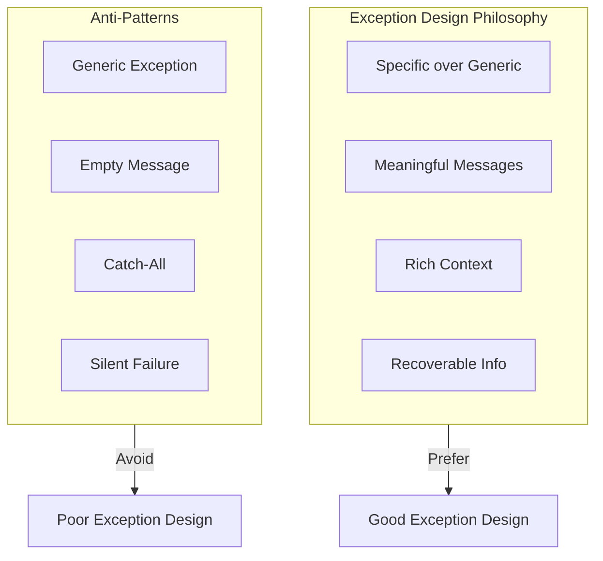
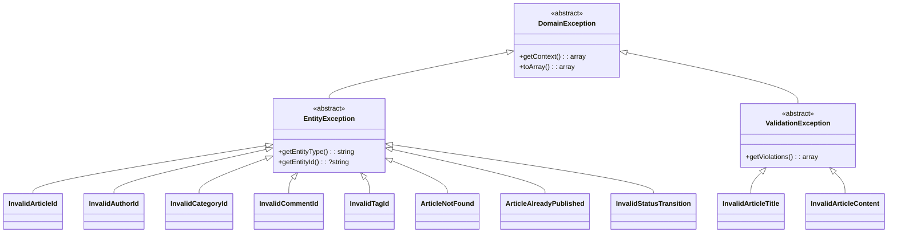

> **Comprehensive guide to designing and implementing domain exceptions for XOOPS 4.0 modules.**

Well-designed exceptions communicate what went wrong, where it happened, and often how to fix it. This guide covers exception hierarchies, best practices, and integration patterns.

---

## Exception Philosophy



**Key Principles:**
1. **Be Specific**: Use domain-specific exceptions, not generic ones
2. **Be Meaningful**: Messages should explain what happened
3. **Be Contextual**: Include relevant data for debugging
4. **Be Recoverable**: Indicate if the error is fixable

---

## Exception Hierarchy

### Recommended Structure



---

## Base Exception Classes

### DomainException

The root of all domain exceptions:

```php
<?php

declare(strict_types=1);

namespace Xoops\Vision2026\Domain\Exception;

/**
 * Base exception for all domain errors
 *
 * Extends RuntimeException because domain errors typically occur
 * during runtime when business rules are violated.
 */
abstract class DomainException extends \RuntimeException implements \JsonSerializable
{
    /**
     * Additional context data for debugging
     */
    protected array $context = [];

    /**
     * Create exception with message and context
     */
    public function __construct(
        string $message,
        array $context = [],
        int $code = 0,
        ?\Throwable $previous = null,
    ) {
        parent::__construct($message, $code, $previous);
        $this->context = $context;
    }

    /**
     * Get additional context data
     */
    public function getContext(): array
    {
        return $this->context;
    }

    /**
     * Get a specific context value
     */
    public function getContextValue(string $key, mixed $default = null): mixed
    {
        return $this->context[$key] ?? $default;
    }

    /**
     * Get error code identifier (for API responses)
     */
    public function getErrorCode(): string
    {
        // Convert class name to error code
        // InvalidArticleId -> INVALID_ARTICLE_ID
        $className = (new \ReflectionClass($this))->getShortName();
        return strtoupper(preg_replace('/([a-z])([A-Z])/', '$1_$2', $className));
    }

    /**
     * Convert to array (for logging/API responses)
     */
    public function toArray(): array
    {
        return [
            'error' => $this->getErrorCode(),
            'message' => $this->getMessage(),
            'context' => $this->context,
        ];
    }

    /**
     * JSON serialization
     */
    public function jsonSerialize(): array
    {
        return $this->toArray();
    }

    /**
     * Create a user-friendly message (for UI display)
     */
    public function getUserMessage(): string
    {
        return $this->getMessage();
    }
}
```

### EntityException

For entity-related errors:

```php
<?php

declare(strict_types=1);

namespace Xoops\Vision2026\Domain\Exception;

/**
 * Base exception for entity-related errors
 */
abstract class EntityException extends DomainException
{
    protected ?string $entityId = null;

    public function __construct(
        string $message,
        ?string $entityId = null,
        array $context = [],
        int $code = 0,
        ?\Throwable $previous = null,
    ) {
        $this->entityId = $entityId;

        if ($entityId !== null) {
            $context['entity_id'] = $entityId;
        }

        parent::__construct($message, $context, $code, $previous);
    }

    /**
     * Get the entity type (e.g., "article", "author")
     */
    abstract public function getEntityType(): string;

    /**
     * Get the entity ID if available
     */
    public function getEntityId(): ?string
    {
        return $this->entityId;
    }

    public function toArray(): array
    {
        return array_merge(parent::toArray(), [
            'entity_type' => $this->getEntityType(),
            'entity_id' => $this->entityId,
        ]);
    }
}
```

### ValidationException

For validation errors:

```php
<?php

declare(strict_types=1);

namespace Xoops\Vision2026\Domain\Exception;

/**
 * Base exception for validation errors
 */
abstract class ValidationException extends DomainException
{
    /** @var array<string, string[]> Field => error messages */
    protected array $violations = [];

    public function __construct(
        string $message,
        array $violations = [],
        array $context = [],
        int $code = 0,
        ?\Throwable $previous = null,
    ) {
        $this->violations = $violations;
        $context['violations'] = $violations;

        parent::__construct($message, $context, $code, $previous);
    }

    /**
     * Get all validation violations
     *
     * @return array<string, string[]>
     */
    public function getViolations(): array
    {
        return $this->violations;
    }

    /**
     * Get violations for a specific field
     */
    public function getFieldErrors(string $field): array
    {
        return $this->violations[$field] ?? [];
    }

    /**
     * Check if a field has errors
     */
    public function hasFieldErrors(string $field): bool
    {
        return isset($this->violations[$field]) && !empty($this->violations[$field]);
    }

    public function toArray(): array
    {
        return array_merge(parent::toArray(), [
            'violations' => $this->violations,
        ]);
    }
}
```

---

## ID Exception Classes

### InvalidArticleId

```php
<?php

declare(strict_types=1);

namespace Xoops\Vision2026\Domain\Exception;

/**
 * Thrown when an invalid article ID is provided
 */
final class InvalidArticleId extends EntityException
{
    /**
     * Create from invalid ID string
     */
    public static function fromString(string $id): self
    {
        return new self(
            message: "Invalid article ID format: '{$id}'. Expected a valid ULID (26 characters).",
            entityId: $id,
            context: [
                'provided_id' => $id,
                'expected_format' => 'ULID (26 characters, Crockford Base32)',
                'example' => '01HV8X5Z0KDMVR8SDPY62J9ACP',
            ],
        );
    }

    /**
     * Create for empty ID
     */
    public static function empty(): self
    {
        return new self(
            message: 'Article ID cannot be empty.',
            context: ['reason' => 'empty_value'],
        );
    }

    public function getEntityType(): string
    {
        return 'article';
    }

    public function getUserMessage(): string
    {
        return 'The provided article ID is invalid.';
    }
}
```

### InvalidAuthorId

```php
<?php

declare(strict_types=1);

namespace Xoops\Vision2026\Domain\Exception;

/**
 * Thrown when an invalid author ID is provided
 */
final class InvalidAuthorId extends EntityException
{
    public static function fromString(string $id): self
    {
        return new self(
            message: "Invalid author ID format: '{$id}'. Expected a valid ULID.",
            entityId: $id,
            context: [
                'provided_id' => $id,
                'expected_format' => 'ULID',
            ],
        );
    }

    public function getEntityType(): string
    {
        return 'author';
    }
}
```

### InvalidCategoryId

```php
<?php

declare(strict_types=1);

namespace Xoops\Vision2026\Domain\Exception;

/**
 * Thrown when an invalid category ID is provided
 */
final class InvalidCategoryId extends EntityException
{
    public static function fromString(string $id): self
    {
        return new self(
            message: "Invalid category ID format: '{$id}'. Expected a valid ULID.",
            entityId: $id,
        );
    }

    public function getEntityType(): string
    {
        return 'category';
    }
}
```

### InvalidCommentId

```php
<?php

declare(strict_types=1);

namespace Xoops\Vision2026\Domain\Exception;

/**
 * Thrown when an invalid comment ID is provided
 */
final class InvalidCommentId extends EntityException
{
    public static function fromString(string $id): self
    {
        return new self(
            message: "Invalid comment ID format: '{$id}'. Expected a valid ULID.",
            entityId: $id,
        );
    }

    public function getEntityType(): string
    {
        return 'comment';
    }
}
```

### InvalidTagId

```php
<?php

declare(strict_types=1);

namespace Xoops\Vision2026\Domain\Exception;

/**
 * Thrown when an invalid tag ID is provided
 */
final class InvalidTagId extends EntityException
{
    public static function fromString(string $id): self
    {
        return new self(
            message: "Invalid tag ID format: '{$id}'. Expected a valid ULID.",
            entityId: $id,
        );
    }

    public function getEntityType(): string
    {
        return 'tag';
    }
}
```

---

## Entity State Exceptions

### ArticleNotFound

```php
<?php

declare(strict_types=1);

namespace Xoops\Vision2026\Domain\Exception;

/**
 * Thrown when an article cannot be found
 */
final class ArticleNotFound extends EntityException
{
    public static function withId(string $id): self
    {
        return new self(
            message: "Article not found with ID: '{$id}'.",
            entityId: $id,
            code: 404,
        );
    }

    public static function withSlug(string $slug): self
    {
        return new self(
            message: "Article not found with slug: '{$slug}'.",
            context: ['slug' => $slug],
            code: 404,
        );
    }

    public function getEntityType(): string
    {
        return 'article';
    }

    public function getUserMessage(): string
    {
        return 'The requested article could not be found.';
    }
}
```

### InvalidStatusTransition

```php
<?php

declare(strict_types=1);

namespace Xoops\Vision2026\Domain\Exception;

use Xoops\Vision2026\Domain\Entity\ArticleStatus;

/**
 * Thrown when an invalid status transition is attempted
 */
final class InvalidStatusTransition extends EntityException
{
    public static function create(
        string $articleId,
        ArticleStatus $from,
        ArticleStatus $to,
    ): self {
        $allowedTransitions = match ($from) {
            ArticleStatus::Draft => 'published, archived',
            ArticleStatus::Published => 'archived',
            ArticleStatus::Archived => 'none (terminal state)',
        };

        return new self(
            message: "Cannot transition article from '{$from->value}' to '{$to->value}'.",
            entityId: $articleId,
            context: [
                'current_status' => $from->value,
                'requested_status' => $to->value,
                'allowed_transitions' => $allowedTransitions,
            ],
        );
    }

    public function getEntityType(): string
    {
        return 'article';
    }

    public function getUserMessage(): string
    {
        $from = $this->context['current_status'] ?? 'unknown';
        $to = $this->context['requested_status'] ?? 'unknown';

        return "This article cannot be changed from {$from} to {$to}.";
    }
}
```

### ArticleAlreadyPublished

```php
<?php

declare(strict_types=1);

namespace Xoops\Vision2026\Domain\Exception;

/**
 * Thrown when trying to publish an already published article
 */
final class ArticleAlreadyPublished extends EntityException
{
    public static function withId(string $id, \DateTimeImmutable $publishedAt): self
    {
        return new self(
            message: "Article '{$id}' is already published.",
            entityId: $id,
            context: [
                'published_at' => $publishedAt->format(\DateTimeInterface::ATOM),
            ],
        );
    }

    public function getEntityType(): string
    {
        return 'article';
    }

    public function getUserMessage(): string
    {
        return 'This article has already been published.';
    }
}
```

---

## Validation Exceptions

### InvalidArticleTitle

```php
<?php

declare(strict_types=1);

namespace Xoops\Vision2026\Domain\Exception;

/**
 * Thrown when an article title is invalid
 */
final class InvalidArticleTitle extends ValidationException
{
    private const MIN_LENGTH = 3;
    private const MAX_LENGTH = 255;

    public static function empty(): self
    {
        return new self(
            message: 'Article title cannot be empty.',
            violations: ['title' => ['Title is required.']],
        );
    }

    public static function tooShort(string $title): self
    {
        $length = mb_strlen($title);
        return new self(
            message: "Article title is too short ({$length} characters). Minimum is " . self::MIN_LENGTH . ".",
            violations: ['title' => ["Title must be at least " . self::MIN_LENGTH . " characters."]],
            context: [
                'provided_length' => $length,
                'min_length' => self::MIN_LENGTH,
            ],
        );
    }

    public static function tooLong(string $title): self
    {
        $length = mb_strlen($title);
        return new self(
            message: "Article title is too long ({$length} characters). Maximum is " . self::MAX_LENGTH . ".",
            violations: ['title' => ["Title cannot exceed " . self::MAX_LENGTH . " characters."]],
            context: [
                'provided_length' => $length,
                'max_length' => self::MAX_LENGTH,
            ],
        );
    }

    public function getUserMessage(): string
    {
        $errors = $this->getFieldErrors('title');
        return $errors[0] ?? 'Invalid article title.';
    }
}
```

### InvalidArticleContent

```php
<?php

declare(strict_types=1);

namespace Xoops\Vision2026\Domain\Exception;

/**
 * Thrown when article content is invalid
 */
final class InvalidArticleContent extends ValidationException
{
    private const MIN_LENGTH = 50;
    private const MAX_LENGTH = 100000;

    public static function tooShort(int $length): self
    {
        return new self(
            message: "Article content is too short ({$length} characters). Minimum is " . self::MIN_LENGTH . ".",
            violations: ['content' => ["Content must be at least " . self::MIN_LENGTH . " characters."]],
            context: [
                'provided_length' => $length,
                'min_length' => self::MIN_LENGTH,
            ],
        );
    }

    public static function tooLong(int $length): self
    {
        return new self(
            message: "Article content is too long ({$length} characters). Maximum is " . self::MAX_LENGTH . ".",
            violations: ['content' => ["Content cannot exceed " . self::MAX_LENGTH . " characters."]],
            context: [
                'provided_length' => $length,
                'max_length' => self::MAX_LENGTH,
            ],
        );
    }

    public static function invalidFormat(string $reason): self
    {
        return new self(
            message: "Article content format is invalid: {$reason}",
            violations: ['content' => [$reason]],
        );
    }
}
```

---

## Using Exceptions in Value Objects

Integration with the EntityId trait:

```php
<?php

declare(strict_types=1);

namespace Xoops\Vision2026\Domain\ValueObject;

use Xmf\EntityId;
use Xoops\Vision2026\Domain\Exception\InvalidArticleId;

final readonly class ArticleId implements \Stringable, \JsonSerializable
{
    use EntityId;

    protected static function exceptionClass(): string
    {
        return InvalidArticleId::class;
    }
}

// Usage:
try {
    $id = ArticleId::fromString('invalid-id');
} catch (InvalidArticleId $e) {
    // Handle specific exception
    echo $e->getUserMessage();
    echo $e->getErrorCode(); // "INVALID_ARTICLE_ID"

    // Log with context
    $logger->error($e->getMessage(), $e->getContext());
}
```

---

## Exception Handling in Controllers

### REST API Controller

```php
<?php

declare(strict_types=1);

namespace Xoops\Vision2026\Infrastructure\Http;

use Xoops\Vision2026\Domain\Exception\DomainException;
use Xoops\Vision2026\Domain\Exception\EntityException;
use Xoops\Vision2026\Domain\Exception\ValidationException;
use Psr\Http\Message\ResponseInterface;

final class ArticleController
{
    public function show(string $id): ResponseInterface
    {
        try {
            $articleId = ArticleId::fromString($id);
            $article = $this->articleRepository->findOrFail($articleId);

            return $this->json($article->toArray());

        } catch (EntityException $e) {
            return $this->errorResponse($e, $e->getCode() ?: 400);
        }
    }

    public function store(array $data): ResponseInterface
    {
        try {
            $article = $this->createArticleUseCase->execute($data);

            return $this->json($article->toArray(), 201);

        } catch (ValidationException $e) {
            return $this->validationErrorResponse($e);

        } catch (DomainException $e) {
            return $this->errorResponse($e, 400);
        }
    }

    private function errorResponse(DomainException $e, int $status): ResponseInterface
    {
        return $this->json([
            'error' => [
                'code' => $e->getErrorCode(),
                'message' => $e->getUserMessage(),
            ],
        ], $status);
    }

    private function validationErrorResponse(ValidationException $e): ResponseInterface
    {
        return $this->json([
            'error' => [
                'code' => 'VALIDATION_ERROR',
                'message' => $e->getUserMessage(),
                'details' => $e->getViolations(),
            ],
        ], 422);
    }
}
```

### Global Exception Handler

```php
<?php

declare(strict_types=1);

namespace Xoops\Vision2026\Infrastructure\Http;

use Xoops\Vision2026\Domain\Exception\DomainException;
use Xoops\Vision2026\Domain\Exception\EntityException;
use Xoops\Vision2026\Domain\Exception\ValidationException;
use Psr\Log\LoggerInterface;

final class ExceptionHandler
{
    public function __construct(
        private readonly LoggerInterface $logger,
        private readonly bool $debug = false,
    ) {}

    public function handle(\Throwable $e): array
    {
        // Log all exceptions
        $this->logger->error($e->getMessage(), [
            'exception' => get_class($e),
            'file' => $e->getFile(),
            'line' => $e->getLine(),
            'context' => $e instanceof DomainException ? $e->getContext() : [],
        ]);

        // Handle domain exceptions
        if ($e instanceof ValidationException) {
            return [
                'status' => 422,
                'body' => [
                    'error' => [
                        'code' => 'VALIDATION_ERROR',
                        'message' => $e->getUserMessage(),
                        'details' => $e->getViolations(),
                    ],
                ],
            ];
        }

        if ($e instanceof EntityException) {
            $status = $e->getCode() ?: 400;
            return [
                'status' => $status,
                'body' => [
                    'error' => [
                        'code' => $e->getErrorCode(),
                        'message' => $e->getUserMessage(),
                    ],
                ],
            ];
        }

        if ($e instanceof DomainException) {
            return [
                'status' => 400,
                'body' => [
                    'error' => [
                        'code' => $e->getErrorCode(),
                        'message' => $e->getUserMessage(),
                    ],
                ],
            ];
        }

        // Generic server error (hide details in production)
        return [
            'status' => 500,
            'body' => [
                'error' => [
                    'code' => 'INTERNAL_ERROR',
                    'message' => $this->debug
                        ? $e->getMessage()
                        : 'An unexpected error occurred.',
                ],
            ],
        ];
    }
}
```

---

## Best Practices

### 1. Use Named Constructors

```php
// Good: Clear, descriptive factory methods
InvalidArticleId::fromString($id);
InvalidArticleId::empty();
ArticleNotFound::withId($id);
ArticleNotFound::withSlug($slug);

// Avoid: Generic constructors
throw new InvalidArticleId("Invalid ID: {$id}");
```

### 2. Provide Context

```php
// Good: Rich context for debugging
throw new self(
    message: "Invalid article ID: {$id}",
    context: [
        'provided_id' => $id,
        'expected_format' => 'ULID',
        'example' => '01HV8X5Z0KDMVR8SDPY62J9ACP',
    ],
);

// Avoid: No context
throw new InvalidArgumentException("Invalid ID");
```

### 3. Separate User and Developer Messages

```php
// getMessage() - for logs/developers
// getUserMessage() - for UI display

$e->getMessage();      // "Invalid article ID format: 'abc'. Expected ULID."
$e->getUserMessage();  // "The provided article ID is invalid."
```

### 4. Use Specific Exception Types

```php
// Good: Catch specific exceptions
try {
    $article = $this->find($id);
} catch (ArticleNotFound $e) {
    return $this->notFound($e->getUserMessage());
} catch (InvalidArticleId $e) {
    return $this->badRequest($e->getUserMessage());
}

// Avoid: Catching generic exceptions
try {
    $article = $this->find($id);
} catch (\Exception $e) {
    // What kind of error? How to handle?
}
```

### 5. Don't Use Exceptions for Flow Control

```php
// Good: Check first
if ($this->articleRepository->exists($slug)) {
    return $this->findBySlug($slug);
}
return $this->createWithSlug($slug);

// Avoid: Using exceptions for flow control
try {
    return $this->findBySlug($slug);
} catch (ArticleNotFound $e) {
    return $this->createWithSlug($slug);
}
```

---

## Testing Exceptions

```php
<?php

use PHPUnit\Framework\TestCase;
use Xoops\Vision2026\Domain\Exception\InvalidArticleId;
use Xoops\Vision2026\Domain\ValueObject\ArticleId;

final class ArticleIdTest extends TestCase
{
    public function test_throws_for_invalid_format(): void
    {
        $this->expectException(InvalidArticleId::class);
        $this->expectExceptionMessage('Invalid article ID format');

        ArticleId::fromString('invalid');
    }

    public function test_exception_contains_context(): void
    {
        try {
            ArticleId::fromString('abc123');
            $this->fail('Expected exception');
        } catch (InvalidArticleId $e) {
            $this->assertSame('article', $e->getEntityType());
            $this->assertSame('abc123', $e->getEntityId());
            $this->assertArrayHasKey('expected_format', $e->getContext());
            $this->assertSame('INVALID_ARTICLE_ID', $e->getErrorCode());
        }
    }

    public function test_user_message_is_safe(): void
    {
        $e = InvalidArticleId::fromString('<script>alert("xss")</script>');

        // User message should not contain raw input
        $this->assertStringNotContainsString('<script>', $e->getUserMessage());
    }
}
```

---

## 🔗 Related

- XMF Components
- EntityId Trait
- Domain Model
- REST API Design

---

#exceptions #domain #error-handling #best-practices #vision2026
