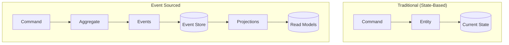
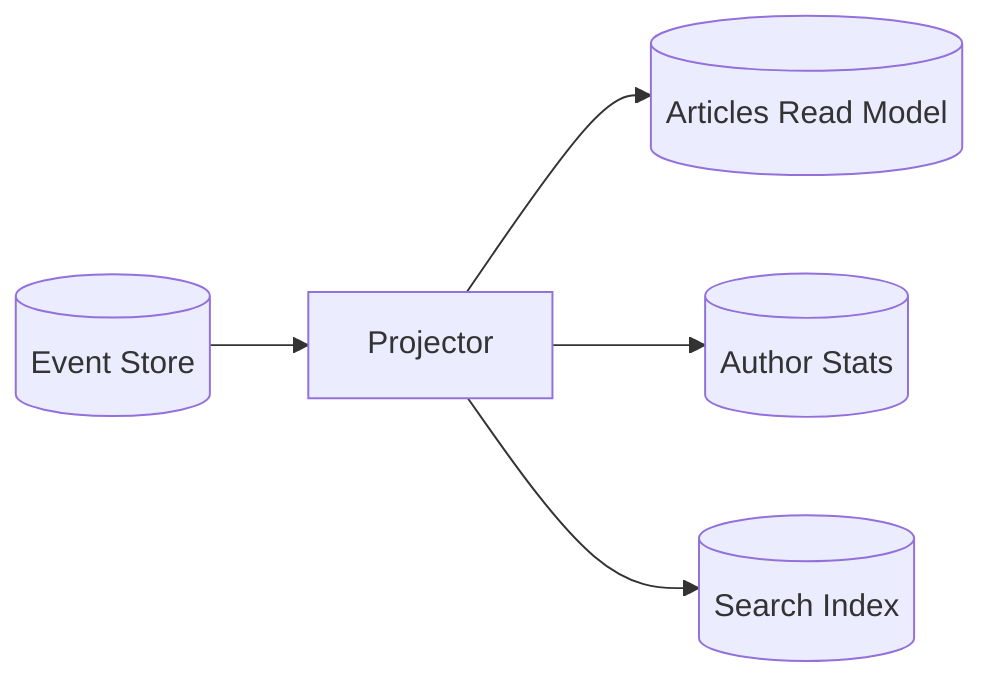

> **Storing state as a sequence of events for complete audit trails and temporal queries in XOOPS 4.0.**

:::caution[Advanced Pattern — Use Only When Required]
Event Sourcing is an **advanced architectural pattern** with significant complexity costs. It's best suited for domains requiring complete audit trails, temporal queries, or event replay (e.g., financial systems, compliance-heavy applications). **Most XOOPS modules should use traditional state-based persistence.** Before implementing Event Sourcing, ensure your use case genuinely requires it—the operational and development overhead is substantial. Consider starting with the [Repository Pattern](../../03-Module-Development/Patterns/Repository-Pattern.md) for simpler data access needs.
:::

Event Sourcing stores all changes to application state as a sequence of events, rather than storing just the current state. This enables complete audit trails, temporal queries, and event replay.

---

## Overview



### Key Concepts

| Concept | Description |
|---------|-------------|
| **Event** | Immutable record of something that happened |
| **Event Store** | Append-only storage of all events |
| **Aggregate** | Entity rebuilt from its event history |
| **Projection** | Read model built from events |
| **Snapshot** | Cached aggregate state for performance |

---

## When to Use Event Sourcing

### Good Candidates

| Scenario | Benefit |
|----------|---------|
| Audit requirements | Complete history of all changes |
| Temporal queries | "What was the state on date X?" |
| Complex domain | Event-driven modeling fits naturally |
| Debugging | Replay events to reproduce issues |
| Analytics | Rich event data for analysis |

### Poor Candidates

| Scenario | Reason |
|----------|--------|
| Simple CRUD | Significant overhead for simple operations |
| High-frequency updates | Event store size grows quickly |
| Immediate consistency | Eventual consistency with projections |

---

## Domain Events

### Base Event Interface

```php
<?php

declare(strict_types=1);

namespace Xoops\Vision2026\Domain\Event;

/**
 * Base interface for all domain events
 */
interface DomainEvent
{
    /**
     * Get the aggregate ID this event belongs to
     */
    public function getAggregateId(): string;

    /**
     * Get the aggregate type (e.g., "article", "author")
     */
    public function getAggregateType(): string;

    /**
     * Get when this event occurred
     */
    public function getOccurredAt(): \DateTimeImmutable;

    /**
     * Get event version for schema evolution
     */
    public function getVersion(): int;

    /**
     * Serialize event data for storage
     */
    public function toPayload(): array;

    /**
     * Deserialize event from storage
     */
    public static function fromPayload(array $payload): static;
}
```

### Abstract Event Base

```php
<?php

declare(strict_types=1);

namespace Xoops\Vision2026\Domain\Event;

abstract class AbstractDomainEvent implements DomainEvent
{
    protected \DateTimeImmutable $occurredAt;

    public function __construct(
        ?\DateTimeImmutable $occurredAt = null,
    ) {
        $this->occurredAt = $occurredAt ?? new \DateTimeImmutable();
    }

    public function getOccurredAt(): \DateTimeImmutable
    {
        return $this->occurredAt;
    }

    public function getVersion(): int
    {
        return 1;
    }

    public function getAggregateType(): string
    {
        // Default: extract from class namespace
        $parts = explode('\\', static::class);
        return strtolower($parts[count($parts) - 2] ?? 'unknown');
    }
}
```

### Article Events

```php
<?php

declare(strict_types=1);

namespace Xoops\Vision2026\Domain\Event;

final class ArticleCreated extends AbstractDomainEvent
{
    public function __construct(
        public readonly string $articleId,
        public readonly string $title,
        public readonly string $content,
        public readonly string $authorId,
        public readonly string $categoryId,
        public readonly string $slug,
        ?\DateTimeImmutable $occurredAt = null,
    ) {
        parent::__construct($occurredAt);
    }

    public function getAggregateId(): string
    {
        return $this->articleId;
    }

    public function toPayload(): array
    {
        return [
            'article_id' => $this->articleId,
            'title' => $this->title,
            'content' => $this->content,
            'author_id' => $this->authorId,
            'category_id' => $this->categoryId,
            'slug' => $this->slug,
            'occurred_at' => $this->occurredAt->format(\DateTimeInterface::ATOM),
        ];
    }

    public static function fromPayload(array $payload): static
    {
        return new static(
            articleId: $payload['article_id'],
            title: $payload['title'],
            content: $payload['content'],
            authorId: $payload['author_id'],
            categoryId: $payload['category_id'],
            slug: $payload['slug'],
            occurredAt: new \DateTimeImmutable($payload['occurred_at']),
        );
    }
}

final class ArticleTitleChanged extends AbstractDomainEvent
{
    public function __construct(
        public readonly string $articleId,
        public readonly string $oldTitle,
        public readonly string $newTitle,
        public readonly string $newSlug,
        ?\DateTimeImmutable $occurredAt = null,
    ) {
        parent::__construct($occurredAt);
    }

    public function getAggregateId(): string
    {
        return $this->articleId;
    }

    public function toPayload(): array
    {
        return [
            'article_id' => $this->articleId,
            'old_title' => $this->oldTitle,
            'new_title' => $this->newTitle,
            'new_slug' => $this->newSlug,
            'occurred_at' => $this->occurredAt->format(\DateTimeInterface::ATOM),
        ];
    }

    public static function fromPayload(array $payload): static
    {
        return new static(
            articleId: $payload['article_id'],
            oldTitle: $payload['old_title'],
            newTitle: $payload['new_title'],
            newSlug: $payload['new_slug'],
            occurredAt: new \DateTimeImmutable($payload['occurred_at']),
        );
    }
}

final class ArticlePublished extends AbstractDomainEvent
{
    public function __construct(
        public readonly string $articleId,
        public readonly \DateTimeImmutable $publishedAt,
        ?\DateTimeImmutable $occurredAt = null,
    ) {
        parent::__construct($occurredAt);
    }

    public function getAggregateId(): string
    {
        return $this->articleId;
    }

    public function toPayload(): array
    {
        return [
            'article_id' => $this->articleId,
            'published_at' => $this->publishedAt->format(\DateTimeInterface::ATOM),
            'occurred_at' => $this->occurredAt->format(\DateTimeInterface::ATOM),
        ];
    }

    public static function fromPayload(array $payload): static
    {
        return new static(
            articleId: $payload['article_id'],
            publishedAt: new \DateTimeImmutable($payload['published_at']),
            occurredAt: new \DateTimeImmutable($payload['occurred_at']),
        );
    }
}

final class ArticleArchived extends AbstractDomainEvent
{
    public function __construct(
        public readonly string $articleId,
        public readonly string $reason,
        ?\DateTimeImmutable $occurredAt = null,
    ) {
        parent::__construct($occurredAt);
    }

    public function getAggregateId(): string
    {
        return $this->articleId;
    }

    public function toPayload(): array
    {
        return [
            'article_id' => $this->articleId,
            'reason' => $this->reason,
            'occurred_at' => $this->occurredAt->format(\DateTimeInterface::ATOM),
        ];
    }

    public static function fromPayload(array $payload): static
    {
        return new static(
            articleId: $payload['article_id'],
            reason: $payload['reason'],
            occurredAt: new \DateTimeImmutable($payload['occurred_at']),
        );
    }
}
```

---

## Event-Sourced Aggregate

```php
<?php

declare(strict_types=1);

namespace Xoops\Vision2026\Domain\Entity;

use Xoops\Vision2026\Domain\Event\{
    ArticleCreated,
    ArticleTitleChanged,
    ArticlePublished,
    ArticleArchived,
    DomainEvent
};
use Xoops\Vision2026\Domain\ValueObject\{
    ArticleId,
    ArticleTitle,
    ArticleSlug,
    ArticleContent,
    AuthorId,
    CategoryId
};

final class Article
{
    private ArticleId $id;
    private ArticleTitle $title;
    private ArticleSlug $slug;
    private ArticleContent $content;
    private ArticleStatus $status;
    private AuthorId $authorId;
    private CategoryId $categoryId;
    private \DateTimeImmutable $createdAt;
    private ?\DateTimeImmutable $publishedAt = null;

    /** @var DomainEvent[] Uncommitted events */
    private array $recordedEvents = [];

    /** @var int Version for optimistic concurrency */
    private int $version = 0;

    private function __construct()
    {
        // Private constructor - use factory methods
    }

    // =========================================================================
    // Factory Methods (Command Side)
    // =========================================================================

    public static function create(
        ArticleId $id,
        ArticleTitle $title,
        ArticleContent $content,
        AuthorId $authorId,
        CategoryId $categoryId,
    ): self {
        $article = new self();

        $article->recordThat(new ArticleCreated(
            articleId: $id->toString(),
            title: $title->value,
            content: $content->value,
            authorId: $authorId->toString(),
            categoryId: $categoryId->toString(),
            slug: ArticleSlug::fromTitle($title)->toString(),
        ));

        return $article;
    }

    public function changeTitle(ArticleTitle $newTitle): void
    {
        if ($this->title->equals($newTitle)) {
            return; // No change
        }

        $this->recordThat(new ArticleTitleChanged(
            articleId: $this->id->toString(),
            oldTitle: $this->title->value,
            newTitle: $newTitle->value,
            newSlug: ArticleSlug::fromTitle($newTitle)->toString(),
        ));
    }

    public function publish(): void
    {
        if ($this->status !== ArticleStatus::Draft) {
            throw new InvalidStatusTransition(
                "Can only publish draft articles"
            );
        }

        $this->recordThat(new ArticlePublished(
            articleId: $this->id->toString(),
            publishedAt: new \DateTimeImmutable(),
        ));
    }

    public function archive(string $reason = ''): void
    {
        if ($this->status === ArticleStatus::Archived) {
            return; // Already archived
        }

        $this->recordThat(new ArticleArchived(
            articleId: $this->id->toString(),
            reason: $reason,
        ));
    }

    // =========================================================================
    // Reconstitution (from Event History)
    // =========================================================================

    /**
     * Rebuild aggregate from event history
     *
     * @param DomainEvent[] $events
     */
    public static function reconstitute(array $events): self
    {
        $article = new self();

        foreach ($events as $event) {
            $article->apply($event);
            $article->version++;
        }

        return $article;
    }

    // =========================================================================
    // Event Handling
    // =========================================================================

    private function recordThat(DomainEvent $event): void
    {
        $this->recordedEvents[] = $event;
        $this->apply($event);
    }

    private function apply(DomainEvent $event): void
    {
        match (get_class($event)) {
            ArticleCreated::class => $this->applyArticleCreated($event),
            ArticleTitleChanged::class => $this->applyArticleTitleChanged($event),
            ArticlePublished::class => $this->applyArticlePublished($event),
            ArticleArchived::class => $this->applyArticleArchived($event),
            default => throw new UnknownEvent(get_class($event)),
        };
    }

    private function applyArticleCreated(ArticleCreated $event): void
    {
        $this->id = ArticleId::fromString($event->articleId);
        $this->title = ArticleTitle::fromString($event->title);
        $this->slug = ArticleSlug::fromString($event->slug);
        $this->content = ArticleContent::fromString($event->content);
        $this->status = ArticleStatus::Draft;
        $this->authorId = AuthorId::fromString($event->authorId);
        $this->categoryId = CategoryId::fromString($event->categoryId);
        $this->createdAt = $event->getOccurredAt();
    }

    private function applyArticleTitleChanged(ArticleTitleChanged $event): void
    {
        $this->title = ArticleTitle::fromString($event->newTitle);
        $this->slug = ArticleSlug::fromString($event->newSlug);
    }

    private function applyArticlePublished(ArticlePublished $event): void
    {
        $this->status = ArticleStatus::Published;
        $this->publishedAt = $event->publishedAt;
    }

    private function applyArticleArchived(ArticleArchived $event): void
    {
        $this->status = ArticleStatus::Archived;
    }

    // =========================================================================
    // Event Access
    // =========================================================================

    /**
     * Get uncommitted events and clear the list
     *
     * @return DomainEvent[]
     */
    public function pullUncommittedEvents(): array
    {
        $events = $this->recordedEvents;
        $this->recordedEvents = [];
        return $events;
    }

    public function getVersion(): int
    {
        return $this->version;
    }

    // Getters...
    public function getId(): ArticleId { return $this->id; }
    public function getTitle(): ArticleTitle { return $this->title; }
    public function getStatus(): ArticleStatus { return $this->status; }
}
```

---

## Event Store

### Event Store Interface

```php
<?php

declare(strict_types=1);

namespace Xoops\Vision2026\Infrastructure\EventStore;

use Xoops\Vision2026\Domain\Event\DomainEvent;

interface EventStore
{
    /**
     * Append events to a stream
     *
     * @param string $streamId Aggregate ID
     * @param DomainEvent[] $events Events to append
     * @param int $expectedVersion For optimistic concurrency
     * @throws ConcurrencyException If version mismatch
     */
    public function append(string $streamId, array $events, int $expectedVersion): void;

    /**
     * Load all events for a stream
     *
     * @param string $streamId
     * @return DomainEvent[]
     */
    public function load(string $streamId): array;

    /**
     * Load events from a specific version
     *
     * @param string $streamId
     * @param int $fromVersion
     * @return DomainEvent[]
     */
    public function loadFrom(string $streamId, int $fromVersion): array;

    /**
     * Get all events across all streams (for projections)
     *
     * @param int $fromPosition Global position
     * @param int $limit Max events to return
     * @return StoredEvent[]
     */
    public function readAll(int $fromPosition = 0, int $limit = 1000): array;
}
```

### MySQL Event Store

```php
<?php

declare(strict_types=1);

namespace Xoops\Vision2026\Infrastructure\EventStore;

use Xoops\Vision2026\Domain\Event\DomainEvent;

final class MySQLEventStore implements EventStore
{
    private const TABLE = 'event_store';

    public function __construct(
        private readonly \PDO $pdo,
        private readonly EventSerializer $serializer,
    ) {}

    public function append(string $streamId, array $events, int $expectedVersion): void
    {
        $this->pdo->beginTransaction();

        try {
            // Check current version (optimistic concurrency)
            $stmt = $this->pdo->prepare(
                'SELECT MAX(version) FROM ' . self::TABLE . ' WHERE stream_id = ? FOR UPDATE'
            );
            $stmt->execute([$streamId]);
            $currentVersion = (int) ($stmt->fetchColumn() ?: 0);

            if ($currentVersion !== $expectedVersion) {
                throw new ConcurrencyException(
                    "Expected version {$expectedVersion}, but stream is at {$currentVersion}"
                );
            }

            // Append events
            $stmt = $this->pdo->prepare('
                INSERT INTO ' . self::TABLE . '
                    (stream_id, version, event_type, payload, metadata, occurred_at)
                VALUES
                    (:stream_id, :version, :event_type, :payload, :metadata, :occurred_at)
            ');

            $version = $expectedVersion;
            foreach ($events as $event) {
                $version++;
                $stmt->execute([
                    'stream_id' => $streamId,
                    'version' => $version,
                    'event_type' => get_class($event),
                    'payload' => json_encode($event->toPayload()),
                    'metadata' => json_encode($this->buildMetadata($event)),
                    'occurred_at' => $event->getOccurredAt()->format('Y-m-d H:i:s.u'),
                ]);
            }

            $this->pdo->commit();

        } catch (\Throwable $e) {
            $this->pdo->rollBack();
            throw $e;
        }
    }

    public function load(string $streamId): array
    {
        $stmt = $this->pdo->prepare('
            SELECT event_type, payload, occurred_at
            FROM ' . self::TABLE . '
            WHERE stream_id = ?
            ORDER BY version ASC
        ');
        $stmt->execute([$streamId]);

        $events = [];
        while ($row = $stmt->fetch(\PDO::FETCH_ASSOC)) {
            $events[] = $this->serializer->deserialize(
                $row['event_type'],
                json_decode($row['payload'], true)
            );
        }

        return $events;
    }

    public function loadFrom(string $streamId, int $fromVersion): array
    {
        $stmt = $this->pdo->prepare('
            SELECT event_type, payload
            FROM ' . self::TABLE . '
            WHERE stream_id = ? AND version > ?
            ORDER BY version ASC
        ');
        $stmt->execute([$streamId, $fromVersion]);

        $events = [];
        while ($row = $stmt->fetch(\PDO::FETCH_ASSOC)) {
            $events[] = $this->serializer->deserialize(
                $row['event_type'],
                json_decode($row['payload'], true)
            );
        }

        return $events;
    }

    public function readAll(int $fromPosition = 0, int $limit = 1000): array
    {
        $stmt = $this->pdo->prepare('
            SELECT id, stream_id, version, event_type, payload, occurred_at
            FROM ' . self::TABLE . '
            WHERE id > ?
            ORDER BY id ASC
            LIMIT ?
        ');
        $stmt->execute([$fromPosition, $limit]);

        $events = [];
        while ($row = $stmt->fetch(\PDO::FETCH_ASSOC)) {
            $events[] = new StoredEvent(
                position: (int) $row['id'],
                streamId: $row['stream_id'],
                version: (int) $row['version'],
                event: $this->serializer->deserialize(
                    $row['event_type'],
                    json_decode($row['payload'], true)
                ),
                occurredAt: new \DateTimeImmutable($row['occurred_at']),
            );
        }

        return $events;
    }

    private function buildMetadata(DomainEvent $event): array
    {
        return [
            'event_version' => $event->getVersion(),
            'aggregate_type' => $event->getAggregateType(),
            'recorded_at' => (new \DateTimeImmutable())->format(\DateTimeInterface::ATOM),
        ];
    }
}
```

### Event Store Schema

```sql
CREATE TABLE `event_store` (
    `id` BIGINT UNSIGNED AUTO_INCREMENT PRIMARY KEY,
    `stream_id` CHAR(26) NOT NULL,
    `version` INT UNSIGNED NOT NULL,
    `event_type` VARCHAR(255) NOT NULL,
    `payload` JSON NOT NULL,
    `metadata` JSON NOT NULL,
    `occurred_at` DATETIME(6) NOT NULL,
    `created_at` TIMESTAMP DEFAULT CURRENT_TIMESTAMP,

    UNIQUE KEY `idx_stream_version` (`stream_id`, `version`),
    KEY `idx_event_type` (`event_type`),
    KEY `idx_occurred_at` (`occurred_at`)
) ENGINE=InnoDB DEFAULT CHARSET=utf8mb4;
```

---

## Event-Sourced Repository

```php
<?php

declare(strict_types=1);

namespace Xoops\Vision2026\Infrastructure\Repository;

use Xoops\Vision2026\Domain\Entity\Article;
use Xoops\Vision2026\Domain\Repository\ArticleRepository;
use Xoops\Vision2026\Domain\ValueObject\ArticleId;
use Xoops\Vision2026\Infrastructure\EventStore\EventStore;
use Psr\EventDispatcher\EventDispatcherInterface;

final class EventSourcedArticleRepository implements ArticleRepository
{
    public function __construct(
        private readonly EventStore $eventStore,
        private readonly EventDispatcherInterface $eventDispatcher,
        private readonly ?SnapshotStore $snapshotStore = null,
    ) {}

    public function find(ArticleId $id): ?Article
    {
        $streamId = $id->toString();
        $events = $this->eventStore->load($streamId);

        if (empty($events)) {
            return null;
        }

        return Article::reconstitute($events);
    }

    public function findOrFail(ArticleId $id): Article
    {
        $article = $this->find($id);

        if ($article === null) {
            throw ArticleNotFound::withId($id->toString());
        }

        return $article;
    }

    public function save(Article $article): void
    {
        $events = $article->pullUncommittedEvents();

        if (empty($events)) {
            return; // Nothing to save
        }

        // Append to event store
        $this->eventStore->append(
            streamId: $article->getId()->toString(),
            events: $events,
            expectedVersion: $article->getVersion() - count($events),
        );

        // Dispatch events
        foreach ($events as $event) {
            $this->eventDispatcher->dispatch($event);
        }
    }

    public function nextIdentity(): ArticleId
    {
        return ArticleId::generate();
    }
}
```

---

## Snapshots

For aggregates with many events, snapshots improve load performance:

```php
<?php

declare(strict_types=1);

namespace Xoops\Vision2026\Infrastructure\Snapshot;

interface SnapshotStore
{
    public function save(Snapshot $snapshot): void;

    public function load(string $aggregateId): ?Snapshot;
}

final readonly class Snapshot
{
    public function __construct(
        public string $aggregateId,
        public string $aggregateType,
        public int $version,
        public array $state,
        public \DateTimeImmutable $createdAt,
    ) {}
}
```

### Repository with Snapshots

```php
<?php

public function find(ArticleId $id): ?Article
{
    $streamId = $id->toString();

    // Try to load from snapshot first
    $snapshot = $this->snapshotStore?->load($streamId);

    if ($snapshot !== null) {
        // Load only events after snapshot
        $events = $this->eventStore->loadFrom($streamId, $snapshot->version);

        if (empty($events) && !empty($snapshot->state)) {
            return Article::fromSnapshot($snapshot);
        }

        $article = Article::fromSnapshot($snapshot);
        foreach ($events as $event) {
            $article->apply($event);
        }
        return $article;
    }

    // No snapshot, load all events
    $events = $this->eventStore->load($streamId);

    if (empty($events)) {
        return null;
    }

    $article = Article::reconstitute($events);

    // Create snapshot if many events
    if (count($events) >= 100) {
        $this->createSnapshot($article);
    }

    return $article;
}
```

---

## Projections



### Projection Base

```php
<?php

declare(strict_types=1);

namespace Xoops\Vision2026\Infrastructure\Projection;

use Xoops\Vision2026\Domain\Event\DomainEvent;

interface Projector
{
    /**
     * Handle an event and update projections
     */
    public function project(DomainEvent $event): void;

    /**
     * Get the last processed event position
     */
    public function getPosition(): int;

    /**
     * Reset the projection (for rebuilding)
     */
    public function reset(): void;
}
```

### Article List Projector

```php
<?php

declare(strict_types=1);

namespace Xoops\Vision2026\Infrastructure\Projection;

use Xoops\Vision2026\Domain\Event\{
    ArticleCreated,
    ArticleTitleChanged,
    ArticlePublished,
    ArticleArchived,
    DomainEvent
};

final class ArticleListProjector implements Projector
{
    private int $position = 0;

    public function __construct(
        private readonly \PDO $readDb,
    ) {}

    public function project(DomainEvent $event): void
    {
        match (get_class($event)) {
            ArticleCreated::class => $this->onArticleCreated($event),
            ArticleTitleChanged::class => $this->onArticleTitleChanged($event),
            ArticlePublished::class => $this->onArticlePublished($event),
            ArticleArchived::class => $this->onArticleArchived($event),
            default => null, // Ignore unknown events
        };
    }

    private function onArticleCreated(ArticleCreated $event): void
    {
        $stmt = $this->readDb->prepare('
            INSERT INTO article_list
                (id, title, slug, status, author_id, category_id, created_at)
            VALUES
                (:id, :title, :slug, :status, :author_id, :category_id, :created_at)
        ');

        $stmt->execute([
            'id' => $event->articleId,
            'title' => $event->title,
            'slug' => $event->slug,
            'status' => 'draft',
            'author_id' => $event->authorId,
            'category_id' => $event->categoryId,
            'created_at' => $event->getOccurredAt()->format('Y-m-d H:i:s'),
        ]);
    }

    private function onArticleTitleChanged(ArticleTitleChanged $event): void
    {
        $stmt = $this->readDb->prepare('
            UPDATE article_list
            SET title = :title, slug = :slug
            WHERE id = :id
        ');

        $stmt->execute([
            'id' => $event->articleId,
            'title' => $event->newTitle,
            'slug' => $event->newSlug,
        ]);
    }

    private function onArticlePublished(ArticlePublished $event): void
    {
        $stmt = $this->readDb->prepare('
            UPDATE article_list
            SET status = :status, published_at = :published_at
            WHERE id = :id
        ');

        $stmt->execute([
            'id' => $event->articleId,
            'status' => 'published',
            'published_at' => $event->publishedAt->format('Y-m-d H:i:s'),
        ]);
    }

    private function onArticleArchived(ArticleArchived $event): void
    {
        $stmt = $this->readDb->prepare('
            UPDATE article_list
            SET status = :status
            WHERE id = :id
        ');

        $stmt->execute([
            'id' => $event->articleId,
            'status' => 'archived',
        ]);
    }

    public function getPosition(): int
    {
        return $this->position;
    }

    public function reset(): void
    {
        $this->readDb->exec('TRUNCATE TABLE article_list');
        $this->position = 0;
    }
}
```

### Projection Runner

```php
<?php

declare(strict_types=1);

namespace Xoops\Vision2026\Infrastructure\Projection;

final class ProjectionRunner
{
    /** @var Projector[] */
    private array $projectors = [];

    public function __construct(
        private readonly EventStore $eventStore,
    ) {}

    public function register(Projector $projector): void
    {
        $this->projectors[] = $projector;
    }

    /**
     * Process new events
     */
    public function run(int $batchSize = 100): int
    {
        $processed = 0;

        foreach ($this->projectors as $projector) {
            $position = $projector->getPosition();

            $events = $this->eventStore->readAll($position, $batchSize);

            foreach ($events as $storedEvent) {
                $projector->project($storedEvent->event);
                $processed++;
            }
        }

        return $processed;
    }

    /**
     * Rebuild all projections from scratch
     */
    public function rebuild(): void
    {
        foreach ($this->projectors as $projector) {
            $projector->reset();
        }

        while ($this->run(1000) > 0) {
            // Keep processing until no more events
        }
    }
}
```

---

## Temporal Queries

Event sourcing enables powerful temporal queries:

```php
<?php

// Get article state at a specific point in time
public function getArticleAt(ArticleId $id, \DateTimeImmutable $at): ?Article
{
    $events = $this->eventStore->load($id->toString());

    // Filter events up to the specified time
    $events = array_filter(
        $events,
        fn($e) => $e->getOccurredAt() <= $at
    );

    if (empty($events)) {
        return null;
    }

    return Article::reconstitute($events);
}

// Get article history
public function getArticleHistory(ArticleId $id): array
{
    return $this->eventStore->load($id->toString());
}
```

---

## Best Practices

### 1. Events Are Immutable Facts

```php
// Good: Events describe what happened
final class ArticlePublished { ... }

// Avoid: Events that describe intentions
final class PublishArticle { ... } // This is a command!
```

### 2. Include Enough Context

```php
// Good: All needed data included
new ArticleTitleChanged(
    articleId: $id,
    oldTitle: $old,
    newTitle: $new,
    newSlug: $slug,
);

// Avoid: Missing context
new ArticleTitleChanged(articleId: $id, newTitle: $new);
```

### 3. Version Your Events

```php
public function getVersion(): int
{
    return 2; // Increment when payload changes
}
```

### 4. Use Snapshots for Long Histories

```php
if (count($events) >= 100) {
    $this->createSnapshot($aggregate);
}
```

---

## 🔗 Related

- CQRS
- Event System
- Exception Handling
- Domain Model

---

#event-sourcing #architecture #events #patterns #ddd
