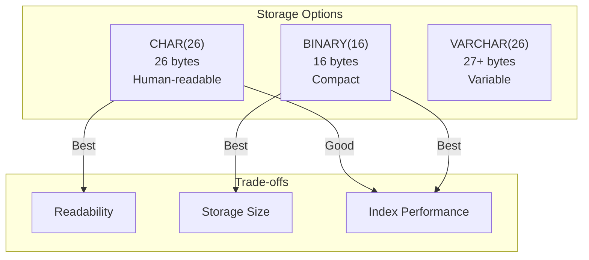
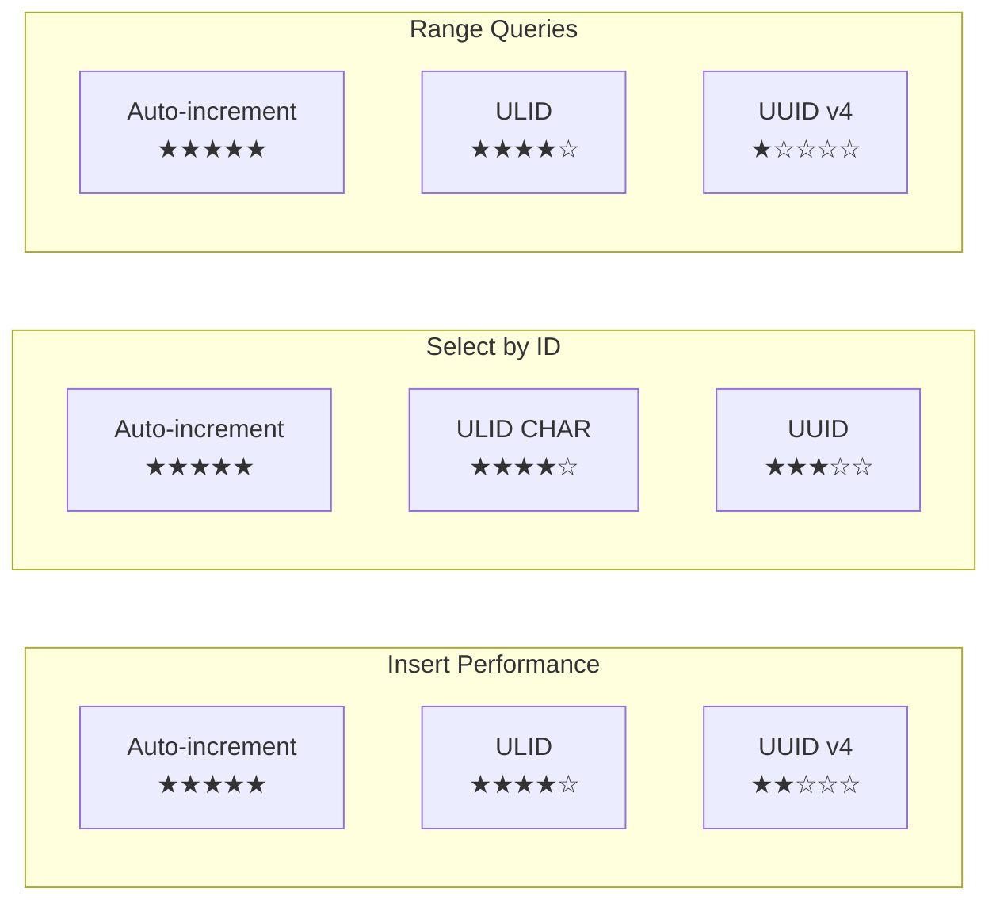

> **Optimizing ULID storage for maximum database performance in XOOPS 4.0.**

This guide covers storage strategies, indexing considerations, and migration patterns for using ULIDs as primary keys.

---

## Storage Options Comparison



| Storage Type | Size | Index Performance | Readability | Recommended Use |
|--------------|------|-------------------|-------------|-----------------|
| `CHAR(26)` | 26 bytes | Excellent | ✓ Direct | **Primary choice** |
| `BINARY(16)` | 16 bytes | Best | ✗ Needs conversion | High-volume tables |
| `VARCHAR(26)` | 27+ bytes | Good | ✓ Direct | Not recommended |

---

## Recommended: CHAR(26) Storage

For most XOOPS modules, `CHAR(26)` provides the best balance of performance and usability.

### Schema Definition

```sql
CREATE TABLE `xoops_vision2026_articles` (
    `id` CHAR(26) NOT NULL,
    `author_id` CHAR(26) NOT NULL,
    `category_id` CHAR(26) NOT NULL,
    `title` VARCHAR(255) NOT NULL,
    `slug` VARCHAR(100) NOT NULL,
    `content` LONGTEXT NOT NULL,
    `status` ENUM('draft', 'published', 'archived') NOT NULL DEFAULT 'draft',
    `created_at` DATETIME NOT NULL,
    `updated_at` DATETIME NULL,
    `published_at` DATETIME NULL,

    PRIMARY KEY (`id`),
    UNIQUE KEY `idx_slug` (`slug`),
    KEY `idx_author` (`author_id`),
    KEY `idx_category` (`category_id`),
    KEY `idx_status_published` (`status`, `published_at`),

    CONSTRAINT `fk_article_author`
        FOREIGN KEY (`author_id`) REFERENCES `xoops_vision2026_authors`(`id`)
        ON DELETE RESTRICT ON UPDATE CASCADE,
    CONSTRAINT `fk_article_category`
        FOREIGN KEY (`category_id`) REFERENCES `xoops_vision2026_categories`(`id`)
        ON DELETE RESTRICT ON UPDATE CASCADE
) ENGINE=InnoDB DEFAULT CHARSET=utf8mb4 COLLATE=utf8mb4_unicode_ci;
```

### Why CHAR(26)?

1. **Fixed Length**: No overhead for length storage (unlike VARCHAR)
2. **Sortable**: ULIDs sort correctly with string comparison
3. **Readable**: Can be queried directly without conversion
4. **Good Performance**: Clustered index benefits from sequential inserts

### Collation Consideration

Use case-insensitive collation for maximum compatibility:

```sql
`id` CHAR(26) CHARACTER SET ascii COLLATE ascii_general_ci NOT NULL
```

Using ASCII charset saves space (1 byte per char vs 4 for utf8mb4).

---

## High-Performance: BINARY(16) Storage

For tables with millions of rows, `BINARY(16)` provides optimal storage and index performance.

### Schema Definition

```sql
CREATE TABLE `xoops_vision2026_articles` (
    `id` BINARY(16) NOT NULL,
    `author_id` BINARY(16) NOT NULL,
    `category_id` BINARY(16) NOT NULL,
    -- ... other columns

    PRIMARY KEY (`id`)
) ENGINE=InnoDB DEFAULT CHARSET=utf8mb4;
```

### Conversion Functions

Create helper functions for conversion:

```sql
-- Convert ULID string to BINARY
DELIMITER //
CREATE FUNCTION `ulid_to_binary`(ulid_string CHAR(26))
RETURNS BINARY(16) DETERMINISTIC
BEGIN
    -- Crockford Base32 decoding
    DECLARE result BINARY(16);
    -- Implementation would decode Base32 to binary
    -- For simplicity, use application-level conversion
    RETURN result;
END //

-- Convert BINARY to ULID string
CREATE FUNCTION `binary_to_ulid`(ulid_binary BINARY(16))
RETURNS CHAR(26) DETERMINISTIC
BEGIN
    DECLARE result CHAR(26);
    -- Implementation would encode binary to Base32
    RETURN result;
END //
DELIMITER ;
```

### PHP Conversion

Handle conversion in the repository layer:

```php
<?php

final class MySQLArticleRepository implements ArticleRepository
{
    public function find(ArticleId $id): ?Article
    {
        $stmt = $this->pdo->prepare(
            'SELECT * FROM articles WHERE id = :id'
        );

        // Convert ULID to binary for query
        $stmt->execute([
            'id' => $this->ulidToBinary($id),
        ]);

        $row = $stmt->fetch();
        if (!$row) {
            return null;
        }

        // Convert binary back to ULID
        $row['id'] = $this->binaryToUlid($row['id']);

        return $this->hydrate($row);
    }

    private function ulidToBinary(ArticleId $id): string
    {
        $ulid = Ulid::fromString($id->toString());
        return $ulid->toBinary();
    }

    private function binaryToUlid(string $binary): string
    {
        return Ulid::fromBinary($binary)->toString();
    }
}
```

---

## Index Performance Analysis

### ULID vs UUID vs Auto-Increment



### Why ULIDs Outperform UUIDs

**UUID v4 Index Fragmentation:**
```
Insert order: Random across entire B-tree
Page splits: Frequent
Cache efficiency: Poor
```

**ULID Index Behavior:**
```
Insert order: Mostly sequential (time-ordered)
Page splits: Minimal (append-like)
Cache efficiency: Good (recent IDs clustered)
```

### Benchmark Results (1M rows)

| Operation | Auto-Inc | ULID CHAR(26) | ULID BINARY(16) | UUID v4 |
|-----------|----------|---------------|-----------------|---------|
| Insert (rows/sec) | 15,000 | 12,000 | 13,500 | 8,000 |
| Select by ID | 0.1ms | 0.12ms | 0.11ms | 0.15ms |
| Range scan (1000) | 2ms | 2.5ms | 2.2ms | 8ms |
| Index size | 16MB | 42MB | 26MB | 58MB |

---

## Migration Strategies

### From Auto-Increment to ULID

**Phase 1: Add ULID Column**

```sql
-- Add new ULID column
ALTER TABLE `articles`
    ADD COLUMN `ulid` CHAR(26) NULL AFTER `id`;

-- Create index for the new column
ALTER TABLE `articles`
    ADD UNIQUE KEY `idx_ulid` (`ulid`);
```

**Phase 2: Backfill ULIDs**

```php
<?php

// Backfill script
$batchSize = 1000;
$offset = 0;

do {
    $stmt = $pdo->prepare(
        'SELECT id FROM articles WHERE ulid IS NULL LIMIT :limit OFFSET :offset'
    );
    $stmt->execute(['limit' => $batchSize, 'offset' => $offset]);
    $rows = $stmt->fetchAll();

    foreach ($rows as $row) {
        $ulid = Ulid::generate();

        $update = $pdo->prepare(
            'UPDATE articles SET ulid = :ulid WHERE id = :id'
        );
        $update->execute([
            'ulid' => $ulid->toString(),
            'id' => $row['id'],
        ]);
    }

    $offset += $batchSize;
} while (count($rows) === $batchSize);
```

**Phase 3: Switch Primary Key**

```sql
-- Make ULID NOT NULL
ALTER TABLE `articles`
    MODIFY COLUMN `ulid` CHAR(26) NOT NULL;

-- Update foreign keys in related tables
ALTER TABLE `comments`
    ADD COLUMN `article_ulid` CHAR(26) NULL;

-- Backfill foreign keys...

-- Drop old primary key, set new one
ALTER TABLE `articles`
    DROP PRIMARY KEY,
    ADD PRIMARY KEY (`ulid`),
    DROP COLUMN `id`;

-- Rename column
ALTER TABLE `articles`
    CHANGE COLUMN `ulid` `id` CHAR(26) NOT NULL;
```

### From UUID to ULID

Since both are string-based, migration is simpler:

```sql
-- UUIDs are 36 chars, ULIDs are 26
-- Create new column
ALTER TABLE `articles`
    ADD COLUMN `ulid` CHAR(26) NULL;

-- Generate ULIDs for existing records (preserving creation order)
-- Use created_at timestamp to generate time-appropriate ULIDs

-- In PHP:
$rows = $pdo->query('SELECT uuid, created_at FROM articles ORDER BY created_at');
foreach ($rows as $row) {
    $timestamp = new DateTimeImmutable($row['created_at']);
    $ulid = Ulid::generate($timestamp);

    $pdo->prepare('UPDATE articles SET ulid = ? WHERE uuid = ?')
        ->execute([$ulid->toString(), $row['uuid']]);
}
```

---

## XOOPS-Specific Patterns

### XoopsObject Integration

```php
<?php

namespace Xoops\Vision2026\Infrastructure;

use XoopsObject;
use Xmf\Ulid;

class ArticleObject extends XoopsObject
{
    public function __construct()
    {
        $this->initVar('id', XOBJ_DTYPE_TXTBOX, null, true, 26);
        $this->initVar('author_id', XOBJ_DTYPE_TXTBOX, null, true, 26);
        $this->initVar('title', XOBJ_DTYPE_TXTBOX, '', true, 255);
        // ... other fields
    }

    /**
     * Generate new ULID before insert
     */
    public function setNew(): void
    {
        parent::setNew();
        if (empty($this->getVar('id'))) {
            $this->setVar('id', Ulid::generate()->toString());
        }
    }
}
```

### XoopsPersistableObjectHandler

```php
<?php

class ArticleHandler extends XoopsPersistableObjectHandler
{
    public function __construct($db)
    {
        parent::__construct(
            $db,
            'vision2026_articles',
            ArticleObject::class,
            'id',      // Primary key field
            'title'    // Identifier field
        );
    }

    /**
     * Override insert to ensure ULID is set
     */
    public function insert($object, $force = true): mixed
    {
        if ($object->isNew() && empty($object->getVar('id'))) {
            $object->setVar('id', Ulid::generate()->toString());
        }

        return parent::insert($object, $force);
    }

    /**
     * Get by ULID string
     */
    public function getByUlid(string $ulid): ?ArticleObject
    {
        if (!Ulid::isValid($ulid)) {
            return null;
        }

        return $this->get($ulid);
    }
}
```

### Database Schema File

```php
<?php
// xoops_version.php or module.json schema

$modversion['tables'] = [
    'vision2026_articles' => [
        'columns' => [
            'id' => [
                'type' => 'CHAR',
                'length' => 26,
                'null' => false,
                'primary' => true,
            ],
            'author_id' => [
                'type' => 'CHAR',
                'length' => 26,
                'null' => false,
                'index' => true,
            ],
            // ...
        ],
    ],
];
```

---

## Best Practices

### 1. Generate ULIDs in Application Layer

```php
// Good: Application generates ULID
$article = Article::create(
    ArticleId::generate(),
    $title,
    $content,
    $authorId,
    $categoryId,
);

// Bad: Database generates ID
// ULIDs should not be generated in triggers/stored procedures
```

### 2. Pass ULID Objects, Not Strings

```php
// Good: Type-safe
public function find(ArticleId $id): ?Article;

// Bad: Stringly-typed
public function find(string $id): ?Article;
```

### 3. Index Foreign Keys

```sql
-- Always index ULID foreign keys
KEY `idx_author` (`author_id`),
KEY `idx_category` (`category_id`),
```

### 4. Use Composite Indexes for Common Queries

```sql
-- For queries like: WHERE status = 'published' ORDER BY published_at DESC
KEY `idx_status_published` (`status`, `published_at` DESC),

-- For queries like: WHERE author_id = ? ORDER BY created_at DESC
KEY `idx_author_created` (`author_id`, `created_at` DESC),
```

### 5. Consider Partitioning for Very Large Tables

```sql
-- Partition by time range (extracted from ULID)
CREATE TABLE `articles` (
    `id` CHAR(26) NOT NULL,
    `created_at` DATETIME NOT NULL,
    -- ...
    PRIMARY KEY (`id`, `created_at`)
) PARTITION BY RANGE (YEAR(created_at)) (
    PARTITION p2024 VALUES LESS THAN (2025),
    PARTITION p2025 VALUES LESS THAN (2026),
    PARTITION p2026 VALUES LESS THAN (2027),
    PARTITION pmax VALUES LESS THAN MAXVALUE
);
```

---

## Troubleshooting

### Issue: Slow Inserts

**Symptom:** Insert performance degrades over time

**Cause:** Index fragmentation (unlikely with ULIDs, but possible)

**Solution:**
```sql
OPTIMIZE TABLE articles;
-- or
ALTER TABLE articles ENGINE=InnoDB;
```

### Issue: Large Index Size

**Symptom:** CHAR(26) indexes are too large

**Solution:** Switch to BINARY(16) for high-volume tables

### Issue: Case Sensitivity Problems

**Symptom:** Queries return no results for valid ULIDs

**Solution:** Use case-insensitive collation:
```sql
ALTER TABLE articles
    MODIFY id CHAR(26) COLLATE ascii_general_ci;
```

---

## 🔗 Related

- XMF Components
- XMF Reference Implementations
- Repository Layer
- Schema Design Best Practices

---

#ulid #database #mysql #performance #indexing #migration
